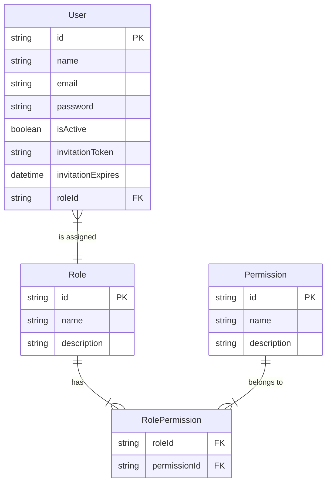
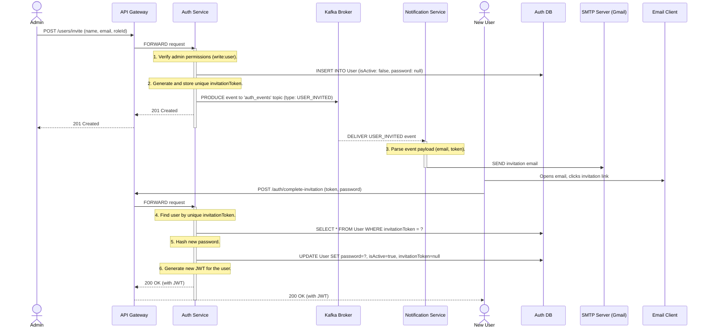
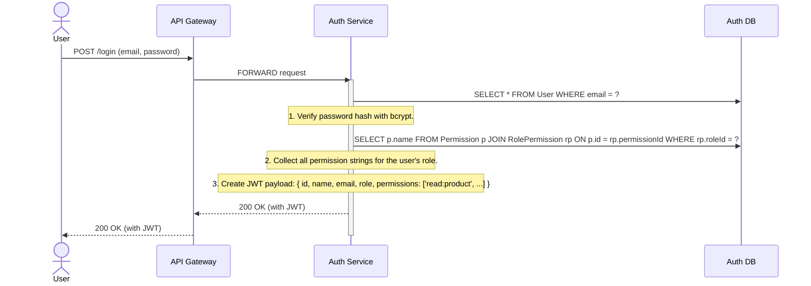
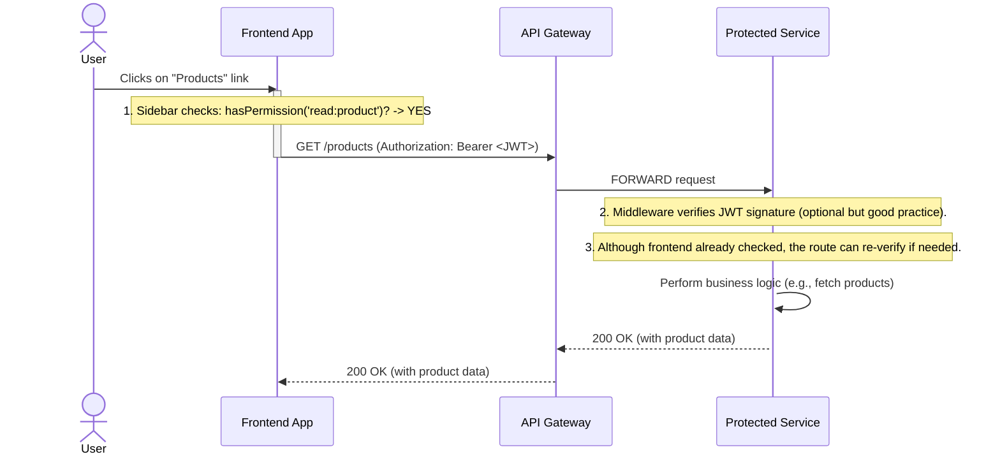
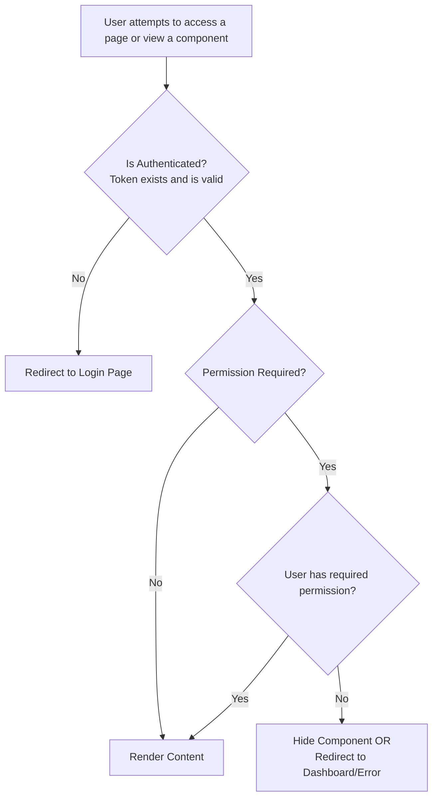

### **Rapport d'Architecture Système : RBAC et Gestion du Cycle de Vie des Utilisateurs**

#### **Résumé Exécutif**

Le système met en œuvre une architecture robuste et événementielle pour la gestion de l'identité des utilisateurs et du contrôle d'accès. Il est fondé sur un modèle granulaire de Contrôle d'Accès Basé sur les Rôles (RBAC), où les permissions sont l'unité fondamentale d'autorité. Ces permissions sont agrégées en rôles, qui sont ensuite assignés aux utilisateurs. Le cycle de vie de la création d'un utilisateur est géré par un flux d'invitation asynchrone et sécurisé, garantissant que le service principal `auth-service` est découplé des préoccupations externes telles que les notifications par e-mail. Cette conception est sécurisée, évolutive et conforme aux meilleures pratiques modernes des microservices.

---

### **Partie 1 : Le Modèle de Données Principal**

L'ensemble du système RBAC repose sur un modèle de données clair et robuste au sein de la base de données PostgreSQL du service `auth-service`. Les relations entre `User`, `Role` et `Permission` constituent le fondement de toute la logique de sécurité.

#### **Diagramme Entité-Relation (DER)**

Ce diagramme illustre le schéma de la base de données. L'élément clé est la table de jonction `RolePermission`, qui crée une relation plusieurs-à-plusieurs entre les Rôles et les Permissions, permettant une flexibilité maximale.

**Détail du Modèle :**

1.  **Permission :** L'unité d'autorité la plus granulaire (ex : `create:product`, `read:user`). Celles-ci sont statiques et définies dans le script d'initialisation (seed script). Elles représentent une action unique qu'un utilisateur peut effectuer.
2.  **Rôle :** Une collection nommée de permissions (ex : "Superviseur", "Auditeur"). Un rôle définit une fonction professionnelle au sein du système.
3.  **Utilisateur :** Une entité individuelle à laquelle est assigné exactement un Rôle. L'utilisateur hérite de toutes les permissions accordées par ce rôle.
4.  **RolePermission :** La table de jonction qui lie les Rôles et les Permissions. C'est ce qui permet à un seul Rôle d'avoir plusieurs Permissions, et à une seule Permission de faire partie de plusieurs Rôles.

---

### **Partie 2 : Le Flux d'Invitation et de Création d'Utilisateur**

Il s'agit du processus le plus complexe, impliquant plusieurs services communiquant de manière asynchrone. Il est conçu pour être résilient et découplé. Un utilisateur est créé dans un état "en attente" et doit activer son propre compte.

#### **Diagramme de Séquence : Cycle de Vie Complet de l'Invitation**

Ce diagramme montre le processus de bout en bout, du clic initial de l'administrateur jusqu'à ce que le nouvel utilisateur soit pleinement actif dans le système.

---

### **Partie 3 : Le Flux d'Authentification et d'Autorisation**

Une fois qu'un utilisateur est actif, son identité et ses permissions sont gérées via des JSON Web Tokens (JWT).

#### **Flux 3.1 : Connexion de l'Utilisateur et Création du JWT**

Lorsqu'un utilisateur se connecte, le `auth-service` interroge la base de données pour obtenir toutes les permissions associées et les intègre directement dans le payload du JWT. Cela fait du JWT un "passeport" autonome contenant l'identité et les capacités de l'utilisateur.

#### **Flux 3.2 : Requête API Authentifiée et Autorisée**

Lorsque le frontend effectue une requête vers une page protégée, il inclut le JWT. La logique frontend (HOC `WithPermission` et rendu conditionnel) utilise la liste des permissions contenue dans le JWT pour accorder ou refuser l'accès.

---

### **Partie 4 : Implémentation Frontend**

Le frontend met en œuvre un modèle de sécurité à deux niveaux pour offrir une expérience utilisateur fluide.

1.  **Sécurité au Niveau de la Route :** Le HOC `WithPermission` agit comme un gardien strict pour des pages entières. Si un utilisateur essaie d'accéder directement à une URL, ce HOC vérifie ses permissions avant d'afficher le composant de la page.
2.  **Sécurité au Niveau du Composant :** Au sein d'une page, les éléments de l'interface utilisateur (boutons, champs de formulaire, liens) sont affichés de manière conditionnelle à l'aide de la fonction d'aide `hasPermission` du `authStore`. Cela garantit qu'un utilisateur ne voit jamais une action qu'il n'est pas autorisé à effectuer.

#### **Organigramme de la Logique Frontend**

Ce diagramme montre le processus de décision sur le frontend pour l'affichage de tout contenu protégé.

Ce système complet garantit que l'accès des utilisateurs est contrôlé de manière sécurisée, efficace et cohérente, depuis la base de données jusqu'au dernier pixel affiché dans le navigateur de l'utilisateur.
