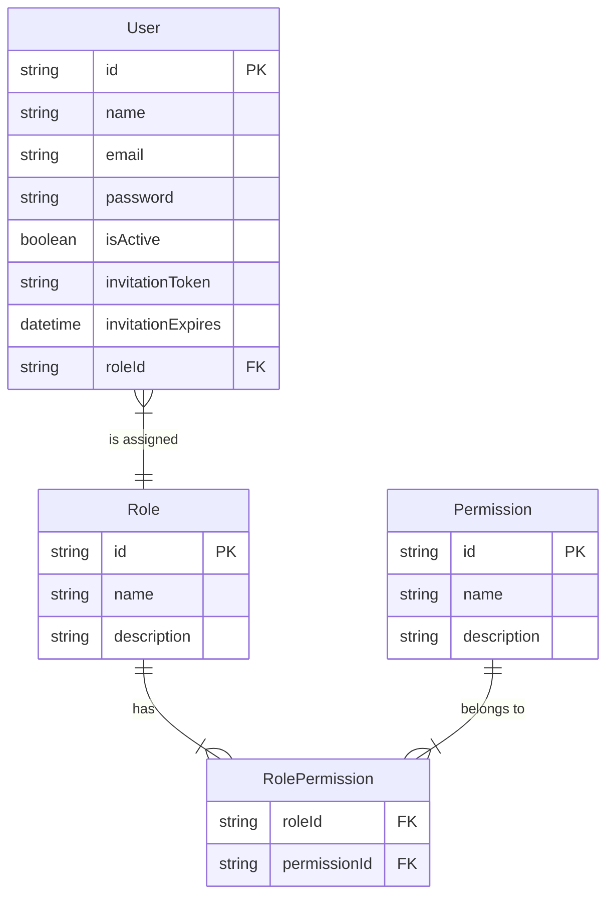
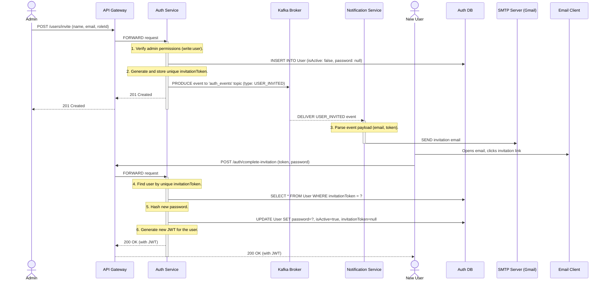
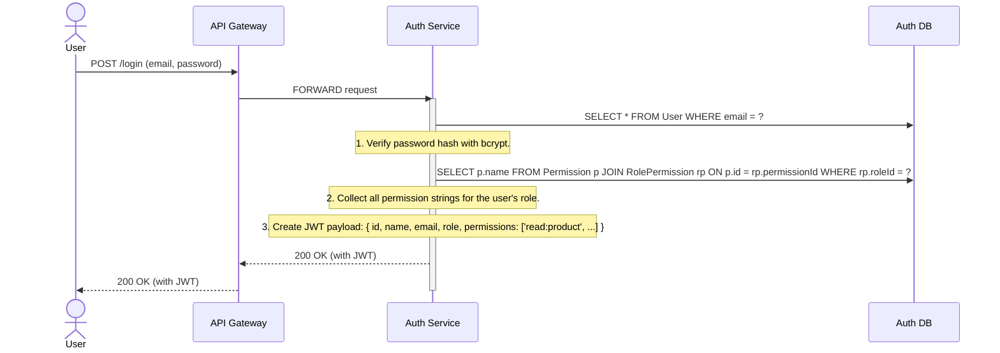
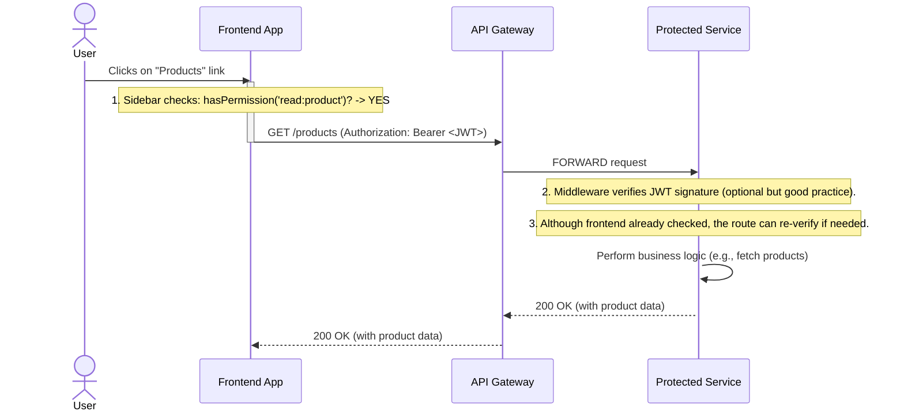
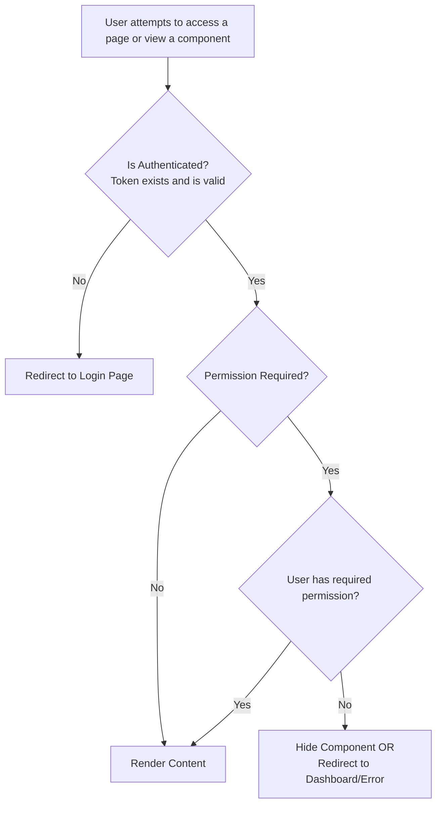

### **System Architecture Report: RBAC and User Lifecycle Management**

#### **Executive Summary**

The system implements a robust, event-driven architecture for managing user identity and access control. It is built upon a granular Role-Based Access Control (RBAC) model, where permissions are the fundamental unit of authority. These permissions are aggregated into roles, which are then assigned to users. The user creation lifecycle is handled through a secure, asynchronous invitation flow, ensuring that the core `auth-service` is decoupled from external-facing concerns like email notifications. This design is secure, scalable, and adheres to modern microservice best practices.

---

### **Part 1: The Core Data Model**

The entire RBAC system is built upon a clear and robust data model within the `auth-service`'s PostgreSQL database. The relationships between `User`, `Role`, and `Permission` are the foundation of all security logic.

#### **Entity Relationship Diagram (ERD)**

This diagram illustrates the database schema. The key is the `RolePermission` join table, which creates a many-to-many relationship between Roles and Permissions, allowing for maximum flexibility.

**Model Breakdown:**

1.  **Permission:** The most granular unit of authority (e.g., `create:product`, `read:user`). These are static and defined in the seed script. They represent a single action a user can perform.
2.  **Role:** A named collection of permissions (e.g., "Supervisor", "Auditor"). A role defines a job function within the system.
3.  **User:** An individual entity that is assigned exactly one Role. The user inherits all permissions granted by that role.
4.  **RolePermission:** The join table that links Roles and Permissions. This is what allows a single Role to have many Permissions, and a single Permission to be part of many Roles.

---

### **Part 2: The User Invitation & Creation Flow**

This is the most complex process, involving multiple services communicating asynchronously. It is designed to be resilient and decoupled. A user is created in a "pending" state and must activate their own account.

#### **Sequence Diagram: Full Invitation Lifecycle**

This diagram shows the end-to-end process from an administrator's initial click to the new user being fully active in the system.

---

### **Part 3: Authentication & Authorization Flow**

Once a user is active, their identity and permissions are managed via JSON Web Tokens (JWTs).

#### **Flow 3.1: User Login and JWT Creation**

When a user logs in, the `auth-service` queries the database for all associated permissions and embeds them directly into the JWT payload. This makes the JWT a self-contained "passport" of the user's identity and capabilities.

#### **Flow 3.2: Authenticated & Authorized API Request**

When the frontend makes a request to a protected page, it includes the JWT. The frontend logic (`WithPermission` HOC and conditional rendering) uses the permission list within the JWT to grant or deny access.

---

### **Part 4: Frontend Implementation**

The frontend implements a two-layer security model to provide a seamless user experience.

1.  **Route-Level Security:** The `WithPermission` HOC acts as a hard gatekeeper for entire pages. If a user tries to access a URL directly, this HOC checks their permissions before rendering the page component.
2.  **Component-Level Security:** Within a page, UI elements (buttons, form fields, links) are conditionally rendered using the `hasPermission` helper from the `authStore`. This ensures a user never even sees an action they are not authorized to perform.

#### **Frontend Logic Flowchart**

This diagram shows the decision process on the frontend for rendering any protected content.

This comprehensive system ensures that user access is controlled securely, efficiently, and consistently from the database all the way to the final pixel rendered in the user's browser.
