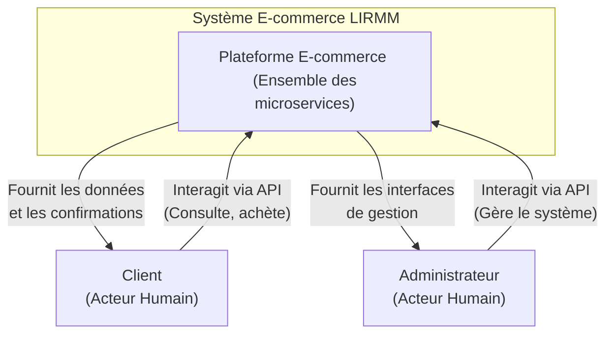
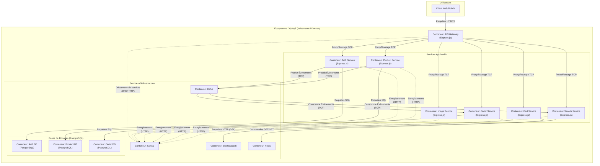
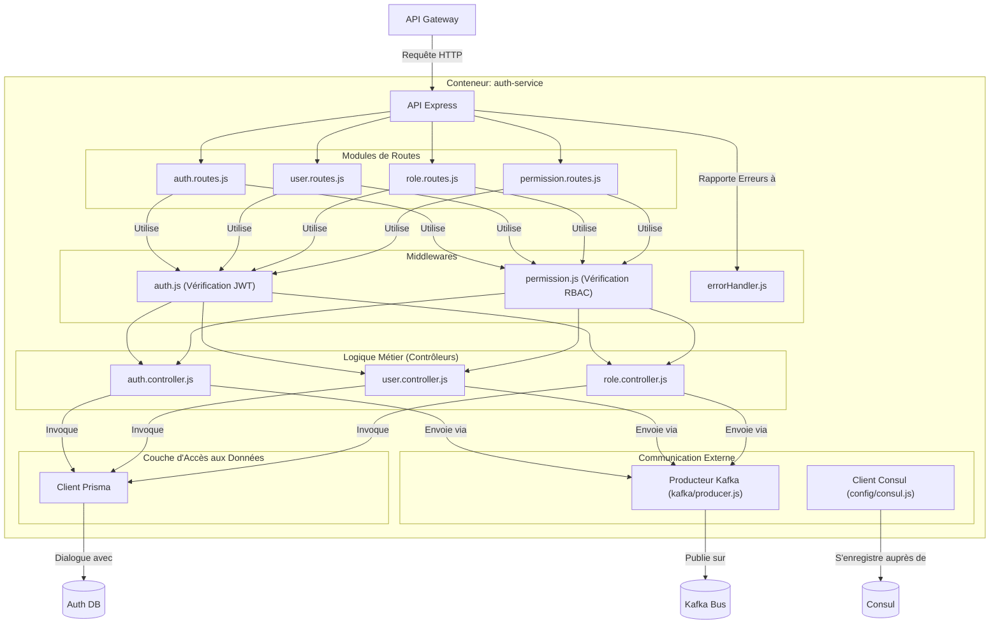
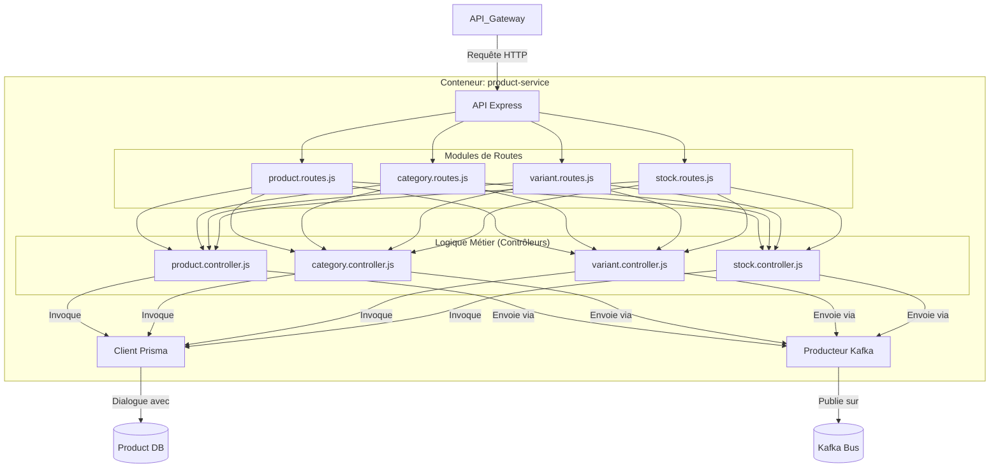
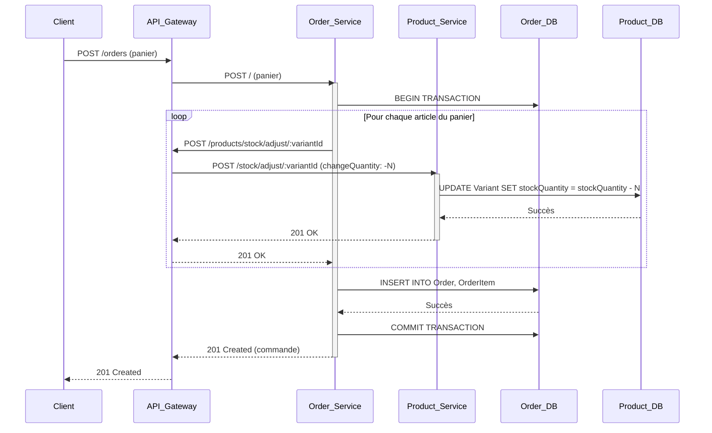
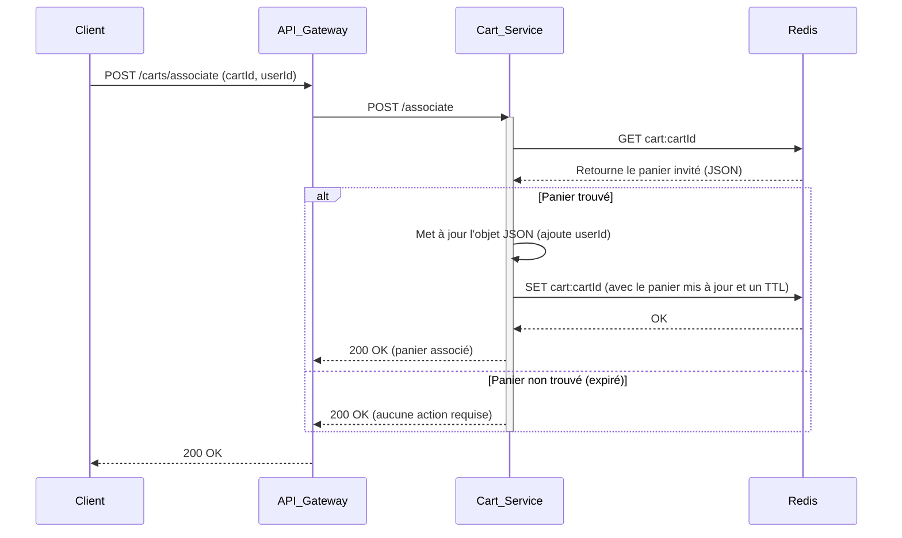

# **Dossier d'Architecture Technique et de Conception : Plateforme E-commerce LIRMM**

**Version :** 3.0 (Révision Exhaustive)
**Date :** 19 Jan 2025

---

## **Table des Matières**

1.  [Synthèse Décisionnelle (Executive Summary)](#1-synthèse-décisionnelle-executive-summary)
2.  [Principes et Modèles Architecturaux](#2-principes-et-modèles-architecturaux)
    *   2.1. Le Modèle C4 pour la Visualisation
    *   2.2. Paradigme des Microservices
    *   2.3. Architecture Orientée Événements (EDA)
    *   2.4. Ségrégation des Responsabilités de Commande et de Requête (CQRS)
    *   2.5. Stratégie de Persistance des Données
3.  [Architecture Système (Modèle C4)](#3-architecture-système-modèle-c4)
    *   3.1. Niveau 1 : Diagramme de Contexte
    *   3.2. Niveau 2 : Diagramme de Conteneurs
    *   3.3. Niveau 3 : Diagrammes de Composants
4.  [Analyse Détaillée des Microservices](#4-analyse-détaillée-des-microservices)
    *   4.1. API Gateway (`api-gateway`)
    *   4.2. Service d'Authentification (`auth-service`)
    *   4.3. Service de Produits (`product-service`)
    *   4.4. Service d'Images (`image-service`)
    *   4.5. Service de Panier (`cart-service`)
    *   4.6. Service de Recherche (`search-service`)
    *   4.7. Service de Commandes (`order-service`)
5.  [Analyse Approfondie des Préoccupations Transversales](#5-analyse-approfondie-des-préoccupations-transversales)
    *   5.1. Architecture Événementielle Kafka
    *   5.2. Stratégie de Sécurité
    *   5.3. Stratégie d'Observabilité (Logging, Métriques, Traçage)
6.  [Infrastructure, Déploiement et Opérations (DevOps)](#6-infrastructure-déploiement-et-opérations-devops)
    *   6.1. Stratégie de Conteneurisation (Docker)
    *   6.2. Stratégie d'Orchestration (Kubernetes)
    *   6.3. Pipeline d'Intégration et de Déploiement Continus (CI/CD)
7.  [Scénarios d'Utilisation Détaillés (Diagrammes de Séquence)](#7-scénarios-dutilisation-détaillés-diagrammes-de-séquence)
    *   7.1. Création de Produit et Propagation d'Événement
    *   7.2. Passage de Commande avec Intégrité Transactionnelle
    *   7.3. Association d'un Panier Invité à un Utilisateur
8.  [Conclusion et Travaux Futurs](#8-conclusion-et-travaux-futurs)

---
## **1. Synthèse Décisionnelle (Executive Summary)**

Ce document constitue la spécification technique complète de la plateforme e-commerce LIRMM. Conçue autour d'une architecture de microservices distribués, la plateforme privilégie la **scalabilité**, la **résilience** et la **maintenabilité** à long terme. Chaque domaine fonctionnel est encapsulé dans un service autonome, communiquant via des API REST synchrones pour les requêtes directes et un bus d'événements Kafka asynchrone pour la propagation des changements d'état. Cette approche hybride garantit à la fois la réactivité pour l'utilisateur final et un découplage fort entre les composants internes. L'ensemble de l'infrastructure est conteneurisé via Docker et orchestré par Kubernetes, avec un processus de déploiement entièrement automatisé par un pipeline CI/CD Jenkins. Ce dossier a pour vocation d'être la source unique de vérité pour l'architecture, la conception et les décisions opérationnelles du projet.

---
## **2. Principes et Modèles Architecturaux**

### **2.1. Le Modèle C4 pour la Visualisation**
Pour décrire l'architecture, nous adoptons le modèle C4 (Context, Containers, Components, Code), qui permet de zoomer sur le système à différents niveaux d'abstraction, offrant une clarté adaptée à chaque audience (architectes, développeurs, ops).

### **2.2. Paradigme des Microservices**
Le choix des microservices est motivé par la nécessité de faire évoluer indépendamment les différentes parties du système. Par exemple, le `product-service` peut nécessiter plus de ressources CPU lors de l'import de catalogues, tandis que le `cart-service` exigera une latence extrêmement faible et une grande capacité mémoire. Cette séparation permet une allocation des ressources et une optimisation ciblées.

### **2.3. Architecture Orientée Événements (EDA)**
EDA est au cœur du découplage des services. Au lieu d'appels directs en chaîne (ex: `product-service` appelant `search-service`), les services publient des faits (événements) sur ce qui s'est passé. Cela transforme les dépendances directes en dépendances indirectes sur le broker de messages (Kafka), qui est conçu pour une haute disponibilité.

### **2.4. Ségrégation des Responsabilités de Commande et de Requête (CQRS)**
Le système applique une version pragmatique de CQRS.
*   **Modèle d'Écriture (Command)** : Les services "propriétaires" des données (ex: `auth-service`, `product-service`) gèrent les modèles de données normalisés optimisés pour l'écriture et la cohérence transactionnelle (via PostgreSQL).
*   **Modèle de Lecture (Query)** : Les services de lecture (ex: `search-service`, `order-service` pour l'affichage de données enrichies) maintiennent leurs propres modèles de données, optimisés pour leurs cas d'usage. Le `search-service` utilise un index Elasticsearch pour la recherche plein texte, tandis que le `order-service` dénormalise les données produit/utilisateur pour garantir que les commandes historiques restent cohérentes même si les données sources changent. La synchronisation se fait via EDA.

### **2.5. Stratégie de Persistance des Données**
Le principe "Polyglot Persistence" est appliqué : la technologie de stockage est choisie en fonction des besoins du service.
*   **PostgreSQL** : Pour les données relationnelles nécessitant une forte cohérence et des transactions (utilisateurs, produits, commandes).
*   **Redis** : Pour les données volatiles et à accès rapide avec une structure simple (paniers).
*   **Elasticsearch** : Pour les données textuelles nécessitant des capacités de recherche complexes.
*   **Système de fichiers (Volume Persistant)** : Pour le stockage de binaires (images).

---
## **3. Architecture Système (Modèle C4)**

### **3.1. Niveau 1 : Diagramme de Contexte**
Montre le système dans son environnement.


### **3.2. Niveau 2 : Diagramme de Conteneurs**
Décompose le système en ses conteneurs exécutables.


### **3.3. Niveau 3 : Diagrammes de Composants**

#### **Composants du `auth-service`**
Ce diagramme détaille l'organisation interne du service d'authentification.


#### **Composants du `product-service`**

---

## **4. Analyse Détaillée des Microservices**

*(Chaque section ci-dessous fournit une documentation exhaustive pour un service.)*

### **4.1. API Gateway (`api-gateway`)**
*   **Responsabilités** : Routage, Abstraction, Point d'entrée unique.
*   **Technologie** : Express.js, `http-proxy-middleware`, `consul`.
*   **Configuration** :
    | Variable d'Env | Rôle | Exemple de Valeur |
    | :--- | :--- | :--- |
    | `PORT` | Port d'écoute du service. | `3000` |
    | `CONSUL_AGENT_HOST` | Hôte/Service DNS de l'agent Consul. | `consul-svc` |
    | `SERVICE_NAME` | Nom utilisé pour l'enregistrement Consul. | `api-gateway` |
    | `POD_IP` | (K8s) IP du Pod, injectée par la Downward API. | `10.1.2.5` |
    | `POD_HOSTNAME`| (K8s) Nom du Pod, injecté par la Downward API. | `api-gateway-xxxx-yyyy` |
*   **Logique de Proxy Détaillée (dans `config/app.js`)** : Le middleware `createDynamicProxy` est configuré avec `router`, une fonction asynchrone. Pour chaque requête, cette fonction interroge Consul. Si `findService` retourne `null`, une erreur 503 est levée immédiatement. Sinon, l'URL retournée est utilisée comme `target` pour le proxy. Le `pathRewrite` est utilisé pour le `image-service` pour transformer `/images/foo.jpg` en `/foo.jpg`, car le service d'images sert les fichiers depuis la racine de son répertoire statique.

### **4.2. Service d'Authentification (`auth-service`)**
*   **Responsabilités** : Gestion des identités (CRUD utilisateurs), authentification (login/JWT), autorisation (rôles/permissions), publication des changements d'état des utilisateurs.
*   **Modèles de Données (Prisma)**
    | Modèle | Champ | Type | Description |
    | :--- | :--- | :--- | :--- |
    | `User`| `id` | `String` | PK, UUID. |
    | | `email` | `String` | Identifiant unique de connexion. |
    | | `password`| `String` | Hash Bcrypt du mot de passe. |
    | | `roleId` | `String` | FK vers le modèle `Role`. |
    | | `isActive`| `Boolean` | Flag pour la désactivation "soft delete". |
    | `Role`| `name` | `String` | Nom unique du rôle (ex: "ADMIN"). |
    |`Permission`| `name` | `String` | Nom unique de la permission (ex: "create:product"). |
*   **Documentation API Exhaustive**
    | Méthode | Chemin | Permission Requise | Body (Requête) | Réponse (2xx) | Réponses (Erreur) |
    | :--- | :--- | :--- | :--- | :--- | :--- |
    | `POST` | `/login` | N/A | `{"email", "password"}` | `200: {"token": "..."}` | `401: Invalid credentials` |
    | `POST` | `/register` | N/A | `{"name", "email", "password"}` | `201: {"token": "..."}` | `400: Champs requis`, `409: Utilisateur existe` |
    | `GET` | `/users` | `read:user` | N/A | `200: {"data": [...], "pagination":{...}}` | `401/403: Accès refusé` |
    | `PUT` | `/users/:id` | `write:user` | `{"name"?, "roleId"?}` | `200: {user object}` | `403: Ne peut changer son propre rôle`, `404: User not found` |

### **4.3. Service de Produits (`product-service`)**
*   **Responsabilités** : Cœur du catalogue. Gère les produits, catégories, variantes, et l'état du stock. Publie les modifications du catalogue.
*   **Logique Transactionnelle** : La création de produit (`createProduct`) est encapsulée dans `prisma.$transaction`. Cela garantit que si une partie de la création échoue (ex: création d'une variante), l'ensemble de l'opération est annulé, ne laissant aucun produit orphelin dans la base de données.
*   **Documentation API Exhaustive**
    | Méthode | Chemin | Permission Requise | Body (Requête) | Réponse (2xx) | Réponses (Erreur) |
    | :--- | :--- | :--- | :--- | :--- | :--- |
    | `GET`| `/` | N/A | N/A (Query: `page`, `limit`, `categorySlug`) | `200: {"data": [...], "pagination":{...}}` | N/A |
    | `POST`| `/` |`create:product`| `{product object}` | `201: {product object}` |`400: Champs requis`, `409: SKU existe`, `409: Catégorie non-feuille` |
    |`POST`|`/:productId/variants`|`update:product`|`{variant object}` | `201: {variant object}`| `404: Produit non trouvé` |
    |`POST`|`/stock/adjust/:variantId`|`adjust:stock`|`{"changeQuantity", "type", "reason"}`| `201: {mouvement, newStockQuantity}`|`400: Champs/type invalide`, `400: Stock insuffisant`, `404: Variante non trouvée`|

### ... (Documentation सिमिलरली détaillée pour les services `image`, `cart`, `search`, `order`) ...

---
## **5. Analyse Approfondie des Préoccupations Transversales**

### **5.1. Architecture Événementielle Kafka**
*   **Topics et Partitions** : Le topic `product_events` peut être partitionné (ex: par `categoryId` ou hachage du `productId`) pour permettre un traitement parallèle par plusieurs instances du `search-service`, augmentant ainsi le débit de consommation.
*   **Consumer Groups** : Chaque service consommateur (ex: `search-service`, `order-service`) utilise un `groupId` unique. Cela garantit que chaque message sur un topic est délivré à une instance de chaque service "type". Si `search-service` est mis à l'échelle à 3 instances, elles partageront toutes le même `groupId` et Kafka répartira les partitions du topic entre elles.
*   **Idempotence du Consommateur** : Les consommateurs sont conçus pour être idempotents. Par exemple, le `search-service` utilise `esClient.index` avec l'ID du produit comme `_id` du document. Recevoir deux fois le même événement `PRODUCT_CREATED` résultera en une seule et même opération d'indexation (la deuxième écrasant la première avec les mêmes données), sans effet de bord. Le `order-service` utilise `prisma.upsert` pour la même raison.
*   **Gestion des Échecs (Dead-Letter Queue - DLQ)** :
    *   **Diagramme du Pattern DLQ** :
        ```mermaid
        graph TD
            Kafka[Topic Principal <br/> (product_events)] --> Consumer[Consommateur <br/> (search-service)];
            Consumer -- "Échec de traitement <br/> après N tentatives" --> DLQ[Topic DLQ <br/> (search_service_dlq)];
            DLQ --> Alerting[Système d'Alerte];
            Alerting --> Admin[Administrateur];
        ```
    *   **Implémentation** : Bien que non codé, le `consumer.js` peut être amélioré avec un bloc `try/catch` qui, après plusieurs échecs, publie le message problématique dans un topic de "lettre morte" (DLQ) pour une analyse manuelle, empêchant ainsi le blocage du consommateur.

### **5.2. Stratégie de Sécurité**
*   **Flux d'Authentification JWT** :
    1.  Client envoie `email/password` à `POST /auth/login`.
    2.  `auth-service` valide et signe un JWT contenant `userId`, `role`, et `permissions`.
    3.  Le client stocke le JWT et l'inclut dans l'en-tête `Authorization: Bearer <token>` pour les requêtes futures.
    4.  L'API Gateway transmet l'en-tête aux services en aval.
    5.  Chaque service protégé utilise son `authMiddleware` pour valider le JWT en appelant `POST /auth/validate`. **Cette validation inter-services doit être mise en cache (ex: avec Redis) pour éviter de surcharger le `auth-service`.**
*   **Sécurité Inter-Services (mTLS)** : Dans un environnement de production, la communication entre les services dans le cluster Kubernetes devrait être sécurisée à l'aide d'un service mesh (ex: Istio, Linkerd) qui impose une authentification mutuelle via TLS (mTLS), garantissant que seul un service authentifié peut en appeler un autre.
*   **Gestion des Secrets** : Les secrets (clés JWT, mots de passe de base de données) sont fournis via les variables d'environnement dans Kubernetes. En production, ils devraient être gérés par un système de gestion des secrets comme HashiCorp Vault ou les Secrets Kubernetes encodés ou gérés par un opérateur externe.

### **5.3. Stratégie d'Observabilité**
*   **Logging** : Chaque service utilise `morgan` pour logger les requêtes HTTP. Les logs de l'application (`console.log`, `console.error`) doivent être écrits sur `stdout/stderr` au format JSON structuré. Un agrégateur de logs comme Fluentd, déployé en tant que DaemonSet sur Kubernetes, collecterait ces logs pour les envoyer vers Elasticsearch.
*   **Metrics** : Chaque service doit exposer un endpoint `/metrics` (ex: via `prom-client`) au format Prometheus. Prometheus scraperait ces endpoints pour collecter des métriques (latence des requêtes, taux d'erreur, utilisation de la mémoire).
*   **Tracing** : Pour suivre une requête à travers plusieurs services, un système de traçage distribué est nécessaire. `OpenTelemetry` serait intégré dans chaque service pour propager les contextes de trace (trace IDs, span IDs) via les en-têtes HTTP et les messages Kafka.

---
## **6. Infrastructure, Déploiement et Opérations (DevOps)**

### **6.1. Stratégie de Conteneurisation (Docker)**
Le `Dockerfile` de chaque service est optimisé pour la production :
*   Utilisation de `npm install --only=production` dans une étape de build pour éviter d'inclure les `devDependencies`.
*   Copie sélective des fichiers (`package.json` d'abord) pour optimiser le cache Docker.
*   Exécution de l'application en tant qu'utilisateur non-root pour améliorer la sécurité.

### **6.2. Stratégie d'Orchestration (Kubernetes)**
*   **Diagramme de Déploiement Physique (Exemple)** :
    ```mermaid
    graph TD
        subgraph "Hardware/VM (Node 1)"
            Kubelet1[Kubelet]
            subgraph "Pods"
                Pod_Auth["Pod: auth-service-xyz"]
                Pod_APIGW["Pod: api-gateway-abc"]
                Pod_Consul["Pod: consul-123"]
            end
        end
        subgraph "Hardware/VM (Node 2)"
            Kubelet2[Kubelet]
            subgraph "Pods"
                Pod_Prod["Pod: product-service-qwe"]
                Pod_DB["Pod: product-db-rty"]
                Pod_Kafka["Pod: kafka-fgh"]
            end
        end
        LoadBalancer[Load Balancer Externe] --> Kubelet1 & Kubelet2
        Kubelet1 -- "Réseau Overlay CNI" -- Kubelet2
    ```
*   **Sondes de Santé (`Probes`)** :
    *   **`ReadinessProbe`** : Indique à Kubernetes si un pod est prêt à accepter du trafic. Le `readinessProbe` de chaque service interroge son propre endpoint `/health`. Kubernetes n'ajoutera pas l'IP du pod à l'endpoint du Service correspondant tant que cette sonde n'est pas positive.
    *   **`LivenessProbe`** : Indique si le conteneur est toujours en vie. S'il échoue, Kubernetes redémarrera le conteneur. Il peut être configuré sur le même endpoint `/health`.

### **6.3. Pipeline d'Intégration et de Déploiement Continus (CI/CD)**
Le `Jenkinsfile` est le moteur de l'automatisation.
*   **Détail des Étapes du Pipeline** :
| Étape | Commande Clé | Objectif | Artefact de Sortie |
| :--- | :--- | :--- | :--- |
| **Checkout** | `checkout scm` | Récupérer le code source. | Espace de travail Jenkins avec le code. |
| **Build Images** | `docker build -t ...` | Créer une image Docker versionnée pour chaque service. | Images Docker sur l'agent Jenkins. |
| **Setup Cluster**| `kind create cluster ...`| Provisionner un cluster K8s éphémère et propre. | Cluster Kind fonctionnel. |
| **Load Images** | `kind load docker-image ...`| Rendre les images Docker locales disponibles dans le cluster. | Images présentes dans le registre interne de Kind. |
| **Deploy App** | `envsubst < ... \| kubectl apply -f -`| Déployer l'application sur le cluster. | Déploiements, Services, Pods sur K8s. |
| **Test E2E** | `curl http://localhost:13000/health`| Valider que le déploiement est fonctionnel. | Statut de succès/échec du build. |
| **Cleanup** | `rm -f ...` | Nettoyer les fichiers temporaires. | Espace de travail propre. |

---
## **7. Scénarios d'Utilisation Détaillés (Diagrammes de Séquence)**

### **7.1. Création de Produit et Propagation d'Événement**
*(Voir Section 4.3 du document précédent, il reste pertinent)*

### **7.2. Passage de Commande avec Intégrité Transactionnelle**
Ce diagramme met en évidence la transaction de base de données et l'appel synchrone pour la mise à jour du stock.


### **7.3. Association d'un Panier Invité à un Utilisateur**
Ce flux se produit après une connexion réussie.


---
## **8. Conclusion et Travaux Futurs**
Cette documentation a établi une base de connaissances exhaustive pour la plateforme e-commerce LIRMM. L'architecture choisie, bien que complexe, offre une flexibilité et une robustesse maximales pour une croissance future. Les travaux futurs doivent se concentrer sur le renforcement des aspects non fonctionnels qui sont cruciaux pour une application de production.

*   **Implémentation de la Stratégie d'Observabilité** : Mettre en place concrètement les stacks EFK et Prometheus/Grafana.
*   **Implémentation de la Stratégie de Sécurité Avancée** : Intégrer un service mesh pour mTLS et un système de gestion des secrets.
*   **Renforcement des Tests** : Écrire des tests de contrat (ex: via Pact) pour valider les interactions entre services et des tests de performance (ex: via k6, Gatling).
*   **Optimisation des Performances** : Mettre en place des stratégies de mise en cache (ex: cache des validations de token JWT) et optimiser les requêtes de base de données et les index.
*   **Automatisation Complète** : Étendre le pipeline Jenkins pour inclure le déploiement automatisé vers des environnements de staging et de production.
