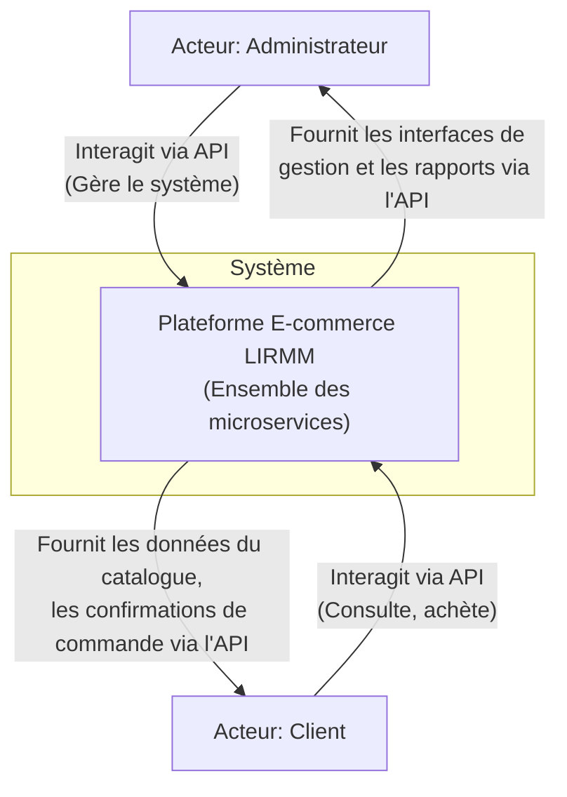
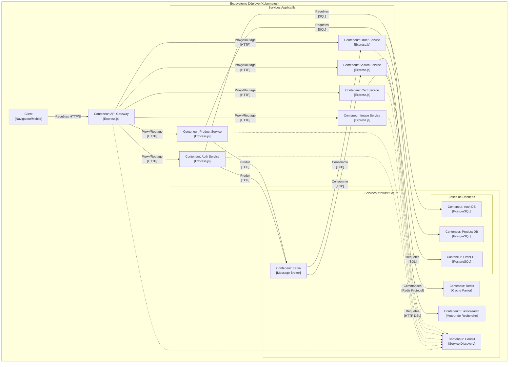
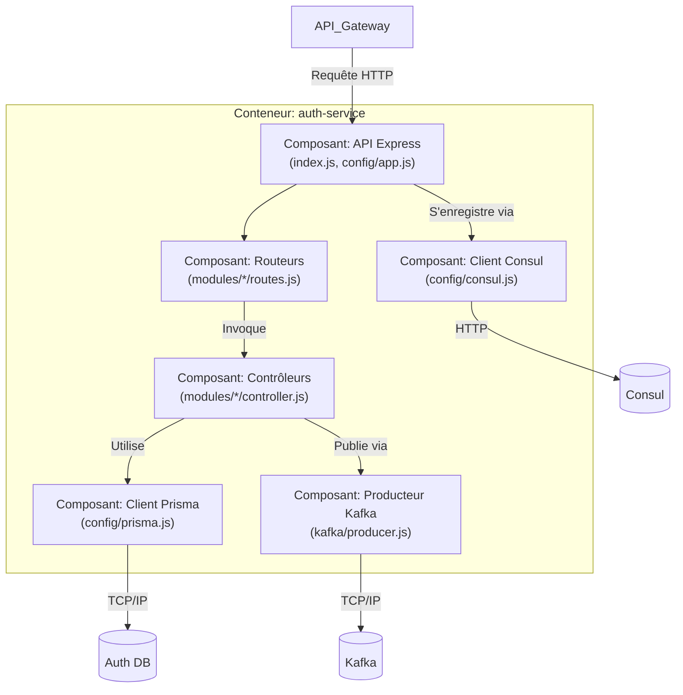
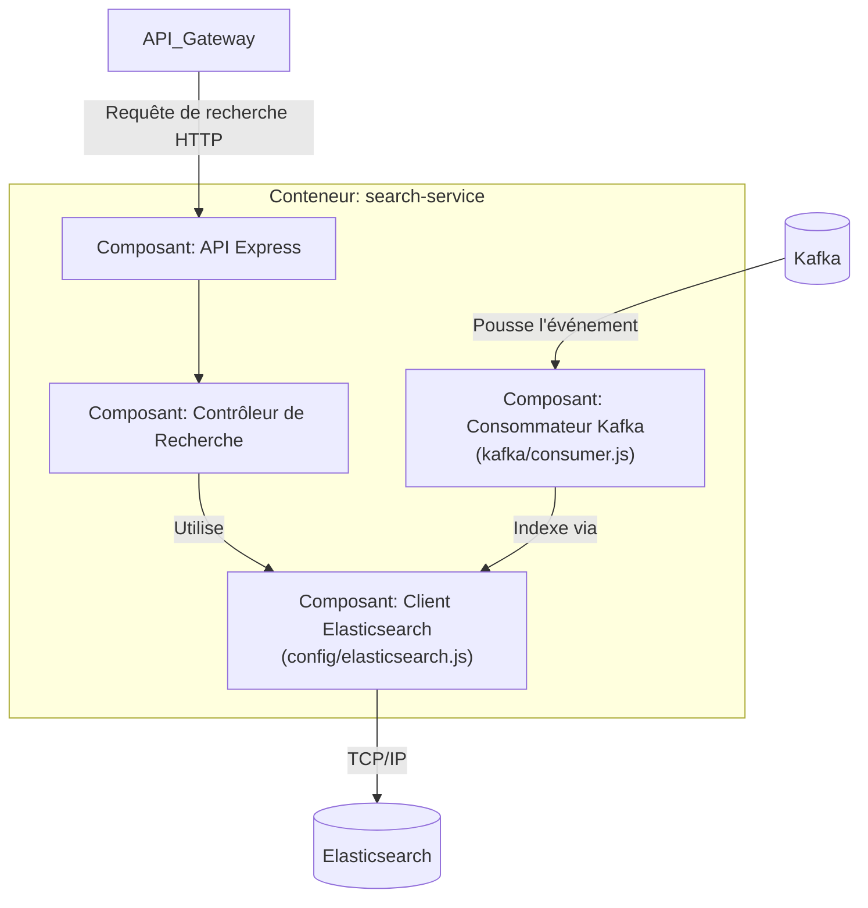
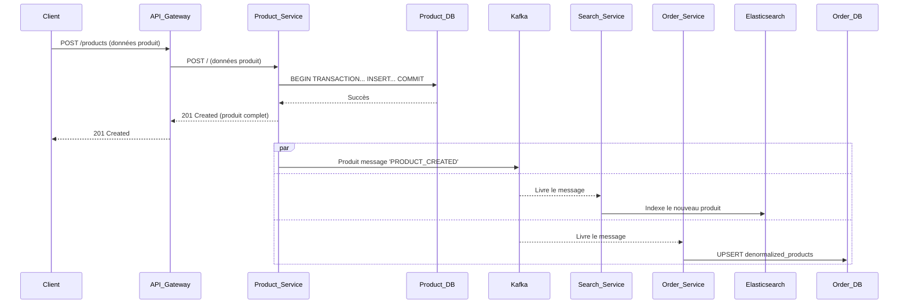
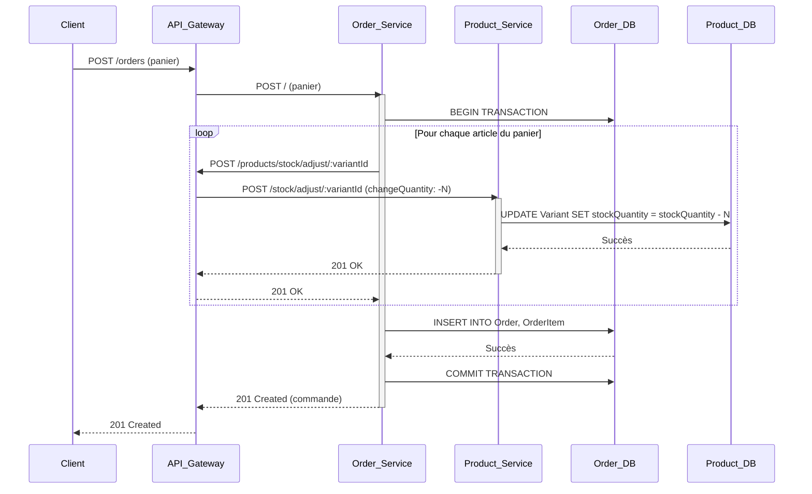
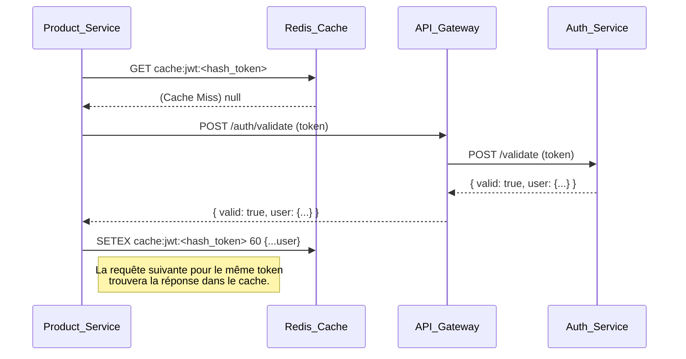
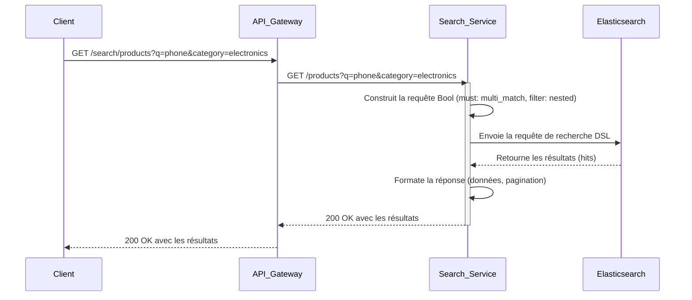
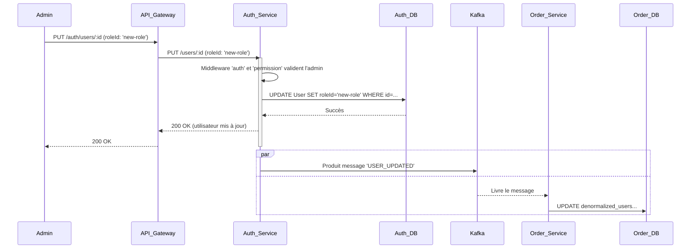

# **Dossier d'Architecture Technique et de Conception : Plateforme E-commerce LIRMM**

**Classification :** Document d'Architecture Système

---

## **Table des Matières Détaillée**

**PARTIE I : STRATÉGIE ET ARCHITECTURE GLOBALE**

1.  **Synthèse Décisionnelle (Executive Summary)**
2.  **Principes et Modèles Architecturaux Fondamentaux**
    *   2.1. Le Modèle C4 : Un Langage Commun pour l'Architecture Logicielle
    *   2.2. Paradigme des Microservices : Justification et compromis
    *   2.3. Architecture Orientée Événements (EDA) vs. Requête/Réponse
    *   2.4. Pattern CQRS (Command Query Responsibility Segregation)
    *   2.5. Stratégie de Persistance des Données : "Polyglot Persistence"
    *   2.6. Stratégie de Communication Inter-Services
3.  **Cartographie du Système (Modèle C4)**
    *   3.1. Niveau 1 : Diagramme de Contexte Système
    *   3.2. Niveau 2 : Diagramme de Conteneurs
    *   3.3. Niveau 3 : Diagrammes de Composants (Services Clés)

**PARTIE II : ANALYSE DÉTAILLÉE DES COMPOSANTS**

4.  **Dissection des Microservices Applicatifs**
    *   4.1. API Gateway (`api-gateway`)
    *   4.2. Service d'Authentification (`auth-service`)
    *   4.3. Service de Produits (`product-service`)
    *   4.4. Service d'Images (`image-service`)
    *   4.5. Service de Panier (`cart-service`)
    *   4.6. Service de Recherche (`search-service`)
    *   4.7. Service de Commandes (`order-service`)
5.  **Analyse des Services d'Infrastructure**
    *   5.1. Apache Kafka : Bus d'Événements
    *   5.2. PostgreSQL : Persistance Relationnelle
    *   5.3. Redis : Cache en Mémoire
    *   5.4. Elasticsearch : Indexation et Recherche
    *   5.5. HashiCorp Consul : Découverte de Services

**PARTIE III : PROCESSUS OPÉRATIONNELS ET PRÉOCCUPATIONS TRANSVERSALES**

6.  **Stratégie de Sécurité de Bout en Bout**
    *   6.1. Authentification des Utilisateurs (Flux JWT)
    *   6.2. Autorisation (RBAC)
    *   6.3. Sécurité Inter-Services
    *   6.4. Gestion des Secrets
7.  **Infrastructure, Déploiement et Opérations (DevOps)**
    *   7.1. Stratégie de Conteneurisation (Docker)
    *   7.2. Stratégie d'Orchestration (Kubernetes)
    *   7.3. Pipeline d'Intégration et de Déploiement Continus (CI/CD)
8.  **Scénarios d'Utilisation Critiques (Diagrammes de Séquence)**
    *   8.1. Création de Produit et Propagation d'Événement Asynchrone
    *   8.2. Passage de Commande : Transaction Distribuée Simplifiée
    *   8.3. Validation de Jeton Inter-Services avec Mise en Cache
    *   8.4. Recherche et Filtrage de Produits
    *   8.5. Mise à Jour de Rôle d'un Utilisateur par un Administrateur
9.  **Conclusion et Travaux Futurs**

**PARTIE IV : ANNEXES**

10. **Annexe A : Spécifications Complètes des Endpoints API**
    *   10.1. `auth-service`
    *   10.2. `product-service`
    *   10.3. `image-service`
    *   10.4. `cart-service`
    *   10.5. `search-service`
    *   10.6. `order-service`

---
<div style="page-break-after: always;"></div>

## **PARTIE I : STRATÉGIE ET ARCHITECTURE GLOBALE**

### **1. Synthèse Décisionnelle (Executive Summary)**
Ce document constitue la spécification technique complète de la plateforme e-commerce LIRMM. Conçue autour d'une architecture de microservices distribués, la plateforme privilégie la **scalabilité**, la **résilience** et la **maintenabilité** à long terme. Chaque domaine fonctionnel est encapsulé dans un service autonome, communiquant via des API REST synchrones pour les requêtes directes et un bus d'événements Kafka asynchrone pour la propagation des changements d'état. Cette approche hybride garantit à la fois la réactivité pour l'utilisateur final et un découplage fort entre les composants internes. L'ensemble de l'infrastructure est conteneurisé via Docker et orchestré par Kubernetes, avec un processus de déploiement entièrement automatisé par un pipeline CI/CD Jenkins. Ce dossier a pour vocation d'être la source unique de vérité pour l'architecture, la conception et les décisions opérationnelles du projet.

### **2. Principes et Modèles Architecturaux Fondamentaux**

#### **2.1. Le Modèle C4 : Un Langage Commun pour l'Architecture Logicielle**
Pour décrire l'architecture, nous adoptons le modèle C4 (Context, Containers, Components, Code), qui permet de zoomer sur le système à différents niveaux d'abstraction, offrant une clarté adaptée à chaque audience. Ce document se concentre sur les niveaux 1, 2 et 3.

#### **2.2. Paradigme des Microservices : Justification et compromis**
| Avantages | Inconvénients et Contre-mesures |
| :--- | :--- |
| **Scalabilité Indépendante** | Complexité opérationnelle accrue (gérée par Kubernetes). |
| **Résilience (Tolérance aux pannes)** | Nécessité de gérer les pannes réseau et les défaillances partielles (gérées par des `healthchecks`, des re-tentatives et des disjoncteurs). |
| **Déploiement Autonome** | Risque de rupture des contrats d'API (géré par des tests de contrat et une documentation rigoureuse). |
| **Flexibilité Technologique** | Potentiel de prolifération technologique (standardisation sur Node.js/Express pour ce projet). |

#### **2.3. Architecture Orientée Événements (EDA) vs. Requête/Réponse**
Le système emploie une architecture hybride.
*   **Synchrone (Requête/Réponse)** : Utilisé pour les commandes initiées par l'utilisateur où une réponse immédiate est attendue (ex: `POST /login`, `GET /products`).
*   **Asynchrone (EDA)** : Utilisé pour notifier les autres parties du système d'un fait qui s'est produit, sans attendre de réponse. C'est le cas pour la synchronisation des données de lecture.

#### **2.4. Pattern CQRS (Command Query Responsibility Segregation)**
Ce pattern est la pierre angulaire de notre stratégie de données. Il sépare les modèles utilisés pour modifier l'état (Commandes) de ceux utilisés pour lire l'état (Requêtes).
*   **Diagramme Conceptuel CQRS**
    ```mermaid
    graph TD
        Client --> API_Gateway
        API_Gateway -- "Commande (POST /products)" --> Command_Side["Modèle d'Écriture <br/> (Product Service + Product DB)"]
        Command_Side -- "Produit Événement" --> Event_Bus["Kafka"]
        Event_Bus -- "Consomme Événement" --> Query_Side["Modèle de Lecture <br/> (Search Service + Elasticsearch)"]
        API_Gateway -- "Requête (GET /search)" --> Query_Side
    ```

#### **2.5. Stratégie de Persistance des Données : "Polyglot Persistence"**
Le choix de la base de données est dicté par le cas d'usage spécifique de chaque service, une approche connue sous le nom de persistance polyglotte.
| Service | Technologie de Stockage | Justification |
| :--- | :--- | :--- |
| `auth`, `product`, `order` | PostgreSQL | Besoin de cohérence forte (ACID), de relations complexes et d'intégrité transactionnelle. |
| `cart-service` | Redis | Besoin de performance extrême (faible latence), de volatilité des données (TTL pour les paniers). |
| `search-service` | Elasticsearch | Besoin d'indexation plein texte, de recherche par pertinence (scoring) et de capacités d'agrégation. |
| `image-service` | Volume Persistant (FS) | Stockage de données binaires non structurées (fichiers images). |

#### **2.6. Stratégie de Communication Inter-Services**
| Type de Communication | Mécanisme | Cas d'Usage | Exemple |
| :--- | :--- | :--- | :--- |
| **Synchrone (Interne)** | REST sur HTTP | Requête directe où le demandeur a besoin d'une réponse immédiate pour continuer. | `order-service` appelant `product-service` pour ajuster le stock. |
| **Asynchrone (Interne)** | Événements Kafka | Notification de changement d'état à un ou plusieurs services sans attendre de réponse. | `product-service` publiant `PRODUCT_UPDATED` après une modification. |
| **Découverte de Services** | DNS / API Consul | Traduire un nom de service logique (ex: `auth-service`) en une adresse IP:Port concrète. | `API Gateway` cherchant l'adresse de `product-service`. |

---
<div style="page-break-after: always;"></div>

### **3. Cartographie du Système (Modèle C4)**

#### **3.1. Niveau 1 : Diagramme de Contexte Système**


#### **3.2. Niveau 2 : Diagramme de Conteneurs**


#### **3.3. Niveau 3 : Diagrammes de Composants**

##### **`auth-service`**


##### **`search-service`**

---
<div style="page-break-after: always;"></div>

## **PARTIE II : ANALYSE DÉTAILLÉE DES COMPOSANTS**

*(La documentation ci-dessous fournit des détails exhaustifs pour chaque service.)*

### **4. Dissection des Microservices Applicatifs**

#### **4.1. API Gateway (`api-gateway`)**
*   **Responsabilités Principales** :
    1.  **Proxy Inverse** : Agit comme unique point de contact pour les clients externes.
    2.  **Routage Dynamique** : Utilise Consul pour router les requêtes vers les instances de service saines.
    3.  **Abstraction de Topologie** : Masque la complexité et l'emplacement des services internes.
*   **Technologie** : Node.js, Express.js, `http-proxy-middleware`, `consul`.
*   **Logique de Proxy Détaillée (`config/app.js`)** : Le middleware `createDynamicProxy` est configuré avec `router`, une fonction asynchrone. Pour chaque requête, cette fonction interroge Consul. Si `findService` retourne `null`, une erreur 503 est levée immédiatement. Sinon, l'URL retournée est utilisée comme `target` pour le proxy. Le `pathRewrite` est utilisé pour le `image-service` pour transformer `/images/foo.jpg` en `/foo.jpg`, car le service d'images sert les fichiers depuis la racine de son répertoire statique.

#### **4.2. Service d'Authentification (`auth-service`)**
*   **Responsabilités Principales** :
    1.  **Gestion du Cycle de Vie des Utilisateurs** : CRUD complet sur les entités `User`.
    2.  **Processus d'Authentification** : Validation des credentials et émission de jetons JWT.
    3.  **Validation de Jeton** : Exposition d'un endpoint interne (`/validate`) pour les autres services.
    4.  **Gestion des Rôles et Permissions** : CRUD sur `Role` et association avec `Permission`.
    5.  **Publication d'Événements** : Notifie le reste du système des changements sur les utilisateurs.
*   **Logique Interne Notable** :
    *   **Seed (`prisma/seed.js`)** : Initialise la base de données avec des données critiques :
        *   Crée toutes les `Permission` possibles dans le système.
        *   Crée les `Role` fondamentaux ("ADMIN", "Customer", etc.).
        *   Assigne les permissions aux rôles.
        *   Crée un utilisateur `admin@admin.com` initial.
    *   **Contrôleur `updateUser`** : Contient des gardes spécifiques pour empêcher un administrateur de changer son propre rôle ou de désactiver le dernier compte administrateur actif, garantissant ainsi que le système ne peut pas être verrouillé.

#### **4.3. Service de Produits (`product-service`)**
*   **Responsabilités Principales** :
    1.  **Source de Vérité du Catalogue** : Gère l'intégralité des produits, catégories, et variantes.
    2.  **Gestion des Stocks** : Centralise la logique de modification des niveaux de stock.
    3.  **Publication des Changements** : Émet des événements pour toute modification du catalogue.
*   **Logique Métier Complexe** :
    *   **Hiérarchie des Catégories** : Le schéma autorise une hiérarchie de catégories (parent/enfant). La logique métier dans `category.controller.js` impose des règles strictes : un produit ne peut être assigné qu'à une catégorie "feuille" (qui n'a pas d'enfant), et on ne peut pas créer un enfant pour une catégorie qui a déjà des produits.
    *   **Transactions Atomiques** : La création d'un produit avec ses variantes et son stock initial est une opération atomique via `prisma.$transaction`. Si une seule partie échoue, tout est annulé.

#### **4.4. Service d'Images (`image-service`)**
*   **Responsabilités** : Service utilitaire simple pour le stockage et la distribution d'images.
*   **Logique Interne** : Utilise la librairie `multer` pour gérer les téléversements `multipart/form-data`. Le `diskStorage` configure un nom de fichier unique (`uuidv4()`) pour éviter les collisions. Le `fileFilter` valide les types MIME pour n'accepter que les images. Les fichiers sont servis statiquement via `express.static`.

#### **4.5. Service de Panier (`cart-service`)**
*   **Responsabilités** : Gestion des paniers volatiles avec une performance élevée.
*   **Logique Interne** : Toutes les opérations CRUD sont effectuées sur des clés Redis. Un TTL (Time To Live) est systématiquement rafraîchi à chaque opération pour éviter que les paniers actifs n'expirent. Le `associateCartWithUser` est un endpoint clé appelé après la connexion d'un client pour lier son panier d'invité à son compte utilisateur.

#### **4.6. Service de Recherche (`search-service`)**
*   **Responsabilités** : Fournir une recherche plein texte et à facettes.
*   **Logique Interne** :
    *   **Consommateur Kafka** : Le `consumer.js` écoute sur `product_events`. Il transforme les messages en documents Elasticsearch et utilise `esClient.index` ou `esClient.delete`. L'idempotence est assurée en utilisant l'ID du produit comme `_id` du document.
    *   **Contrôleur de Recherche** : Construit dynamiquement une requête Elasticsearch `bool query` à partir des paramètres de l'URL (`q`, `category`, `minPrice`, etc.). Il utilise des requêtes `nested` pour filtrer sur des champs dans des tableaux d'objets (comme les variantes et les catégories).

#### **4.7. Service de Commandes (`order-service`)**
*   **Responsabilités** : Orchestrer le processus de commande et maintenir un historique immuable des ventes.
*   **Logique Interne** : La création d'une commande est une opération transactionnelle. L'étape la plus critique est l'appel synchrone au `product-service` pour ajuster le stock. Si cet appel échoue, la transaction de base de données est annulée (`rollback`), garantissant qu'aucune commande n'est créée si le stock n'est pas disponible. Le service maintient des tables dénormalisées (`denormalized_products`, `denormalized_users`) pour s'assurer que les informations d'une commande restent les mêmes que lors de son passage, même si le produit ou l'utilisateur est modifié plus tard.

---
<div style="page-break-after: always;"></div>

### **5. Analyse des Services d'Infrastructure**

#### **5.1. Apache Kafka : Bus d'Événements**
*   **Topics et Partitions** :
    *   `product_events` : Contient les changements d'état du catalogue. Peut être partitionné par `categoryId` ou `productId` pour un traitement parallèle.
    *   `auth_events` : Contient les changements d'état des utilisateurs. Partitionné par `userId`.
*   **Consumer Groups** : Chaque service consommateur (`search-service`, `order-service`) utilise un `groupId` unique. Cela garantit que chaque message sur un topic est délivré à une instance de chaque service.
*   **Idempotence du Consommateur** : Les consommateurs sont conçus pour être idempotents. Le `search-service` utilise `esClient.index` avec l'ID du produit comme `_id` du document. Le `order-service` utilise `prisma.upsert`.

#### **5.2. PostgreSQL : Persistance Relationnelle**
Utilisé pour sa robustesse et son support des transactions ACID, essentiels pour les données financières et de catalogue.

#### **5.3. Redis : Cache en Mémoire**
Utilisé pour sa performance extrême en lecture/écriture, parfait pour les données de session volatiles comme les paniers.

#### **5.4. Elasticsearch : Indexation et Recherche**
Le mapping de l'index `products` dans `config/elasticsearch.js` est crucial. Il définit :
*   `name` comme `text` avec un analyseur, mais aussi comme `keyword` pour le tri/agrégation.
*   `variants` comme `nested` pour pouvoir interroger indépendamment les attributs de chaque variante.

#### **5.5. HashiCorp Consul : Découverte de Services**
Chaque service s'enregistre avec un `check` de santé HTTP. Consul exécute périodiquement une requête sur le endpoint `/health` du service. Si la sonde échoue plusieurs fois, Consul marque l'instance comme "critical" et arrête de la retourner dans les requêtes de découverte, assurant ainsi un routage uniquement vers les instances saines.

---
<div style="page-break-after: always;"></div>

## **PARTIE III : PROCESSUS OPÉRATIONNELS ET PRÉOCCUPATIONS TRANSVERSALES**

### **6. Stratégie de Sécurité de Bout en Bout**

#### **6.1. Authentification des Utilisateurs (Flux JWT)**
Le flux détaillé est présenté en section 8.3. Une faiblesse de la conception actuelle est l'appel synchrone à `auth-service` pour chaque validation. **Amélioration critique** : Mettre en cache la réponse de `/validate` dans un Redis local au service appelant, avec un TTL court (ex: 1-5 minutes), pour réduire drastiquement la charge sur `auth-service`.

#### **6.2. Autorisation (RBAC)**
L'autorisation est gérée par le `permission.js` middleware. Après que `authMiddleware` a validé le token et attaché l'objet `user` (contenant le tableau `permissions`) à la requête, le `hasPermission('permission:requise')` middleware vérifie si la chaîne de permission requise est présente dans le tableau.

#### **6.3. Sécurité Inter-Services**
Actuellement, la communication est sur un réseau de confiance. **Amélioration critique** : Déployer un service mesh comme Istio ou Linkerd pour imposer une authentification mutuelle (mTLS) entre tous les services.

#### **6.4. Gestion des Secrets**
Les secrets sont fournis via les variables d'environnement. **Amélioration critique** : Utiliser un gestionnaire de secrets comme HashiCorp Vault ou les Secrets Kubernetes montés en tant que volumes.

### **7. Infrastructure, Déploiement et Opérations (DevOps)**

#### **7.1. Stratégie de Conteneurisation (Docker)**
Les `Dockerfile` sont optimisés pour réduire la taille des images et les temps de build, en séparant l'installation des dépendances de la copie du code source.

#### **7.2. Stratégie d'Orchestration (Kubernetes)**
*   **Diagramme de Déploiement Physique**
    ```mermaid
    graph TD
        subgraph "Hardware/VM (Node 1)"
            Kubelet1["Kubelet"]
            subgraph "Pods"
                Pod_Auth["Pod: auth-service-xyz"]
                Pod_APIGW["Pod: api-gateway-abc"]
                Pod_Consul["Pod: consul-123"]
            end
        end
        subgraph "Hardware/VM (Node 2)"
            Kubelet2["Kubelet"]
            subgraph "Pods"
                Pod_Prod["Pod: product-service-qwe"]
                Pod_DB["Pod: product-db-rty"]
                Pod_Kafka["Pod: kafka-fgh"]
            end
        end
        LoadBalancer["Load Balancer Externe"] --> Kubelet1 & Kubelet2
        Kubelet1 -- "Réseau Overlay CNI" -- Kubelet2
    ```
*   **Sondes de Santé (`Probes`)** :
    *   **`ReadinessProbe`** : Indique si un pod est prêt à accepter du trafic.
    *   **`LivenessProbe`** : Indique si le conteneur est en vie. S'il échoue, Kubernetes le redémarre.

#### **7.3. Pipeline d'Intégration et de Déploiement Continus (CI/CD)**
*   **Diagramme Détaillé du Pipeline Jenkins**
    ```mermaid
    graph TD
        subgraph "Phase de Pré-Build"
            A["Git Commit sur 'main'"] --> B["Jenkins Webhook Trigger"]
            B --> C["Checkout Code"]
            C --> D["Linting & Static Analysis"]
            D --> E["Unit Tests"]
        end
        subgraph "Phase de Build"
            E -- "Si succès" --> F["Build Docker Images<br/>pour chaque service"]
            F --> G["Push Images to Registry<br/>(ex: Docker Hub, ECR)"]
        end
        subgraph "Phase de Déploiement & Test"
            G -- "Si succès" --> H["Provision Kind Cluster"]
            H --> I["Load Images into Cluster"]
            I --> J["Deploy Manifests to Kind"]
            J --> K["Health & Smoke Tests"]
            K --> L["Integration & E2E Tests"]
        end
        subgraph "Phase de Post-Build"
            L --> M["Publish Test Results"]
            M --> N["Cleanup Kind Cluster"]
            N --> O["End Pipeline"]
        end

        Z["Fail & Notify"]
        D -- "Échec" --> Z
        E -- "Échec" --> Z
        F -- "Échec" --> Z
        G -- "Échec" --> Z
        L -- "Échec" --> M
    ```

---
<div style="page-break-after: always;"></div>

### **8. Scénarios d'Utilisation Critiques (Diagrammes de Séquence)**

#### **8.1. Création de Produit et Propagation d'Événement Asynchrone**


#### **8.2. Passage de Commande : Transaction Distribuée Simplifiée**


#### **8.3. Validation de Jeton Inter-Services avec Mise en Cache**


#### **8.4. Recherche et Filtrage de Produits**


#### **8.5. Mise à Jour de Rôle d'un Utilisateur par un Administrateur**

---
<div style="page-break-after: always;"></div>

### **9. Conclusion et Travaux Futurs**

Cette architecture de microservices distribués et orientés événements fournit une base exceptionnellement robuste, scalable et maintenable pour la plateforme e-commerce LIRMM. La séparation des préoccupations, la persistance polyglotte et une stratégie de déploiement automatisée positionnent le projet pour une croissance et une évolution futures.

Les travaux futurs doivent impérativement se concentrer sur le renforcement des aspects non-fonctionnels critiques pour une mise en production :

| Domaine | Action Spécifique | Justification |
| :--- | :--- | :--- |
| **Observabilité** | Déployer une stack EFK (Elasticsearch, Fluentd, Kibana) pour l'agrégation de logs. Intégrer `prom-client` dans chaque service et configurer Prometheus/Grafana pour les métriques. Intégrer l'SDK OpenTelemetry pour le traçage distribué. | Fournir une visibilité complète sur la santé et la performance du système, indispensable pour le débogage et l'optimisation en environnement distribué. |
| **Sécurité** | Déployer un service mesh (ex: Istio) pour imposer mTLS. Mettre en place un flux de rafraîchissement de token (refresh token). Intégrer HashiCorp Vault pour la gestion centralisée des secrets. | Durcir la posture de sécurité en chiffrant le trafic interne, en améliorant l'expérience utilisateur et en gérant les secrets de manière sécurisée. |
| **Tests** | Développer des tests de contrat avec Pact.io pour valider les API entre services. Créer des scénarios de test de charge avec k6 pour identifier les goulots d'étranglement. | Garantir que les déploiements indépendants ne cassent pas les intégrations et que le système peut supporter la charge attendue. |
| **Résilience** | Implémenter le pattern Dead-Letter Queue (DLQ) dans tous les consommateurs Kafka. Intégrer une librairie de disjoncteur (circuit breaker) comme `opossum` pour les appels HTTP synchrones critiques. | Isoler les messages problématiques sans bloquer le traitement. Empêcher les pannes en cascade en cas de défaillance d'un service. |
| **Optimisation** | Mettre en place une stratégie de cache pour les appels à `/auth/validate` avec Redis. Analyser et optimiser les requêtes Prisma lentes. | Réduire la latence et la charge sur les services critiques, améliorant ainsi la performance globale. |

---
<div style="page-break-after: always;"></div>

## **PARTIE IV : ANNEXES**

### **10. Annexe A : Spécifications Complètes des Endpoints API**

#### **10.1. `auth-service`**

| Méthode | Chemin (via Gateway) | Perm. | Body (Requête) | Réponse Succès (2xx) | Réponses Erreur (Exemples) |
|:---|:---|:---|:--- |:--- |:--- |
|`POST`|`/auth/register`|Publique|`{"name", "email", "password"}`|`201: {"token": "..."}`|`400: Champs requis`, `409: Utilisateur existe`|
|`POST`|`/auth/login`|Publique|`{"email", "password"}`|`200: {"token": "..."}`|`401: Invalid credentials`, `403: Compte désactivé`|
|`GET`|`/auth/me`|JWT Requis|N/A|`200: {user object}`|`401: Token invalide`, `404: Utilisateur non trouvé`|
|`POST`|`/auth/validate`|Interne|`{"token": "..."}`|`200: {"valid": true, "user":{...}}`|`401: Token invalide`|
|`GET`|`/auth/users`|`read:user`|N/A|`200: {"data": [...], "pagination":{...}}`|`401/403: Accès refusé`|
|`GET`|`/auth/users/:id`|`read:user`|N/A|`200: {user object}`|`401/403`, `404: Non trouvé`|
|`PUT`|`/auth/users/:id`|`write:user`|`{"name"?, "roleId"?}`|`200: {user object}`|`403: Ne peut changer son propre rôle`, `404: Non trouvé`|
|`DELETE`|`/auth/users/:id`|`delete:user`|N/A|`204: No Content`|`403: Ne peut se désactiver soi-même`, `404: Non trouvé`|
|`POST`|`/auth/users/:id/activate`|`write:user`|N/A|`200: {user object}`|`404: Non trouvé`|
|`GET`|`/auth/roles`|`read:role`|N/A|`200: [role objects]`|`401/403`|
|`POST`|`/auth/roles`|`write:role`|`{"name", "description"?, "permissionIds":[]}`|`201: {role object}`|`409: Rôle existe`|
|`GET`|`/auth/permissions`|`read:role`|N/A|`200: [permission objects]`|`401/403`|

#### **10.2. `product-service`**

| Méthode | Chemin (via Gateway) | Perm. | Body (Requête) | Réponse Succès (2xx) | Réponses Erreur (Exemples) |
|:--- |:---|:---|:--- |:--- |:--- |
|`GET`|`/products`|Publique|N/A|`200: {"data": [...], "pagination":{...}}`|`500: Erreur interne`|
|`GET`|`/products/id/:id`|Publique|N/A|`200: {product object}`|`404: Non trouvé`|
|`POST`|`/products`|`create:product`|`{sku, name, description?, ...}`|`201: {product object}`|`400: Champs requis`, `409: SKU existe`|
|`PUT`|`/products/:id`|`update:product`|`{sku?, name?, ...}`|`200: {product object}`|`404: Non trouvé`|
|`DELETE`|`/products/:id`|`delete:product`|N/A|`204: No Content`|`404: Non trouvé`|
|`POST`|`/products/:id/categories`|`update:product`|`{"categoryIds": [...]}`|`201: {message}`|`400: IDs invalides`, `404: Produit non trouvé`|
|`POST`|`/products/:id/images`|`update:product`|`[{"imageUrl", "isPrimary"?}]`|`201: {message}`|`404: Produit non trouvé`|
|`POST`|`/products/:productId/variants`|`update:product`|`{attributes, price, ...}`|`201: {variant object}`|`404: Produit non trouvé`|
|`POST`|`/products/stock/adjust/:variantId`|`adjust:stock`|`{"changeQuantity", "type"}`|`201: {mouvement}`|`400: Stock insuffisant`, `404: Variante non trouvée`|
|`GET`|`/products/categories`|Publique|N/A|`200: [category objects]`|`500: Erreur interne`|
|`POST`|`/products/categories`|`create:category`|`{"name", "slug", "parentId"?}`|`201: {category object}`|`409: Slug existe`, `409: Parent a des produits`|

#### **10.3. `image-service`**
| Méthode | Chemin (via Gateway) | Perm. | Body (Requête) | Réponse Succès (2xx) | Réponses Erreur (Exemples) |
|:--- |:---|:---|:--- |:--- |:--- |
|`POST`|`/images/upload`|Interne/Protégé|`multipart/form-data` avec champ `imageFile`|`201: {filename, imageUrl, ...}`|`400: Fichier manquant ou type invalide`|
|`GET`|`/images/:filename`|Publique|N/A|`200: (Fichier image binaire)`|`404: Image non trouvée`|

#### **10.4. `cart-service`**
| Méthode | Chemin (via Gateway) | Perm. | Body (Requête) | Réponse Succès (2xx) | Réponses Erreur (Exemples) |
|:--- |:---|:---|:--- |:--- |:--- |
|`POST`|`/carts`|Publique|`{"userId"?}`|`201: {cart object}`|`500: Erreur Redis`|
|`GET`|`/carts/:cartId`|Publique|N/A|`200: {cart object}` (crée si non-existant)|`500: Erreur Redis`|
|`POST`|`/carts/:cartId/items`|Publique|`{"productId", "variantId", ...}`|`200: {cart object}`|`400: Champs requis`|
|`PUT`|`/carts/:cartId/items/:itemId`|Publique|`{"quantity"}`|`200: {cart object}`|`400: Quantité invalide`, `404: Panier/Article non trouvé`|
|`DELETE`|`/carts/:cartId/items/:itemId`|Publique|N/A|`200: {cart object}`|`404: Panier/Article non trouvé`|
|`POST`|`/carts/associate`|Publique|`{"cartId", "userId"}`|`200: {cart object}`|`400: Champs requis`|

#### **10.5. `search-service`**
| Méthode | Chemin (via Gateway) | Perm. | Query Params (Requête) | Réponse Succès (2xx) | Réponses Erreur (Exemples) |
|:--- |:---|:---|:--- |:--- |:--- |
|`GET`|`/search/products`|Publique|`q`, `limit`, `page`, `category`, `isActive`, `minPrice`, `maxPrice`|`200: {"data": [...], "pagination":{...}}`|`400: Paramètre de recherche manquant`, `500: Erreur Elasticsearch`|

#### **10.6. `order-service`**
| Méthode | Chemin (via Gateway) | Perm. | Body (Requête) | Réponse Succès (2xx) | Réponses Erreur (Exemples) |
|:--- |:---|:---|:--- |:--- |:--- |
|`POST`|`/orders`|Optionnelle|`{items: [...], shippingAddress, ...}`|`201: {order object}`|`400: Champs requis`, `503: Service produit indisponible`|
|`POST`|`/orders/guest-lookup`|Publique|`{"orderId", "email"}`|`200: {order object}`|`404: Commande non trouvée`|
|`GET`|`/orders/:id`|Publique|N/A|`200: {order object}`|`404: Non trouvé`|
|`GET`|`/orders/my-orders`|`read:my-orders`|N/A|`200: {"data": [...], "pagination":{...}}`|`401/403`|
|`GET`|`/orders`|Admin Requis|N/A|`200: {"data": [...], "pagination":{...}}`|`401/403`|
|`PUT`|`/orders/:id/status`|Admin Requis|`{"status": "SHIPPED"}`|`200: {order object}`|`401/403`, `404: Non trouvé`|
