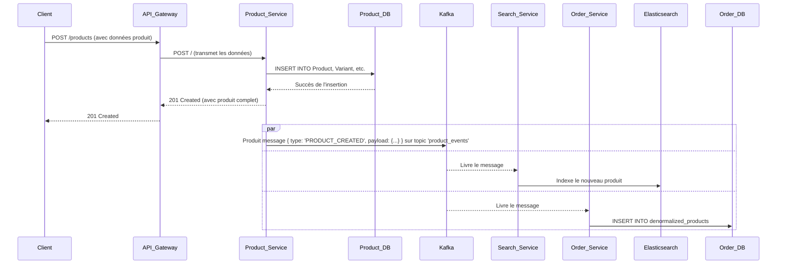

Absolument. Voici une documentation complète et académique de votre projet, rédigée en français pour votre superviseur. La documentation couvre l'architecture, les microservices, l'infrastructure, le CI/CD et les technologies utilisées, avec des diagrammes et des tableaux détaillés.

***

# **Documentation Technique du Projet E-commerce LIRMM**

**Projet de Fin d'Études**

**Auteur :** Samir
**Date :** 26 Mai 2024
**Superviseur :** [Nom de votre superviseur]

---

## **Table des Matières**

1.  [Introduction](#1-introduction)
    *   1.1. Objectif du Projet
    *   1.2. Choix Architecturaux
    *   1.3. Technologies Utilisées
2.  [Architecture Globale](#2-architecture-globale)
    *   2.1. Vue d'Ensemble des Composants
    *   2.2. Flux de Données et Communication
3.  [Description Détaillée des Microservices](#3-description-détaillée-des-microservices)
    *   3.1. API Gateway (`api-gateway`)
    *   3.2. Service d'Authentification (`auth-service`)
    *   3.3. Service de Produits (`product-service`)
    *   3.4. Service d'Images (`image-service`)
    *   3.5. Service de Panier (`cart-service`)
    *   3.6. Service de Recherche (`search-service`)
    *   3.7. Service de Commandes (`order-service`)
4.  [Architecture Orientée Événements avec Kafka](#4-architecture-orientée-événements-avec-kafka)
    *   4.1. Principe et Avantages
    *   4.2. Topics Kafka
    *   4.3. Scénario : Création d'un Produit
5.  [Infrastructure et Déploiement](#5-infrastructure-et-déploiement)
    *   5.1. Conteneurisation avec Docker
    *   5.2. Orchestration Locale avec Docker Compose
    *   5.3. Orchestration de Production avec Kubernetes (Kind)
6.  [Intégration et Déploiement Continus (CI/CD) avec Jenkins](#6-intégration-et-déploiement-continus-cicd-avec-jenkins)
    *   6.1. Présentation du `Jenkinsfile`
    *   6.2. Étapes du Pipeline
7.  [Services d'Infrastructure Complémentaires](#7-services-dinfrastructure-complémentaires)
    *   7.1. Service Discovery (Consul)
    *   7.2. Bases de Données (PostgreSQL)
    *   7.3. Système de Cache (Redis)
    *   7.4. Moteur de Recherche (Elasticsearch)
8.  [Conclusion](#8-conclusion)

---

## **1. Introduction**

### **1.1. Objectif du Projet**

Ce document présente l'architecture technique d'une plateforme e-commerce backend conçue comme projet de fin d'études. L'objectif est de construire un système robuste, scalable et maintenable en s'appuyant sur les meilleures pratiques de l'ingénierie logicielle moderne, notamment l'architecture microservices et la communication événementielle.

### **1.2. Choix Architecturaux**

Le système est fondé sur une **architecture microservices**. Chaque fonctionnalité métier principale (authentification, produits, commandes, etc.) est isolée dans son propre service indépendant. Cette approche offre plusieurs avantages :
*   **Scalabilité indépendante** : Chaque service peut être mis à l'échelle en fonction de sa charge spécifique.
*   **Résilience** : Une défaillance dans un service n'entraîne pas nécessairement l'arrêt complet du système.
*   **Flexibilité technologique** : Chaque service peut potentiellement utiliser la technologie la plus adaptée à son besoin.
*   **Déploiement découplé** : Les services peuvent être mis à jour et déployés indépendamment les uns des autres.

La communication entre les services est assurée de deux manières :
1.  **Synchrone (HTTP/REST)** : Pour les requêtes directes initiées par le client, via une API Gateway.
2.  **Asynchrone (Événementielle)** : Pour la propagation des changements d'état entre les services, via le broker de messages **Apache Kafka**.

### **1.3. Technologies Utilisées**

| Catégorie | Technologie | Rôle |
| :--- | :--- | :--- |
| **Langage/Framework Backend** | Node.js / Express.js | Développement des microservices. |
| **Bases de Données** | PostgreSQL | Stockage des données relationnelles pour les services `auth`, `product` et `order`. |
| **ORM** | Prisma | Object-Relational Mapper pour interagir avec les bases de données PostgreSQL. |
| **Cache en Mémoire** | Redis | Gestion des paniers (`cart-service`), optimisé pour la performance et la volatilité. |
| **Moteur de Recherche** | Elasticsearch | Indexation et recherche plein texte des produits (`search-service`). |
| **Broker de Messages** | Apache Kafka | Communication asynchrone et événementielle entre les services. |
| **Service Discovery** | HashiCorp Consul | Enregistrement et découverte dynamique des instances de microservices. |
| **Conteneurisation** | Docker | Empaquetage des applications et de leurs dépendances. |
| **Orchestration** | Docker Compose / Kubernetes | Gestion et déploiement des conteneurs en environnement local (Compose) et de production (K8s). |
| **CI/CD** | Jenkins | Automatisation du build, des tests et du déploiement de l'application. |

---

## **2. Architecture Globale**

### **2.1. Vue d'Ensemble des Composants**

L'architecture est composée de services applicatifs, de services d'infrastructure et d'un point d'entrée unique.

```mermaid
graph TD
    subgraph "Infrastructure Externe"
        Client[Client Web/Mobile]
    end

    subgraph "Cluster Kubernetes / Docker"
        subgraph "Services Applicatifs"
            API_Gateway[API Gateway]
            Auth_Service[Auth Service]
            Product_Service[Product Service]
            Image_Service[Image Service]
            Cart_Service[Cart Service]
            Search_Service[Search Service]
            Order_Service[Order Service]
        end

        subgraph "Services d'Infrastructure"
            Consul[Consul<br/>(Service Discovery)]
            Kafka_Bus[Kafka<br/>(Message Broker)]
            Elasticsearch[Elasticsearch<br/>(Recherche)]
            Redis[Redis<br/>(Cache Panier)]

            subgraph "Bases de Données (PostgreSQL)"
                Auth_DB[(Auth DB)]
                Product_DB[(Product DB)]
                Order_DB[(Order DB)]
            end
        end

        Client --> API_Gateway

        API_Gateway -->|/auth| Auth_Service
        API_Gateway -->|/products| Product_Service
        API_Gateway -->|/images| Image_Service
        API_Gateway -->|/carts| Cart_Service
        API_Gateway -->|/search| Search_Service
        API_Gateway -->|/orders| Order_Service

        Auth_Service --> Auth_DB
        Product_Service --> Product_DB
        Order_Service --> Order_DB

        Cart_Service --> Redis

        Auth_Service --- Consul
        Product_Service --- Consul
        Image_Service --- Consul
        Cart_Service --- Consul
        Search_Service --- Consul
        Order_Service --- Consul
        API_Gateway --- Consul

        Auth_Service -- Événements Auth --> Kafka_Bus
        Product_Service -- Événements Produit --> Kafka_Bus

        Kafka_Bus -- Événements Auth --> Order_Service
        Kafka_Bus -- Événements Produit --> Order_Service
        Kafka_Bus -- Événements Produit --> Search_Service

        Search_Service --> Elasticsearch
    end

    style Client fill:#fff,stroke:#333,stroke-width:2px
    style Kafka_Bus fill:#f9f,stroke:#333,stroke-width:2px
```

### **2.2. Flux de Données et Communication**

1.  **Requête Synchrone** : Le client envoie une requête HTTP (ex: `GET /products`) à l'**API Gateway**. L'API Gateway utilise **Consul** pour découvrir l'adresse du `Product-Service`, lui transmet la requête, attend la réponse et la renvoie au client.
2.  **Communication Asynchrone** : Lorsqu'une action modifie l'état d'une ressource (ex: un produit est créé dans le `Product-Service`), le service publie un événement (ex: `PRODUCT_CREATED`) dans un topic **Kafka**. D'autres services, comme le `Search-Service` et le `Order-Service`, sont abonnés à ce topic. Ils consomment l'événement et mettent à jour leurs propres données en conséquence (le `Search-Service` indexe le nouveau produit dans **Elasticsearch**, le `Order-Service` met à jour sa table de produits dénormalisée).

---

## **3. Description Détaillée des Microservices**

### **3.1. API Gateway (`api-gateway`)**
*   **Rôle** : Point d'entrée unique pour toutes les requêtes externes. Il est responsable du routage des requêtes vers les services internes appropriés en utilisant la découverte de service via Consul.
*   **Endpoints** : N'a pas de points de terminaison métier propres, mais agit comme un proxy inversé.

| Préfixe de Route | Service Cible | Description |
| :--- | :--- | :--- |
| `/auth/**` | `auth-service` | Gère les requêtes liées à l'authentification et aux utilisateurs. |
| `/products/**` | `product-service` | Gère les requêtes pour les produits, catégories, etc. |
| `/images/**` | `image-service` | Gère le téléversement et la récupération d'images. |
| `/carts/**` | `cart-service` | Gère les requêtes liées aux paniers d'achat. |
| `/search/**` | `search-service` | Gère les requêtes de recherche de produits. |
| `/orders/**` | `order-service` | Gère les requêtes pour les commandes. |
| `/health` | `api-gateway` | Point de terminaison de santé du service lui-même. |

### **3.2. Service d'Authentification (`auth-service`)**
*   **Rôle** : Gère l'enregistrement, la connexion, la gestion des utilisateurs, les rôles et les permissions. Il émet des jetons JWT et valide ceux présentés par les autres services.
*   **Schéma de la Base de Données (`auth_db`)** :
    ```mermaid
    erDiagram
        User {
            string id PK
            string name
            string email UK
            string password
            string profileImage
            boolean isActive
            string roleId FK
        }
        Role {
            string id PK
            string name UK
            string description
        }
        Permission {
            string id PK
            string name UK
            string description
        }
        RolePermission {
            string roleId PK, FK
            string permissionId PK, FK
        }
        User ||--|{ Role : "a un"
        Role }o--o{ RolePermission : "contient"
        Permission }o--o{ RolePermission : "est contenu dans"
    ```
*   **Événements Kafka produits (Topic: `auth_events`)** : `USER_CREATED`, `USER_UPDATED`, `USER_DELETED`. Ces événements permettent aux autres services (comme `order-service`) de maintenir une copie dénormalisée des informations utilisateur.
*   **Points de terminaison API** :

| Méthode | Chemin | Description | Protection |
| :--- | :--- | :--- | :--- |
| `POST` | `/register` | Enregistre un nouvel utilisateur. | Publique |
| `POST` | `/login` | Connecte un utilisateur et retourne un JWT. | Publique |
| `GET` | `/me` | Retourne les informations de l'utilisateur connecté. | JWT Requis |
| `POST`| `/validate` | Valide un jeton JWT (usage interne par d'autres services). | Interne |
| `GET` | `/users` | Liste tous les utilisateurs (paginé). | `read:user` |
| `GET` | `/users/:id` | Récupère un utilisateur par son ID. | `read:user` |
| `PUT` | `/users/:id` | Met à jour un utilisateur. | `write:user` |
| `DELETE`| `/users/:id` | Désactive un utilisateur. | `delete:user` |
| `POST` | `/users/:id/activate` | Réactive un utilisateur. | `write:user` |
| `GET` | `/roles` | Liste tous les rôles. | `read:role` |
| `POST` | `/roles` | Crée un nouveau rôle. | `write:role` |
| `GET` | `/permissions` | Liste toutes les permissions disponibles. | `read:role` |

### **3.3. Service de Produits (`product-service`)**
*   **Rôle** : Gère le catalogue de produits, y compris les catégories, les produits, leurs variantes et le stock.
*   **Schéma de la Base de Données (`product_db`)** :
    ```mermaid
    erDiagram
        Product {
            string id PK
            string sku UK
            string name
            string description
            boolean isActive
        }
        Category {
            string id PK
            string name
            string slug UK
            string parentId FK
        }
        Variant {
            string id PK
            string productId FK
            json attributes
            decimal price
            int stockQuantity
        }
        StockMovement {
            string id PK
            string variantId FK
            int changeQuantity
            enum type
            string reason
        }
        ProductImage {
            string id PK
            string productId FK
            string imageUrl
            boolean isPrimary
        }
        ProductCategory {
            string productId PK, FK
            string categoryId PK, FK
        }
        Product ||--|{ Variant : "a"
        Product ||--o{ ProductImage : "a"
        Product }o--o{ ProductCategory : "appartient à"
        Category }o--o{ ProductCategory : "contient"
        Category ||--o{ Category : "est parent de"
        Variant ||--|{ StockMovement : "a des mouvements de"
    ```
*   **Événements Kafka produits (Topic: `product_events`)** : `PRODUCT_CREATED`, `PRODUCT_UPDATED`, `PRODUCT_DELETED`.
*   **Points de terminaison API** :

| Méthode | Chemin | Description | Protection |
| :--- | :--- | :--- | :--- |
| `GET` | `/` | Liste les produits (paginé, filtrable par catégorie). | Publique |
| `GET` | `/id/:id` | Récupère un produit par son ID. | Publique |
| `GET` | `/sku/:sku`| Récupère un produit par son SKU. | Publique |
| `POST` | `/` | Crée un nouveau produit. | `create:product` |
| `PUT` | `/:id` | Met à jour un produit. | `update:product` |
| `DELETE`| `/:id` | Supprime un produit. | `delete:product` |
| `GET` | `/categories` | Liste les catégories (format plat ou arbre). | Publique |
| `POST` | `/categories` | Crée une catégorie. | `create:category`|
| `POST` | `/:productId/variants` | Ajoute une variante à un produit. | `update:product`|
| `POST` | `/stock/adjust/:variantId` | Ajuste le stock d'une variante. | `adjust:stock` |

### **3.4. Service d'Images (`image-service`)**
*   **Rôle** : Gère le téléversement et la distribution des images des produits. Il utilise un volume persistant pour stocker les fichiers.
*   **Points de terminaison API** :

| Méthode | Chemin | Description |
| :--- | :--- | :--- |
| `POST` | `/upload` | Téléverse une image (multipart/form-data). |
| `GET` | `/images/:filename` | Sert un fichier image statique. |

### **3.5. Service de Panier (`cart-service`)**
*   **Rôle** : Gère les paniers d'achat des utilisateurs (connectés ou invités). Utilise Redis pour un stockage rapide et avec une durée de vie (TTL) définie.
*   **Stockage** : Redis (Key-Value Store). La clé est `cart:<cartId>`.
*   **Points de terminaison API** :

| Méthode | Chemin | Description |
| :--- | :--- | :--- |
| `POST` | `/` | Crée ou récupère un panier. |
| `GET` | `/:cartId` | Récupère le contenu d'un panier. |
| `POST` | `/:cartId/items` | Ajoute un article à un panier. |
| `PUT` | `/:cartId/items/:itemId` | Met à jour la quantité d'un article. |
| `DELETE`| `/:cartId/items/:itemId` | Supprime un article du panier. |
| `DELETE`| `/:cartId/items` | Vide tous les articles du panier. |
| `POST`| `/associate` | Associe un panier invité à un ID utilisateur après connexion. |

### **3.6. Service de Recherche (`search-service`)**
*   **Rôle** : Fournit une capacité de recherche avancée (plein texte, filtres, facettes) sur les produits. Il consomme les événements de produits de Kafka pour maintenir son index Elasticsearch à jour.
*   **Stockage** : Elasticsearch.
*   **Événements Kafka consommés (Topic: `product_events`)** : `PRODUCT_CREATED`, `PRODUCT_UPDATED`, `PRODUCT_DELETED`.
*   **Points de terminaison API** :

| Méthode | Chemin | Description |
| :--- | :--- | :--- |
| `GET` | `/products` | Recherche des produits avec des paramètres de requête (q, category, etc.). |

### **3.7. Service de Commandes (`order-service`)**
*   **Rôle** : Gère la création et le suivi des commandes. Il maintient des copies dénormalisées des informations de produits et d'utilisateurs pour garantir l'intégrité des commandes passées.
*   **Événements Kafka consommés (Topics: `product_events`, `auth_events`)** : Consomme les événements pour mettre à jour ses tables dénormalisées `denormalized_products` et `denormalized_users`.
*   **Schéma de la Base de Données (`order_db`)** :
    ```mermaid
    erDiagram
        Order {
            string id PK
            string userId FK "Optionnel"
            string guestEmail "Optionnel"
            string phone
            enum status
            decimal totalAmount
        }
        OrderItem {
            string id PK
            string orderId FK
            string productId
            string variantId
            string productName
            decimal priceAtTimeOfOrder
            int quantity
        }
        DenormalizedProduct {
            string id PK
            string name
            string sku
            string imageUrl
        }
        DenormalizedUser {
            string id PK
            string name
            string email
        }
        Order ||--o{ OrderItem : "contient"
    ```
*   **Points de terminaison API** :

| Méthode | Chemin | Description | Protection |
| :--- | :--- | :--- | :--- |
| `POST` | `/` | Crée une nouvelle commande. | Optionnelle |
| `POST` | `/guest-lookup` | Récupère une commande pour un invité via son email. | Publique |
| `GET` | `/:id` | Récupère une commande par son ID. | Publique |
| `GET` | `/my-orders` | Liste les commandes de l'utilisateur connecté. | `read:my-orders` |
| `GET` | `/` | (Admin) Liste toutes les commandes. | Admin Requis |
| `PUT` | `/:id/status` | (Admin) Met à jour le statut d'une commande. | Admin Requis |

---

## **4. Architecture Orientée Événements avec Kafka**

### **4.1. Principe et Avantages**
L'utilisation de Kafka comme bus d'événements central permet de découpler les services. Lorsqu'un service modifie une donnée importante, il n'a pas besoin de savoir quels autres services dépendent de cette donnée. Il publie simplement un événement. Les services intéressés s'abonnent et réagissent de manière autonome.
*   **Découplage** : Les producteurs et les consommateurs d'événements sont indépendants.
*   **Asynchronisme** : Le producteur n'attend pas que les consommateurs traitent l'événement.
*   **Durabilité** : Les événements sont stockés de manière persistante dans Kafka, ce qui permet aux consommateurs de les traiter même s'ils étaient temporairement indisponibles.

### **4.2. Topics Kafka**
| Topic | Producteur(s) | Consommateur(s) | Description |
| :--- | :--- | :--- | :--- |
| `auth_events` | `auth-service` | `order-service` | Événements liés au cycle de vie des utilisateurs (création, mise à jour, suppression). |
| `product_events`| `product-service`| `order-service`, `search-service` | Événements liés au catalogue de produits (création, mise à jour, suppression). |

### **4.3. Scénario : Création d'un Produit**
Ce diagramme de séquence illustre le flux complet lors de la création d'un produit.



---

## **5. Infrastructure et Déploiement**

### **5.1. Conteneurisation avec Docker**
Chaque microservice est encapsulé dans une image Docker. Le `Dockerfile` de chaque service suit un modèle standard :
1.  **`FROM node:18-alpine`** : Utilise une image de base Node.js légère.
2.  **`WORKDIR /app`** : Définit le répertoire de travail.
3.  **`COPY package*.json ./`** et **`RUN npm install`** : Installe les dépendances en premier pour bénéficier du cache de layers de Docker.
4.  **`COPY . .`** : Copie le code source de l'application.
5.  **`RUN npx prisma generate`** : Génère le client Prisma si nécessaire.
6.  **`EXPOSE <port>`** : Documente le port sur lequel le service écoute.
7.  **`CMD ["npm", "start"]`** : Définit la commande pour lancer le service.

### **5.2. Orchestration Locale avec Docker Compose**
Le fichier `docker-compose.yml` est utilisé pour lancer l'ensemble de l'écosystème en local pour le développement. Il définit :
*   Tous les services applicatifs et d'infrastructure.
*   Les réseaux pour permettre la communication entre conteneurs.
*   Les volumes pour la persistance des données (bases de données, images, Redis).
*   Les variables d'environnement nécessaires pour chaque service.
*   Les dépendances de démarrage (`depends_on`) avec des `healthchecks` pour assurer un ordre de lancement correct.
*   Le montage de volumes de code source (`develop.watch`) pour le rechargement à chaud (hot-reloading) lors du développement.

### **5.3. Orchestration de Production avec Kubernetes (Kind)**
Pour simuler un environnement de production, Kubernetes est utilisé. Kind (Kubernetes in Docker) permet de créer un cluster K8s local.

*   **`kind-cluster-config.yaml`** : Configure le cluster Kind, notamment le mappage des ports (`extraPortMappings`) pour exposer les services sur `localhost` à des fins de test et de débogage.
*   **`kubernetes-manifests.yaml`** : Ce fichier central définit toutes les ressources Kubernetes nécessaires pour déployer l'application.
    *   **`Deployment`** : Pour chaque service ou base de données, un `Deployment` est créé pour gérer les `Pods` (instances de conteneurs). Il spécifie l'image à utiliser, le nombre de réplicas, les variables d'environnement, et les sondes de santé (`readinessProbe`).
    *   **`Service`** : Pour chaque `Deployment`, un `Service` est créé pour fournir une adresse IP et un nom DNS stables à l'intérieur du cluster (ex: `auth-db-svc`). Cela permet aux services de communiquer entre eux sans connaître les adresses IP des pods.
    *   **`NodePort`** : Les services qui doivent être accessibles de l'extérieur du cluster (comme l'API Gateway) utilisent un `Service` de type `NodePort`.
    *   **`initContainers`** : Les services qui dépendent d'une base de données (`auth-service`, `product-service`, `order-service`) utilisent des `initContainers`. Ce conteneur spécial s'exécute *avant* le conteneur principal de l'application pour effectuer des tâches de configuration, comme attendre que la base de données soit prête et appliquer les migrations de schéma Prisma (`prisma db push`).

---

## **6. Intégration et Déploiement Continus (CI/CD) avec Jenkins**

### **6.1. Présentation du `Jenkinsfile`**
Le fichier `Jenkinsfile` définit un pipeline déclaratif qui automatise le processus de build, de test et de déploiement de l'ensemble de l'application sur un cluster Kubernetes éphémère.

### **6.2. Étapes du Pipeline**

1.  **`Checkout`** : Récupère la dernière version du code depuis le système de gestion de version.
2.  **`Build Custom Docker Images`** : Parcourt la liste des services personnalisés et construit une image Docker pour chacun, en la taguant avec un identifiant de build unique (`${env.BUILD_ID}`).
3.  **`Setup Kind Cluster`** :
    *   Supprime tout ancien cluster Kind pour garantir un environnement propre.
    *   Crée un nouveau cluster Kind en utilisant `kind-cluster-config.yaml`.
    *   Charge les images Docker construites à l'étape précédente et les images publiques (Postgres, Kafka, etc.) dans le cluster Kind.
4.  **`Deploy Application to Kind`** :
    *   Remplace les placeholders (`${IMAGE_PREFIX}`, `${IMAGE_TAG}`) dans le fichier `kubernetes-manifests.yaml` avec les valeurs actuelles.
    *   Applique le manifeste rendu au cluster avec `kubectl apply -f`.
    *   Attend que tous les `Deployments` soient complètement déployés et prêts (`kubectl rollout status`).
5.  **`Integration/E2E Tests (Placeholder)`** : Une étape réservée pour exécuter des tests d'intégration de bout en bout contre l'environnement fraîchement déployé.
6.  **`post`** : Bloc qui s'exécute à la fin du pipeline.
    *   **`always`** : Nettoie les fichiers de manifeste temporaires.
    *   **`success` / `failure`** : Affiche des messages de statut finaux.

---

## **7. Services d'Infrastructure Complémentaires**

### **7.1. Service Discovery (Consul)**
Chaque microservice, au démarrage, s'enregistre auprès de l'agent Consul en fournissant son nom, son adresse IP et son port. L'API Gateway et les services internes peuvent ensuite interroger Consul pour obtenir l'adresse actuelle d'un service dont ils ont besoin, ce qui élimine la nécessité de coder en dur les adresses IP.

### **7.2. Bases de Données (PostgreSQL)**
L'approche "Database per service" est adoptée. `auth-service`, `product-service` et `order-service` ont chacun leur propre base de données PostgreSQL isolée. Cela renforce le découplage et permet à chaque service de faire évoluer son schéma indépendamment des autres.

### **7.3. Système de Cache (Redis)**
Redis est utilisé par le `cart-service` pour sa performance élevée en lecture/écriture. Les paniers sont stockés sous forme de chaînes JSON avec une durée de vie (TTL) de 7 jours, ce qui permet de purger automatiquement les anciens paniers d'invités.

### **7.4. Moteur de Recherche (Elasticsearch)**
Elasticsearch est le cœur du `search-service`. Il indexe les données des produits dans une structure optimisée pour la recherche. Le `consumer.js` du `search-service` transforme les événements Kafka en documents Elasticsearch, en les indexant, les mettant à jour ou les supprimant de l'index `products`. Le fichier de configuration `elasticsearch.js` définit le mapping de l'index, qui spécifie le type de chaque champ (`keyword`, `text`, `nested`, etc.) et les analyseurs à utiliser pour la recherche.

---

## **8. Conclusion**

Ce projet met en œuvre une architecture de backend e-commerce moderne, distribuée et résiliente. En s'appuyant sur des principes solides comme les microservices, l'EDA (Event-Driven Architecture) et le CI/CD, le système est conçu pour être à la fois performant et évolutif. La séparation claire des responsabilités entre les services, combinée à une infrastructure conteneurisée et orchestrée, fournit une base solide pour de futurs développements.

Les prochaines étapes pourraient inclure l'implémentation de la sécurité (OAuth2), l'ajout de monitoring et de logging centralisés (par exemple avec la stack ELK/EFK ou Prometheus/Grafana), et l'optimisation des performances sous forte charge.
