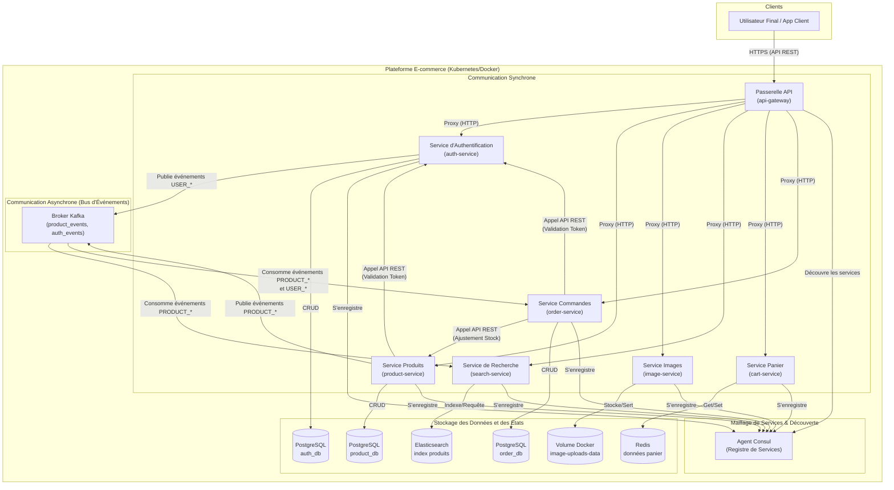
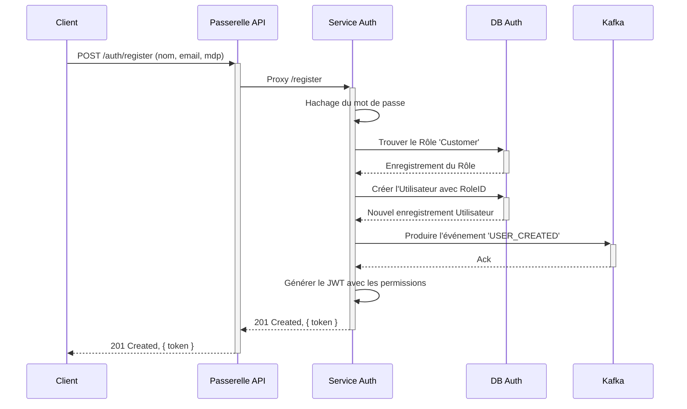
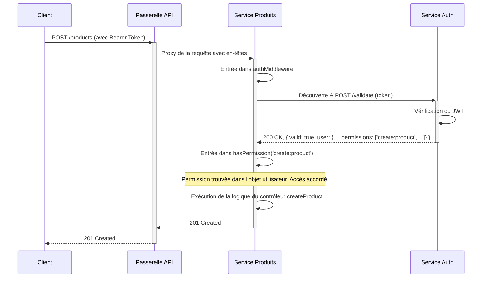
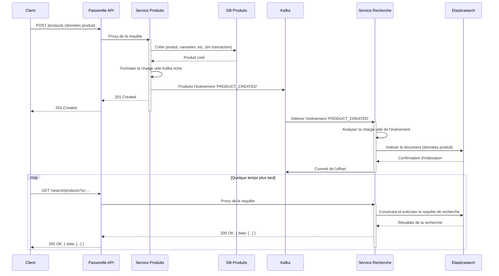
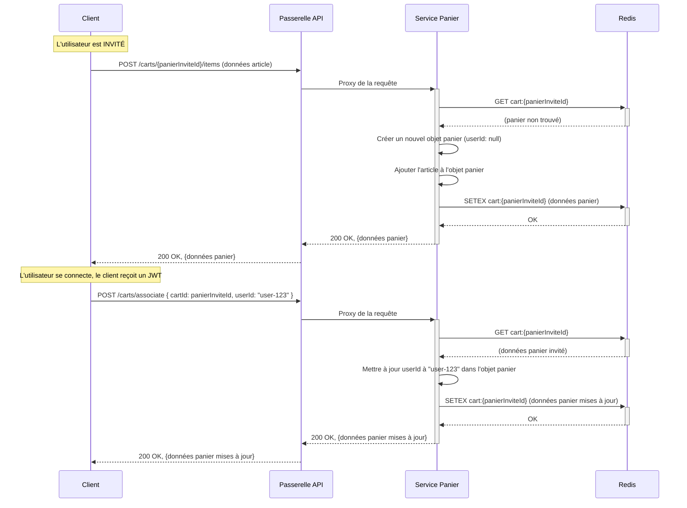
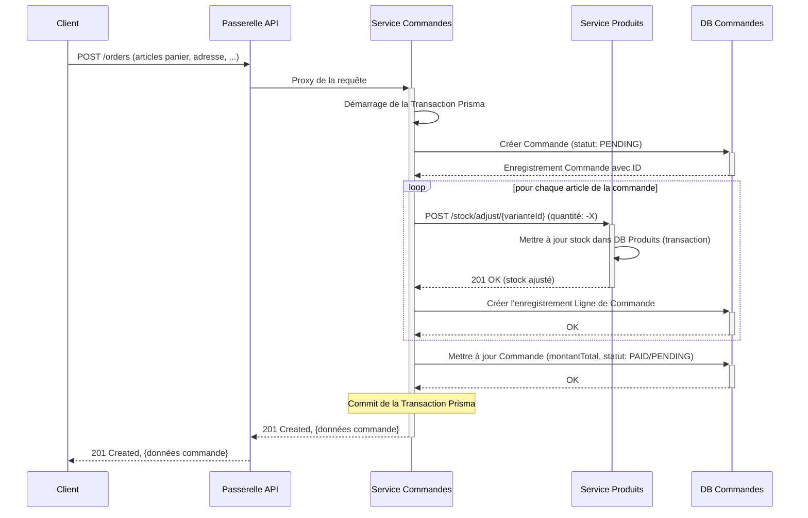
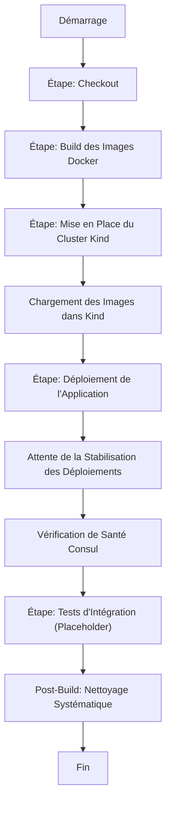

## Rapport Détaillé sur l'Architecture, l'Implémentation et le Déploiement de la Plateforme E-commerce Microservices

**Version du Projet : 2.0 (Portée Étendue)**

**Stage de Master en Architecture des Systèmes Distribués**

**Présenté par :**
HARCHE Samir

**Sous la direction de :**
Dr. Abdelhak Djamel Seriai

**Date :** Avril 2024 (Analyse Mise à Jour)

***

### **Table des Matières**

1.  **Synthèse Exécutive**
    *   1.1. Évolution du Projet
    *   1.2. Principes Architecturaux Clés
    *   1.3. Objectifs du Rapport
2.  **Architecture Globale du Système**
    *   2.1. Vue d'ensemble des Composants
    *   2.2. Modèles de Communication Fondamentaux
    *   2.3. Diagramme de l'Architecture Complète du Système
3.  **Infrastructure Fondamentale et Stack Technologique**
    *   3.1. Conteneurisation & Orchestration (Docker, Kubernetes/Kind)
    *   3.2. Infrastructure de Maillage de Services (Consul)
    *   3.3. Messagerie Asynchrone (Apache Kafka)
    *   3.4. Persistance des Données (PostgreSQL, Redis, Elasticsearch)
    *   3.5. CI/CD & Automatisation (Jenkins)
4.  **Analyse Détaillée du Service : `api-gateway`**
    *   4.1. Rôle et Responsabilités
    *   4.2. Routage et Proxy Dynamique
    *   4.3. Gestion des Erreurs et Résilience
5.  **Analyse Détaillée du Service : `auth-service`**
    *   5.1. Rôle et Responsabilités
    *   5.2. Modèle de Sécurité Étendu : RBAC
    *   5.3. Modèle de Données (Schéma Prisma)
    *   5.4. Intégration Événementielle (Producteur Kafka)
    *   5.5. Endpoints et Logique Métier
6.  **Analyse Détaillée du Service : `product-service`**
    *   6.1. Rôle et Responsabilités
    *   6.2. Modèle de Données Granulaire (Produits, Catégories, Variantes, Stock)
    *   6.3. Structure de l'API et Ressources Imbriquées
    *   6.4. Intégration Événementielle (Producteur Kafka)
7.  **Analyse Détaillée du Service : `image-service`**
    *   7.1. Rôle et Responsabilités
    *   7.2. Stratégie de Stockage et de Distribution
    *   7.3. Gestion des Fichiers avec Multer
8.  **Analyse Détaillée du Service : `search-service`**
    *   8.1. Rôle et Responsabilités
    *   8.2. Indexation et Mapping Elasticsearch
    *   8.3. Intégration Événementielle (Consommateur Kafka)
    *   8.4. Requêtes de Recherche Avancées
9.  **Analyse Détaillée du Service : `cart-service` (Nouveau)**
    *   9.1. Rôle et Responsabilités
    *   9.2. Choix Technologique : Redis
    *   9.3. Structure des Données dans Redis
    *   9.4. Gestion du Cycle de Vie du Panier
10. **Analyse Détaillée du Service : `order-service` (Nouveau)**
    *   10.1. Rôle et Responsabilités
    *   10.2. Modèle de Données & Stratégie de Dénormalisation
    *   10.3. Communication Inter-Services et Transactions
    *   10.4. Intégration Événementielle (Consommateur Kafka)
11. **Analyse des Workflows Clés (Diagrammes de Séquence)**
    *   11.1. Inscription Utilisateur avec RBAC et Événement Kafka
    *   11.2. Requête Inter-Service avec Vérification de Permission
    *   11.3. Création Complète de Produit, Indexation et Recherche
    *   11.4. Cycle de Vie du Panier d'Achat : de l'Invité à l'Utilisateur Connecté
    *   11.5. **Workflow Critique :** Passage de Commande et Ajustement du Stock
12. **Développement et Déploiement (DevOps)**
    *   12.1. Environnement de Développement Local (`docker-compose`)
    *   12.2. Environnement de Staging/CI (Kubernetes avec Kind)
    *   12.3. Analyse du Pipeline CI/CD (`Jenkinsfile`)
    *   12.4. Analyse des Manifestes Kubernetes
13. **Conclusion et Travaux Futurs**
    *   13.1. Résumé des Réalisations
    *   13.2. Améliorations Potentielles et Prochaines Étapes

***

### 1. Synthèse Exécutive

#### 1.1. Évolution du Projet
Ce rapport détaille l'évolution significative de la plateforme e-commerce, passant d'un ensemble fondamental de microservices à un système plus complet en termes de fonctionnalités, plus robuste et prêt pour la production. Les composants initiaux (`api-gateway`, `auth-service`, `product-service`, `image-service`, `search-service`) ont été substantiellement améliorés. De manière critique, deux nouveaux services métier principaux ont été introduits : un **`cart-service`** pour la gestion des paniers d'achat des utilisateurs et un **`order-service`** pour gérer l'ensemble du cycle de vie des commandes.

De plus, le projet a mûri au-delà de la simple conteneurisation. Il dispose désormais d'un système sophistiqué de Contrôle d'Accès Basé sur les Rôles (RBAC), d'un pipeline CI/CD entièrement automatisé s'appuyant sur **Jenkins**, et d'une stratégie de déploiement complète pour **Kubernetes** (utilisant Kind pour les environnements locaux/staging).

#### 1.2. Principes Architecturaux Clés
L'architecture reste fermement ancrée dans les principes des systèmes distribués modernes :
*   **Architecture Microservices :** Chaque domaine métier est encapsulé dans un service indépendant et déployable.
*   **Architecture Orientée Événements (EDA) :** Apache Kafka est utilisé pour découpler les services, permettant une communication asynchrone pour des processus tels que l'indexation de recherche et la dénormalisation des données, augmentant ainsi la résilience et la scalabilité.
*   **Point d'Entrée Centralisé :** Une Passerelle API (API Gateway) fournit une interface unique et unifiée pour les clients, gérant le routage et les préoccupations transversales.
*   **Découverte de Services Dynamique :** Consul permet aux services de se localiser mutuellement de manière dynamique, éliminant les dépendances codées en dur et facilitant la mise à l'échelle.
*   **Infrastructure as Code (IaC) :** `docker-compose.yml` pour le développement local et les manifestes Kubernetes déclaratifs (`kubernetes-manifests.yaml`) pour le staging/production définissent l'ensemble de la stack applicative sous forme de code.
*   **Persistance Polyglotte :** Le système utilise désormais le meilleur magasin de données pour chaque tâche : PostgreSQL pour les données transactionnelles relationnelles, Redis pour les données de panier éphémères, et Elasticsearch pour la recherche complexe et l'analytique.

#### 1.3. Objectifs du Rapport
Ce document sert de plan technique complet du système actuel. Il vise à :
*   Documenter l'architecture et les responsabilités de chaque service, nouveau et mis à jour.
*   Fournir des diagrammes détaillés de l'architecture système, des modèles de données et des workflows d'interaction clés.
*   Analyser la stratégie de déploiement CI/CD et Kubernetes.
*   Servir de référence technique pour les développements actuels et futurs.

***

### 2. Architecture Globale du Système

#### 2.1. Vue d'ensemble des Composants
La plateforme est maintenant composée de sept microservices distincts, soutenus par une couche d'infrastructure robuste.

*   **Services Principaux :**
    *   `api-gateway` : Le point d'entrée unique.
    *   `auth-service` : Gère les utilisateurs, rôles, permissions et JWTs.
    *   `product-service` : La source de vérité pour le catalogue de produits, catégories, variantes et stock.
    *   `image-service` : Gère le téléversement et le service des images.
    *   `search-service` : Fournit des capacités de recherche plein texte.
    *   `cart-service` : Gère les paniers d'achat éphémères.
    *   `order-service` : Orchestre le processus de passage et de suivi des commandes.
*   **Composants d'Infrastructure :**
    *   **PostgreSQL :** Trois bases de données distinctes (`auth_db`, `product_db`, `order_db`) assurent l'isolation des données entre les services.
    *   **Elasticsearch :** Un cluster à nœud unique pour l'indexation des données produits.
    *   **Redis :** Un magasin clé-valeur pour la persistance des données de panier.
    *   **Apache Kafka & Zookeeper :** L'épine dorsale de la communication événementielle.
    *   **Consul :** Le registre de services et l'agent de découverte.

#### 2.2. Modèles de Communication Fondamentaux
1.  **Synchrone (API REST) :** Utilisé pour les interactions immédiates de type requête/réponse.
    *   Client -> Passerelle API -> Service (ex: récupération des détails d'un produit).
    *   Service -> Service (ex: `order-service` appelant `product-service` pour ajuster le stock).
2.  **Asynchrone (Orienté Événements via Kafka) :** Utilisé pour découpler les services et gérer les tâches en arrière-plan.
    *   `auth-service` -> Kafka -> `order-service` (Profil utilisateur créé/mis à jour).
    *   `product-service` -> Kafka -> `search-service` (Produit créé/mis à jour/supprimé pour l'indexation).
    *   `product-service` -> Kafka -> `order-service` (Données produit dénormalisées mises à jour).

#### 2.3. Diagramme de l'Architecture Complète du Système
Ce diagramme illustre les interactions de haut niveau entre tous les composants de l'écosystème.



***

### 3. Infrastructure Fondamentale et Stack Technologique

Cette section détaille le rôle de chaque technologie fondamentale.

*   **Docker :** Utilisé pour packager chaque microservice et ses dépendances dans une image conteneur standardisée et portable (`Dockerfile`). Cela garantit la cohérence entre tous les environnements.
*   **Kubernetes (via Kind) :** Choisi pour les environnements de staging et de CI. Kind (Kubernetes in Docker) fournit un cluster Kubernetes local et léger. Le fichier `kubernetes-manifests.yaml` définit de manière déclarative l'état souhaité de toute l'application, y compris les Déploiements, les Services (avec `NodePort` pour l'accès externe), et la gestion des ressources. Les `initContainers` sont utilisés efficacement pour les migrations de schémas de base de données.
*   **Jenkins :** Le serveur d'automatisation orchestrant le pipeline CI/CD. Le `Jenkinsfile` définit l'ensemble du processus du build au déploiement, y compris la construction des images Docker, le démarrage d'un cluster Kind frais, le chargement des images et l'application des manifestes Kubernetes.
*   **Consul :** Agit comme le registre de services. Chaque microservice s'enregistre auprès de l'agent Consul au démarrage et se désenregistre proprement à l'arrêt. Cela permet à la Passerelle API et aux autres services de découvrir dynamiquement les emplacements réseau de leurs dépendances en utilisant `findService`.
*   **Apache Kafka :** L'épine dorsale de la messagerie asynchrone. Deux topics principaux sont utilisés :
    *   `auth_events` : Pour diffuser les créations et mises à jour d'utilisateurs.
    *   `product_events` : Pour diffuser les changements du catalogue de produits.
    Cette approche événementielle découple les services, empêchant une défaillance dans un service en aval non essentiel (comme `search-service`) d'impacter un service en amont critique (`product-service`).
*   **PostgreSQL :** La base de données relationnelle choisie pour les données transactionnelles. De manière cruciale, les données sont ségréguées en trois bases de données distinctes (`auth_db`, `product_db`, `order_db`), renforçant le principe d'isolation des données des microservices.
*   **Redis :** Un magasin clé-valeur en mémoire utilisé par le `cart-service`. Sa haute performance est idéale pour la nature éphémère et fréquemment accédée des données de panier d'achat. Un Time-To-Live (TTL) est défini sur les paniers pour nettoyer automatiquement les paniers d'invités abandonnés.
*   **Elasticsearch :** Un puissant moteur de recherche utilisé par le `search-service`. Il ingère les données produits depuis Kafka et fournit des capacités avancées de recherche plein texte, y compris le filtrage, la recherche floue (tolérance aux fautes de frappe) et des agrégations complexes qui seraient inefficaces dans une base de données relationnelle.

***

### 4. Analyse Détaillée du Service : `api-gateway`

*   **Rôle et Responsabilités :** Le point d'entrée unique pour toutes les requêtes de clients externes. Ses rôles principaux sont :
    1.  **Routage de Requêtes :** Rerouter dynamiquement les requêtes entrantes vers le microservice approprié en aval en fonction du chemin de l'URL (ex: `/auth/*` -> `auth-service`).
    2.  **Découverte de Services :** S'intègre avec Consul pour trouver l'emplacement réseau actuel des instances de service saines.
    3.  **Préoccupations Transversales (Futur) :** C'est l'endroit idéal pour implémenter des préoccupations comme la limitation de débit (rate limiting), les vérifications d'authentification globales (bien que déléguées actuellement), et la journalisation des requêtes.
*   **Routage et Proxy Dynamique :** Implémenté en utilisant `http-proxy-middleware`. une fonction d'aide `createDynamicProxy` encapsule la logique de recherche d'un service via `findService` et de transmission de la requête. Elle inclut également la réécriture de chemin pour des services comme `image-service` (`/images/file.jpg` -> `/file.jpg`).
*   **Gestion des Erreurs et Résilience :** Le proxy inclut un gestionnaire `onError` qui intercepte les erreurs réseau (ex: `ECONNREFUSED`) lorsqu'un service en aval n'est pas disponible, les traduisant en codes de statut HTTP appropriés comme `503 Service Unavailable` ou `502 Bad Gateway`.

***

### 5. Analyse Détaillée du Service : `auth-service`

*   **Rôle et Responsabilités :** Ce service est l'autorité pour toutes les questions de gestion d'identité et d'accès. Ses responsabilités ont été considérablement étendues.
    1.  **Gestion des Utilisateurs :** Gère l'inscription et la connexion des utilisateurs.
    2.  **Authentification :** Émet et valide les JSON Web Tokens (JWTs).
    3.  **Autorisation (RBAC) :** Gère un système sophistiqué de Rôles et de Permissions.
    4.  **Sourcing d'Événements :** Publie les événements du cycle de vie des utilisateurs (`USER_CREATED`, `USER_UPDATED`, `USER_DELETED`) sur Kafka.
*   **Modèle de Sécurité Étendu : RBAC :**
    *   Le service implémente maintenant un système complet de Contrôle d'Accès Basé sur les Rôles.
    *   **Permissions :** Actions granulaires qui peuvent être effectuées (ex: `create:product`, `read:order`).
    *   **Rôles :** Collections de permissions qui peuvent être assignées aux utilisateurs (ex: `ADMIN`, `Supervisor`, `Customer`).
    *   **Charge Utile JWT (Payload) :** La charge utile du JWT est enrichie pour inclure le rôle de l'utilisateur et sa liste complète de permissions, permettant aux autres services de prendre des décisions d'autorisation locales et efficaces après avoir validé le token.
*   **Modèle de Données (Schéma Prisma) :**

    ```mermaid
    erDiagram
        UTILISATEUR {
            string id PK
            string nom
            string email UK
            string mot_de_passe
            boolean est_actif
            string image_profil
            string roleId FK
        }
        ROLE {
            string id PK
            string nom UK
            string description
        }
        PERMISSION {
            string id PK
            string nom UK
            string description
        }
        ROLE_PERMISSION {
            string roleId PK, FK
            string permissionId PK, FK
        }

        UTILISATEUR ||--o{ ROLE : "possède"
        ROLE ||--|{ ROLE_PERMISSION : "est mappé à"
        PERMISSION ||--|{ ROLE_PERMISSION : "est mappée par"
    ```
*   **Intégration Événementielle (Producteur Kafka) :** Lorsqu'un utilisateur est créé ou que ses détails principaux (nom, image) sont mis à jour, `auth-service` publie un événement sur le topic Kafka `auth_events`. Cela permet à d'autres services, comme `order-service`, de maintenir une copie locale dénormalisée et à jour des informations utilisateur pour enrichir les données de commande sans avoir à interroger `auth-service` de manière synchrone à chaque requête.
*   **Endpoints et Logique Métier :**
    *   `/register`, `/login` : Flux d'authentification standard.
    *   `/me` : Renvoie les détails de l'utilisateur authentifié.
    *   `/validate` : **Endpoint à usage interne.** Un composant critique pour la sécurité inter-services. D'autres services envoient un JWT à cet endpoint pour confirmer sa validité et recevoir en retour la charge utile utilisateur décodée et fiable.
    *   `/users`, `/roles`, `/permissions` : APIs CRUD complètes pour gérer le système RBAC, protégées par des permissions.

***

### 6. Analyse Détaillée du Service : `product-service`

*   **Rôle et Responsabilités :** La source de vérité unique pour l'ensemble du catalogue de produits.
    1.  **CRUD Produit :** Gère les données de base des produits.
    2.  **Gestion de la Taxonomie :** Gère les catégories hiérarchiques.
    3.  **Gestion des Variantes :** Gère les variantes de produits (ex: différentes tailles, couleurs).
    4.  **Gestion de l'Inventaire :** Le service maître pour le suivi des niveaux de stock via un modèle de registre `StockMovement`.
    5.  **Sourcing d'Événements :** Publie des événements détaillés sur les changements de produits sur le topic Kafka `product_events`.
*   **Modèle de Données Granulaire (Produits, Catégories, Variantes, Stock) :** Le schéma est hautement relationnel et normalisé, fournissant une base robuste pour les données produits.

    ```mermaid
    erDiagram
        PRODUIT {
            string id PK
            string sku UK
            string nom
            string description
            boolean est_actif
        }
        CATEGORIE {
            string id PK
            string slug UK
            string nom
            string parentId FK
        }
        IMAGE_PRODUIT {
            string id PK
            string produitId FK
            string url_image
            boolean est_primaire
        }
        VARIANTE {
            string id PK
            string produitId FK
            json attributs
            decimal prix
            int quantite_stock
        }
        PRODUIT_CATEGORIE {
            string produitId PK, FK
            string categorieId PK, FK
        }
        MOUVEMENT_STOCK {
            string id PK
            string varianteId FK
            int quantite_changee
            StockMovementType type
            string raison
        }

        PRODUIT ||--|{ IMAGE_PRODUIT : "possède"
        PRODUIT ||--|{ VARIANTE : "possède"
        PRODUIT ||--o{ PRODUIT_CATEGORIE : "appartient à"
        CATEGORIE ||--o{ PRODUIT_CATEGORIE : "contient"
        CATEGORIE ||--o{ CATEGORIE : "a pour enfant"
        VARIANTE ||--|{ MOUVEMENT_STOCK : "enregistre"
    ```
*   **Structure de l'API et Ressources Imbriquées :** L'API est bien structurée, utilisant des routes imbriquées pour plus de clarté (ex: `/products/{productId}/variants`). Cela rend l'API intuitive et RESTful.
*   **Intégration Événementielle (Producteur Kafka) :** Tout changement sur un produit, ses variantes, catégories ou images déclenche la fonction d'aide `fetchAndFormatProductForKafka`. Cette fonction assemble une charge utile complète et dénormalisée de l'ensemble de l'agrégat produit et la publie en tant qu'événement `PRODUCT_CREATED` ou `PRODUCT_UPDATED`. Cette charge utile riche permet aux consommateurs comme `search-service` et `order-service` de reconstruire leur état local sans effectuer d'appels synchrones supplémentaires.

***

### 7. Analyse Détaillée du Service : `image-service`
Ce service reste ciblé et bien défini.
*   **Rôle et Responsabilités :** Uniquement responsable de la gestion du téléversement, du stockage et de la récupération des fichiers image.
*   **Stratégie de Stockage et de Distribution :** Il utilise un volume Docker persistant (`image-uploads-data`) mappé dans son conteneur. Les fichiers téléversés reçoivent un nom unique basé sur un UUID pour éviter les collisions. Il sert ces images de manière statique via un middleware `express.static`.
*   **Gestion des Fichiers avec Multer :** `multer` est configuré pour gérer les requêtes `multipart/form-data`, appliquer des limites de type et de taille de fichier, et sauvegarder les fichiers dans le répertoire de téléversement désigné.

***

### 8. Analyse Détaillée du Service : `search-service`
*   **Rôle et Responsabilités :** Fournir une expérience de recherche rapide, pertinente et puissante.
*   **Indexation et Mapping Elasticsearch :** La configuration `elasticsearch.js` définit un mapping détaillé pour l'index `products`. Ceci est essentiel pour la performance et la précision de la recherche. Les caractéristiques clés incluent :
    *   L'utilisation du type `keyword` pour les champs nécessitant une correspondance/filtrage exact (comme `sku`, `category_slugs`).
    *   L'utilisation du type `text` avec des analyseurs personnalisés pour les champs nécessitant une recherche plein texte (comme `name`, `description`).
    *   L'utilisation du type `nested` pour `variants` et `categories` pour permettre des requêtes indépendantes au sein de ces objets complexes.
*   **Intégration Événementielle (Consommateur Kafka) :** Ce service est un consommateur principal du topic Kafka `product_events`. À la réception d'un événement, il utilise la charge utile riche pour créer, mettre à jour ou supprimer le document correspondant dans Elasticsearch, maintenant ainsi l'index de recherche synchronisé avec les données produit maîtres.
*   **Requêtes de Recherche Avancées :** Le contrôleur de recherche démontre une utilisation sophistiquée du Query DSL d'Elasticsearch. Il construit dynamiquement une requête `bool`, combinant des clauses `must` pour la correspondance de texte (qui affecte le score de pertinence) et des clauses `filter` pour des correspondances exactes non notées (qui sont hautement cachables et performantes).

***

### 9. Analyse Détaillée du Service : `cart-service` (Nouveau)

*   **Rôle et Responsabilités :** Gère les paniers d'achat des utilisateurs, qui sont intrinsèquement éphémères et basés sur la session.
*   **Choix Technologique : Redis :** Redis a été choisi pour ses capacités de stockage clé-valeur en mémoire à haute performance, ce qui en fait un choix parfait pour ce cas d'utilisation. Le client `ioredis` est utilisé, offrant des fonctionnalités robustes comme la reconnexion automatique.
*   **Structure des Données dans Redis :** Chaque panier est stocké comme une seule chaîne de caractères JSON sous une clé préfixée par `cart:`, ex: `cart:uuid-pour-panier`. La valeur est un objet JSON contenant l'ID du panier, un `userId` optionnel, et un tableau d'objets articles.
*   **Gestion du Cycle de Vie du Panier :**
    1.  Un utilisateur invité obtient un nouveau panier avec un `userId` nul.
    2.  Un TTL (Time-To-Live) est défini sur la clé du panier dans Redis, assurant que les paniers abandonnés sont automatiquement purgés.
    3.  Lorsqu'un invité se connecte, le client appelle l'endpoint `/associate`, qui met à jour le champ `userId` dans le panier existant dans Redis. Le TTL est également rafraîchi, persistant le panier pour l'utilisateur connecté.

***

### 10. Analyse Détaillée du Service : `order-service` (Nouveau)

*   **Rôle et Responsabilités :** Le cœur transactionnel du flux e-commerce. Il gère :
    1.  L'orchestration de la création des commandes.
    2.  La persistance de l'historique des commandes.
    3.  La gestion des statuts de commande.
    4.  La dénormalisation des données connexes pour la performance.
*   **Modèle de Données & Stratégie de Dénormalisation :** Le service maintient sa propre base de données `order_db`.

    ```mermaid
    erDiagram
        COMMANDE {
            string id PK
            string userId FK "nullable"
            string email_invite "nullable"
            OrderStatus status
            decimal montant_total
        }
        LIGNE_COMMANDE {
            string id PK
            string commandeId FK
            string produitId
            string varianteId
            string nom_produit "dénormalisé"
            decimal prix_instantane "dénormalisé"
            int quantite
        }
        PRODUIT_DENORMALISE {
            string id PK
            string nom
            string sku
            string url_image
        }
        UTILISATEUR_DENORMALISE {
            string id PK
            string nom
            string email
        }

        COMMANDE ||--|{ LIGNE_COMMANDE : "contient"
        COMMANDE }o..o| UTILISATEUR_DENORMALISE : "référence"
        LIGNE_COMMANDE }o..o| PRODUIT_DENORMALISE : "référence"
    ```
    Pour éviter les jointures inter-services coûteuses au moment de la lecture, `order-service` s'abonne aux événements Kafka de `auth-service` et `product-service` pour maintenir des tables locales et dénormalisées (`denormalized_users`, `denormalized_products`). Lorsqu'une commande est affichée, ces données locales sont utilisées pour enrichir rapidement la réponse.

*   **Communication Inter-Services et Transactions :** La création de commande est un processus critique en plusieurs étapes.
    1.  Elle est encapsulée dans un bloc `prisma.$transaction` pour garantir l'atomicité.
    2.  Au sein de la transaction, il effectue un appel API REST synchrone à l'endpoint `/stock/adjust/:variantId` de `product-service` pour décrémenter le stock.
    3.  Si l'ajustement du stock échoue (ex: stock insuffisant), l'appel API lève une erreur, ce qui provoque l'annulation de toute la transaction Prisma, empêchant la création de la commande. C'est un exemple classique d'un pattern de transaction distribuée.

***

### 11. Analyse des Workflows Clés (Diagrammes de Séquence)

#### 11.1. Inscription Utilisateur avec RBAC et Événement Kafka



#### 11.2. Requête Inter-Service avec Vérification de Permission

Ceci montre le `product-service` vérifiant les permissions pour une action protégée.



#### 11.3. Création Complète de Produit, Indexation et Recherche



#### 11.4. Cycle de Vie du Panier d'Achat : de l'Invité à l'Utilisateur Connecté



#### 11.5. Workflow Critique : Passage de Commande et Ajustement du Stock



***

### 12. Développement et Déploiement (DevOps)

Le projet démontre une approche DevOps mature, supportant à la fois le développement local et le déploiement CI/CD automatisé.

#### 12.1. Environnement de Développement Local (`docker-compose`)
Le fichier `docker-compose.yml` orchestre l'ensemble de la stack pour le développement local.
*   **Services :** Définit les 7 microservices et les 6 composants d'infrastructure (3 BDD, Kafka, Zookeeper, Elasticsearch, Redis, Consul).
*   **Rechargement à Chaud (Hot Reloading) :** La directive `develop: watch:` est utilisée pour tous les services Node.js. Cela permet à Docker de synchroniser automatiquement les changements de code de l'hôte vers le conteneur et de redémarrer le processus Node.js, offrant une expérience de développement fluide et efficace.
*   **Vérifications de Santé (Health Checks) :** Des vérifications de santé robustes sont définies pour tous les composants d'infrastructure, garantissant que les services dépendants ne démarrent qu'une fois que leurs dépendances sont saines.

#### 12.2. Environnement de Staging/CI (Kubernetes avec Kind)
Le répertoire `kind-deployment/` contient la configuration pour déployer l'ensemble de la stack sur un cluster Kubernetes.
*   `kind-cluster-config.yaml` : Définit le cluster Kind lui-même, y compris les `extraPortMappings` cruciaux. Ces mappages exposent les services `NodePort` de Kubernetes à la machine hôte, rendant possible l'accès à la Passerelle API, à l'interface utilisateur de Consul et aux bases de données depuis `localhost`.
*   `setup-kind.sh` : Un script d'aide qui automatise l'ensemble du processus de déploiement Kubernetes local : construction des images, création du cluster, chargement des images dans le registre du cluster et application des manifestes.

#### 12.3. Analyse du Pipeline CI/CD (`Jenkinsfile`)
Le `Jenkinsfile` définit un pipeline déclaratif qui automatise entièrement les tests et le déploiement vers l'environnement de staging Kind.



*   **Configuration Dynamique :** Le pipeline est paramétré à l'aide de variables d'environnement (`IMAGE_TAG`, `KIND_CLUSTER_NAME`) pour plus de flexibilité.
*   **Environnements Éphémères :** Le pipeline crée un cluster Kind frais et propre pour chaque build (`kind delete cluster ... || true`), garantissant que les tests s'exécutent dans un environnement prévisible et isolé.
*   **Gestion des Images :** Il construit toutes les images de service personnalisées, les tague avec l'ID de build unique, et utilise `kind load docker-image` pour les rendre disponibles à l'intérieur du cluster sans avoir besoin d'un registre Docker externe.
*   **Déploiement :** Il utilise `envsubst` pour substituer les tags d'image corrects dans le template `kubernetes-manifests.yaml` avant de l'appliquer avec `kubectl apply`.
*   **Santé & Stabilité :** Il inclut un bloc `timeout` et des commandes `kubectl rollout status` pour attendre patiemment que tous les déploiements soient prêts avant de continuer, une étape critique pour la stabilité.

#### 12.4. Analyse des Manifestes Kubernetes
Le fichier `kubernetes-manifests.yaml` est un fichier complet définissant toutes les ressources Kubernetes.
*   **Deployments :** Chaque microservice et composant stateful a son propre Déploiement, qui gère ses réplicas de Pods.
*   **Services :** Chaque Déploiement est exposé en interne via un Service de type `ClusterIP` (ex: `auth-db-svc`). Cela permet aux services au sein du cluster de communiquer en utilisant des noms DNS stables.
*   **NodePorts :** Les services clés (comme la Passerelle API, les bases de données, l'UI Consul) ont leur type de Service défini sur `NodePort`, ce qui les rend accessibles depuis l'extérieur du cluster Kind pour le débogage et les tests.
*   **Init Containers :** Un pattern de bonne pratique est utilisé pour les services avec des bases de données (`auth-service`, `product-service`, `order-service`). Un `initContainer` s'exécute *avant* le conteneur applicatif principal. Il contient la CLI Prisma et est responsable de l'exécution de `prisma db push` et `prisma db seed`, garantissant que le schéma de la base de données est correct et rempli avant que l'application ne tente de s'y connecter. Cela prévient les conditions de course et les échecs au démarrage.
*   **Downward API :** Les variables d'environnement `POD_IP` et `POD_HOSTNAME` sont injectées dans les conteneurs de service en utilisant la Downward API de Kubernetes. Ceci est crucial pour Consul, permettant à chaque pod de s'enregistrer avec son IP de pod unique et routable et un ID de service unique, ce qui est essentiel pour une vérification de santé et une identification d'instance correctes.

***

### 13. Conclusion et Travaux Futurs

#### 13.1. Résumé des Réalisations
Ce projet a évolué avec succès pour devenir une plateforme microservices sophistiquée et riche en fonctionnalités. L'architecture est saine, s'appuyant sur les principes modernes des systèmes distribués, de la conception événementielle et de l'orchestration de conteneurs. L'ajout des services de panier et de commande complète le workflow e-commerce de base. L'implémentation d'un modèle de sécurité RBAC complet et d'un pipeline CI/CD robuste basé sur Jenkins pour Kubernetes démontre un haut niveau de maturité technique, rapprochant de manière significative le projet d'un système de qualité production.

#### 13.2. Améliorations Potentielles et Prochaines Étapes
1.  **Traçage Distribué :** Implémenter un système de traçage distribué (ex: Jaeger, OpenTelemetry) pour suivre les requêtes à travers les multiples services. C'est inestimable pour le débogage et l'analyse de performance dans un environnement microservices.
2.  **Journalisation Centralisée :** Agréger les journaux (logs) de tous les services dans une plateforme de journalisation centralisée (ex: Stack ELK - Elasticsearch, Logstash, Kibana, ou Stack EFK avec Fluentd).
3.  **Améliorations de la Passerelle API :** Déplacer les vérifications d'authentification (validation JWT) des services individuels vers la Passerelle API. La passerelle peut valider le token une seule fois et transmettre la charge utile utilisateur fiable en aval via les en-têtes de requête.
4.  **Granularité des Topics Kafka :** Envisager de scinder `product_events` en topics plus granulaires (ex: `product_catalog_events`, `product_inventory_events`) si différents consommateurs ne sont intéressés que par des sous-ensembles des données.
5.  **Tests :** Étendre les suites de tests, en particulier en ajoutant de véritables tests de bout en bout (end-to-end) dans le pipeline Jenkins qui interagissent avec l'application déployée via le NodePort de la Passerelle API.
6.  **Charts Helm :** Pour des déploiements Kubernetes plus complexes, migrer les manifestes YAML bruts vers des charts Helm pour améliorer le paramétrage, la réutilisabilité et la gestion du cycle de vie.
