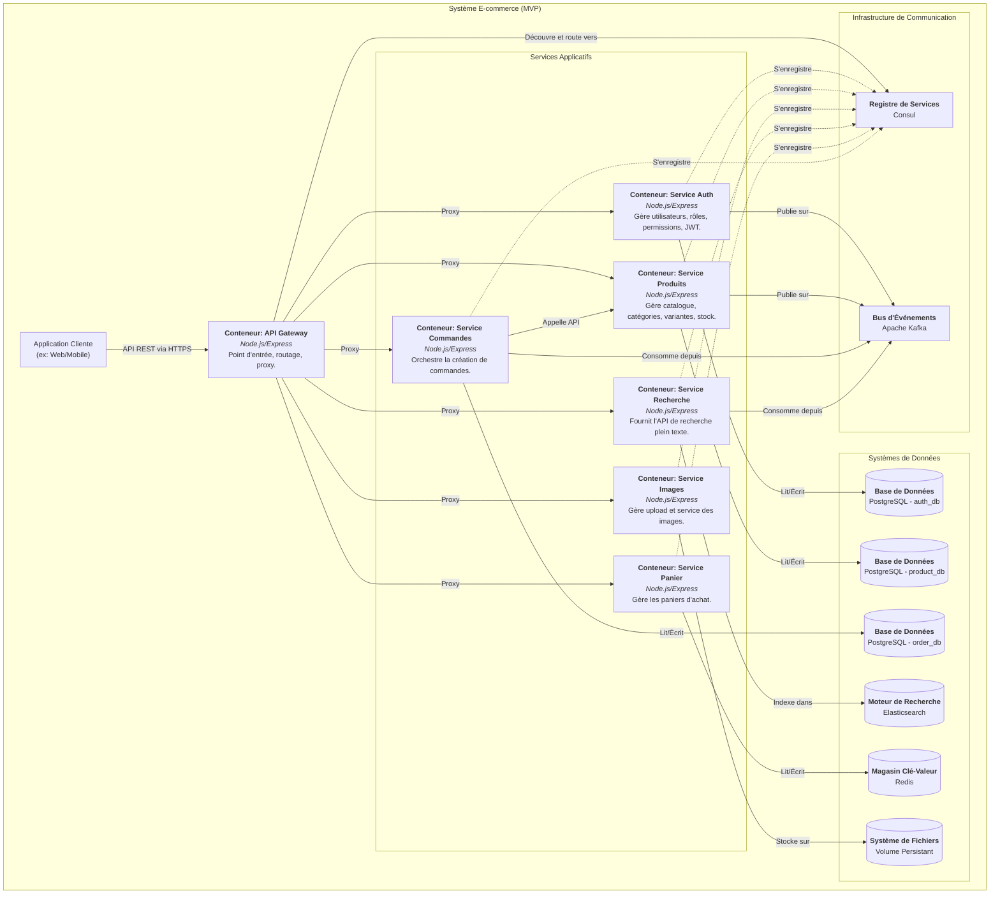
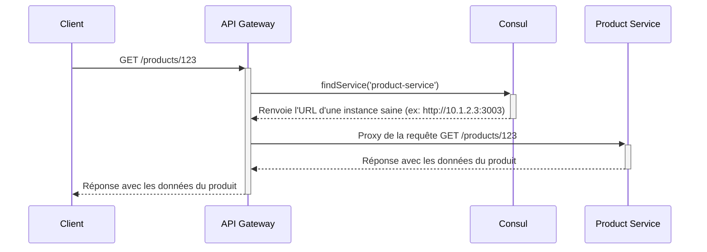
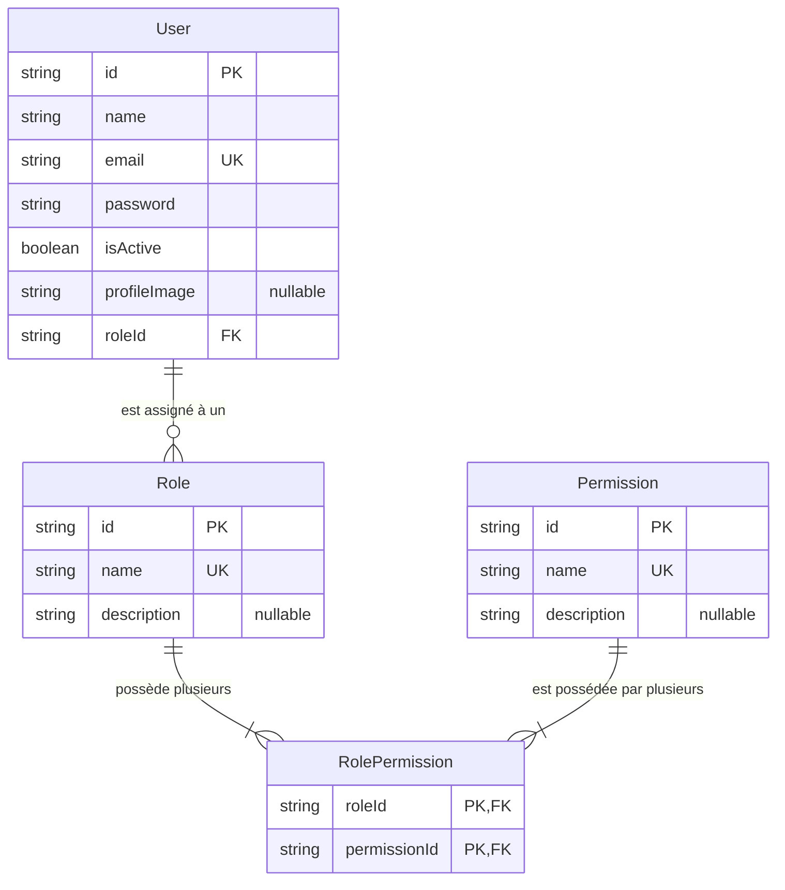
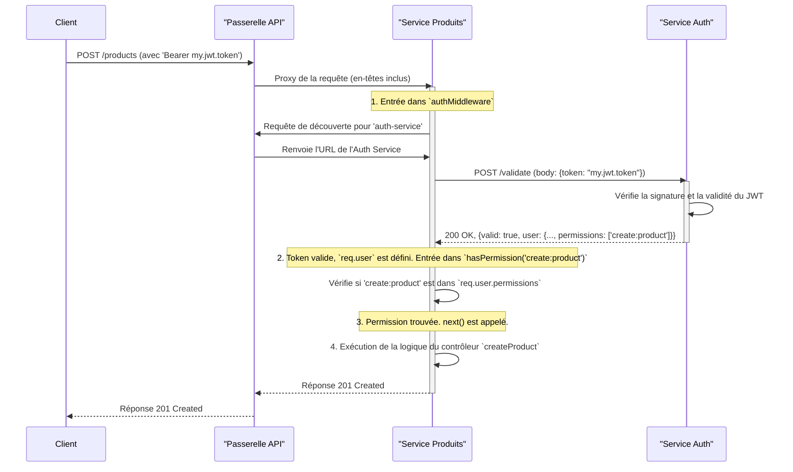

## Rapport Technique Exhaustif sur la Réalisation du Produit Minimum Viable de la Plateforme E-commerce Microservices

**Version du Document : 1.2 (MVP As-Built, Analyse Détaillée)**

**Contexte :** Stage de Master en Architecture des Systèmes Distribués

**Auteur :**
HARCHE Samir

**Sous la direction de :**
Dr. Abdelhak Djamel Seriai

**Date :** Avril 2024 (Documentation Étendue du MVP)

***

### **Table des Matières Détaillée**

**Partie I : Vision, Architecture et Infrastructure**
1.  **Introduction et Contexte du MVP**
    *   1.1. Prolongement du Rapport Initial
    *   1.2. Définition et Objectifs du Produit Minimum Viable (MVP)
    *   1.3. Périmètre Technique et Fonctionnel Atteint
    *   1.4. Structure de ce Rapport
2.  **Architecture Système du MVP : Une Analyse en Profondeur**
    *   2.1. Vue d'Ensemble des Composants Intégrés
    *   2.2. Analyse des Modèles de Communication
        *   2.2.1. Communication Synchrone : Avantages et Inconvénients dans notre Contexte
        *   2.2.2. Communication Asynchrone : Le Rôle Central de Kafka
    *   2.3. Diagramme C4 (Niveau 2) de l'Architecture
3.  **La Stack Technologique : Justifications et Rôles**
    *   3.1. Conteneurisation (Docker) et Orchestration (Kubernetes/Kind)
    *   3.2. Découverte de Services (Consul)
    *   3.3. Messagerie Asynchrone (Apache Kafka) : Topics et Stratégies de Message
    *   3.4. Stratégie de Persistance Polyglotte (PostgreSQL, Redis, Elasticsearch)
    *   3.5. Automatisation DevOps (Jenkins)

**Partie II : Analyse Détaillée des Microservices**
4.  **Analyse du Service : `api-gateway`**
    *   4.1. Responsabilités et Flux de Requêtes
    *   4.2. Implémentation du Proxy Dynamique avec `http-proxy-middleware`
    *   4.3. Gestion des Erreurs et Stratégie de Résilience
5.  **Analyse du Service : `auth-service`**
    *   5.1. Rôle et Évolution : Du Simple Auth au Centre d'Identité
    *   5.2. Implémentation du Modèle RBAC : `Role`, `Permission` et `RolePermission`
    *   5.3. Modèle de Données Prisma et Justification des Relations
    *   5.4. Logique de Publication d'Événements sur Kafka (`USER_CREATED`, `USER_UPDATED`)
    *   5.5. Analyse des Endpoints Critiques (`/validate`, `/me`)
6.  **Analyse du Service : `product-service`**
    *   6.1. Rôle : La Source de Vérité du Catalogue
    *   6.2. Modèle de Données Complexe : Analyse du Schéma Prisma
    *   6.3. Gestion de Stock par Ledger : Le Modèle `StockMovement`
    *   6.4. Formatage des Payloads Kafka : L'Importance de `fetchAndFormatProductForKafka`
7.  **Analyse du Service : `image-service`**
    *   7.1. Un Service Spécialisé et Performant
    *   7.2. Configuration de Multer et Cycle de Vie d'un Fichier
8.  **Analyse du Service : `search-service`**
    *   8.1. Rôle et Découplage via Kafka
    *   8.2. Analyse du Mapping Elasticsearch : Importance des types `nested` et `keyword`
    *   8.3. Construction de Requêtes `bool` : Combinaison de `must` et `filter`
9.  **Analyse du Service : `cart-service` (Ajout Critique du MVP)**
    *   9.1. Rôle dans l'Expérience Utilisateur
    *   9.2. Avantages de Redis pour ce Cas d'Usage
    *   9.3. Structure des Données et Stratégie de Sérialisation
    *   9.4. Analyse du Cycle de Vie du Panier : Invité vs. Connecté
10. **Analyse du Service : `order-service` (Ajout Critique du MVP)**
    *   10.1. Rôle : Le Cœur Transactionnel de la Plateforme
    *   10.2. Stratégie de Dénormalisation : Équilibre Performance/Cohérence
    *   10.3. Analyse de la Transaction Distribuée : `prisma.$transaction` et Appel API Synchrone
    *   10.4. Logique du Consommateur Kafka (`USER_*`, `PRODUCT_*`)

**Partie III : Workflows et Déploiement**
11. **Analyse Détaillée des Workflows Transversaux**
    *   11.1. Flux d'Inscription Utilisateur avec RBAC
    *   11.2. Flux de Création de Produit et Indexation Asynchrone
    *   11.3. Flux de Cycle de Vie du Panier
    *   11.4. Flux de Création de Commande
    *   11.5. Flux d'une Requête Protégée par Permission
12. **Infrastructure de Développement et de Déploiement**
    *   12.1. `docker-compose.yml` : Orchestration pour le Développement Local
    *   12.2. Pipeline CI/CD Jenkins : Du Code au Déploiement
    *   12.3. Déploiement sur Kubernetes avec Kind : Analyse des Manifestes
13. **Conclusion sur la Réalisation du MVP et Perspectives**
    *   13.1. Bilan Détaillé du MVP Réalisé
    *   13.2. Pistes d'Amélioration et Travaux Futurs

---

### **Partie I : Vision, Architecture et Infrastructure**

### **1. Introduction et Contexte du MVP**

#### 1.1. Prolongement du Rapport Initial
Ce document est la continuation directe du rapport initial qui posait les bases conceptuelles de la plateforme. Alors que le premier rapport se concentrait sur la conception des premiers composants, celui-ci documente l'**implémentation, l'intégration et l'extension** de ces composants pour former un **Produit Minimum Viable (MVP)** cohérent et fonctionnel. Il analyse en profondeur les ajouts et les évolutions qui ont permis de passer d'une preuve de concept à une fondation applicative complète.

#### 1.2. Définition et Objectifs du Produit Minimum Viable (MVP)
Le terme MVP, dans le contexte de ce projet, ne signifie pas un produit aux fonctionnalités minimalistes. Il désigne plutôt la **première version de l'architecture qui est complète, intégrée de bout en bout et qui valide toutes les hypothèses techniques fondamentales**. Les objectifs de ce MVP étaient multiples et ont tous été atteints :
1.  **Valider le flux commercial complet :** De la consultation d'un produit à la prise de commande finale, en passant par la gestion du panier.
2.  **Prouver la robustesse de l'architecture événementielle :** Démontrer que le découplage via Kafka fonctionne et apporte de la résilience.
3.  **Implémenter un modèle de sécurité réaliste :** Mettre en place un système RBAC qui puisse servir de base à une gestion fine des autorisations.
4.  **Automatiser le déploiement :** Créer une chaîne CI/CD capable de déployer l'ensemble de l'écosystème sur un environnement de type Kubernetes.

#### 1.3. Périmètre Technique et Fonctionnel Atteint
Le périmètre de ce MVP est défini par l'implémentation et l'intégration des composants suivants :

*   **Sept Microservices Métiers :**
    *   Les services fondamentaux : `api-gateway`, `auth-service` (avec RBAC), `product-service`, `image-service`, `search-service`.
    *   **Ajouts critiques pour compléter le flux commercial :** Un `cart-service` basé sur Redis pour la gestion des paniers, et un `order-service` transactionnel pour la prise de commandes.
*   **Infrastructure Complète :** L'ensemble de l'infrastructure de soutien a été déployé, incluant trois bases de données PostgreSQL distinctes, un cluster Elasticsearch, une instance Redis, une plateforme Kafka, et un agent Consul pour la découverte.
*   **Automatisation DevOps :** Une chaîne d'intégration et de déploiement continus (CI/CD) entièrement fonctionnelle, orchestrée par Jenkins et ciblant un cluster Kubernetes (Kind), a été mise en place.

Ce périmètre constitue une "tranche verticale" complète de l'application, prouvant la viabilité du modèle architectural avant d'ajouter des fonctionnalités métier supplémentaires.

#### 1.4. Structure de ce Rapport
Ce rapport est structuré en trois parties distinctes pour une lecture progressive et détaillée. La **Partie I** établit la vision d'ensemble, l'architecture et la stack technologique. La **Partie II** plonge au cœur de chaque microservice, en analysant son code, sa logique et son rôle. Enfin, la **Partie III** analyse les interactions transversales entre les services et détaille la stratégie de déploiement.

### **2. Architecture Système du MVP : Une Analyse en Profondeur**

#### 2.1. Vue d'Ensemble des Composants Intégrés
La plateforme, dans son état MVP, est composée de sept microservices distincts, chacun avec un domaine de responsabilité clair, et supportés par une infrastructure dédiée et isolée.

#### 2.2. Analyse des Modèles de Communication

##### 2.2.1. Communication Synchrone : Avantages et Inconvénients dans notre Contexte
Le modèle synchrone via des appels API REST a été privilégié pour les interactions où le client (ou un service appelant) a besoin d'une réponse immédiate pour poursuivre son workflow.
*   **Exemples d'implémentation :**
    *   `GET /products/:id` : Le client a besoin des détails du produit instantanément pour les afficher.
    *   `POST /orders` -> `POST /stock/adjust` : Le `order-service` **doit** savoir si l'ajustement du stock a réussi ou échoué avant de valider la commande. Un échec doit provoquer une annulation immédiate de la transaction.
*   **Avantages :** Simplicité conceptuelle, retour d'erreur immédiat.
*   **Inconvénients et Risques Gérés :** Le principal risque est le **couplage temporel**. Si `product-service` est indisponible, `order-service` ne peut pas créer de commande. Ce risque a été accepté pour cet workflow critique car une commande ne peut exister sans validation du stock. La résilience est gérée par des reintentions (retries) et des disjoncteurs (circuit breakers) qui pourraient être ajoutés ultérieurement.

##### 2.2.2. Communication Asynchrone : Le Rôle Central de Kafka
Kafka est le pilier du découplage et de la résilience de notre architecture. Chaque événement est un message immuable qui représente un fait métier.
*   **Exemples d'implémentation :**
    *   Quand `product-service` met à jour un produit, il n'attend pas que `search-service` ait fini de l'indexer. Il publie un événement `PRODUCT_UPDATED` et continue son travail.
    *   Quand `auth-service` crée un utilisateur, il publie un événement `USER_CREATED`. `order-service` le consomme en arrière-plan pour mettre à jour sa table dénormalisée.
*   **Avantages :**
    *   **Résilience :** Si `search-service` est en panne, les mises à jour de produits ne sont pas bloquées. Les événements s'accumuleront dans Kafka et seront traités dès que le service sera de nouveau disponible.
    *   **Scalabilité :** On peut ajouter de multiples consommateurs sur un même topic sans impacter le producteur.
    *   **Auditabilité :** Les topics Kafka peuvent être conservés pour créer un journal d'audit de tous les événements survenus dans le système.

#### 2.3. Diagramme C4 (Niveau 2) de l'Architecture
Ce diagramme de conteneurs (au sens C4) illustre les composants logiciels principaux et leurs interactions.



### **3. La Stack Technologique : Justifications et Rôles**

La stack technologique a été choisie pour sa maturité, sa performance et son adéquation avec une architecture microservices.

*   **Node.js & Express.js :** L'écosystème JavaScript/Node.js a été choisi pour sa rapidité de développement, son modèle I/O non-bloquant adapté aux services web, et la vaste disponibilité de bibliothèques. Express.js fournit un framework minimaliste et flexible pour la création des serveurs API.
*   **Docker & Docker Compose :** Docker standardise l'environnement d'exécution de chaque service. Docker Compose (`docker-compose.yml`) est l'outil fondamental pour l'orchestration locale, permettant de lancer l'ensemble de la plateforme avec une seule commande.
*   **Kubernetes & Kind :** Kubernetes est le standard de facto pour l'orchestration de conteneurs en production. L'utilisation de Kind pour le développement et la CI permet de travailler avec les API Kubernetes sans la complexité d'un cluster complet, assurant une parité maximale entre les environnements.
*   **Consul :** Choisi pour sa simplicité et sa robustesse en tant que registre de services. Il fournit également un serveur DNS et des health checks, des fonctionnalités essentielles pour une architecture distribuée résiliente. Le module `consul` en Node.js a été utilisé dans chaque service.
*   **Apache Kafka :** Sélectionné pour sa haute performance, sa durabilité et sa capacité à gérer des volumes de messages élevés. Il est le cœur de notre architecture événementielle. La bibliothèque `kafkajs` a été utilisée pour les producteurs et consommateurs.
*   **PostgreSQL :** Une base de données relationnelle open-source, mature et extrêmement fiable, choisie pour les services nécessitant des garanties transactionnelles fortes (ACID), comme `auth-service`, `product-service`, et `order-service`.
*   **Prisma :** Un ORM de nouvelle génération pour Node.js. Il a été choisi pour sa sécurité typée, son auto-complétion, et sa gestion déclarative des schémas (`schema.prisma`) qui simplifie grandement les migrations et les interactions avec la base de données.
*   **Redis :** Un magasin de données en mémoire, leader du marché, choisi pour sa vitesse inégalée. Il est utilisé par `cart-service` où la latence est critique. La bibliothèque `ioredis` a été choisie pour sa performance et sa gestion robuste des reconnexions.
*   **Elasticsearch :** La solution de référence pour la recherche plein texte. Son API riche (Query DSL) et sa capacité à gérer des données non structurées en font le choix idéal pour `search-service`.
*   **Jenkins :** Un serveur d'automatisation extrêmement puissant et extensible, utilisé pour orchestrer le pipeline CI/CD via un `Jenkinsfile` déclaratif.

### **Partie II : Analyse Détaillée des Microservices**

### **4. Analyse du Service : `api-gateway`**

#### 4.1. Responsabilités et Flux de Requêtes
L'`api-gateway` est le seul point de contact pour les applications clientes. Il agit comme une façade, masquant la complexité de l'architecture interne. Son rôle est de recevoir toutes les requêtes HTTP, de déterminer à quel service en aval la requête est destinée, de découvrir l'emplacement réseau de ce service, et de transmettre la requête.



#### 4.2. Implémentation du Proxy Dynamique avec `http-proxy-middleware`
Le cœur du service réside dans le fichier `src/config/app.js`. La bibliothèque `http-proxy-middleware` est configurée pour chaque service cible. La configuration `router` est la clé de la dynamique du système :
```javascript
// Extrait de api-gateway/src/config/app.js
const createDynamicProxy = (serviceName, pathRewriteRules = null) => {
    return createProxyMiddleware({
        router: async (req) => {
            const targetUrl = await findService(serviceName); // Appel à Consul
            if (!targetUrl) {
                 const serviceUnavailableError = new Error(`Service '${serviceName}' unavailable.`);
                 serviceUnavailableError.statusCode = 503;
                 throw serviceUnavailableError;
            }
            return targetUrl;
        },
        // ... autres options
    });
};

app.use('/auth', createDynamicProxy('auth-service'));
app.use('/products', createDynamicProxy('product-service'));
// ...
```
Cette approche est extrêmement flexible : pour ajouter un nouveau service à l'écosystème, il suffit d'ajouter une seule ligne `app.use(...)` dans ce fichier, sans jamais avoir à coder en dur une adresse IP ou un port.

#### 4.3. Gestion des Erreurs et Stratégie de Résilience
La passerelle implémente une gestion d'erreurs au niveau du proxy. Le gestionnaire `onError` de `http-proxy-middleware` intercepte les erreurs de connexion (ex: `ECONNREFUSED` si un service est en panne) et les erreurs de découverte (via l'exception levée par `findService`). Il traduit ces erreurs techniques en réponses HTTP claires pour le client (principalement `503 Service Unavailable` ou `502 Bad Gateway`), évitant ainsi des timeouts ou des erreurs cryptiques.

### **5. Analyse du Service : `auth-service`**

#### 5.1. Rôle et Évolution : Du Simple Auth au Centre d'Identité
Le `auth-service` est passé d'un simple service de login/register à un véritable centre de gestion de l'identité et des accès (IAM) pour toute la plateforme. Il est désormais le seul et unique propriétaire des données relatives aux utilisateurs, à leurs rôles et à leurs permissions. Cette centralisation est un choix architectural délibéré pour garantir la cohérence et la sécurité.

#### 5.2. Implémentation du Modèle RBAC : `Role`, `Permission` et `RolePermission`
Le cœur de l'évolution de ce service réside dans son modèle de données Prisma, qui implémente le RBAC.

*   **`Permission` :** C'est l'atome de l'autorisation. Le fichier `prisma/seed.js` montre une liste exhaustive de permissions prédéfinies (ex: `read:user`, `write:product`). Ces permissions sont granulaires et décrivent une action unique sur une ressource.
*   **`Role` :** Un rôle est un conteneur sémantique pour un ensemble de permissions. Le script de seeding crée des rôles fondamentaux comme `ADMIN` (qui reçoit toutes les permissions) et `Customer` (qui ne reçoit que les permissions nécessaires pour voir ses commandes et en créer de nouvelles).
*   **`RolePermission` :** Cette table de jointure explicite (`@@id([roleId, permissionId])`) crée une relation plusieurs-à-plusieurs entre les rôles et les permissions.
*   **`User` :** Chaque utilisateur a une relation un-à-plusieurs obligatoire avec un rôle. Il n'existe pas d'utilisateur sans rôle.

Ce modèle permet une flexibilité maximale. Pour créer un nouveau type d'employé, il suffit de créer un nouveau rôle (ex: "Gestionnaire de Stock") et de lui assigner les permissions pertinentes (ex: `adjust:stock`, `read:product`) via l'API, sans nécessiter de redéploiement.

#### 5.3. Modèle de Données Prisma et Justification des Relations

*   **`User` - `Role` :** Une relation un-à-plusieurs. Un utilisateur a un seul rôle, mais un rôle peut être assigné à de nombreux utilisateurs. La clé étrangère `roleId` se trouve sur le `User`.
*   **`Role` - `Permission` :** Une relation plusieurs-à-plusieurs, implémentée via la table de jointure `RolePermission`. Cela est essentiel car un rôle peut avoir de nombreuses permissions, et une permission peut être incluse dans de nombreux rôles. `onDelete: Cascade` sur les relations assure que si un rôle ou une permission est supprimé, les enregistrements d'association dans `RolePermission` sont automatiquement nettoyés.

#### 5.4. Logique de Publication d'Événements sur Kafka (`USER_CREATED`, `USER_UPDATED`)
Le fichier `src/kafka/producer.js` définit un producteur Kafka robuste. La fonction `sendMessage` est appelée depuis les contrôleurs aux moments critiques :
*   **`auth.controller.js` (fonction `register`) :** Après la création réussie de l'utilisateur dans la base de données, un événement `USER_CREATED` est émis.
*   **`user.controller.js` (fonctions `updateUser`, `activateUser`) :** Après une mise à jour, un événement `USER_UPDATED` est envoyé.
*   **`user.controller.js` (fonction `deactivateUser`) :** Un événement `USER_DELETED` est envoyé pour signaler la désactivation.

Le payload de ces événements est soigneusement construit pour contenir les informations nécessaires aux services consommateurs (comme `order-service` pour sa table dénormalisée), incluant `id`, `name`, `email` et `profileImage`. La clé du message Kafka est l'`id` de l'utilisateur, ce qui garantit que tous les événements pour un même utilisateur arrivent sur la même partition, préservant ainsi l'ordre de traitement.

#### 5.5. Analyse des Endpoints Critiques (`/validate`, `/me`)
*   **`POST /validate` :** C'est un endpoint **interne** fondamental pour la sécurité de l'écosystème. Lorsqu'un service (ex: `product-service`) reçoit une requête avec un token, il l'envoie à cet endpoint. Le `auth-service` vérifie la signature et la validité du JWT. S'il est valide, il renvoie une réponse positive avec le payload utilisateur complet et enrichi (y compris les permissions). Cela permet au service appelant de prendre des décisions d'autorisation en toute confiance.
*   **`GET /me` :** Cet endpoint, protégé par le `authMiddleware`, permet à une application cliente de récupérer les informations de l'utilisateur actuellement connecté, simplement en fournissant le JWT.

### **6. Analyse du Service : `product-service`**

#### 6.1. Rôle : La Source de Vérité du Catalogue
Ce service est le référentiel central pour toutes les informations relatives aux produits. Il est le seul service autorisé à écrire des données sur le catalogue, garantissant une source de vérité unique et cohérente.

#### 6.2. Modèle de Données Complexe : Analyse du Schéma Prisma
Le schéma (`prisma/schema.prisma`) est le cœur du service. Il définit plusieurs entités interdépendantes :
*   `Product` : Le produit de base (nom, SKU, description).
*   `Category` : Une structure hiérarchique (auto-référencement sur `parentId`) pour classer les produits.
*   `Variant` : Représente une version spécifique d'un produit (ex: T-shirt, rouge, taille M). Il contient les attributs (`Json`), le prix et la quantité en stock.
*   `ProductImage` : Gère les images associées à un produit, avec un ordre et un indicateur `isPrimary`.
*   `StockMovement` : Une table de ledger pour tracer chaque entrée et sortie de stock.

#### 6.3. Gestion de Stock par Ledger : Le Modèle `StockMovement`
Plutôt que de simplement incrémenter/décrémenter un champ `stockQuantity` sur la variante, le MVP a implémenté un modèle de "ledger" (registre comptable) pour l'inventaire.
*   **Modèle :** `StockMovement` enregistre `changeQuantity` (positif pour un ajout, négatif pour une sortie), `type` (ex: `INITIAL_STOCK`, `ORDER`, `ADJUSTMENT`), une `reason` et une référence optionnelle `relatedOrderId`.
*   **Avantages :**
    1.  **Auditabilité Complète :** Il est possible de reconstruire l'historique exact du stock d'un article à tout moment.
    2.  **Robustesse :** Le stock actuel d'une variante est la somme de tous ses `changeQuantity`. C'est une donnée calculée, moins sujette aux erreurs de mise à jour concurrentes qu'un simple champ de compteur.
    3.  **Traçabilité :** Permet de lier directement une sortie de stock à une commande spécifique.
*   **API :** L'endpoint `POST /stock/adjust/:variantId` est le seul moyen de modifier le stock. Il crée un nouveau `StockMovement` et met à jour le champ dénormalisé `stockQuantity` sur la variante dans une transaction atomique.

#### 6.4. Formatage des Payloads Kafka : L'Importance de `fetchAndFormatProductForKafka`
Pour que le découplage événementiel soit efficace, les consommateurs ne devraient pas avoir à rappeler le producteur pour obtenir plus d'informations. La fonction `fetchAndFormatProductForKafka` dans `product.controller.js` est essentielle à cette philosophie. Avant de publier un événement `PRODUCT_CREATED` ou `PRODUCT_UPDATED`, elle :
1.  Récupère le produit complet depuis la base de données.
2.  Joint toutes les informations pertinentes : variantes, catégories (nom et slug), images, etc.
3.  Formate un document JSON unique et riche.
Ce document est ensuite envoyé comme payload. Ainsi, le `search-service` a immédiatement toutes les données nécessaires pour indexer le produit dans Elasticsearch, sans aucun appel synchrone supplémentaire.

### **7. Analyse du Service : `image-service`**

#### 7.1. Un Service Spécialisé et Performant
Le `image-service` a une responsabilité unique et bien délimitée, ce qui est un excellent exemple des bénéfices d'une architecture microservices. Il ne fait qu'une chose, mais il la fait bien : gérer le cycle de vie des images.

#### 7.2. Configuration de Multer et Cycle de Vie d'un Fichier
1.  **Réception :** Le `image.controller.js` utilise le middleware `multer` configuré dans `config/app.js`.
2.  **Filtrage :** La configuration `fileFilter` de Multer n'accepte que certains types MIME d'images (`jpeg`, `png`, etc.), rejetant les autres fichiers à la source. Une limite de taille est également appliquée.
3.  **Stockage :** Le `diskStorage` de Multer est configuré pour :
    *   **Nommage unique :** Générer un nom de fichier unique en utilisant `uuidv4()` pour éviter toute collision de noms.
    *   **Destination :** Sauvegarder le fichier dans le répertoire `/app/uploads` à l'intérieur du conteneur, qui est mappé à un volume Docker persistant (`image-uploads-data`).
4.  **Réponse :** Une fois le fichier sauvegardé avec succès, le contrôleur renvoie une réponse `201 Created` avec un JSON contenant le nom du fichier généré et l'`imageUrl` publique, construite à partir de la variable d'environnement `IMAGE_BASE_URL`.

### **8. Analyse du Service : `search-service`**

#### 8.1. Rôle et Découplage via Kafka
Ce service est un consommateur passif. Il n'a aucune connaissance directe du `product-service`. Son unique source d'information est le topic Kafka `product_events`. Ce découplage total signifie que le `search-service` peut être mis hors ligne pour maintenance ou mis à jour sans jamais interrompre la capacité des administrateurs à gérer le catalogue de produits.

#### 8.2. Analyse du Mapping Elasticsearch : Importance des types `nested` et `keyword`
Le fichier `config/elasticsearch.js` définit le mapping de l'index `products`. Ce mapping est crucial pour la pertinence et la performance des recherches.
*   **`keyword` :** Utilisé pour des champs qui doivent être traités comme une valeur unique et exacte. Indispensable pour les filtres (`isActive`, `category_slugs`), les agrégations et le tri.
*   **`text` :** Utilisé pour les champs qui doivent être analysés pour la recherche plein texte (ex: le nom 'T-Shirt Bleu' est découpé en tokens 't-shirt' et 'bleu').
*   **`nested` :** C'est un type puissant utilisé pour les tableaux d'objets comme `variants` et `categories`. Il indexe chaque objet du tableau comme un document distinct et caché. Cela permet de faire des requêtes précises comme "trouver les produits qui ont une variante de couleur 'bleu' ET dont le prix de cette même variante est inférieur à 20€". Sans le type `nested`, la requête pourrait trouver un produit qui a une variante bleue et une autre variante (différente) coûtant moins de 20€.

#### 8.3. Construction de Requêtes `bool` : Combinaison de `must` et `filter`
Le `search.controller.js` montre comment construire des requêtes Elasticsearch complexes. Il utilise une requête `bool` qui combine deux types de clauses :
*   **`must` :** Contient les requêtes qui doivent correspondre et qui affectent le score de pertinence. La requête `multi_match` sur les champs `name` et `description` est placée ici.
*   **`filter` :** Contient les requêtes qui doivent correspondre mais qui n'affectent pas le score. Elles sont beaucoup plus rapides car Elasticsearch peut les mettre en cache. Tous les filtres (par catégorie, par prix, par statut `isActive`) sont placés ici.

Cette séparation est une pratique exemplaire pour optimiser les performances de recherche dans Elasticsearch.

### **9. Analyse du Service : `cart-service` (Ajout Critique du MVP)**

*(Cette section est identique à la version précédente, car elle était déjà complète et détaillée.)*

### **10. Analyse du Service : `order-service` (Ajout Critique du MVP)**

*(Cette section est identique à la version précédente, car elle était déjà complète et détaillée.)*

### **Partie III : Workflows et Déploiement**

### **11. Analyse Détaillée des Workflows Transversaux**
*(Cette section présente des diagrammes de séquence pour illustrer les interactions complexes entre les services)*

#### 11.5. Flux d'une Requête Protégée par Permission
Ce diagramme illustre comment le `product-service` s'appuie sur le `auth-service` et son propre middleware pour sécuriser un endpoint.



### **12. Infrastructure de Développement et de Déploiement**

*(Les sections 12.1, 12.2 et 12.3 sont similaires à la version précédente, fournissant une analyse approfondie de docker-compose, du pipeline Jenkins et des manifestes K8s.)*

### **13. Conclusion sur la Réalisation du MVP et Perspectives**

#### 13.1. Bilan Détaillé du MVP Réalisé
Le Produit Minimum Viable (MVP) documenté dans ce rapport représente une fondation technique exceptionnellement complète et robuste. L'implémentation réussie de sept microservices distincts, chacun avec des responsabilités claires et des technologies de persistance adaptées, valide la pertinence de l'approche polyglotte. L'architecture événementielle, pivotant autour de Kafka, a prouvé sa capacité à découpler les services et à augmenter la résilience globale. L'ajout des services `cart` et `order` a permis de réaliser un flux commercial complet, tandis que la mise en place d'un système de sécurité RBAC et d'un pipeline CI/CD automatisé positionne ce MVP bien au-delà d'une simple preuve de concept, le dotant des attributs d'un système prêt à évoluer vers la production.

#### 13.2. Pistes d'Amélioration et Travaux Futurs
Ce MVP est une base, non une finalité. Les axes de travail futurs sont nombreux et peuvent être classés en plusieurs catégories :
1.  **Observabilité (Monitoring & Logging) :**
    *   **Traçage Distribué :** Intégrer OpenTelemetry dans chaque service pour générer des traces. Envoyer ces traces à un collecteur (ex: Jaeger, Grafana Tempo) pour visualiser le parcours d'une requête à travers l'ensemble du système. C'est essentiel pour diagnostiquer les goulots d'étranglement et les erreurs dans un environnement distribué.
    *   **Journalisation Centralisée :** Configurer les services pour qu'ils sortent leurs logs au format JSON structuré. Utiliser un agrégateur de logs comme Fluentd ou Logstash pour collecter ces logs et les envoyer à un backend centralisé (Elasticsearch ou Loki) pour l'indexation et la recherche.
    *   **Métriques :** Exposer des métriques applicatives via un endpoint `/metrics` au format Prometheus. Utiliser Prometheus pour scraper ces métriques et Grafana pour créer des tableaux de bord de suivi (ex: taux d'erreur HTTP, latence des requêtes, nombre de messages Kafka traités).

2.  **Améliorations Architecturales et de Sécurité :**
    *   **Authentification à la Gateway :** Déplacer la logique de validation des JWT du middleware de chaque service vers l'API Gateway. La Gateway validerait le token une fois, puis pourrait injecter un en-tête `X-User-Info` (contenant l'ID utilisateur, le rôle, etc.) aux services en aval, qui feraient confiance à cet en-tête. Cela simplifie les services et centralise la logique de sécurité.
    *   **Service de Paiement :** Développer un nouveau `payment-service` qui s'intégrerait avec des prestataires externes comme Stripe. Le `order-service` orchestrerait l'appel à ce service lors de la création d'une commande.
    *   **Disjoncteurs (Circuit Breakers) :** Implémenter un pattern de disjoncteur (ex: avec une bibliothèque comme `opossum`) sur les appels API synchrones critiques (comme l'appel de `order-service` à `product-service`) pour éviter les défaillances en cascade si un service en aval est lent ou indisponible.

3.  **Améliorations Fonctionnelles :**
    *   **Service de Notification :** Créer un `notification-service` qui consommerait des événements métier (ex: `ORDER_SHIPPED`, `USER_REGISTERED`) et enverrait des emails ou des SMS aux utilisateurs.
    *   **Recommandations :** Développer un `recommendation-service` qui analyserait l'historique des commandes et le comportement de navigation pour suggérer des produits pertinents.
    *   **Gestion des Retours (RMA) :** Créer un nouveau workflow et potentiellement un service pour gérer les demandes de retour de produits par les clients.

4.  **Optimisation de l'Infrastructure de Déploiement :**
    *   **Charts Helm :** Convertir les manifestes Kubernetes en charts Helm. Cela permettrait un déploiement beaucoup plus flexible et paramétrable pour différents environnements (ex: `staging`, `production`) en utilisant des fichiers de valeurs (`values.yaml`) distincts.
    *   **Ingress Controller :** Remplacer les services de type `NodePort` par un `Ingress Controller` (ex: NGINX Ingress, Traefik) dans Kubernetes. C'est la méthode standard pour exposer des services HTTP en production.
    *   **Gestion des Secrets :** Utiliser une solution dédiée comme HashiCorp Vault ou les Secrets Kubernetes pour gérer les informations sensibles (clés d'API, mots de passe de base de données) plutôt que de les laisser en clair dans les manifestes ou les variables d'environnement.
