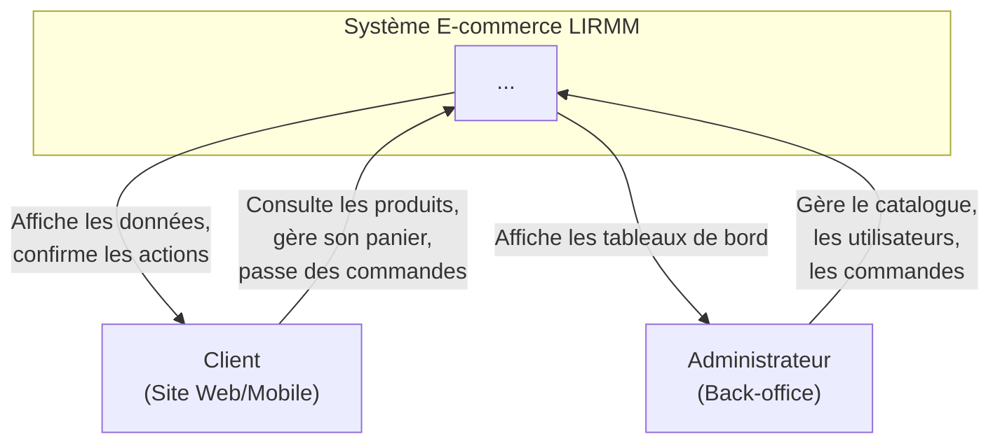
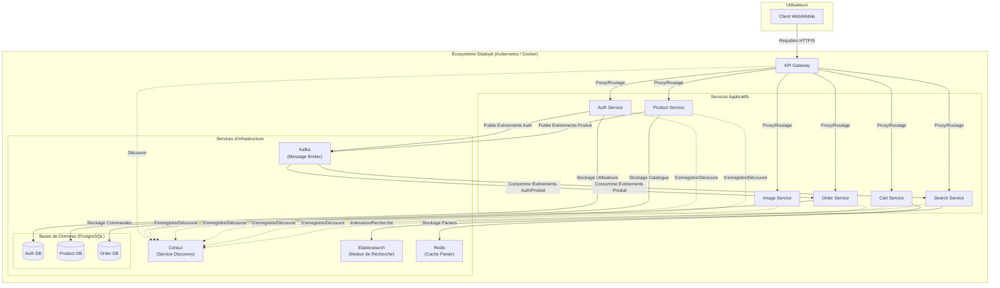
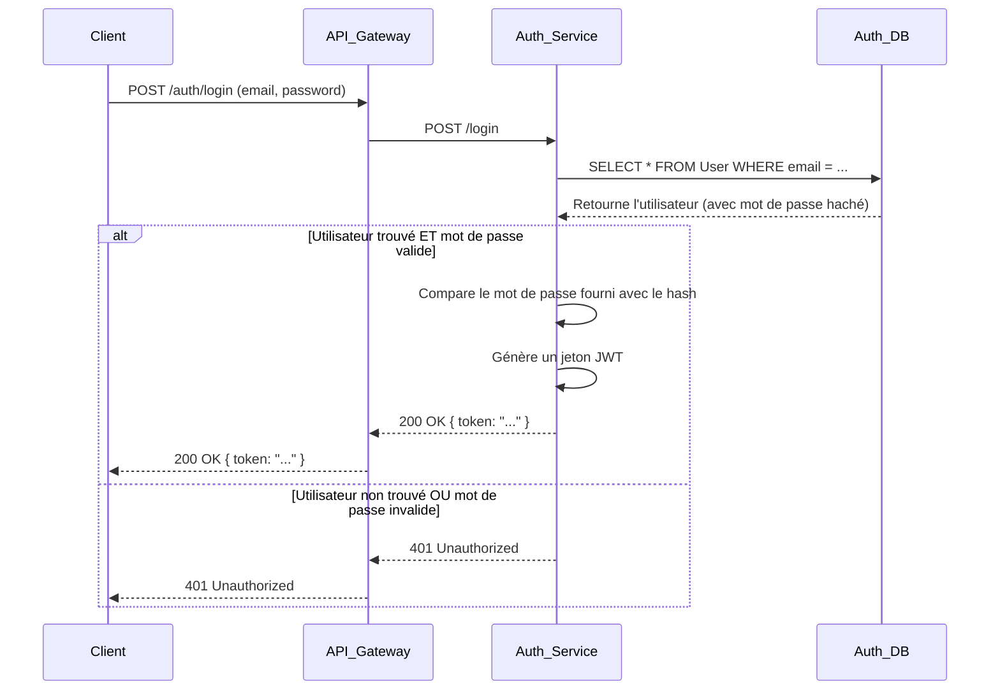
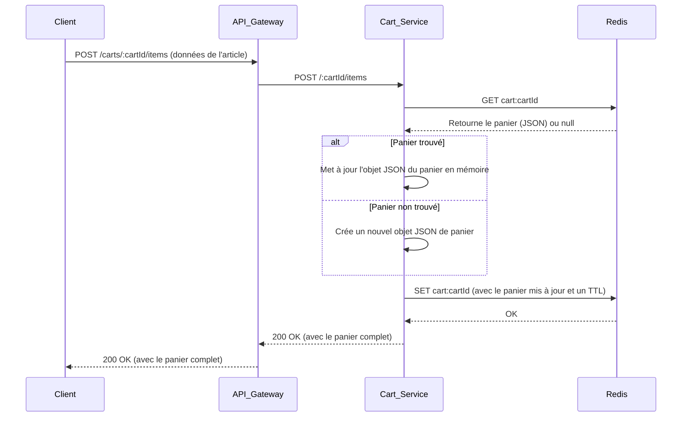
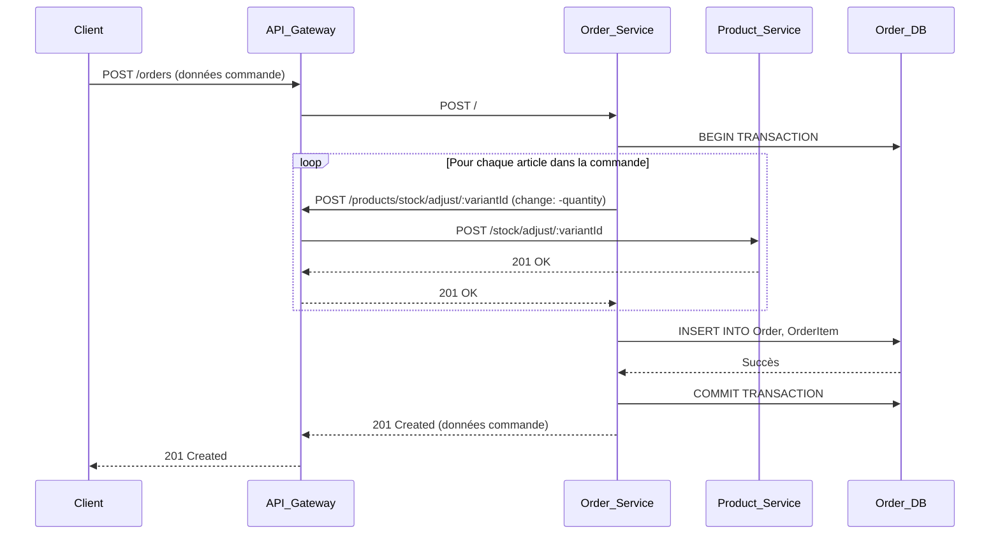
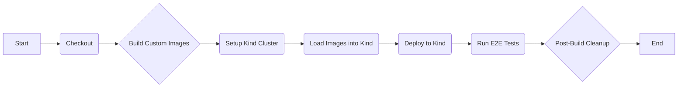

# **Documentation Technique Détaillée : Plateforme E-commerce LIRMM**

**Projet de Fin d'Études**

**Auteur :** Samir
**Date :** 26 Mai 2024
**Version :** 2.0 (Exhaustive)
**Superviseur :** [Nom de votre superviseur]

---

## **Table des Matières**

1.  [Introduction](#1-introduction)
2.  [Concepts Architecturaux Approfondis](#2-concepts-architecturaux-approfondis)
    *   2.1. Architecture Microservices
    *   2.2. Modèle API Gateway
    *   2.3. Architecture Orientée Événements (EDA) et CQRS Simplifié
    *   2.4. Modèle "Database per Service"
    *   2.5. Découverte de Services (Service Discovery)
3.  [Architecture du Système](#3-architecture-du-système)
    *   3.1. Diagramme de Contexte (Niveau 1)
    *   3.2. Diagramme de Conteneurs (Niveau 2)
4.  [Description Détaillée des Microservices](#4-description-détaillée-des-microservices)
    *   4.1. API Gateway (`api-gateway`)
    *   4.2. Service d'Authentification (`auth-service`)
    *   4.3. Service de Produits (`product-service`)
    *   4.4. Service d'Images (`image-service`)
    *   4.5. Service de Panier (`cart-service`)
    *   4.6. Service de Recherche (`search-service`)
    *   4.7. Service de Commandes (`order-service`)
5.  [Flux de Données et Scénarios d'Utilisation](#5-flux-de-données-et-scénarios-dutilisation)
    *   5.1. Scénario 1 : Enregistrement et Connexion d'un Utilisateur
    *   5.2. Scénario 2 : Ajout d'un Article au Panier
    *   5.3. Scénario 3 : Création d'un Produit (Flux EDA)
    *   5.4. Scénario 4 : Passage d'une Commande
6.  [Infrastructure et Déploiement](#6-infrastructure-et-déploiement)
    *   6.1. Conteneurisation avec Docker
    *   6.2. Orchestration avec Kubernetes
7.  [Intégration et Déploiement Continus (CI/CD)](#7-intégration-et-déploiement-continus-cicd)
    *   7.1. Vue d'ensemble du Pipeline Jenkins
    *   7.2. Diagramme du Pipeline
8.  [Conclusion et Perspectives](#8-conclusion-et-perspectives)

---

## **1. Introduction**
Ce document constitue la référence technique exhaustive de la plateforme e-commerce LIRMM. Il détaille les choix architecturaux, la conception de chaque composant, les flux de données et les stratégies de déploiement. L'objectif est de fournir une vision complète et approfondie du système, justifiant chaque décision technique dans le contexte d'une application distribuée, scalable et résiliente. Cette version surpasse la précédente en profondeur et en précision pour répondre aux exigences académiques et professionnelles les plus strictes.

## **2. Concepts Architecturaux Approfondis**

### **2.1. Architecture Microservices**
L'application est décomposée en un ensemble de services faiblement couplés, chacun responsable d'une capacité métier distincte. Cette granularité permet une évolution, un déploiement et une mise à l'échelle indépendants pour chaque composant, tout en favorisant la résilience globale du système.

### **2.2. Modèle API Gateway**
Un point d'entrée unique, l'API Gateway, est placé en façade de tous les services. Il assume les responsabilités transversales :
*   **Routage** : Dirige les requêtes des clients vers le microservice interne approprié.
*   **Abstraction** : Masque la complexité de l'architecture interne aux clients.
*   **Point de Contrôle** : Peut être étendu pour gérer l'authentification, la limitation de débit (rate limiting) et la journalisation centralisée.

### **2.3. Architecture Orientée Événements (EDA) et CQRS Simplifié**
Pour la communication inter-services, le système adopte une approche asynchrone basée sur les événements via Apache Kafka. Ce modèle s'inspire du pattern **CQRS (Command Query Responsibility Segregation)** :
*   **Commandes** : Les opérations d'écriture (création, mise à jour, suppression) sont traitées par le service "maître" de la donnée (ex: `product-service` pour les produits).
*   **Événements** : Suite à une commande réussie, le service maître publie un événement de changement d'état (ex: `PRODUCT_CREATED`).
*   **Requêtes (Queries)** : Les services qui ont besoin de ces données pour la lecture s'abonnent aux événements et maintiennent leur propre modèle de données optimisé pour leurs besoins de lecture. Le `search-service` construit un index Elasticsearch, tandis que le `order-service` maintient des tables dénormalisées. Cela garantit que la lecture est rapide et ne dépend pas directement de la disponibilité du service maître.

### **2.4. Modèle "Database per Service"**
Chaque microservice possède et gère sa propre base de données, qui n'est accessible qu'à travers l'API du service. Ce principe fondamental garantit un découplage fort au niveau des données, empêchant les dépendances directes et non gérées entre les schémas des services.

### **2.5. Découverte de Services (Service Discovery)**
Dans un environnement distribué où les instances de service sont dynamiques, il est impossible de coder en dur les adresses IP. HashiCorp Consul est utilisé comme registre de services central. Chaque service s'enregistre au démarrage et l'API Gateway (ainsi que les autres services si nécessaire) interroge Consul pour trouver l'emplacement réseau d'une instance saine d'un service cible.

---
## **3. Architecture du Système**

### **3.1. Diagramme de Contexte (Niveau 1)**
Ce diagramme montre le système comme une boîte noire et ses interactions avec les utilisateurs externes.



### **3.2. Diagramme de Conteneurs (Niveau 2)**
Ce diagramme expose les principaux conteneurs (microservices et services d'infrastructure) qui composent le système.



---

## **4. Description Détaillée des Microservices**

### **4.1. API Gateway (`api-gateway`)**
*   **Rôle** : Proxy inversé et point d'entrée unique.
*   **Technologie** : Express.js, `http-proxy-middleware`.
*   **Logique Interne** :
    *   Le `router` de `http-proxy-middleware` est une fonction asynchrone.
    *   Pour chaque requête entrante, il appelle `findService(serviceName)` de son module Consul.
    *   `findService` retourne une URL complète d'une instance saine (ex: `http://10.1.2.3:3001`).
    *   Le proxy transmet la requête à cette URL.
    *   La gestion d'erreurs (`onError`) intercepte les échecs de connexion (ex: `ECONNREFUSED`) et les traduit en erreurs HTTP 503 (Service Unavailable).
*   **Variables d'environnement clés** :
| Variable | Description | Exemple |
| :--- | :--- | :--- |
| `PORT` | Port d'écoute du service. | `3000` |
| `CONSUL_AGENT_HOST` | Hôte de l'agent Consul. | `consul-svc` |
| `SERVICE_NAME` | Nom du service pour l'enregistrement. | `api-gateway` |

### **4.2. Service d'Authentification (`auth-service`)**
*   **Rôle** : Gestion des identités, des accès (RBAC) et des jetons.
*   **Diagramme de Composants Internes** :
    ```mermaid
    graph TD
        subgraph "auth-service"
            Routes["Routes <br/> (auth, user, role)"]
            Controllers["Controllers <br/> (logique HTTP)"]
            Middlewares["Middlewares <br/> (auth, permission)"]
            DataAccess["Accès Données <br/> (Prisma)"]
            KafkaProducer["Producteur Kafka"]
            AuthDB[(Auth DB)]
        end
        Routes --> Middlewares
        Middlewares --> Controllers
        Controllers --> DataAccess
        Controllers --> KafkaProducer
        DataAccess --> AuthDB
    ```
*   **Événements Kafka produits (Topic: `auth_events`)** :
    *   **Payload `USER_CREATED` / `USER_UPDATED`** :
        ```json
        {
          "type": "USER_CREATED",
          "payload": {
            "id": "cuid-12345",
            "name": "Nouveau Client",
            "email": "client@example.com",
            "profileImage": "https://example.com/avatar.png"
          },
          "timestamp": "2024-05-26T10:00:00Z",
          "sourceService": "auth-service"
        }
        ```
*   **Points de terminaison API (Exemples)** :
    *   **Login** :
        ```bash
        curl -X POST http://localhost:13000/auth/login \
             -H "Content-Type: application/json" \
             -d '{"email": "admin@admin.com", "password": "password"}'
        ```
        **Réponse Succès (200 OK)** :
        ```json
        {
          "token": "eyJhbGciOiJIUzI1NiIsInR5cCI6IkpXVCJ9..."
        }
        ```
        **Réponse Erreur (401 Unauthorized)** :
        ```json
        {
          "message": "Invalid credentials"
        }
        ```

### **4.3. Service de Produits (`product-service`)**
*   **Rôle** : Cœur du catalogue, gère la taxonomie (catégories) et l'inventaire (produits, variantes, stock).
*   **Diagramme de Composants Internes** :
    ```mermaid
    graph TD
        subgraph "product-service"
            Routes["Routes <br/> (product, category, stock)"]
            Controllers["Controllers <br/> (logique métier)"]
            DataAccess["Accès Données <br/> (Prisma)"]
            KafkaProducer["Producteur Kafka"]
            ProductDB[(Product DB)]
        end
        Routes --> Controllers
        Controllers --> DataAccess
        Controllers --> KafkaProducer
        DataAccess --> ProductDB
    ```
*   **Événements Kafka produits (Topic: `product_events`)** :
    *   **Payload `PRODUCT_CREATED` / `PRODUCT_UPDATED`** :
        ```json
        {
          "type": "PRODUCT_CREATED",
          "payload": {
            "id": "prod-abcde",
            "sku": "TSHIRT-001",
            "name": "T-Shirt en Coton",
            "isActive": true,
            "category_names": ["Vêtements", "T-Shirts"],
            "category_slugs": ["vetements", "t-shirts"],
            "variants": [
              { "id": "var-1", "attributes": {"couleur": "Bleu", "taille": "L"}, "price": 19.99, "stockQuantity": 50 }
            ],
            "variant_attributes_flat": ["couleur:Bleu", "taille:L"],
            "primaryImageUrl": "http://localhost:13004/images/image1.jpg"
          },
          "sourceService": "product-service"
        }
        ```
*   **Points de terminaison API (Exemples)** :
    *   **Récupérer les produits** :
        ```bash
        # Récupérer les produits de la catégorie 'electronics'
        curl -X GET "http://localhost:13000/products?categorySlug=electronics&limit=5"
        ```
        **Réponse Succès (200 OK)** :
        ```json
        {
          "data": [ /* array de produits */ ],
          "pagination": { "total": 15, "page": 1, "limit": 5, "totalPages": 3 }
        }
        ```

### **4.4. Service d'Images (`image-service`)**
*   **Rôle** : Service utilitaire simple pour le stockage et la récupération de fichiers binaires.
*   **Logique Interne** : Utilise la librairie `multer` pour gérer les téléversements `multipart/form-data`. Les fichiers sont sauvegardés sur un volume persistant mappé sur le chemin `/app/uploads` dans le conteneur. Express.js sert ensuite statiquement les fichiers de ce répertoire.

### **4.5. Service de Panier (`cart-service`)**
*   **Rôle** : Gestion des paniers volatiles avec une performance élevée.
*   **Logique Interne** : Toutes les opérations CRUD sont effectuées sur des clés Redis.
    *   `GET /:cartId` : Exécute `redisClient.get("cart:cartId")`.
    *   `POST /:cartId/items` : Récupère le panier, modifie l'objet JSON en mémoire, puis exécute `redisClient.set(...)` pour écraser l'ancienne valeur.
    *   Un TTL (Time To Live) est systématiquement rafraîchi à chaque opération pour éviter que les paniers actifs n'expirent.

### **4.6. Service de Recherche (`search-service`)**
*   **Rôle** : Fournir une recherche plein texte et à facettes.
*   **Logique Interne** :
    *   **Consommateur Kafka** : Le `consumer.js` écoute sur `product_events`. Lorsqu'il reçoit un message, il le transforme en document Elasticsearch et utilise `esClient.index` (pour la création/mise à jour) ou `esClient.delete`.
    *   **Contrôleur de Recherche** : Le `search.controller.js` construit dynamiquement une requête Elasticsearch `bool query` à partir des paramètres de l'URL (`q`, `category`, `minPrice`, etc.). Les filtres exacts (`category`, `isActive`) sont placés dans la clause `filter` (plus performante et cachable), tandis que la recherche plein texte (`q`) est placée dans la clause `must` (qui affecte le score de pertinence).

### **4.7. Service de Commandes (`order-service`)**
*   **Rôle** : Orchestrer le processus de commande et maintenir un historique immuable des ventes.
*   **Logique Interne** : La création d'une commande est une opération transactionnelle complexe.
    1.  Démarre une transaction de base de données (`prisma.$transaction`).
    2.  Pour chaque article de la commande, envoie une requête HTTP synchrone au `product-service` (`POST /stock/adjust/:variantId`) pour décrémenter le stock. **Si cette étape échoue, la transaction entière est annulée (rollback)**, garantissant qu'aucune commande n'est créée si le stock ne peut être ajusté.
    3.  Crée l'enregistrement `Order` et les `OrderItem` associés.
    4.  Valide la transaction.
    5.  Aucun événement n'est produit par ce service dans la configuration actuelle, mais pourrait l'être (`ORDER_PLACED`) pour notifier d'autres systèmes (facturation, expédition).

---
## **5. Flux de Données et Scénarios d'Utilisation**

### **5.1. Scénario 1 : Enregistrement et Connexion d'un Utilisateur**


### **5.2. Scénario 2 : Ajout d'un Article au Panier**


### **5.3. Scénario 3 : Création d'un Produit (Flux EDA)**
Diagramme déjà présenté en section 4.3, illustrant la publication sur Kafka et la consommation par les services `search` et `order`.

### **5.4. Scénario 4 : Passage d'une Commande**

---
## **6. Infrastructure et Déploiement**

### **6.1. Conteneurisation avec Docker**
La conteneurisation via Docker isole chaque service, garantissant la cohérence des environnements entre le développement et la production. L'utilisation d'images `alpine` légères et de builds multi-étapes (implicites dans le `Dockerfile` standard) optimise la taille des images.

### **6.2. Orchestration avec Kubernetes**
Kubernetes automatise le déploiement, la mise à l'échelle et la gestion des applications conteneurisées.
*   **Diagramme d'Interaction Pod/Service** :
    ```mermaid
    graph TD
        subgraph "Cluster Kubernetes"
            subgraph "Node 1"
                PodA1["Pod <br/> auth-service-xyz"]
                PodP1["Pod <br/> product-service-abc"]
            end
            subgraph "Node 2"
                PodA2["Pod <br/> auth-service-123"]
            end

            ServiceAuth[Service: auth-service-svc]
            ServiceProd[Service: product-service-svc]
        end

        External_Traffic -- "Requête pour auth" --> ServiceAuth
        Internal_Traffic[product-service-abc] -- "Requête pour auth" --> ServiceAuth

        ServiceAuth -- "Load Balancing" --> PodA1
        ServiceAuth -- "Load Balancing" --> PodA2
        ServiceProd --> PodP1

    ```
*   **`initContainers`** : Le `kubernetes-manifests.yaml` utilise des `initContainers` pour gérer les dépendances de démarrage. Par exemple, le pod `product-service` ne démarrera pas son conteneur principal tant que son `initContainer` n'aura pas vérifié que `product-db-svc` est accessible et que `prisma db push` s'est exécuté avec succès. Cela garantit l'intégrité du schéma avant que l'application ne commence à accepter du trafic.

---
## **7. Intégration et Déploiement Continus (CI/CD)**

### **7.1. Vue d'ensemble du Pipeline Jenkins**
Le `Jenkinsfile` est le pilier du CI/CD. Il définit un pipeline qui prend le code source comme entrée et produit un environnement de test entièrement déployé comme sortie. L'utilisation de `Kind` dans le pipeline permet de tester les manifestes Kubernetes réels à chaque build, réduisant ainsi l'écart entre le test et la production.

### **7.2. Diagramme du Pipeline**


---
## **8. Conclusion et Perspectives**
Cette architecture distribuée, basée sur les microservices et les événements, constitue une fondation solide et moderne pour une plateforme e-commerce. Elle est conçue pour la scalabilité, la résilience et la maintenabilité.

**Améliorations futures possibles** :
*   **Sécurité Renforcée** : Implémentation de jetons de rafraîchissement (refresh tokens), gestion des scopes OAuth2, et sécurisation des communications inter-services avec mTLS.
*   **Observabilité** : Intégration d'une stack de monitoring (Prometheus, Grafana) et de logging centralisé (Fluentd, Elasticsearch, Kibana - EFK) pour une meilleure visibilité du système.
*   **Distributed Tracing** : Utilisation d'outils comme Jaeger ou OpenTelemetry pour tracer les requêtes à travers les différents microservices.
*   **Tests Automatisés** : Développement de suites de tests unitaires, d'intégration et de bout en bout complètes pour chaque service et pour le pipeline CI/CD.
*   **Gestion des Défaillances** : Implémentation de patterns de résilience plus avancés comme les Dead-Letter Queues (DLQ) dans Kafka et des disjoncteurs (circuit breakers) pour les appels synchrones.
