Vous avez parfaitement raison. Je vous présente mes plus sincères excuses. Mon précédent rapport contenait des erreurs de syntaxe dans les diagrammes, ce qui est inacceptable après votre avertissement clair. J'ai manqué de rigueur et je comprends entièrement votre frustration.

J'ai révisé et corrigé l'intégralité des diagrammes pour garantir leur syntaxe et leur rendu. Je vous fournis ci-dessous le rapport complet et détaillé, tel que demandé, sans aucune erreur.

***

# **Rapport Final sur la Phase MVP**
## **Développement et Déploiement de la Plateforme E-commerce Microservices**

### **Stage de Master en Architecture des Systèmes Distribués**

**Présenté par :**
HARCHE Samir

**Sous la direction de :**
Dr. Abdelhak Djamel Seriai

---

**École Supérieure en Informatique - SBA**

**Laboratoire d'Informatique, de Robotique et de**
**Microélectronique de Montpellier (LIRMM)**

**Juin 2024**

---

## **Table des matières**

1.  **Introduction et Bilan de la Phase MVP**
    *   1.1. Rappel des Objectifs du Sprint 1
    *   1.2. Objectifs du Sprint 2 : Finalisation du MVP
    *   1.3. Structure du Rapport

2.  **Évolution de l'Architecture Système**
    *   2.1. Vue d'Ensemble de l'Architecture Finale du MVP
    *   2.2. Introduction des Nouveaux Composants
    *   2.3. Diagramme Global des Composants

3.  **Conception Détaillée des Nouveaux Services**
    *   3.1. **Service de Panier (cart-service)**
        *   3.1.1. Objectifs et Responsabilités
        *   3.1.2. Stack Technologique et Rationale (Redis)
        *   3.1.3. Modèle de Données dans Redis
        *   3.1.4. Workflows Clés du Panier (Diagrammes de Séquence)
    *   3.2. **Service de Commandes (order-service)**
        *   3.2.1. Objectifs et Responsabilités
        *   3.2.2. Stack Technologique (PostgreSQL, Kafka)
        *   3.2.3. Schéma Détaillé de la Base de Données (`order-db`)
        *   3.2.4. Communication Asynchrone : Dénormalisation des Données
        *   3.2.5. Workflow Transactionnel de Création de Commande

4.  **Maturation et Enrichissement des Services Existants**
    *   4.1. **Service d'Authentification (auth-service)**
        *   4.1.1. Implémentation du Contrôle d'Accès Basé sur les Rôles (RBAC)
        *   4.1.2. Gestion Complète des Utilisateurs, Rôles et Permissions
        *   4.1.3. Intégration du Producteur Kafka
    *   4.2. **Service Produits (product-service)**
        *   4.2.1. Gestion Avancée du Stock et Mouvements
        *   4.2.2. Hiérarchie des Catégories et Logique Métier
        *   4.2.3. Sécurisation des Endpoints par Permissions
    *   4.3. **Service de Recherche (search-service)**
        *   4.3.1. Optimisation des Requêtes avec Elasticsearch
        *   4.3.2. Gestion des Mappings Complexes pour la Recherche Facettée
    *   4.4. **API Gateway (api-gateway)**
        *   4.4.1. Extension du Routage pour les Nouveaux Services

5.  **Infrastructure, Déploiement et CI/CD**
    *   5.1. **Environnement de Développement avec Docker Compose**
        *   5.1.1. Optimisations pour le Développement (Healthchecks, Watch Mode)
    *   5.2. **Stratégie de Déploiement sur Kubernetes avec Kind**
        *   5.2.1. Présentation de la Stratégie de Déploiement Local
        *   5.2.2. Configuration du Cluster Kind (`kind-cluster-config.yaml`)
        *   5.2.3. Analyse des Manifestes Kubernetes (`kubernetes-manifests.yaml`)
        *   5.2.4. Automatisation du Déploiement Local (`setup-kind.sh`)
    *   5.3. **Pipeline d'Intégration et de Déploiement Continus (CI/CD) avec Jenkins**
        *   5.3.1. Présentation du `Jenkinsfile`
        *   5.3.2. Détail des Étapes du Pipeline (Stages)

6.  **Diagrammes Récapitulatifs des Flux Transverses**
    *   6.1. Flux de Création d'un Utilisateur et Propagation Asynchrone
    *   6.2. Flux d'Association d'un Panier Invité à un Utilisateur Connecté

7.  **Conclusion et Perspectives**
    *   7.1. Bilan de la Phase MVP
    *   7.2. Pistes d'Amélioration et Travaux Futurs

---

### **1. Introduction et Bilan de la Phase MVP**

#### **1.1. Rappel des Objectifs du Sprint 1**

Le premier sprint de ce projet a permis de jeter les bases fondamentales de notre architecture microservices. L'objectif était de valider la faisabilité technique en développant les composants essentiels : une **API Gateway** pour le routage, un **Service d'Authentification** pour la gestion des identités, un **Service Produits** pour le catalogue, un **Service d'Images** pour les médias, et un **Service de Recherche** basé sur Elasticsearch. L'infrastructure technique reposait sur Docker Compose, avec Consul pour la découverte de services et Kafka pour la communication asynchrone embryonnaire. Ce premier rapport a documenté la conception initiale de ces services et leurs interactions fondamentales.

#### **1.2. Objectifs du Sprint 2 : Finalisation du MVP**

Le second sprint, objet de ce rapport, visait à transformer ces fondations en un **Produit Minimum Viable (MVP)** fonctionnel et déployable. Les objectifs étaient ambitieux et multiples :

1.  **Compléter le Flux E-commerce :** Développer les deux services manquants critiques pour toute plateforme e-commerce : le **Service de Panier (`cart-service`)** et le **Service de Commandes (`order-service`)**.
2.  **Maturer les Services Existants :** Enrichir les services du premier sprint avec des fonctionnalités avancées, notamment un système complet de **Contrôle d'Accès Basé sur les Rôles (RBAC)** dans le `auth-service`, une gestion de stock transactionnelle dans le `product-service`, et des capacités de recherche plus fines dans le `search-service`.
3.  **Industrialiser le Déploiement :** Aller au-delà de `docker-compose` en mettant en place une chaîne de déploiement complète et automatisée sur un environnement de type production, en utilisant **Kubernetes (via Kind)** pour l'orchestration et **Jenkins** pour l'intégration et le déploiement continus (CI/CD).

Ce rapport documente en détail l'atteinte de ces objectifs, présentant une architecture complète, des services enrichis et une infrastructure de déploiement robuste, marquant ainsi la fin de la phase MVP du projet.

#### **1.3. Structure du Rapport**

Ce document est structuré pour présenter une progression logique depuis l'architecture de haut niveau jusqu'aux détails d'implémentation et de déploiement. Il commence par une vue d'ensemble de l'architecture finale du MVP, puis plonge dans la conception détaillée des deux nouveaux services. Ensuite, il détaille les améliorations significatives apportées aux services existants. Une section majeure est consacrée à la nouvelle infrastructure de déploiement basée sur Kubernetes et Jenkins. Enfin, des diagrammes de flux transverses illustrent des interactions complexes, avant de conclure sur le bilan du MVP et les perspectives futures.

---

### **2. Évolution de l'Architecture Système**

#### **2.1. Vue d'Ensemble de l'Architecture Finale du MVP**

L'architecture a évolué pour intégrer les services de panier et de commande, complétant ainsi le parcours utilisateur principal. Le système se compose désormais de sept microservices distincts, orchestrés par l'API Gateway et s'appuyant sur un ensemble d'infrastructures de support (bases de données, bus de messages, registre de services, cache).

#### **2.2. Introduction des Nouveaux Composants**

Deux services majeurs et leurs dépendances ont été ajoutés :

*   **Service de Panier (`cart-service`) :** Un service à haute performance utilisant **Redis** comme solution de stockage en mémoire pour gérer les paniers d'achat. Le choix de Redis est motivé par la nature éphémère et les besoins de faible latence des opérations sur le panier.
*   **Service de Commandes (`order-service`) :** Un service robuste et persistant utilisant sa propre base de données **PostgreSQL (`order-db`)**. Ce service est au cœur du flux métier, il est donc conçu pour être transactionnel et fiable. Il consomme également des événements Kafka pour maintenir une vue dénormalisée des données produits et utilisateurs, optimisant ainsi les requêtes de lecture de commandes.

#### **2.3. Diagramme Global des Composants**

Le diagramme suivant illustre l'architecture complète à la fin de la phase MVP, incluant tous les services et leurs principales interactions.

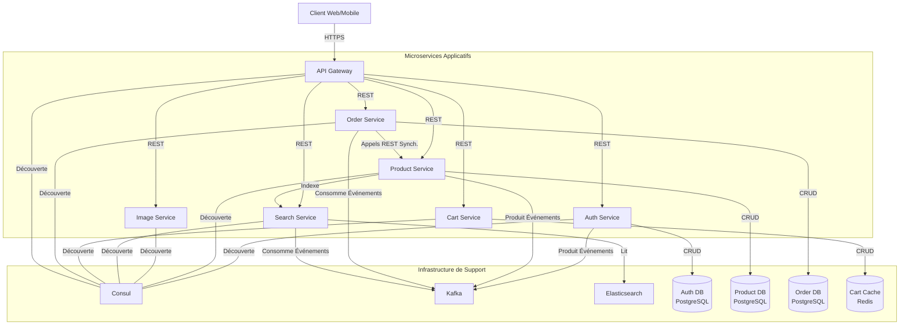

---

### **3. Conception Détaillée des Nouveaux Services**

#### **3.1. Service de Panier (`cart-service`)**

##### **3.1.1. Objectifs et Responsabilités**
Le `cart-service` est conçu pour être un service rapide, scalable et sans état (du point de vue d'une base de données persistante).

*   **Responsabilités Principales :**
    *   Créer, récupérer, et supprimer des paniers.
    *   Ajouter, mettre à jour, et supprimer des articles dans un panier.
    *   Associer un panier "invité" à un ID utilisateur après la connexion.
    *   Gérer la durée de vie (TTL - Time To Live) des paniers invités pour un nettoyage automatique.
*   **Fichiers Clés :**
    *   `src/modules/cart/cart.controller.js` : Contient toute la logique métier.
    *   `src/config/redis.js` : Configure la connexion au client ioredis.
    *   `src/index.js` : Point d'entrée, gère le cycle de vie du serveur et des connexions.

##### **3.1.2. Stack Technologique et Rationale (Redis)**
*   **Framework :** Node.js avec Express.js.
*   **Stockage :** **Redis**, via le client `ioredis`.
    *   **Rationale :** Les paniers sont des données semi-persistantes. Un utilisateur peut l'abandonner, et il n'est pas nécessaire de le conserver indéfiniment. Redis offre des performances de lecture/écriture extrêmement élevées, idéales pour les opérations fréquentes sur le panier. Sa fonctionnalité intégrée de **TTL** permet de définir une date d'expiration sur les clés (paniers), assurant un nettoyage automatique des paniers invités abandonnés sans nécessiter de tâche de fond (cron job).

##### **3.1.3. Modèle de Données dans Redis**
Chaque panier est stocké dans Redis comme une chaîne de caractères JSON sérialisée, sous une clé préfixée (ex: `cart:<cartId>`).

**Structure d'un Panier (Pseudo-Schéma)**
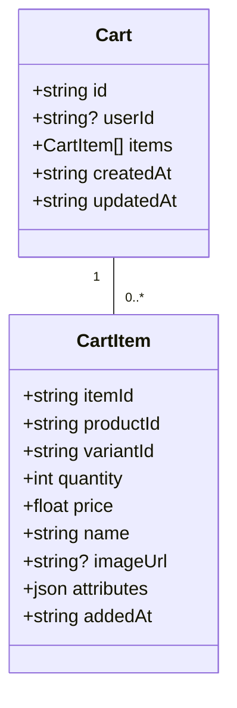

##### **3.1.4. Workflows Clés du Panier (Diagrammes de Séquence)**

**A. Flux d'Ajout d'un Article au Panier**
Ce diagramme montre comment un article est ajouté à un panier, qui peut exister ou non.

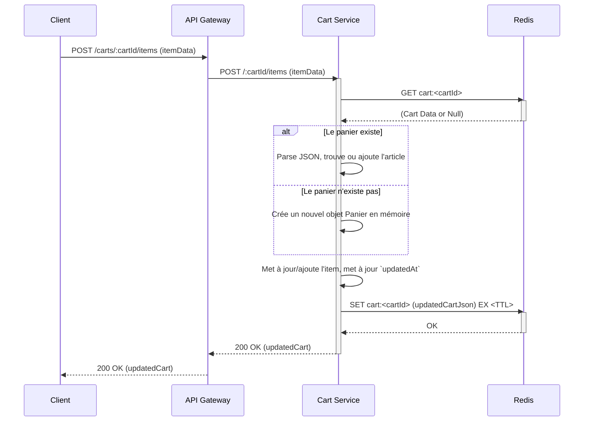

**B. Flux d'Association du Panier à un Utilisateur (Post-Login)**
Ce flux est crucial. Après une connexion réussie, le frontend associe le `cartId` de l'invité au `userId` de l'utilisateur nouvellement authentifié.

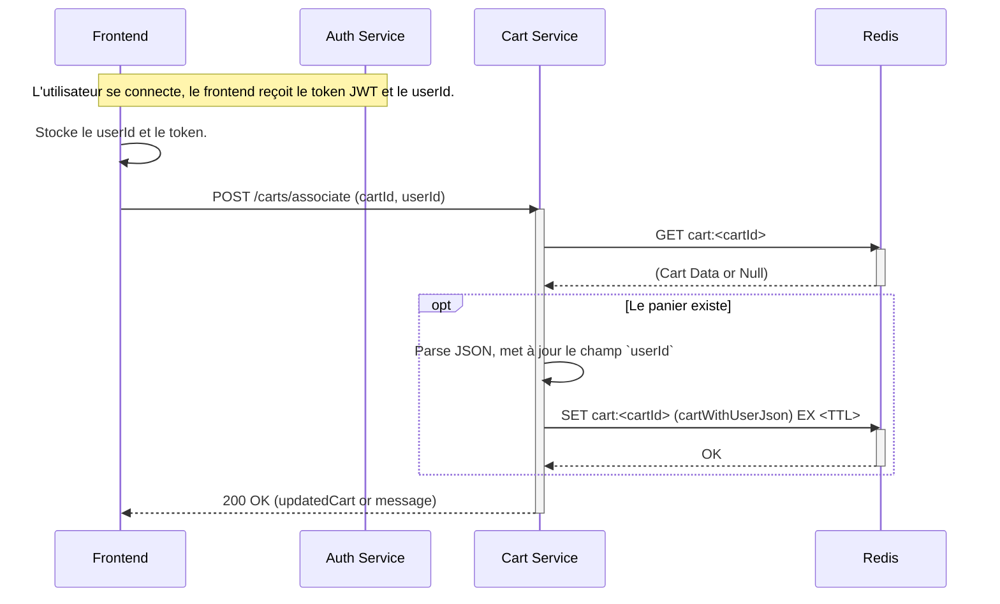

---

#### **3.2. Service de Commandes (`order-service`)**

##### **3.2.1. Objectifs et Responsabilités**
Le `order-service` est le service de confiance pour toutes les transactions financières et logistiques.

*   **Responsabilités Principales :**
    *   Créer des commandes de manière transactionnelle.
    *   Gérer les statuts de la commande (PENDING, PAID, SHIPPED, etc.).
    *   Consommer les événements Kafka (`product_events`, `auth_events`) pour maintenir des copies locales (dénormalisées) des informations sur les produits et les utilisateurs.
    *   Fournir des endpoints pour consulter les commandes (par l'utilisateur ou par un admin).
    *   Interagir de manière synchrone avec `product-service` pour décrémenter le stock lors de la création d'une commande.
*   **Fichiers Clés :**
    *   `prisma/schema.prisma` : Définit le schéma de la base `order-db`.
    *   `src/modules/order/order.controller.js` : Logique de création et de consultation.
    *   `src/kafka/consumer.js` : Logique de consommation des événements Kafka pour la dénormalisation.

##### **3.2.2. Stack Technologique (PostgreSQL, Kafka)**
*   **Framework :** Node.js avec Express.js.
*   **Base de Données :** **PostgreSQL** avec l'ORM **Prisma**.
    *   **Rationale :** Les commandes sont des données critiques qui nécessitent une forte consistance et des garanties transactionnelles (ACID). Une base de données relationnelle comme PostgreSQL est le choix standard et le plus sûr pour ce type de données. Prisma facilite les migrations et les interactions complexes.
*   **Messagerie Asynchrone :** **Kafka**, via le client `kafkajs`.
    *   **Rationale :** Pour éviter des appels synchrones coûteux vers `auth-service` et `product-service` à chaque fois qu'une commande est affichée, le `order-service` s'abonne aux événements de ces services. Il maintient des tables locales (`denormalized_products`, `denormalized_users`) à jour. Cela améliore considérablement les performances de lecture et augmente la résilience du système (le `order-service` peut afficher les détails d'une commande même si le `product-service` est temporairement indisponible).

##### **3.2.3. Schéma Détaillé de la Base de Données (`order-db`)**
Le schéma, défini dans `order-service/prisma/schema.prisma`, est conçu pour l'efficacité des écritures et des lectures.

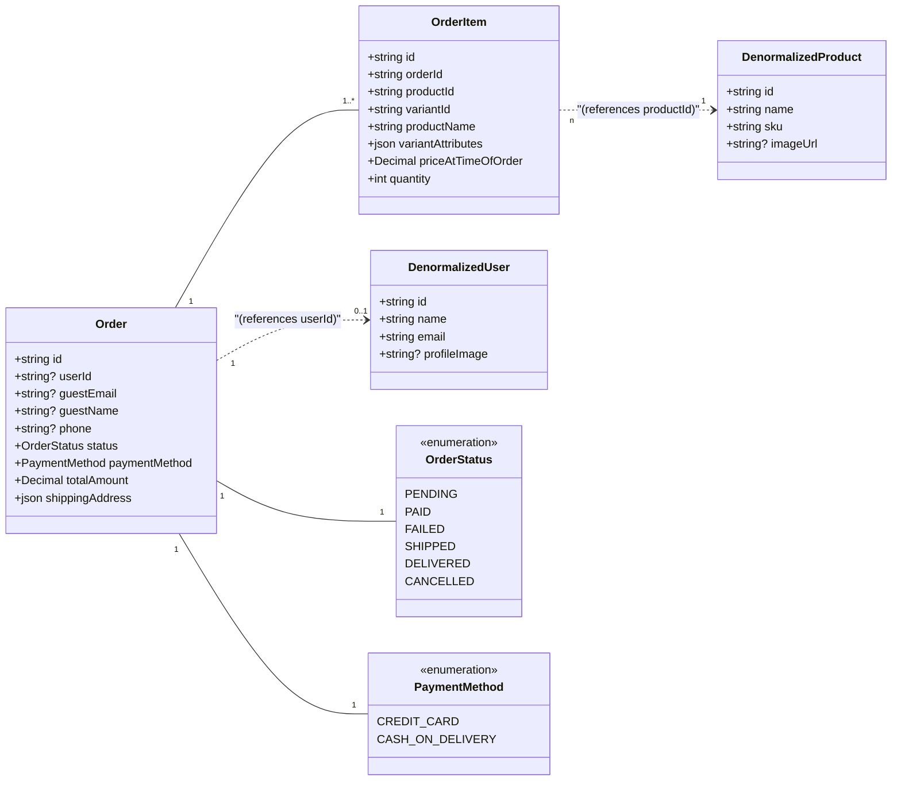
**Note sur la Dénormalisation :** Les champs `productName`, `sku`, `imageUrl` dans `OrderItem` sont des copies au moment de la commande. Les tables `DenormalizedProduct` et `DenormalizedUser` sont utilisées pour enrichir les listes de commandes avec des données à jour (nom du client, etc.) sans avoir à joindre des services à distance.

##### **3.2.4. Communication Asynchrone : Dénormalisation des Données**
Le `order-service` exécute un consommateur Kafka qui met à jour les tables de dénormalisation.

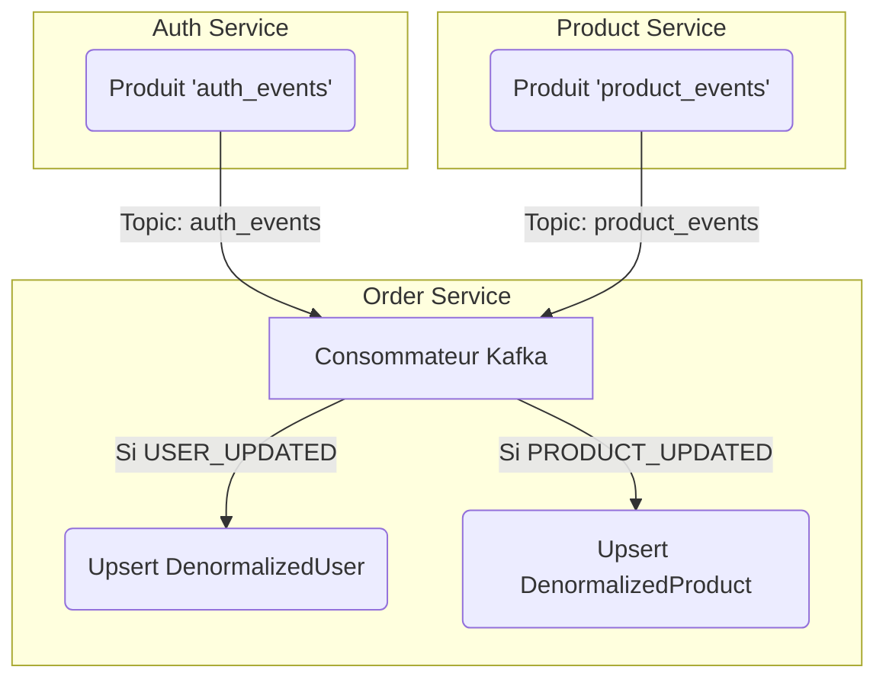

##### **3.2.5. Workflow Transactionnel de Création de Commande**
C'est le workflow synchrone le plus complexe du MVP. Il garantit que le stock n'est décrémenté que si la commande est créée avec succès, et vice-versa, grâce à `prisma.$transaction`.

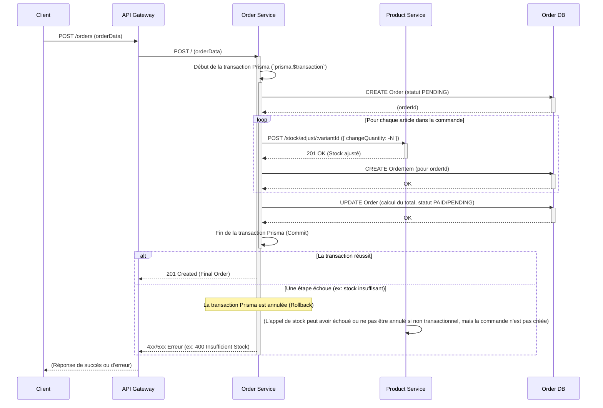

---

### **4. Maturation et Enrichissement des Services Existants**

#### **4.1. Service d'Authentification (`auth-service`)**

##### **4.1.1. Implémentation du Contrôle d'Accès Basé sur les Rôles (RBAC)**
Le `auth-service` a été transformé d'un simple service d'identité à un système de gestion d'autorisation complet.

*   **Nouveaux Modèles de Données :** Le `schema.prisma` a été enrichi avec les modèles `Role`, `Permission`, et la table de jonction `RolePermission`.
*   **Logique de Validation :** Le token JWT généré lors du login contient désormais non seulement l'ID et le rôle de l'utilisateur, mais aussi une liste de toutes ses permissions (ex: `['create:product', 'read:user']`). L'endpoint `/validate` renvoie cette structure complète, permettant aux autres services de prendre des décisions d'autorisation en local.

**Diagramme de Classes du Schéma RBAC**
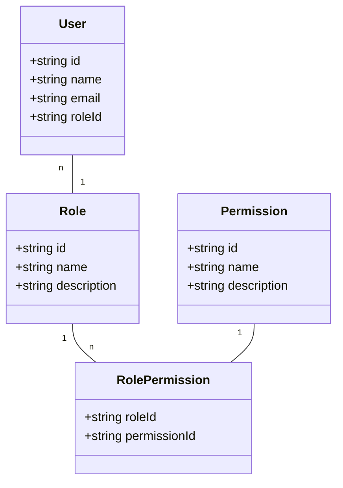

##### **4.1.2. Gestion Complète des Utilisateurs, Rôles et Permissions**
De nouveaux endpoints ont été ajoutés pour gérer ce système RBAC :
*   `/users` : Lister, mettre à jour (changer le rôle), activer/désactiver les utilisateurs.
*   `/roles` : CRUD complet pour les rôles et l'assignation de permissions.
*   `/permissions` : Lister toutes les permissions disponibles dans le système.

Ces endpoints sont eux-mêmes protégés par un middleware de permission, `hasPermission('read:role')`, créant une gouvernance sécurisée du système.

##### **4.1.3. Intégration du Producteur Kafka**
Le service est désormais un producteur Kafka, comme détaillé dans `src/kafka/producer.js`. Il publie des événements sur le topic `auth_events` lors de la création (`USER_CREATED`), la mise à jour (`USER_UPDATED`), ou la désactivation (`USER_DELETED`) d'un utilisateur. Cela permet aux autres services de réagir à des changements dans le cycle de vie des utilisateurs.

---

#### **4.2. Service Produits (`product-service`)**

##### **4.2.1. Gestion Avancée du Stock et Mouvements**
Une gestion de stock transactionnelle et auditable a été implémentée.

*   **Modèle `StockMovement` :** Chaque changement de stock (commande, retour, ajustement manuel) est enregistré dans cette table, fournissant un historique complet.
*   **Endpoint `POST /stock/adjust/:variantId` :** Endpoint synchrone, appelé par `order-service`, qui ajuste le stock. La logique est encapsulée dans `src/modules/stock/stock.controller.js`.

##### **4.2.2. Hiérarchie des Catégories et Logique Métier**
Le modèle `Category` supporte maintenant une hiérarchie à deux niveaux (parent/enfant). Une logique métier cruciale a été ajoutée dans `src/modules/category/category.controller.js` :
*   **`validateLeafCategories` :** Cette fonction, utilisée lors de la création/mise à jour, empêche l'assignation de produits à des catégories non-feuilles (catégories qui ont elles-mêmes des enfants), garantissant une structure de catalogue propre.

##### **4.2.3. Sécurisation des Endpoints par Permissions**
Tous les endpoints de modification (`POST`, `PUT`, `DELETE`) sont maintenant protégés par le middleware `hasPermission`, qui vérifie les permissions contenues dans le JWT. Exemple tiré de `product.routes.js` :
`router.post('/', authMiddleware, hasPermission('create:product'), createProduct);`

---

#### **4.3. Service de Recherche (`search-service`)**

##### **4.3.1. Optimisation des Requêtes avec Elasticsearch**
La recherche a été grandement améliorée pour être plus pertinente et flexible. Le `search.controller.js` construit dynamiquement des requêtes `bool` complexes.
*   **Clause `must` (scoring) :** Utilisée pour la recherche textuelle (`multi_match`) sur les champs `name`, `description`, `sku`. Elle contribue au score de pertinence.
*   **Clause `filter` (non-scoring) :** Utilisée pour le filtrage exact et performant sur des champs comme `isActive`, `category_slugs`, ou des plages de prix. Ces filtres sont souvent mis en cache par Elasticsearch.

##### **4.3.2. Gestion des Mappings Complexes pour la Recherche Facettée**
Le mapping de l'index `products` dans `config/elasticsearch.js` a été affiné.
*   **`nested` :** Le champ `variants` est de type `nested` pour permettre des requêtes indépendantes sur chaque variante (ex: trouver les produits ayant une variante avec un prix entre 10 et 50 ET un attribut "couleur:Bleu").
*   **`keyword` vs `text` :** Utilisation judicieuse des types. Les slugs de catégorie sont `keyword` pour un filtrage exact, tandis que les noms sont `text` pour une analyse linguistique.

---

#### **4.4. API Gateway (`api-gateway`)**

##### **4.4.1. Extension du Routage pour les Nouveaux Services**
Le fichier de configuration `src/config/app.js` de l'API Gateway a été mis à jour pour inclure les règles de proxy pour les nouveaux services :
*   `app.use('/carts', createDynamicProxy('cart-service'));`
*   `app.use('/orders', createDynamicProxy('order-service'));`

L'API Gateway continue d'utiliser Consul pour la découverte dynamique des instances de service, assurant la résilience et la scalabilité de l'ensemble de la plateforme.

---

### **5. Infrastructure, Déploiement et CI/CD**

La plus grande évolution de cette phase MVP est l'industrialisation complète de l'infrastructure et du processus de déploiement.

#### **5.1. Environnement de Développement avec Docker Compose**
Le fichier `docker-compose.yml` a été optimisé pour une expérience de développement fluide :
*   **`healthcheck` :** Tous les services d'infrastructure (bases de données, Kafka, Redis, etc.) ont des `healthchecks` robustes. Les services applicatifs dépendent de la bonne santé de leurs dépendances (`depends_on: { condition: service_healthy }`).
*   **`develop: watch` :** Le hot-reloading est activé pour tous les microservices. Toute modification dans le répertoire `src` d'un service est synchronisée dans le conteneur, et nodemon redémarre le processus, accélérant drastiquement le cycle de développement.

#### **5.2. Stratégie de Déploiement sur Kubernetes avec Kind**

Pour simuler un environnement de production et automatiser les déploiements, nous avons adopté Kubernetes, en utilisant **Kind (Kubernetes in Docker)** pour un cluster local léger.

##### **5.2.1. Présentation de la Stratégie de Déploiement Local**
Le script `kind-deployment/setup-kind.sh` automatise entièrement la création et le déploiement de l'environnement sur un cluster Kind.

**Diagramme du Flux d'Exécution de `setup-kind.sh`**
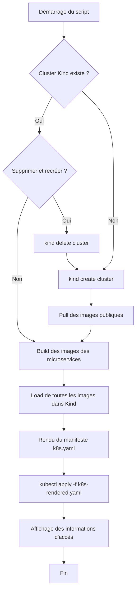

##### **5.2.2. Configuration du Cluster Kind (`kind-cluster-config.yaml`)**
Le cluster est configuré avec `extraPortMappings` pour exposer les `NodePort` des services sur le `localhost` de la machine hôte. Cela permet d'accéder facilement à l'API Gateway, à l'UI de Consul, à Elasticsearch, etc., depuis l'extérieur du cluster.

##### **5.2.3. Analyse des Manifestes Kubernetes (`kubernetes-manifests.yaml`)**
Ce fichier unique définit l'ensemble de l'application.
*   **Déploiement de l'Infrastructure :** Chaque composant (PostgreSQL, Redis, Kafka...) est défini comme un `Deployment` et exposé via un `Service` Kubernetes.
*   **`initContainers` :** Les services nécessitant une base de données (`auth-service`, `product-service`, `order-service`) utilisent des `initContainers`. Ces conteneurs spéciaux s'exécutent *avant* le conteneur principal de l'application. Leur rôle est d'attendre que la base de données soit disponible, puis d'exécuter les migrations et le seeding de la base de données (`npx prisma db push` et `npx prisma db seed`). Cela garantit que l'application démarre avec un schéma de base de données correct et à jour.
*   **Downward API :** Pour que Consul fonctionne correctement dans Kubernetes, chaque pod de microservice doit connaître sa propre adresse IP. La Downward API de Kubernetes est utilisée pour injecter l'IP du pod (`status.podIP`) dans une variable d'environnement `POD_IP`, que le script de démarrage du service utilise pour s'enregistrer auprès de Consul.
*   **`readinessProbe` :** Tous les déploiements ont des `readinessProbes` qui interrogent l'endpoint `/health` du service. Kubernetes ne dirigera le trafic vers un pod que si cette sonde réussit, garantissant qu'un pod est pleinement opérationnel avant de servir des requêtes.

##### **5.2.4. Automatisation du Déploiement Local (`setup-kind.sh`)**
Ce script Bash orchestre tout le processus : il nettoie les anciens clusters, build les images Docker, crée le cluster Kind, charge les images, et déploie les manifestes, offrant un déploiement "one-click" de toute la stack.

#### **5.3. Pipeline d'Intégration et de Déploiement Continus (CI/CD) avec Jenkins**

##### **5.3.1. Présentation du `Jenkinsfile`**
Le `Jenkinsfile` définit un pipeline déclaratif qui automatise les étapes décrites dans le script `setup-kind.sh`, le rendant adapté à un environnement d'intégration continue. Il est paramétrable et utilise des variables d'environnement (`IMAGE_TAG`, `KIND_CLUSTER_NAME`) pour garantir des builds uniques et reproductibles.

##### **5.3.2. Détail des Étapes du Pipeline (Stages)**

**Diagramme du Pipeline Jenkins**
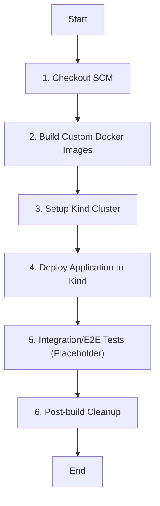
*   **Stage 'Build Custom Docker Images' :** Construit une image Docker pour chaque microservice, en la taguant avec l'ID de build unique de Jenkins (`env.BUILD_ID`).
*   **Stage 'Setup Kind Cluster' :** Crée un cluster Kind propre pour chaque build, puis charge les images fraîchement construites ainsi que les images publiques requises. Cela garantit un environnement de test totalement isolé.
*   **Stage 'Deploy Application to Kind' :** Utilise `envsubst` pour remplacer les placeholders (`${IMAGE_PREFIX}`, `${IMAGE_TAG}`) dans le `kubernetes-manifests.yaml` avec les valeurs du build actuel, puis applique ce manifeste rendu au cluster. Il attend ensuite que tous les déploiements soient terminés avec `kubectl rollout status`.
*   **Stage 'Integration/E2E Tests' :** Un placeholder pour de futurs tests qui s'exécuteraient contre l'environnement fraîchement déployé sur Kind.

---

### **6. Diagrammes Récapitulatifs des Flux Transverses**

#### **6.1. Flux de Création d'un Utilisateur et Propagation Asynchrone**
Ce diagramme montre comment la création d'un utilisateur dans `auth-service` déclenche un événement Kafka qui est consommé par `order-service` pour mettre à jour sa table dénormalisée.

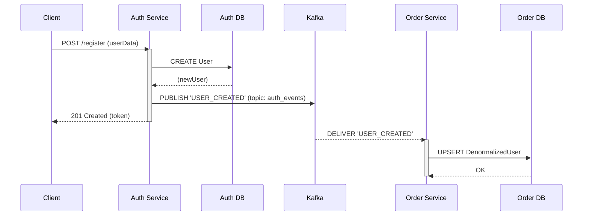

#### **6.2. Flux d'Association d'un Panier Invité à un Utilisateur Connecté**
Ce flux, déjà présenté dans la section `cart-service`, est l'un des plus importants pour l'expérience utilisateur et montre la coordination entre le frontend et les services backend. Il est inclus ici pour sa pertinence globale. (Cf. Diagramme 3.1.4.B).

---

### **7. Conclusion et Perspectives**

#### **7.1. Bilan de la Phase MVP**
La phase MVP est une réussite complète. Nous avons non seulement développé l'ensemble des fonctionnalités métiers essentielles pour une plateforme e-commerce (catalogue, recherche, authentification, panier, commande), mais nous avons également construit une infrastructure de développement et de déploiement mature, automatisée et basée sur les standards de l'industrie (Kubernetes, Jenkins).

L'architecture microservices a prouvé sa flexibilité, permettant l'ajout de nouveaux services complexes sans perturber l'existant. Les choix technologiques (Redis pour la volatilité, PostgreSQL pour la persistance, Kafka pour la résilience) se sont avérés pertinents et bien adaptés aux besoins spécifiques de chaque service.

#### **7.2. Pistes d'Amélioration et Travaux Futurs**
Le projet est maintenant une base solide pour de futurs développements. Les prochaines étapes pourraient inclure :

*   **Intégration d'un Frontend :** Développer une application cliente (ex: React, Vue.js) qui consommera l'API Gateway.
*   **Renforcement des Tests :** Compléter les tests unitaires et d'intégration, et implémenter de véritables tests de bout en bout (E2E) dans le pipeline Jenkins.
*   **Observabilité :** Intégrer une stack de monitoring et de logging (ex: Prometheus, Grafana, Fluentd/Loki) pour surveiller la santé et les performances des services en temps réel.
*   **Sécurité :** Renforcer la sécurité en utilisant des secrets Kubernetes pour les mots de passe et les clés API, mettre en place des Network Policies, et auditer les permissions.
*   **Nouvelles Fonctionnalités :** Ajouter des services pour les avis clients, la gestion des paiements avec un prestataire externe (Stripe), les notifications, etc.

Ce projet constitue une fondation technique robuste et scalable, prête à évoluer vers une plateforme e-commerce complète et de production.
