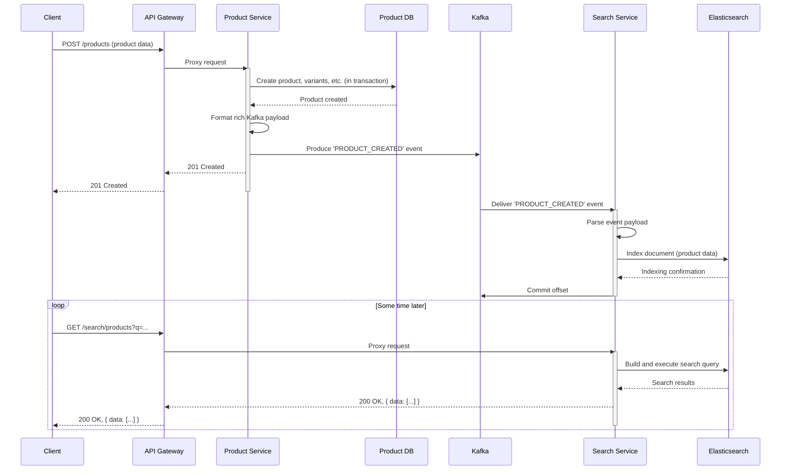

Of course. I have assimilated the entire project structure and its contents. Here is the comprehensive, highly detailed report on the expanded e-commerce platform, complete with numerous Mermaid diagrams as requested.

***

## Comprehensive Report on the Architecture, Implementation, and Deployment of the LIRMM E-commerce Microservices Platform

**Project Version: 2.0 (Expanded Scope)**

**Stage de Master en Architecture des Systèmes Distribués**

**Presented by:**
HARCHE Samir

**Under the direction of:**
Dr. Abdelhak Djamel Seriai

**Date:** April 2024 (Updated Analysis)

***

### **Table of Contents**

1.  **Executive Summary**
    *   1.1. Project Evolution
    *   1.2. Key Architectural Tenets
    *   1.3. Report Objectives
2.  **Global System Architecture**
    *   2.1. Component Overview
    *   2.2. Core Communication Patterns
    *   2.3. System-Wide Architecture Diagram
3.  **Core Infrastructure and Technology Stack**
    *   3.1. Containerization & Orchestration (Docker, Kubernetes/Kind)
    *   3.2. Service Mesh Infrastructure (Consul)
    *   3.3. Asynchronous Messaging (Apache Kafka)
    *   3.4. Data Persistence (PostgreSQL, Redis, Elasticsearch)
    *   3.5. CI/CD & Automation (Jenkins)
4.  **Service Deep Dive: `api-gateway`**
    *   4.1. Purpose and Responsibilities
    *   4.2. Routing and Dynamic Proxying
    *   4.3. Error Handling and Resilience
5.  **Service Deep Dive: `auth-service`**
    *   5.1. Purpose and Responsibilities
    *   5.2. Expanded Security Model: RBAC
    *   5.3. Data Model (Prisma Schema)
    *   5.4. Event-Driven Integration (Kafka Producer)
    *   5.5. Core Endpoints and Logic
6.  **Service Deep Dive: `product-service`**
    *   6.1. Purpose and Responsibilities
    *   6.2. Granular Data Model (Products, Categories, Variants, Stock)
    *   6.3. API Structure and Nested Resources
    *   6.4. Event-Driven Integration (Kafka Producer)
7.  **Service Deep Dive: `image-service`**
    *   7.1. Purpose and Responsibilities
    *   7.2. Storage and Delivery Strategy
    *   7.3. File Handling with Multer
8.  **Service Deep Dive: `search-service`**
    *   8.1. Purpose and Responsibilities
    *   8.2. Elasticsearch Indexing and Mapping
    *   8.3. Event-Driven Integration (Kafka Consumer)
    *   8.4. Advanced Search Querying
9.  **Service Deep Dive: `cart-service` (New)**
    *   9.1. Purpose and Responsibilities
    *   9.2. Technology Choice: Redis
    *   9.3. Data Structure in Redis
    *   9.4. Cart Lifecycle Management
10. **Service Deep Dive: `order-service` (New)**
    *   10.1. Purpose and Responsibilities
    *   10.2. Data Model & Denormalization Strategy
    *   10.3. Inter-Service Communication and Transactions
    *   10.4. Event-Driven Integration (Kafka Consumer)
11. **Key Workflow Analysis (Sequence Diagrams)**
    *   11.1. User Registration with RBAC and Kafka Event
    *   11.2. Inter-Service Request with Permission Check
    *   11.3. Full Product Creation, Indexing, and Search
    *   11.4. Shopping Cart Lifecycle: Guest to Logged-in User
    *   11.5. **Critical Workflow:** Order Placement and Stock Adjustment
12. **Development and Deployment (DevOps)**
    *   12.1. Local Development Environment (`docker-compose`)
    *   12.2. Staging/CI Environment (Kubernetes with Kind)
    *   12.3. CI/CD Pipeline (`Jenkinsfile`) Analysis
    *   12.4. Kubernetes Manifests Analysis
13. **Conclusion and Future Work**
    *   13.1. Summary of Achievements
    *   13.2. Potential Improvements and Next Steps

***

### 1. Executive Summary

#### 1.1. Project Evolution
This report details the significant evolution of the e-commerce platform from a foundational set of microservices to a more feature-complete, robust, and production-ready system. The initial components (`api-gateway`, `auth-service`, `product-service`, `image-service`, `search-service`) have been substantially enhanced. Critically, two new core business services have been introduced: a **`cart-service`** for managing user shopping carts and an **`order-service`** for handling the entire order lifecycle.

Furthermore, the project has matured beyond simple containerization. It now features a sophisticated Role-Based Access Control (RBAC) system, a fully automated CI/CD pipeline leveraging **Jenkins**, and a complete deployment strategy for **Kubernetes** (using Kind for local/staging environments).

#### 1.2. Key Architectural Tenets
The architecture remains firmly rooted in modern distributed systems principles:
*   **Microservice Architecture:** Each business domain is encapsulated in an independent, deployable service.
*   **Event-Driven Architecture (EDA):** Apache Kafka is used to decouple services, enabling asynchronous communication for processes like search indexing and data denormalization, thereby increasing resilience and scalability.
*   **Centralized Entry Point:** An API Gateway provides a single, unified interface for clients, handling routing and cross-cutting concerns.
*   **Dynamic Service Discovery:** Consul enables services to locate each other dynamically, eliminating hardcoded dependencies and facilitating scaling.
*   **Infrastructure as Code (IaC):** `docker-compose.yml` for local development and declarative Kubernetes manifests (`kubernetes-manifests.yaml`) for staging/production define the entire application stack in code.
*   **Polyglot Persistence:** The system now utilizes the best data store for the job: PostgreSQL for relational transactional data, Redis for ephemeral cart data, and Elasticsearch for complex search and analytics.

#### 1.3. Report Objectives
This document serves as a comprehensive technical blueprint of the current system. It aims to:
*   Document the architecture and responsibilities of every new and updated service.
*   Provide detailed diagrams of system architecture, data models, and key interaction workflows.
*   Analyze the CI/CD and Kubernetes deployment strategy.
*   Serve as a technical reference for current and future development.

***

### 2. Global System Architecture

#### 2.1. Component Overview
The platform is now composed of seven distinct microservices, supported by a robust infrastructure layer.

*   **Core Services:**
    *   `api-gateway`: The single ingress point.
    *   `auth-service`: Manages users, roles, permissions, and JWTs.
    *   `product-service`: The master source for product catalog, categories, variants, and stock.
    *   `image-service`: Manages image uploads and serving.
    *   `search-service`: Provides full-text search capabilities.
    *   `cart-service`: Manages ephemeral shopping carts.
    *   `order-service`: Orchestrates the order placement and fulfillment process.
*   **Infrastructure Components:**
    *   **PostgreSQL:** Three separate databases (`auth_db`, `product_db`, `order_db`) ensure data isolation between services.
    *   **Elasticsearch:** A single-node cluster for indexing product data.
    *   **Redis:** A key-value store for persisting cart data.
    *   **Apache Kafka & Zookeeper:** The backbone of the event-driven communication.
    *   **Consul:** The service registry and discovery agent.

#### 2.2. Core Communication Patterns
1.  **Synchronous (REST API):** Used for immediate request/response interactions.
    *   Client -> API Gateway -> Service (e.g., fetching product details).
    *   Service -> Service (e.g., `order-service` calling `product-service` to adjust stock).
2.  **Asynchronous (Event-Driven via Kafka):** Used for decoupling services and handling background tasks.
    *   `auth-service` -> Kafka -> `order-service` (User profile created/updated).
    *   `product-service` -> Kafka -> `search-service` (Product created/updated/deleted for indexing).
    *   `product-service` -> Kafka -> `order-service` (Denormalized product data updated).

#### 2.3. System-Wide Architecture Diagram
This diagram illustrates the high-level interactions between all components in the ecosystem.


***

### 3. Core Infrastructure and Technology Stack

This section details the role of each foundational technology.

*   **Docker:** Used to package each microservice and its dependencies into a standardized, portable container image (`Dockerfile`). This ensures consistency across all environments.
*   **Kubernetes (via Kind):** Chosen for staging and CI environments. Kind (Kubernetes in Docker) provides a lightweight, local Kubernetes cluster. The `kubernetes-manifests.yaml` file declaratively defines the desired state of the entire application, including Deployments, Services (with `NodePort` for external access), and resource management. `initContainers` are used effectively for database schema migrations.
*   **Jenkins:** The automation server orchestrating the CI/CD pipeline. The `Jenkinsfile` defines the entire build-to-deploy process, including building Docker images, spinning up a fresh Kind cluster, loading images, and applying Kubernetes manifests.
*   **Consul:** Acts as the service registry. Each microservice registers itself with the Consul agent upon startup and deregisters gracefully on shutdown. This allows the API Gateway and other services to discover network locations of their dependencies dynamically using `findService`.
*   **Apache Kafka:** The asynchronous messaging backbone. Two primary topics are used:
    *   `auth_events`: For broadcasting user creation and updates.
    *   `product_events`: For broadcasting product catalog changes.
    This event-driven approach decouples services, preventing a failure in a non-essential downstream service (like `search-service`) from impacting a critical upstream service (`product-service`).
*   **PostgreSQL:** The chosen relational database for transactional data. Crucially, data is segregated into three distinct databases (`auth_db`, `product_db`, `order_db`), enforcing the microservice principle of data isolation.
*   **Redis:** An in-memory key-value store used by the `cart-service`. Its high performance is ideal for the ephemeral and frequently accessed nature of shopping cart data. A Time-To-Live (TTL) is set on carts to automatically clean up abandoned guest carts.
*   **Elasticsearch:** A powerful search engine used by the `search-service`. It ingests product data from Kafka and provides advanced full-text search capabilities, including filtering, fuzziness (typo tolerance), and complex aggregations that would be inefficient in a relational database.

***

### 4. Service Deep Dive: `api-gateway`

*   **Purpose & Responsibilities:** The single point of entry for all external client requests. Its primary roles are:
    1.  **Request Routing:** Dynamically route incoming requests to the appropriate downstream microservice based on the URL path (e.g., `/auth/*` -> `auth-service`).
    2.  **Service Discovery:** Integrates with Consul to find the current network location of healthy service instances.
    3.  **Cross-Cutting Concerns (Future):** It is the ideal place to implement concerns like rate limiting, global authentication checks (though currently delegated), and request logging.
*   **Routing and Dynamic Proxying:** Implemented using `http-proxy-middleware`. A `createDynamicProxy` helper function encapsulates the logic to look up a service via `findService` and forward the request. It also includes path rewriting for services like `image-service` (`/images/file.jpg` -> `/file.jpg`).
*   **Error Handling and Resilience:** The proxy includes an `onError` handler that catches network errors (e.g., `ECONNREFUSED`) when a downstream service is unavailable, translating them into proper HTTP status codes like `503 Service Unavailable` or `502 Bad Gateway`.

***

### 5. Service Deep Dive: `auth-service`

*   **Purpose & Responsibilities:** This service is the authority for all identity and access management concerns. Its responsibilities have been significantly expanded.
    1.  **User Management:** Handles user registration and login.
    2.  **Authentication:** Issues and validates JSON Web Tokens (JWTs).
    3.  **Authorization (RBAC):** Manages a sophisticated system of Roles and Permissions.
    4.  **Event Sourcing:** Publishes user lifecycle events (`USER_CREATED`, `USER_UPDATED`, `USER_DELETED`) to Kafka.
*   **Expanded Security Model: RBAC:**
    *   The service now implements a full Role-Based Access Control system.
    *   **Permissions:** Granular actions that can be performed (e.g., `create:product`, `read:order`).
    *   **Roles:** Collections of permissions that can be assigned to users (e.g., `ADMIN`, `Supervisor`, `Customer`).
    *   **JWT Payload:** The JWT payload is enriched to include the user's role and their full list of permissions, allowing other services to make local, efficient authorization decisions after validating the token.
*   **Data Model (Prisma Schema):**

    ```mermaid
    erDiagram
        USER {
            string id PK
            string name
            string email UK
            string password
            boolean isActive
            string profileImage
            string roleId FK
        }
        ROLE {
            string id PK
            string name UK
            string description
        }
        PERMISSION {
            string id PK
            string name UK
            string description
        }
        ROLE_PERMISSION {
            string roleId PK, FK
            string permissionId PK, FK
        }

        USER ||--o{ ROLE : "has"
        ROLE ||--|{ ROLE_PERMISSION : "maps to"
        PERMISSION ||--|{ ROLE_PERMISSION : "is mapped by"
    ```
*   **Event-Driven Integration (Kafka Producer):** When a user is created or their core details (name, image) are updated, the `auth-service` publishes an event to the `auth_events` Kafka topic. This allows other services, like the `order-service`, to maintain a denormalized, up-to-date local copy of user information for enriching order data without needing to query the `auth-service` synchronously for every request.
*   **Core Endpoints and Logic:**
    *   `/register`, `/login`: Standard authentication flows.
    *   `/me`: Returns details for the authenticated user.
    *   `/validate`: **Internal-facing endpoint.** A critical component for inter-service security. Other services send a JWT to this endpoint to confirm its validity and receive the decoded, trusted user payload in return.
    *   `/users`, `/roles`, `/permissions`: Full CRUD APIs for managing the RBAC system, protected by permissions.

***

### 6. Service Deep Dive: `product-service`

*   **Purpose & Responsibilities:** The single source of truth for the entire product catalog.
    1.  **Product CRUD:** Manages core product data.
    2.  **Taxonomy Management:** Manages hierarchical categories.
    3.  **Variant Management:** Manages product variants (e.g., different sizes, colors).
    4.  **Inventory Management:** The master service for tracking stock levels via a `StockMovement` ledger model.
    5.  **Event Sourcing:** Publishes detailed product change events to the `product_events` Kafka topic.
*   **Granular Data Model (Products, Categories, Variants, Stock):** The schema is highly relational and normalized, providing a robust foundation for product data.

    ```mermaid
    erDiagram
        PRODUCT {
            string id PK
            string sku UK
            string name
            string description
            boolean isActive
        }
        CATEGORY {
            string id PK
            string slug UK
            string name
            string parentId FK
        }
        PRODUCT_IMAGE {
            string id PK
            string productId FK
            string imageUrl
            boolean isPrimary
        }
        VARIANT {
            string id PK
            string productId FK
            json attributes
            decimal price
            int stockQuantity
        }
        PRODUCT_CATEGORY {
            string productId PK, FK
            string categoryId PK, FK
        }
        STOCK_MOVEMENT {
            string id PK
            string variantId FK
            int changeQuantity
            StockMovementType type
            string reason
        }

        PRODUCT ||--|{ PRODUCT_IMAGE : "has"
        PRODUCT ||--|{ VARIANT : "has"
        PRODUCT ||--o{ PRODUCT_CATEGORY : "belongs to"
        CATEGORY ||--o{ PRODUCT_CATEGORY : "contains"
        CATEGORY ||--o{ CATEGORY : "has child"
        VARIANT ||--|{ STOCK_MOVEMENT : "logs"
    ```
*   **API Structure and Nested Resources:** The API is well-structured, using nested routes for clarity (e.g., `/products/{productId}/variants`). This makes the API intuitive and RESTful.
*   **Event-Driven Integration (Kafka Producer):** Any change to a product, its variants, categories, or images triggers the `fetchAndFormatProductForKafka` helper. This function assembles a comprehensive, denormalized payload of the entire product aggregate and publishes it as a `PRODUCT_CREATED` or `PRODUCT_UPDATED` event. This rich event payload allows consumers like `search-service` and `order-service` to rebuild their local state without making additional synchronous calls.

***

### 7. Service Deep Dive: `image-service`
This service remains focused and well-defined.
*   **Purpose & Responsibilities:** Solely responsible for handling the upload, storage, and retrieval of image files.
*   **Storage and Delivery Strategy:** It uses a persistent Docker volume (`image-uploads-data`) mapped into its container. Uploaded files are given a unique UUID-based name to prevent collisions. It serves these images statically via an `express.static` middleware.
*   **File Handling with Multer:** `multer` is configured to handle `multipart/form-data` requests, enforce file type and size limits, and save files to the designated upload directory.

***

### 8. Service Deep Dive: `search-service`
*   **Purpose & Responsibilities:** To provide a fast, relevant, and powerful search experience.
*   **Elasticsearch Indexing and Mapping:** The `elasticsearch.js` configuration defines a detailed mapping for the `products` index. This is critical for search performance and accuracy. Key features include:
    *   Using `keyword` type for fields that require exact matching/filtering (like `sku`, `category_slugs`).
    *   Using `text` type with custom analyzers for fields requiring full-text search (like `name`, `description`).
    *   Using `nested` type for `variants` and `categories` to allow for querying within these complex objects independently.
*   **Event-Driven Integration (Kafka Consumer):** This service is a primary consumer of the `product_events` Kafka topic. Upon receiving an event, it uses the rich payload to create, update, or delete the corresponding document in Elasticsearch, keeping the search index synchronized with the master product data.
*   **Advanced Search Querying:** The search controller demonstrates a sophisticated use of Elasticsearch's Query DSL. It dynamically builds a `bool` query, combining `must` clauses for text matching (which affects the relevance score) and `filter` clauses for non-scoring, exact matches (which are highly cacheable and performant).

***

### 9. Service Deep Dive: `cart-service` (New)

*   **Purpose & Responsibilities:** Manages user shopping carts, which are inherently ephemeral and session-based.
*   **Technology Choice: Redis:** Redis was chosen for its high-performance, in-memory key-value storage capabilities, making it a perfect fit for this use case. The `ioredis` client is used, which provides robust features like automatic reconnection.
*   **Data Structure in Redis:** Each cart is stored as a single JSON string under a key prefixed with `cart:`, e.g., `cart:uuid-for-cart`. The value is a JSON object containing the cart ID, an optional `userId`, and an array of item objects.
*   **Cart Lifecycle Management:**
    1.  A guest user gets a new cart with a `null` userId.
    2.  A TTL (Time-To-Live) is set on the cart key in Redis, ensuring abandoned carts are automatically purged.
    3.  When a guest logs in, the client calls the `/associate` endpoint, which updates the `userId` field within the existing cart in Redis. The TTL is also refreshed, persisting the cart for the logged-in user.

***

### 10. Service Deep Dive: `order-service` (New)

*   **Purpose & Responsibilities:** The transactional core of the e-commerce flow. It handles:
    1.  Orchestrating order creation.
    2.  Persisting order history.
    3.  Managing order statuses.
    4.  Denormalizing related data for performance.
*   **Data Model & Denormalization Strategy:** The service maintains its own `order_db`.

    ```mermaid
    erDiagram
        ORDER {
            string id PK
            string userId FK "nullable"
            string guestEmail "nullable"
            OrderStatus status
            decimal totalAmount
        }
        ORDER_ITEM {
            string id PK
            string orderId FK
            string productId
            string variantId
            string productName "denormalized"
            decimal priceAtTimeOfOrder "denormalized"
            int quantity
        }
        DENORMALIZED_PRODUCT {
            string id PK
            string name
            string sku
            string imageUrl
        }
        DENORMALIZED_USER {
            string id PK
            string name
            string email
        }

        ORDER ||--|{ ORDER_ITEM : "contains"
        ORDER }o..o| DENORMALIZED_USER : "references"
        ORDER_ITEM }o..o| DENORMALIZED_PRODUCT : "references"
    ```
    To avoid costly cross-service joins at read time, the `order-service` subscribes to Kafka events from `auth-service` and `product-service` to maintain local, denormalized tables (`denormalized_users`, `denormalized_products`). When an order is displayed, this local data is used to enrich the response quickly.

*   **Inter-Service Communication and Transactions:** Order creation is a critical, multi-step process.
    1.  It is wrapped in a `prisma.$transaction` block to ensure atomicity.
    2.  Within the transaction, it makes a synchronous REST API call to `product-service`'s `/stock/adjust/:variantId` endpoint to decrement stock.
    3.  If the stock adjustment fails (e.g., insufficient stock), the API call throws an error, which causes the entire Prisma transaction to roll back, preventing the order from being created. This is a classic example of a distributed transaction pattern.

***

### 11. Key Workflow Analysis (Sequence Diagrams)

#### 11.1. User Registration with RBAC and Kafka Event


#### 11.2. Inter-Service Request with Permission Check

This shows the `product-service` checking permissions for a protected action.


#### 11.3. Full Product Creation, Indexing, and Search



#### 11.4. Shopping Cart Lifecycle: Guest to Logged-in User


#### 11.5. Critical Workflow: Order Placement and Stock Adjustment


***

### 12. Development and Deployment (DevOps)

The project demonstrates a mature DevOps approach, supporting both local development and automated CI/CD deployment.

#### 12.1. Local Development Environment (`docker-compose`)
The `docker-compose.yml` file orchestrates the entire stack for local development.
*   **Services:** Defines all 7 microservices and all 6 infrastructure components (3 DBs, Kafka, Zookeeper, Elasticsearch, Redis, Consul).
*   **Hot Reloading:** The `develop: watch:` directive is used for all Node.js services. This allows Docker to automatically synchronize code changes from the host into the container and restart the Node.js process, providing a seamless and efficient development experience.
*   **Health Checks:** Robust health checks are defined for all infrastructure components, ensuring that dependent services only start after their dependencies are healthy.

#### 12.2. Staging/CI Environment (Kubernetes with Kind)
The `kind-deployment/` directory contains the configuration for deploying the entire stack to a Kubernetes cluster.
*   `kind-cluster-config.yaml`: Defines the Kind cluster itself, including crucial `extraPortMappings`. These mappings expose the Kubernetes `NodePort` services to the host machine, making it possible to access the API Gateway, Consul UI, and databases from `localhost`.
*   `setup-kind.sh`: A helper script that automates the entire local Kubernetes deployment process: building images, creating the cluster, loading images into the cluster's registry, and applying the manifests.

#### 12.3. CI/CD Pipeline (`Jenkinsfile`) Analysis
The `Jenkinsfile` defines a declarative pipeline that fully automates testing and deployment to the Kind staging environment.


*   **Dynamic Configuration:** The pipeline is parameterized using environment variables (`IMAGE_TAG`, `KIND_CLUSTER_NAME`) for flexibility.
*   **Ephemeral Environments:** The pipeline creates a fresh, clean Kind cluster for every build (`kind delete cluster ... || true`), ensuring that tests run in a predictable and isolated environment.
*   **Image Management:** It builds all custom service images, tags them with the unique build ID, and uses `kind load docker-image` to make them available inside the cluster without needing an external Docker registry.
*   **Deployment:** It uses `envsubst` to substitute the correct image tags into the `kubernetes-manifests.yaml` template before applying it with `kubectl apply`.
*   **Health & Stability:** It includes a `timeout` block and `kubectl rollout status` commands to patiently wait for all deployments to become ready before proceeding, a critical step for stability.

#### 12.4. Kubernetes Manifests Analysis
The `kubernetes-manifests.yaml` is a comprehensive file defining all Kubernetes resources.
*   **Deployments:** Each microservice and stateful component has its own Deployment, which manages its Pod replicas.
*   **Services:** Each Deployment is exposed internally via a `ClusterIP` Service (e.g., `auth-db-svc`). This allows services within the cluster to communicate using stable DNS names.
*   **NodePorts:** Key services (like the API Gateway, databases, Consul UI) have their Service type set to `NodePort`, which makes them accessible from outside the Kind cluster for debugging and testing.
*   **Init Containers:** A best-practice pattern is used for services with databases (`auth-service`, `product-service`, `order-service`). An `initContainer` runs *before* the main application container. It contains the Prisma CLI and is responsible for running `prisma db push` and `prisma db seed`, ensuring the database schema is correct and seeded before the application attempts to connect. This prevents race conditions and startup failures.
*   **Downward API:** The `POD_IP` and `POD_HOSTNAME` environment variables are injected into service containers using the Kubernetes Downward API. This is crucial for Consul, allowing each pod to register itself with its unique, routable pod IP and a unique service ID, which is essential for correct health checking and instance identification.

***

### 13. Conclusion and Future Work

#### 13.1. Summary of Achievements
This project has successfully evolved into a sophisticated, feature-rich microservices platform. The architecture is sound, leveraging modern principles of distributed systems, event-driven design, and container orchestration. The addition of the cart and order services completes the core e-commerce workflow. The implementation of a full RBAC security model and a robust Jenkins-based CI/CD pipeline for Kubernetes demonstrates a high level of technical maturity, moving the project significantly closer to a production-grade system.

#### 13.2. Potential Improvements and Next Steps
1.  **Distributed Tracing:** Implement a distributed tracing system (e.g., Jaeger, OpenTelemetry) to trace requests as they flow through multiple services. This is invaluable for debugging and performance analysis in a microservices environment.
2.  **Centralized Logging:** Aggregate logs from all services into a centralized logging platform (e.g., ELK Stack - Elasticsearch, Logstash, Kibana, or EFK Stack with Fluentd).
3.  **API Gateway Enhancements:** Move authentication checks (JWT validation) from individual services to the API Gateway. The gateway can validate the token once and pass the trusted user payload downstream via request headers.
4.  **Kafka Topic Granularity:** Consider splitting `product_events` into more granular topics (e.g., `product_catalog_events`, `product_inventory_events`) if different consumers are only interested in subsets of the data.
5.  **Testing:** Expand the test suites, particularly adding true end-to-end tests in the Jenkins pipeline that interact with the deployed application via the API Gateway's NodePort.
6.  **Helm Charts:** For more complex Kubernetes deployments, migrate the raw YAML manifests to Helm charts to improve parameterization, reusability, and lifecycle management.
