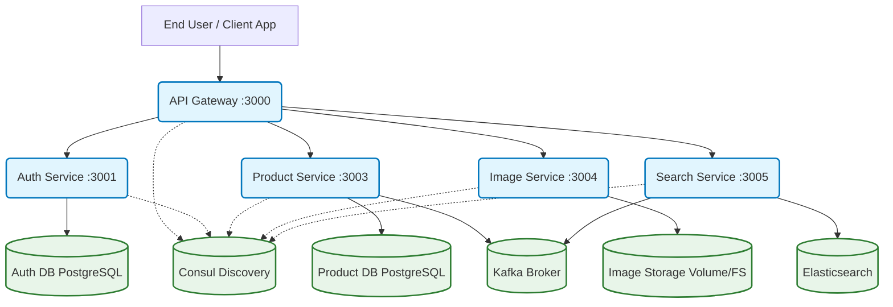
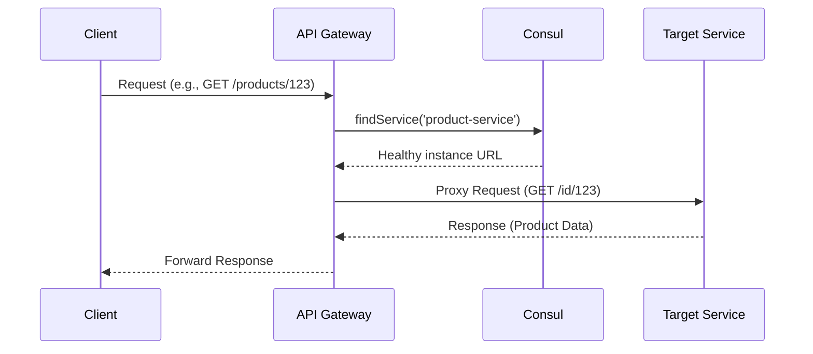
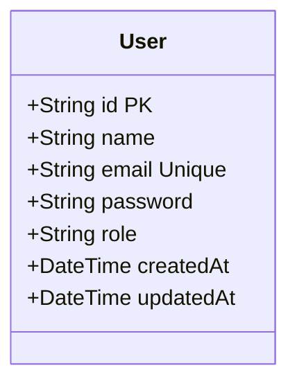
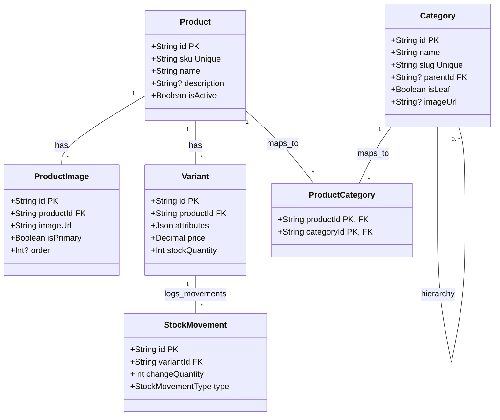
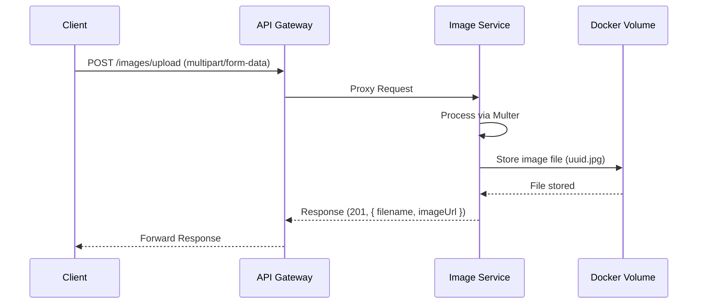
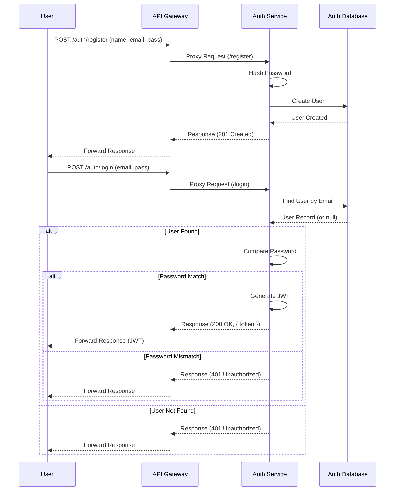
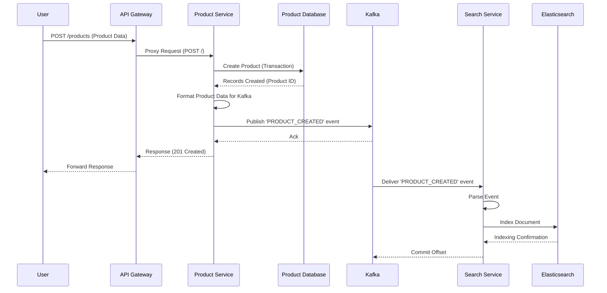
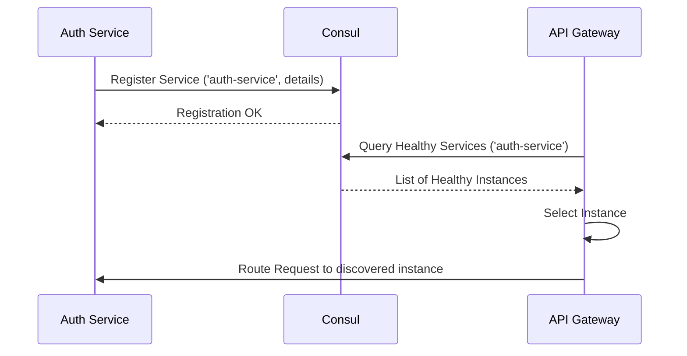
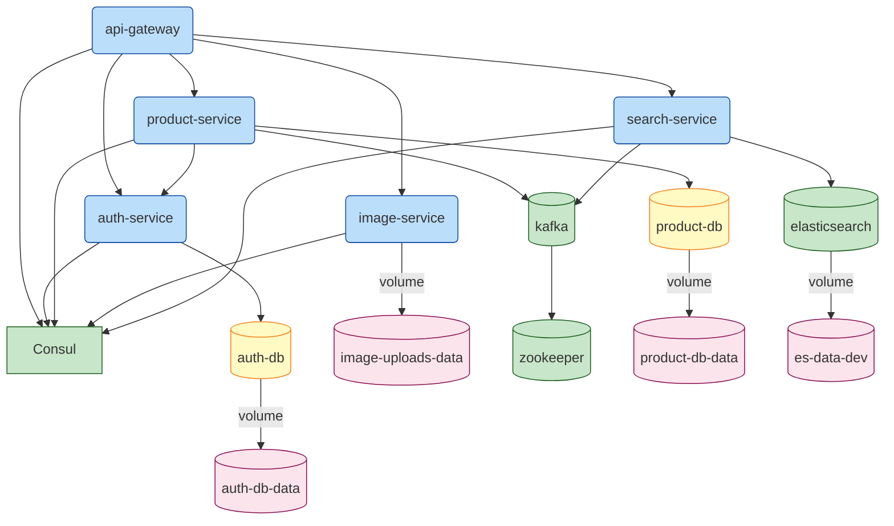

# Graduation Thesis Presentation

## Development of a Microservices-Based E-commerce Backend System

**Presented By:** [Your Name]  
**Supervisor:** [Your Supervisor's Name]  
**Institution:** [Your Institution Name]  
**Date:** [Date of Presentation]

---

## 1. Abstract

This thesis presents the design, implementation, and evaluation of a scalable and resilient backend system for an e-commerce platform, architected using microservices principles. The system decomposes core e-commerce functionalities—authentication, product catalog management, image handling, and search—into independently deployable services. Key technologies employed include Node.js (Express.js), PostgreSQL with Prisma ORM, Apache Kafka for asynchronous event streaming, Elasticsearch for optimized product searching, Consul for service discovery, and Docker for containerization. The architecture emphasizes loose coupling, fault isolation, and technology diversity, enabling independent scaling and development cycles for each service. This presentation details the system architecture, technology stack, service interactions, data flow, deployment strategy, and discusses the achieved benefits and potential challenges of the microservices approach in this context.

---

## 2. Introduction

*   **Problem Domain:** Traditional monolithic e-commerce backends often face challenges related to scalability, maintainability, fault tolerance, and technology lock-in as complexity grows.
*   **Proposed Solution:** A microservices architecture addresses these challenges by breaking down the application into smaller, independent, and specialized services.
*   **Project Goals:**
    *   Design and implement a robust backend for a typical e-commerce platform.
    *   Leverage microservices principles for modularity and scalability.
    *   Implement core functionalities: Authentication, Product Catalog, Image Management, Search.
    *   Ensure service discovery and resilience.
    *   Utilize asynchronous communication for decoupling critical processes (e.g., search indexing).
    *   Containerize services for consistent deployment.
*   **Scope:** Focus on the backend infrastructure, core service implementation, inter-service communication, and deployment aspects. Frontend and advanced features (e.g., complex order management, payment gateways) are outside the primary scope.

---

## 3. Background & Related Work

*   **Microservices Architecture:**
    *   Definition: An architectural style structuring an application as a collection of small, autonomous services modeled around a business domain.
    *   Benefits: Scalability, Resilience, Technology Diversity, Independent Deployment, Faster Development Cycles.
    *   Challenges: Distributed System Complexity, Network Latency, Data Consistency, Monitoring Overhead, Testing Complexity.
*   **Key Enabling Technologies:**
    *   **Containerization (Docker):** Packaging applications and dependencies, ensuring consistency across environments.
    *   **Service Discovery (Consul):** Dynamically locating service instances in a distributed environment.
    *   **API Gateways:** Single entry point, request routing, cross-cutting concerns (authentication, rate limiting).
    *   **Asynchronous Messaging (Kafka):** Decoupling services, enabling event-driven workflows, improving resilience.
    *   **Search Engines (Elasticsearch):** Providing efficient full-text search capabilities beyond traditional database queries.
    *   **ORMs (Prisma):** Simplifying database interactions and migrations.

---

## 4. System Architecture

### 4.1. High-Level Overview

The system comprises several independent microservices communicating via synchronous (REST API) and asynchronous (Kafka) methods, coordinated through an API Gateway and service discovery.

### 4.2. Components

* **API Gateway (api-gateway)**: Single entry point, request routing, service discovery lookup.
* **Authentication Service (auth-service)**: User identity management (registration, login, JWT, validation).
* **Product Service (product-service)**: Manages product catalog (products, categories, variants, stock, image metadata), publishes Kafka events.
* **Image Service (image-service)**: Handles image upload, storage, retrieval.
* **Search Service (search-service)**: Consumes Kafka events, indexes products in Elasticsearch, provides search API.
* **Consul**: Service registry and discovery.
* **Kafka**: Event streaming platform for async communication.
* **Elasticsearch**: Search engine for product indexing and querying.
* **PostgreSQL Databases**: Persistence for auth-service and product-service.
* **Docker & Docker Compose**: Containerization and development environment orchestration.
* **Jenkins (Jenkinsfile)**: CI/CD pipeline definition.

---

## 5. Technology Stack

* **Backend Framework**: Node.js with Express.js
* **Database**: PostgreSQL
* **ORM**: Prisma Client
* **Messaging Queue**: Apache Kafka (via kafkajs)
* **Search Engine**: Elasticsearch (via @elastic/elasticsearch)
* **Service Discovery**: HashiCorp Consul (via consul)
* **API Gateway Proxy**: http-proxy-middleware
* **Containerization**: Docker, Docker Compose
* **CI/CD**: Jenkins
* **Authentication**: JWT, bcrypt
* **File Uploads**: Multer

---

## 6. Service Details & Design

### 6.1. API Gateway (api-gateway)

* **Purpose**: Central entry point, routing, discovery integration.
* **Responsibilities**: Receive requests, discover services via Consul, route/proxy requests, health check (/health).
* **Key Components**: index.js, config/app.js, config/consul.js.
* **Diagram**: Request Routing Flow

### 6.2. Authentication Service (auth-service)

* **Purpose**: Handle user identity and access control.
* **Responsibilities**: Registration, login, JWT generation, profile info (/me), token validation (/validate), Consul registration.
* **Key Components**: index.js, config/app.js, config/prisma.js, config/consul.js, modules/auth, modules/user, middlewares/auth.js, prisma/schema.prisma.
* **Database Schema** (prisma/schema.prisma):

### 6.3. Product Service (product-service)

* **Purpose**: Manage the complete product catalog.
* **Responsibilities**: CRUD (Products, Categories, Variants, Image metadata), Stock management (StockMovement), Publish Kafka events, Consul registration, Auth token validation.
* **Key Components**: index.js, config/app.js, config/prisma.js, config/consul.js, kafka/producer.js, modules/*, middlewares/auth.js, prisma/schema.prisma.
* **Database Schema** (prisma/schema.prisma):

### 6.4. Image Service (image-service)

* **Purpose**: Handle storage and delivery of product images.
* **Responsibilities**: Accept uploads (Multer), validate, store (Docker volume), generate unique names, serve statically, Consul registration.
* **Key Components**: index.js, config/app.js, config/consul.js, middlewares/errorHandler.js, uploads/ directory.
* **Storage**: Docker volume (image-uploads-data) mapped to /app/uploads.
* **Diagram**: Image Upload Flow

### 6.5. Search Service (search-service)

* **Purpose**: Provide efficient full-text product search.
* **Responsibilities**: Consume Kafka events (product_events), Index product data in Elasticsearch (products index), Handle index setup, Expose search API (/search/products), Consul registration.
* **Key Components**: index.js, config/app.js, config/consul.js, config/elasticsearch.js, kafka/consumer.js, modules/search, middlewares/errorHandler.js.
* **Elasticsearch Index** (products): Mappings defined in config/elasticsearch.js for searchable fields.

---

## 7. Key Workflows & Interactions

### 7.1. User Registration & Login Flow

### 7.2. Product Creation & Search Indexing Flow

### 7.3. Service Discovery Flow (Example: API Gateway finding Auth Service)

---

## 8. Infrastructure & Deployment

### 8.1. Containerization (Docker)

* Each service packaged into a Docker image via Dockerfile.
* .dockerignore optimizes build context.
* Benefits: Consistency, Isolation, Portability.

### 8.2. Development Environment (Docker Compose)

* docker-compose.yml orchestrates multi-container setup for development.
* Defines services, infrastructure (DBs, Kafka, ES, Consul), network, volumes, ports, environment variables.
* Manages build context, dependencies (depends_on), health checks.
* Persistent data via named volumes.
* Hot-reloading via develop: watch:.
* Diagram: Docker Compose Services & Dependencies

### 8.3. CI/CD (Jenkins)

* Jenkinsfile defines pipeline automation.
* Typical Stages: Checkout -> Build Images -> Run Tests -> Push Images -> Deploy.
* Automates integration and deployment, improving consistency and speed.

---

## 9. Discussion

* **Benefits Achieved**: Modularity, Scalability, Resilience, Technology Flexibility, Independent Development potential.
* **Challenges & Considerations**: Distributed System Complexity, Eventual Consistency, Network Latency, Testing Complexity, Monitoring Overhead, Lack of Distributed Transactions (requires Sagas).
* **Future Work**: Implement Order/Payment Services, Distributed Tracing, Centralized Logging, Enhanced Security (Validation, Rate Limiting), Saga Pattern, Comprehensive Testing, Production Deployment Strategy (e.g., Kubernetes).

---

## 10. Conclusion

This project successfully implemented a microservices-based e-commerce backend, demonstrating the viability and benefits of the architecture. The decomposition into specialized services, coupled with technologies like Docker, Consul, Kafka, and Elasticsearch, provides a scalable, resilient, and flexible foundation. The event-driven approach ensures loose coupling for processes like search indexing. While challenges exist, the architecture effectively addresses the limitations of traditional monolithic systems for complex applications.

---

## 11. References

* Newman, S. (2015). Building Microservices. O'Reilly Media.
* Docker Documentation: https://docs.docker.com/
* Consul Documentation: https://www.consul.io/docs
* Kafka Documentation: https://kafka.apache.org/documentation/
* Elasticsearch Documentation: https://www.elastic.co/guide/index.html
* Prisma Documentation: https://www.prisma.io/docs/

---

## 12. Q & A

Thank You
