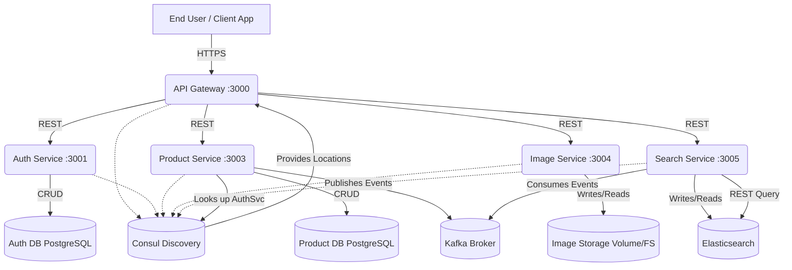
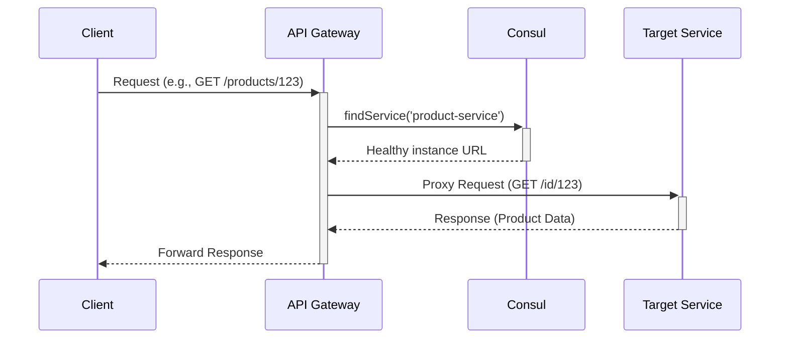
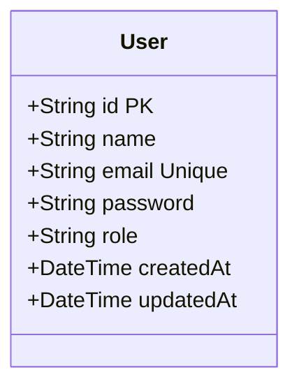
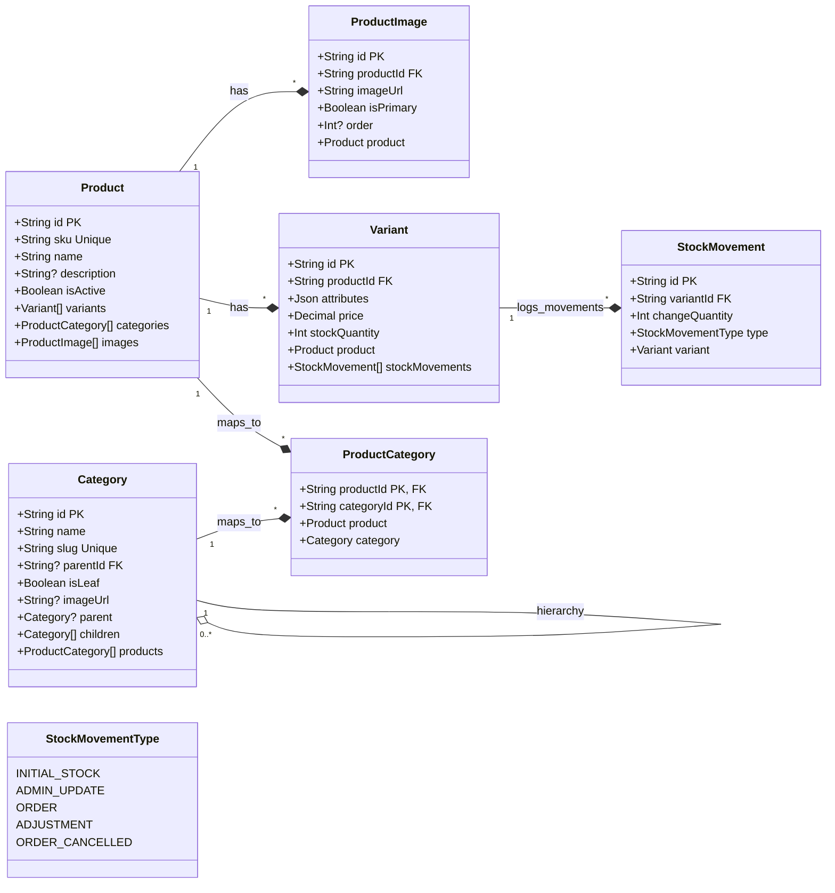
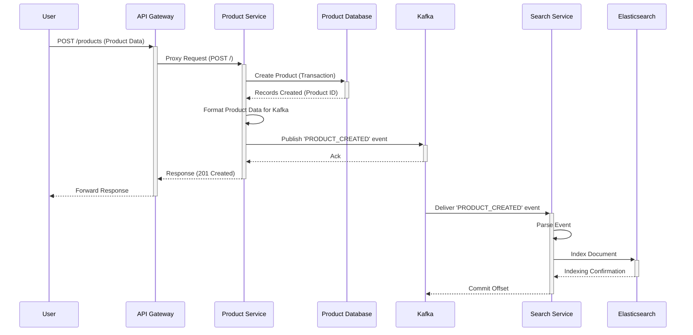
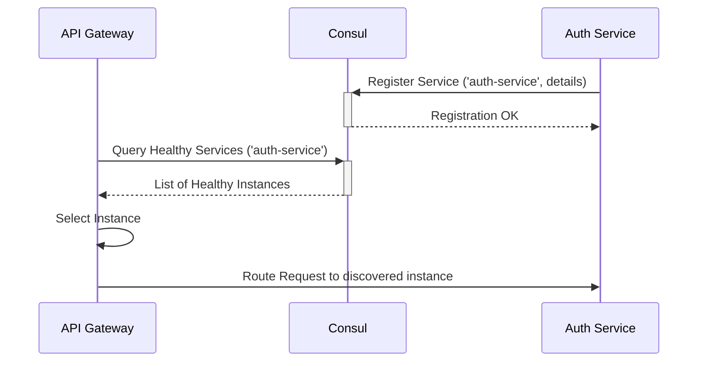
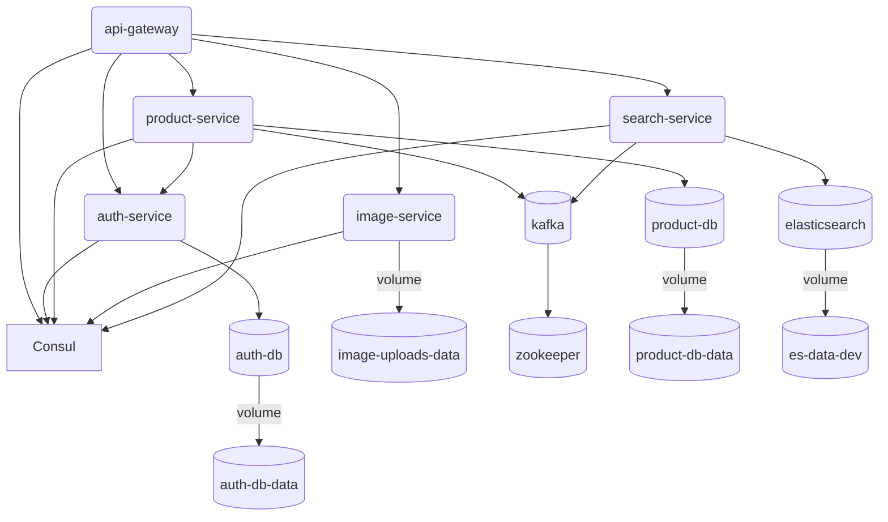

---

##  Introduction

* **Problem Domain:** Traditional monolithic e-commerce backends often face challenges related to scalability, maintainability, fault tolerance, and technology lock-in as complexity grows.
* **Proposed Solution:** A microservices architecture addresses these challenges by breaking down the application into smaller, independent, and specialized services.
* **Project Goals:**
  * Design and implement a robust backend for a typical e-commerce platform.
  * Leverage microservices principles for modularity and scalability.
  * Implement core functionalities: Authentication, Product Catalog, Image Management, Search.
  * Ensure service discovery and resilience.
  * Utilize asynchronous communication for decoupling critical processes (e.g., search indexing).
  * Containerize services for consistent deployment.
* **Scope:** Focus on the backend infrastructure, core service implementation, inter-service communication, and deployment aspects. Frontend and advanced features (e.g., complex order management, payment gateways) are outside the primary scope.

---

##  Background & Related Work

* **Microservices Architecture:**
  * Definition: An architectural style structuring an application as a collection of small, autonomous services modeled around a business domain.
  * Benefits: Scalability, Resilience, Technology Diversity, Independent Deployment, Faster Development Cycles.
  * Challenges: Distributed System Complexity, Network Latency, Data Consistency, Monitoring Overhead, Testing Complexity.
* **Key Enabling Technologies:**
  * **Containerization (Docker):** Packaging applications and dependencies, ensuring consistency across environments.
  * **Service Discovery (Consul):** Dynamically locating service instances in a distributed environment.
  * **API Gateways:** Single entry point, request routing, cross-cutting concerns (authentication, rate limiting).
  * **Asynchronous Messaging (Kafka):** Decoupling services, enabling event-driven workflows, improving resilience.
  * **Search Engines (Elasticsearch):** Providing efficient full-text search capabilities beyond traditional database queries.
  * **ORMs (Prisma):** Simplifying database interactions and migrations.

---

##  System Architecture

### 1. High-Level Overview

The system comprises several independent microservices communicating via synchronous (REST API) and asynchronous (Kafka) methods, coordinated through an API Gateway and service discovery.



### 2. Components

* **API Gateway (api-gateway)**: Single entry point, request routing, service discovery lookup.
* **Authentication Service (auth-service)**: User identity management (registration, login, JWT, validation).
* **Product Service (product-service)**: Manages product catalog (products, categories, variants, stock, image metadata), publishes Kafka events.
* **Image Service (image-service)**: Handles image upload, storage, retrieval.
* **Search Service (search-service)**: Consumes Kafka events, indexes products in Elasticsearch, provides search API.
* **Consul**: Service registry and discovery.
* **Kafka**: Event streaming platform for async communication.
* **Elasticsearch**: Search engine for product indexing and querying.
* **PostgreSQL Databases**: Persistence for auth-service and product-service.
* **Docker & Docker Compose**: Containerization and development environment orchestration.
* **Jenkins (Jenkinsfile)**: CI/CD pipeline definition.

---

##  Technology Stack

* **Backend Framework**: Node.js with Express.js
* **Database**: PostgreSQL
* **ORM**: Prisma Client
* **Messaging Queue**: Apache Kafka (via kafkajs)
* **Search Engine**: Elasticsearch (via @elastic/elasticsearch)
* **Service Discovery**: HashiCorp Consul (via consul)
* **API Gateway Proxy**: http-proxy-middleware
* **Containerization**: Docker, Docker Compose
* **CI/CD**: Jenkins
* **Authentication**: JWT, bcrypt
* **File Uploads**: Multer

---

##  Service Details & Design

### 1. API Gateway (api-gateway)

* **Purpose**: Central entry point, routing, discovery integration.
* **Responsibilities**: Receive requests, discover services via Consul, route/proxy requests, health check (/health).
* **Key Components**: index.js, config/app.js, config/consul.js.

**Diagram: Request Routing Flow**



### 2. Authentication Service (auth-service)

* **Purpose**: Handle user identity and access control.
* **Responsibilities**: Registration, login, JWT generation, profile info (/me), token validation (/validate), Consul registration.
* **Key Components**: index.js, config/app.js, config/prisma.js, config/consul.js, modules/auth, modules/user, middlewares/auth.js, prisma/schema.prisma.

**Database Schema (prisma/schema.prisma):**



### 6.3. Product Service (product-service)

* **Purpose**: Manage the complete product catalog.
* **Responsibilities**: CRUD (Products, Categories, Variants, Image metadata), Stock management (StockMovement), Publish Kafka events, Consul registration, Auth token validation.
* **Key Components**: index.js, config/app.js, config/prisma.js, config/consul.js, kafka/producer.js, modules/*, middlewares/auth.js, prisma/schema.prisma.

**Database Schema (prisma/schema.prisma):**



### 4. Image Service (image-service)

* **Purpose**: Handle storage and delivery of product images.
* **Responsibilities**: Accept uploads (Multer), validate, store (Docker volume), generate unique names, serve statically, Consul registration.
* **Key Components**: index.js, config/app.js, config/consul.js, middlewares/errorHandler.js, uploads/ directory.
* **Storage**: Docker volume (image-uploads-data) mapped to /app/uploads.

**Diagram: Image Upload Flow**


### 5. Search Service (search-service)

* **Purpose**: Provide efficient full-text product search.
* **Responsibilities**: Consume Kafka events (product_events), Index product data in Elasticsearch (products index), Handle index setup, Expose search API (/search/products), Consul registration.
* **Key Components**: index.js, config/app.js, config/consul.js, config/elasticsearch.js, kafka/consumer.js, modules/search, middlewares/errorHandler.js.
* **Elasticsearch Index (products)**: Mappings defined in config/elasticsearch.js for searchable fields.

---

##  Key Workflows & Interactions

### 1. User Registration & Login Flow

```mermaid
sequenceDiagram
    participant User
    participant APIGW as API Gateway
    participant AuthSvc as Auth Service
    participant AuthDB as Auth Database

    User->>+APIGW: POST /auth/register (name, email, pass)
    APIGW->>+AuthSvc: Proxy Request (/register)
    AuthSvc->>AuthSvc: Hash Password
    AuthSvc->>+AuthDB: Create User
    AuthDB-->>-AuthSvc: User Created
    AuthSvc-->>-APIGW: Response (201 Created)
    APIGW-->>-User: Forward Response

    User->>+APIGW: POST /auth/login (email, pass)
    APIGW->>+AuthSvc: Proxy Request (/login)
    AuthSvc->>+AuthDB: Find User by Email
    AuthDB-->>-AuthSvc: User Record (or null)
    alt User Found
        AuthSvc->>AuthSvc: Compare Password
        alt Password Match
            AuthSvc->>AuthSvc: Generate JWT
            AuthSvc-->>-APIGW: Response (200 OK, { token })
            APIGW-->>-User: Forward Response (JWT)
        else Password Mismatch
            AuthSvc-->>-APIGW: Response (401 Unauthorized)
            APIGW-->>-User: Forward Response
        end
    else User Not Found
        AuthSvc-->>-APIGW: Response (401 Unauthorized)
        APIGW-->>-User: Forward Response
    end
```

### 2. Product Creation & Search Indexing Flow



### 3. Service Discovery Flow (Example: API Gateway finding Auth Service)



---

##  Infrastructure & Deployment

### 1. Containerization (Docker)

* Each service packaged into a Docker image via Dockerfile.
* .dockerignore optimizes build context.
* Benefits: Consistency, Isolation, Portability.

### 2. Development Environment (Docker Compose)

* docker-compose.yml orchestrates multi-container setup for development.
* Defines services, infrastructure (DBs, Kafka, ES, Consul), network, volumes, ports, environment variables.
* Manages build context, dependencies (depends_on), health checks.
* Persistent data via named volumes.
* Hot-reloading via develop: watch:.

**Diagram: Docker Compose Services & Dependencies**



### 3. CI/CD (Jenkins)

* Jenkinsfile defines pipeline automation.
* Typical Stages: Checkout -> Build Images -> Run Tests -> Push Images -> Deploy.
* Automates integration and deployment, improving consistency and speed.

---
