# Backlog et User Stories - Application E-commerce Mono-commerçant

&nbsp;  
&nbsp; 

# I-Architecture Microservices

```mermaid
graph TB
    subgraph "Frontend Layer"
        Web["React Web Application"]
        Mobile["React Native Mobile App"]
    end

    subgraph "API Gateway Layer"
        Gateway["API Gateway (Express.js)"]
        LoadBalancer["Load Balancer (NGINX)"]
    end

    subgraph "Microservices Layer"
        AuthUser["Auth/User Service"]
        Product["Product Service"]
        Order["Order Service"]
        Payment["Payment Service"]
        Inventory["Inventory Service"]
        Search["Search Service"]
        Analytics["Analytics Service"]
        Notification["Notification Service"]
        Promotion["Promotion Service"]
        CMS["CMS Service"]
        Recommendation["Recommendation Service"]
        Review["Review & Ratings Service"]
    end

    subgraph "Message Broker"
        Kafka["Kafka Cluster"]
        ZK["ZooKeeper"]
    end

    subgraph "Cache Layer"
        Redis["Redis Cluster"]
    end

    subgraph "Database Layer"
        UserDB["User PostgreSQL DB"]
        ProductDB["Product PostgreSQL DB"]
        OrderDB["Order PostgreSQL DB"]
        PaymentDB["Payment PostgreSQL DB"]
        NotificationDB["Notification PostgreSQL DB"]
        CMSDB["CMS PostgreSQL DB"]
        ReviewDB["Review PostgreSQL DB"]
    end

    subgraph "Analytics Platform"
        AnalyticsDB["Analytics Data Warehouse"]
        PowerBI["Power BI"]
    end

    subgraph "Search Engine"
        ES["Elasticsearch Cluster"]
    end

    subgraph "Recommendation Engine"
        RecEngine["ML Recommendation Engine"]
    end

    subgraph "DevOps & Monitoring"
        Jenkins["Jenkins CI/CD"]
        K8s["Kubernetes Cluster"]
        Prometheus["Prometheus"]
        Grafana["Grafana"]
    end

    %% Frontend connections
    Web -->|"REST/HTTP"| LoadBalancer
    Mobile -->|"REST/HTTP"| LoadBalancer
    LoadBalancer -->|"HTTP/2"| Gateway

    %% Gateway to Services
    Gateway -->|"HTTP/2"| AuthUser
    Gateway -->|"HTTP/2"| Product
    Gateway -->|"HTTP/2"| Order
    Gateway -->|"HTTP/2"| Payment
    Gateway -->|"HTTP/2"| Inventory
    Gateway -->|"HTTP/2"| Search
    Gateway -->|"HTTP/2"| Analytics
    Gateway -->|"HTTP/2"| Notification
    Gateway -->|"HTTP/2"| Promotion
    Gateway -->|"HTTP/2"| CMS
    Gateway -->|"HTTP/2"| Recommendation
    Gateway -->|"HTTP/2"| Review

    %% Database Connections
    AuthUser -->|"node-postgres"| UserDB
    Product -->|"node-postgres"| ProductDB
    Order -->|"node-postgres"| OrderDB
    Payment -->|"node-postgres"| PaymentDB
    Notification -->|"node-postgres"| NotificationDB
    CMS -->|"node-postgres"| CMSDB
    Review -->|"node-postgres"| ReviewDB

    %% Cache Connections
    Product -->|"ioredis"| Redis
    AuthUser -->|"ioredis"| Redis
    Search -->|"ioredis"| Redis
    Order -->|"ioredis"| Redis

    %% Kafka Connections
    Kafka -->|"Control"| ZK
    Order -->|"node-rdkafka"| Kafka
    Payment -->|"node-rdkafka"| Kafka
    Inventory -->|"node-rdkafka"| Kafka

    %% Analytics Connections
    Analytics -->|"ETL"| AnalyticsDB
    AnalyticsDB -->|"Power BI SDK"| PowerBI

    %% Search Engine
    Search -->|"@elastic/elasticsearch"| ES

    %% Recommendation Engine Connection
    Recommendation -->|"ML API"| RecEngine

    %% Monitoring
    Prometheus -->|"metrics"| Gateway
    Prometheus -->|"metrics"| AuthUser
    Prometheus -->|"metrics"| Product
    Prometheus -->|"metrics"| Order
    Prometheus -->|"metrics"| Payment
    Prometheus -->|"metrics"| Inventory
    Prometheus -->|"metrics"| Search
    Prometheus -->|"metrics"| Analytics
    Prometheus -->|"Prometheus API"| Grafana

```

## Frontend

- **Web**: Application React pour navigateurs

## Infrastructure

- **API Gateway**: Point d'entrée centralisé (Express.js) avec équilibrage de charge (NGINX)
- **Cache**: Cluster Redis pour optimiser les performances
- **Message Broker**: Kafka/ZooKeeper pour communication asynchrone entre services
- **DevOps**: CI/CD avec Jenkins, orchestration Kubernetes, monitoring Prometheus/Grafana

## Microservices

- **Auth**: Gestion des utilisateurs, authentification,roles, autorisations, addresses, whishlists ..
- **Product**: Catalogue produits, détails, médias, catégories hierarchiques, variants, stock mouvement
- **Order**: Création et gestion des commandes,
- **Payment**: Traitement des paiements et transactions
- **Search**: Moteur de recherche produits (Elasticsearch)
- **Analytics**: Collecte et analyse des données utilisateurs et comportements
- **Notification**: Envoi d'emails, SMS, notifications push
- **Promotion**: Gestion des réductions, coupons, offres spéciales
- **CMS**: Gestion et personnalisation du contenu (textes, images, sections, landing pages ...)
- **Recommendation**: Suggestions personnalisées aux utilisateurs (Machine Learning)
- **Review**: Avis clients et système de notation
- **Cart**: Carts for both anonymous (guest) and registred Users.
## Bases de données

- PostgreSQL dédiée par service pour isolation et scalabilité
- Data Warehouse analytique avec visualisation Power BI

  &nbsp;  
&nbsp; 
---
&nbsp;  
&nbsp; 

# II-Epics et User Stories

### Epic 1: Gestion des Utilisateurs et Authentification

#### 1.1 Gestion des Comptes Utilisateurs

- **US-1.1** : En tant que visiteur, je peux créer un compte avec email/mot de passe pour accéder aux fonctionnalités réservées aux utilisateurs enregistrés.
- **US-1.2** : En tant que visiteur, je peux m’inscrire via mon compte Google pour gagner du temps lors de l’inscription.
- **US-1.3** : En tant qu’utilisateur enregistré, je peux me connecter à mon compte pour accéder à mes informations personnelles.
- **US-1.4** : En tant qu’utilisateur enregistré, je peux me déconnecter de mon compte pour sécuriser mon accès.
- **US-1.5** : En tant qu’utilisateur enregistré, je peux réinitialiser mon mot de passe en cas d’oubli.
- **US-1.6** : En tant qu’utilisateur enregistré, je peux modifier mes informations personnelles (nom, prénom, email, téléphone).

#### 1.2 Gestion des Adresses

- **US-1.7** : En tant qu’utilisateur enregistré, je peux ajouter une ou plusieurs adresses de livraison à mon profil.
- **US-1.8** : En tant qu’utilisateur enregistré, je peux modifier mes adresses existantes.
- **US-1.9** : En tant qu’utilisateur enregistré, je peux supprimer mes adresses.
- **US-1.10** : En tant qu’utilisateur enregistré, je peux définir une adresse par défaut pour la livraison.

#### 1.3 Administration des Utilisateurs

- **US-1.11** : En tant que Super Admin, je peux voir la liste de tous les utilisateurs du système.
- **US-1.12** : En tant que Super Admin, je peux ajouter un administrateur en renseignant son email, nom, téléphone et rôle. Le nouvel administrateur reçoit un email pour finaliser son inscription en définissant un mot de passe.
- **US-1.13** : En tant que Super Admin, je peux créer des rôles personnalisés en attribuant des permissions spécifiques (Lire, Écrire, Supprimer) pour des domaines fonctionnels clés comme la gestion des utilisateurs et l'authentification, la gestion du catalogue produits et des stocks, le traitement des commandes, la configuration des paiements, la gestion des promotions et réductions, la gestion du contenu du site web, les avis clients, et le reporting analytique, afin de déléguer des tâches en toute sécurité et de contrôler finement les niveaux d'accès des différents membres de l'équipe selon leurs responsabilités.
- **US-1.14** : En tant que Super Admin, je peux accéder à l’historique des activités des administrateurs.

### Epic 2: Gestion des Produits

#### 2.1 Création et Gestion des Produits

- **US-2.1** : En tant qu’admin, je peux créer une catégorie hiérarchique (maximum 2 niveaux) où seules les catégories feuilles peuvent contenir des produits.
- **US-2.2** : En tant qu’admin, je peux modifier une catégorie existante tout en respectant la structure hiérarchique à deux niveaux.
- **US-2.3** : En tant qu’admin, je peux créer un produit et :
  - Définir un SKU unique
  - Ajouter un nom et une description
  - L’associer à plusieurs catégories feuilles uniquement
  - Définir plusieurs variantes avec leurs prix et attributs en JSON et leurs quantités.
- **US-2.4** : En tant qu’admin, je peux modifier les informations d’un produit existant et gérer ses associations avec les catégories feuilles.
- **US-2.5** : En tant qu’admin, je peux désactiver un produit temporairement sans le supprimer.

#### 2.2 Gestion des Variantes et Stock

- **US-2.6** : En tant qu’admin, je peux créer des variantes de produit avec une gestion de stock intégrée et un seuil bas pour les alertes.
- **US-2.7** : En tant qu’admin, je peux mettre à jour le stock d’une variante (augmentation ou réduction).
- **US-2.8** : En tant qu’admin, je reçois une alerte automatique lorsque le stock d’une variante passe sous son seuil bas défini.
- **US-2.9** : En tant qu’admin, je peux modifier les attributs et le seuil bas d’une variante existante.
- **US-2.10** : En tant qu’admin, je peux consulter l’historique des mouvements de stock pour chaque variante et type de mouvement (INITIAL_STOCK ,ADJUSTMENT, ORDER,  ORDER_CANCELLED)

#### 2.3 Consultation

- **US-2.11** : En tant que visiteur/utilisateur enregistré, je peux parcourir les catégories de produits selon leur hiérarchie.
- **US-2.12** : En tant que visiteur/utilisateur enregistré, je peux voir les détails d’un produit et toutes ses variantes disponibles.
- **US-2.13** : En tant que visiteur/utilisateur enregistré, je peux connaître la disponibilité en stock de chaque variante d’un produit.
- **US-2.14** : En tant que visiteur/utilisateur enregistré, je peux filtrer les produits par :
  - Catégorie
  - Disponibilité en stock
  - Attributs spécifiques des variantes

### Epic 3: Gestion du Panier et des Commandes
#### 3.1 Panier d’Achat

- **US-3.1** : En tant que visiteur/utilisateur enregistré, je peux ajouter un produit à mon panier.
- **US-3.2** : En tant que visiteur/utilisateur enregistré, je peux modifier la quantité des produits dans mon panier.
- **US-3.3** : En tant que visiteur/utilisateur enregistré, je peux retirer un produit de mon panier.
- **US-3.4** : En tant que visiteur/utilisateur enregistré, je peux voir le total de mon panier mis à jour en temps réel.
- **US-3.5** : En tant qu’utilisateur enregistré, je peux sauvegarder mon panier pour y revenir plus tard.
- **US-3.6** : En tant que visiteur, je conserve mon panier même si je quitte le site (persistence locale).
- **US-3.7** : En tant qu’utilisateur enregistré, je retrouve mon panier sur différents appareils.

#### 3.2 Processus de Commande

- **US-3.8** : En tant que visiteur/utilisateur enregistré, je peux passer à la caisse avec les produits de mon panier.
- **US-3.9** : En tant que visiteur/utilisateur enregistré, je peux choisir une adresse de livraison.
- **US-3.10** : En tant que visiteur/utilisateur enregistré, je peux choisir une méthode d’expédition.
- **US-3.11** : En tant que visiteur/utilisateur enregistré, je peux appliquer un code promo à ma commande.
- **US-3.12** : En tant que visiteur/utilisateur enregistré, je peux choisir un mode de paiement.
- **US-3.13** : En tant que visiteur/utilisateur enregistré, je peux voir un récapitulatif de ma commande avant de la confirmer.
- **US-3.14** : En tant que visiteur/utilisateur enregistré, je reçois une confirmation par email après avoir passé ma commande.

#### 3.3 Suivi des Commandes

- **US-3.15** : En tant qu’utilisateur enregistré, je peux consulter l’historique de mes commandes.
- **US-3.16** : En tant qu’utilisateur enregistré, je peux voir les détails d’une commande spécifique.
- **US-3.17** : En tant qu’utilisateur enregistré, je peux suivre le statut de livraison de ma commande.
- **US-3.18** : En tant qu’utilisateur enregistré, je peux annuler une commande non expédiée.
- **US-3.20** : En tant qu’utilisateur enregistré, je reçois des notifications sur les changements de statut de mes commandes.

#### 3.4 Gestion des Commandes (Admin)

- **US-3.21** : En tant qu’admin, je peux voir toutes les commandes passées.
- **US-3.22** : En tant qu’admin, je peux filtrer et rechercher des commandes selon différents critères.
- **US-3.23** : En tant qu’admin, je peux voir les détails d’une commande spécifique.
- **US-3.24** : En tant qu’admin, je peux mettre à jour le statut d’une commande.
- **US-3.25** : En tant qu’admin, je peux ajouter des notes internes à une commande.
- **US-3.26** : En tant qu’admin, je peux générer des factures pour les commandes.

### Epic 4: Gestion des des Paiements
#### 4.1 Traitement des Paiements

- **US-4.1** : En tant que visiteur/utilisateur enregistré, je peux payer ma commande par carte bancaire.
- **US-4.2** : En tant que visiteur/utilisateur enregistré, je reçois une confirmation de paiement.

#### 4.2 Administration des Paiements

- **US-4.3** : En tant qu’admin, je peux consulter tous les paiements effectués.
- **US-4.4** : En tant qu’admin, je peux voir le détail d’un paiement spécifique.

### Epic 5: Gestion du Stock

- **US-5.1** : En tant qu’Admin, je peux ajouter des articles au stock.
- **US-5.2** : En tant qu’Admin, je peux mettre à jour les quantités en stock.
- **US-5.3** : En tant qu’Admin, je peux définir un seuil d’alerte pour le réapprovisionnement.
- **US-5.4** : En tant qu’Admin, je reçois des alertes lorsque le stock atteint le seuil défini.
- **US-5.5** : En tant qu’Admin, je peux voir l’historique des mouvements de stock.
- **US-5.6** : En tant que visiteur/utilisateur enregistr ́e, je peux voir si un produit est en
stock ou non.

### Epic 6: Moteur de Recherche

- **US-6.1** : En tant que visiteur/utilisateur enregistré, je peux rechercher des produits par mot-clé.
- **US-6.2** : En tant que visiteur/utilisateur enregistré, je peux utiliser l’autocomplétion dans la barre de recherche.
- **US-6.3** : En tant que visiteur/utilisateur enregistré, je peux voir des suggestions de recherche basées sur mes requêtes.

### Epic 7: Analytics et Reporting

#### 7.1 Collecte de Données

- **US-7.1** : En tant que Marketing Manager, je peux suivre le comportement des utilisateurs sur le site.
- **US-7.2** : En tant que Marketing Manager, je peux suivre les conversions et les taux d’abandon.
- **US-7.3** : En tant que Marketing Manager, je peux analyser le parcours client.
- **US-7.4** : En tant que Marketing Manager, je peux voir quels produits sont les plus consultés.
- **US-7.5** : En tant que Marketing Manager, je peux voir les produits les plus ajoutés au panier.

#### 7.2 Tableaux de Bord et Rapports

- **US-7.6** : En tant que Super Admin, je peux voir un tableau de bord avec les KPIs principaux.
- **US-7.7** : En tant que Marketing Manager, je peux générer des rapports de ventes par période.
- **US-7.8** : En tant que Product Manager, je peux générer des rapports sur la performance des produits.
- **US-7.9** : En tant qu’Inventory Manager, je peux générer des rapports sur les niveaux de stock.
- **US-7.10** : En tant que Finance Manager, je peux générer des rapports financiers.
- **US-7.11** : En tant que Super Admin, je peux exporter les rapports en différents formats (PDF, Excel, etc.).

### Epic 8: Syst`eme de Notifications

#### 8.1 Notifications Utilisateurs

- **US-8.1** : En tant qu’utilisateur enregistré, je reçois des emails de confirmation pour mes actions importantes.
- **US-8.2** : En tant qu’utilisateur enregistré, je reçois des notifications sur les mises à jour de statut de mes commandes.

#### 8.2 Notifications Administrateurs

- **US-8.3** : En tant qu’administrateur, je reçois des alertes pour les actions nécessitant mon attention.
- **US-8.4** : En tant qu’admin, je reçois des alertes pour les produits sous le seuil de stock.
- **US-8.5** : En tant qu’admin, je reçois des alertes pour les nouvelles commandes.

### Epic 9: Systeme de Promotions

#### 9.1 Gestion des Promotions

- **US-9.1** : En tant qu’Admin, je peux créer des codes promotionnels.
- **US-9.2** : En tant qu’Admin, je peux définir des conditions d’utilisation pour les promotions.
- **US-9.3** : En tant qu’Admin, je peux limiter le nombre d’utilisations d’un code promo.
- **US-9.4** : En tant qu’Admin, je peux créer des promotions limitées dans le temps.
- **US-9.6** : En tant qu’Admin, je peux configurer des réductions sur certaines catégories.
- **US-9.7** : En tant qu’Admin, je peux configurer des offres spéciales (2+1 gratuit, etc.).

#### 9.2 Utilisation des Promotions

- **US-9.8** : En tant que visiteur/utilisateur enregistré, je peux appliquer un code promo à mon panier.
- **US-9.9** : En tant que visiteur/utilisateur enregistré, je peux voir les promotions actuelles sur la page d’accueil.
- **US-9.10** : En tant que visiteur/utilisateur enregistré, je peux voir les produits en promotion.
- **US-9.11** : En tant qu’utilisateur enregistré, je reçois des codes promo personnalisés.

   &nbsp;  
&nbsp; 
---
&nbsp;  
&nbsp; 

