# Backlog et User Stories - Application E-commerce Mono-commerçant

## Architecture Microservices

```mermaid
graph TB
    subgraph "Frontend Layer"
        Web["React Web Application"]
        Mobile["React Native Mobile App"]
    end

    subgraph "API Gateway Layer"
        Gateway["API Gateway (Express.js)"]
        LoadBalancer["Load Balancer (NGINX)"]
    end

    subgraph "Microservices Layer"
        Auth["Auth Service (Node.js)"]
        Product["Product Service (Node.js)"]
        Order["Order Service (Node.js)"]
        Payment["Payment Service (Node.js)"]
        User["User Service (Node.js)"]
        Inventory["Inventory Service (Node.js)"]
        Search["Search Service (Node.js)"]
        Analytics["Analytics Service (Node.js)"]
    end

    subgraph "Message Broker"
        Kafka["Kafka Cluster"]
        ZK["ZooKeeper"]
    end

    subgraph "Cache Layer"
        Redis["Redis Cluster"]
    end

    subgraph "Database Layer"
        UserDB["User PostgreSQL DB"]
        ProductDB["Product PostgreSQL DB"]
        OrderDB["Order PostgreSQL DB"]
        PaymentDB["Payment PostgreSQL DB"]
    end

    subgraph "Analytics Platform"
        AnalyticsDB["Analytics Data Warehouse"]
        PowerBI["Power BI"]
    end

    subgraph "Search Engine"
        ES["Elasticsearch Cluster"]
    end

    subgraph "DevOps & Monitoring"
        Jenkins["Jenkins CI/CD"]
        K8s["Kubernetes Cluster"]
        Prometheus["Prometheus"]
        Grafana["Grafana"]
    end

    %% Frontend connections
    Web -->|"REST/HTTP"| LoadBalancer
    Mobile -->|"REST/HTTP"| LoadBalancer
    LoadBalancer -->|"HTTP/2"| Gateway

    %% Gateway to Services
    Gateway -->|"HTTP/2"| Auth
    Gateway -->|"HTTP/2"| Product
    Gateway -->|"HTTP/2"| Order
    Gateway -->|"HTTP/2"| Payment
    Gateway -->|"HTTP/2"| User
    Gateway -->|"HTTP/2"| Inventory
    Gateway -->|"HTTP/2"| Search
    Gateway -->|"HTTP/2"| Analytics

    %% Database Connections
    Auth -->|"node-postgres"| UserDB
    User -->|"node-postgres"| UserDB
    Product -->|"node-postgres"| ProductDB
    Order -->|"node-postgres"| OrderDB
    Payment -->|"node-postgres"| PaymentDB

    %% Cache Connections
    Product -->|"ioredis"| Redis
    User -->|"ioredis"| Redis
    Auth -->|"ioredis"| Redis
    Search -->|"ioredis"| Redis
    Order -->|"ioredis"| Redis

    %% Kafka Connections
    Kafka -->|"Control"| ZK
    Order -->|"node-rdkafka"| Kafka
    Payment -->|"node-rdkafka"| Kafka
    Inventory -->|"node-rdkafka"| Kafka

    %% Analytics Connections
    Analytics -->|"ETL"| AnalyticsDB
    AnalyticsDB -->|"Power BI SDK"| PowerBI

    %% Search Engine
    Search -->|"@elastic/elasticsearch"| ES
    Product -->|"@elastic/elasticsearch"| ES

    %% Monitoring
    Prometheus -->|"metrics"| Gateway
    Prometheus -->|"metrics"| Auth
    Prometheus -->|"metrics"| Product
    Prometheus -->|"metrics"| Order
    Prometheus -->|"metrics"| Payment
    Prometheus -->|"metrics"| User
    Prometheus -->|"metrics"| Inventory
    Prometheus -->|"metrics"| Search
    Prometheus -->|"metrics"| Analytics
    Prometheus -->|"Prometheus API"| Grafana
```

L'application sera divisée en plusieurs microservices indépendants :

1. **Service Authentification et Utilisateurs**
2. **Service Catalogue et Produits**
3. **Service Panier**
4. **Service Commandes**
5. **Service Paiement**
6. **Service Inventaire**
7. **Service Notification**
8. **Service Recherche et Recommandation**
9. **Service Analytics et Reporting**
10. **Service Administrateur**

## Epics et User Stories

### Epic 1: Gestion des Utilisateurs et Authentification

### User Stories - Clients

1. **En tant que** visiteur, **je veux** créer un compte client **afin de** pouvoir effectuer des achats et suivre mes commandes.
    - Critères d'acceptance:
        - Formulaire d'inscription avec validation des champs (email, mot de passe, nom, prénom)
        - Confirmation d'email
        - Protection contre les robots (CAPTCHA)
        - Conformité RGPD
2. **En tant que** client, **je veux** me connecter à mon compte **afin d'** accéder à mes informations personnelles.
    - Critères d'acceptance:
        - Connexion par email/mot de passe
        - Option "Se souvenir de moi"
        - Récupération de mot de passe
        - Détection de connexions suspectes
3. **En tant que** client, **je veux** modifier mes informations personnelles **afin de** les maintenir à jour.
    - Critères d'acceptance:
        - Modification du profil (nom, prénom, téléphone)
        - Changement d'adresse email (avec confirmation)
        - Changement de mot de passe
4. **En tant que** client, **je veux** gérer mes adresses de livraison **afin de** faciliter mes commandes futures.
    - Critères d'acceptance:
        - Ajout/modification/suppression d'adresses
        - Définition d'une adresse par défaut
        - Validation des adresses
5. **En tant que** client, **je veux** consulter l'historique de mes commandes **afin de** suivre mes achats.
    - Critères d'acceptance:
        - Liste des commandes avec statut
        - Détails complets de chaque commande
        - Filtrage par date/statut

### User Stories - Administrateur

1. *En tant qu'administrateur, **je veux** gérer les comptes utilisateurs **afin de** maintenir la base clients.
    - Critères d'acceptance:
        - Recherche de clients par critères
        - Consultation des détails clients
        - Désactivation/réactivation de comptes
        - Journal d'activité des utilisateurs
2. *En tant qu'**administrateur, **je veux** configurer les rôles et permissions **afin d'**assurer une gestion sécurisée.
    - Critères d'acceptance:
        - Création/modification de rôles
        - Attribution de permissions spécifiques
        - Audit des accès

### Epic 2: Gestion du Catalogue et des Produits

1. *En tant qu'**administrateur, **je veux** créer et gérer des catégories de produits **afin d'**organiser mon catalogue.
    - Critères d'acceptance:
        - Création de catégories et sous-catégories
        - Réorganisation de la hiérarchie
        - Attribution d'images et descriptions
2. *En tant qu'**administrateur, **je veux** ajouter de nouveaux produits **afin d'**enrichir mon catalogue.
    - Critères d'acceptance:
        - Formulaire complet (nom, description, prix, caractéristiques)
        - Gestion des images (multiples vues, zoom)
        - SEO (méta-descriptions, mots-clés)
        - Gestion des variantes (tailles, couleurs)
3. *En tant qu'**administrateur, **je veux** modifier les informations produits **afin de** les maintenir à jour.
    - Critères d'acceptance:
        - Édition de tous les champs
        - Historique des modifications
        - Version préliminaire avant publication
4. *En tant qu'**administrateur, **je veux** gérer les prix et promotions **afin d'**optimiser mes ventes.
    - Critères d'acceptance:
        - Définition de prix normaux et promotionnels
        - Planification de promotions temporaires
        - Règles de prix par quantité
        - Gestion des codes promo
5. **En tant que** client, **je veux** parcourir le catalogue par catégories **afin de** trouver facilement des produits.
    - Critères d'acceptance:
        - Navigation intuitive par catégories/sous-catégories
        - Affichage des produits par grille/liste
        - Tri par pertinence/prix/nouveauté
        - Pagination optimisée
6. **En tant que** client, **je veux** rechercher des produits spécifiques **afin de** trouver rapidement ce que je cherche.
    - Critères d'acceptance:
        - Recherche textuelle avec auto-suggestion
        - Filtres avancés (prix, caractéristiques, disponibilité)
        - Recherche par mots-clés/références
        - Performance optimale (résultats < 500ms)
7. **En tant que** client, **je veux** consulter les détails d'un produit **afin de** prendre une décision d'achat éclairée.
    - Critères d'acceptance:
        - Description complète et caractéristiques techniques
        - Galerie d'images avec zoom
        - Affichage des variantes disponibles
        - Indication de disponibilité en temps réel
        - Prix incluant les promotions actives
        - Avis clients

### Epic 3: Gestion du Panier et Processus d'Achat

1. **En tant que** client, **je veux** ajouter des produits à mon panier **afin de** préparer mon achat.
    - Critères d'acceptance:
        - Ajout simple avec quantité
        - Confirmation visuelle d'ajout
        - Gestion des variantes
        - Panier persistant (connexion/déconnexion)
2. **En tant que** client, **je veux** modifier mon panier **afin d'**ajuster ma commande avant validation.
    - Critères d'acceptance:
        - Modification des quantités
        - Suppression d'articles
        - Recalcul automatique du montant
        - Sauvegarde automatique des modifications
3. **En tant que** client, **je veux** voir un récapitulatif de mon panier **afin de** vérifier ma commande.
    - Critères d'acceptance:
        - Liste détaillée des produits
        - Sous-total par article et total
        - Indication des promotions appliquées
        - Estimation des frais de livraison
4. **En tant que** client, **je veux** valider ma commande **afin de** finaliser mon achat.
    - Critères d'acceptance:
        - Processus en étapes claires
        - Choix de l'adresse de livraison
        - Sélection du mode de livraison
        - Récapitulatif final avant paiement
5. **En tant que** client, **je veux** payer ma commande en ligne **afin de** compléter mon achat.
    - Critères d'acceptance:
        - Multiples options de paiement (CB, PayPal, etc.)
        - Sécurisation des transactions (3D Secure)
        - Page de confirmation après paiement
        - Email de confirmation

### Epic 4: Gestion des Commandes et Livraisons

1. **En tant que** client, **je veux** suivre l'état de ma commande **afin de** connaître son avancement.
    - Critères d'acceptance:
        - Visualisation de l'état actuel
        - Historique des étapes
        - Numéro de suivi de livraison
        - Notifications à chaque changement d'état
2. **En tant que** client, **je veux** annuler une commande **afin de** me rétracter si nécessaire.
    - Critères d'acceptance:
        - Annulation possible avant expédition
        - Justification optionnelle
        - Confirmation de l'annulation
        - Information sur le remboursement
3. *En tant qu'**administrateur, **je veux** gérer les commandes **afin de** traiter les ventes.
    - Critères d'acceptance:
        - Liste des commandes avec filtres
        - Détails complets de chaque commande
        - Modification du statut
        - Génération de factures
4. *En tant qu'**administrateur, **je veux** gérer les retours et remboursements **afin de** traiter les insatisfactions clients.
    - Critères d'acceptance:
        - Enregistrement des demandes de retour
        - Validation des retours reçus
        - Traitement des remboursements
        - Communication avec le client

### Epic 5: Inventaire et Stock

1. *En tant qu'**administrateur, **je veux** gérer le stock des produits **afin d'**éviter les ruptures.
    - Critères d'acceptance:
        - Mise à jour manuelle/automatique des quantités
        - Alertes de stock bas
        - Réservation temporaire lors d'ajout au panier
        - Gestion des précommandes
2. *En tant qu'**administrateur, **je veux** définir des seuils de réapprovisionnement **afin d'**optimiser la gestion des stocks.
    - Critères d'acceptance:
        - Configuration par produit/catégorie
        - Alertes automatiques
        - Suggestions de quantités
3. **En tant que** client, **je veux** être informé de la disponibilité des produits **afin de** savoir si je peux commander.
    - Critères d'acceptance:
        - Indication claire (en stock, stock faible, rupture)
        - Date estimée de réapprovisionnement
        - Notification lors du retour en stock

### Epic 6: Notification et Communication

1. **En tant que** client, **je veux** recevoir des notifications sur ma commande **afin d'**être informé de son évolution.
    - Critères d'acceptance:
        - Emails de confirmation (commande, paiement, expédition)
        - Notifications push (si application mobile)
        - SMS optionnels pour livraison
2. **En tant que** client, **je veux** m'abonner à la newsletter **afin de** recevoir les actualités et offres.
    - Critères d'acceptance:
        - Inscription simple avec double opt-in
        - Préférences de communication
        - Possibilité de désabonnement facile
3. *En tant qu'**administrateur, **je veux** envoyer des campagnes marketing **afin de** promouvoir mes produits.
    - Critères d'acceptance:
        - Création de templates personnalisables
        - Ciblage par segments clients
        - Planification des envois
        - Suivi des performances (ouvertures, clics)

### Epic 7: Avis et Notation

1. **En tant que** client, **je veux** laisser un avis sur un produit acheté **afin de** partager mon expérience.
    - Critères d'acceptance:
        - Notation par étoiles
        - Commentaire textuel
        - Upload de photos
        - Modération avant publication
2. *En tant qu'**administrateur, **je veux** modérer les avis clients **afin de** garantir leur qualité.
    - Critères d'acceptance:
        - File d'attente de modération
        - Validation/rejet avec justification
        - Signalement automatique de contenus suspects
        - Statistiques de notation

### Epic 8: Recherche et Recommandations

1. **En tant que** client, **je veux** recevoir des recommandations personnalisées **afin de** découvrir des produits pertinents.
    - Critères d'acceptance:
        - Suggestions basées sur l'historique d'achat
        - Produits complémentaires
        - "Les clients ont aussi acheté..."
        - Personnalisation progressive
2. *En tant qu'**administrateur, **je veux** configurer le moteur de recherche **afin d'**améliorer la pertinence des résultats.
    - Critères d'acceptance:
        - Paramétrage des critères de pertinence
        - Gestion des synonymes et mots-clés
        - Analyse des termes de recherche sans résultats
        - A/B testing des configurations

### Epic 9: Analytics et Reporting

1. *En tant qu'**administrateur, **je veux** consulter des tableaux de bord **afin de** suivre la performance commerciale.
    - Critères d'acceptance:
        - KPIs clés (CA, panier moyen, conversion)
        - Visualisations pertinentes
        - Filtres temporels (jour, semaine, mois)
        - Export des données
2. *En tant qu'**administrateur, **je veux** analyser le comportement des visiteurs **afin d'**optimiser l'expérience utilisateur.
    - Critères d'acceptance:
        - Parcours utilisateurs
        - Taux d'abandon panier
        - Analyse des recherches
        - Heat maps des pages produits
3. *En tant qu'**administrateur, **je veux** exploiter les données via Power BI **afin de** créer des analyses avancées.
    - Critères d'acceptance:
        - Connecteurs configurés vers les sources de données
        - Modèles de données optimisés
        - Tableaux de bord interactifs
        - Rapports automatisés

### Epic 10: SEO et Marketing

1. *En tant qu'**administrateur, **je veux** optimiser le SEO des pages **afin d'**améliorer la visibilité sur les moteurs de recherche.
    - Critères d'acceptance:
        - Configuration des méta-données
        - URLs optimisées
        - Structure de données (schema.org)
        - Sitemap automatique
2. *En tant qu'**administrateur, **je veux** créer et gérer des promotions **afin de** stimuler les ventes.
    - Critères d'acceptance:
        - Différents types de promotions (%, montant fixe)
        - Conditions d'application (seuil d'achat, produits spécifiques)
        - Durée limitée avec planification
        - Cumul possible/impossible avec d'autres offres

### Epic 11: Gestion multi-appareils et Responsive

1. **En tant que** client, **je veux** utiliser la plateforme sur tous mes appareils **afin de** profiter d'une expérience cohérente.
    - Critères d'acceptance:
        - Design responsive (desktop, tablette, mobile)
        - Adaptabilité des fonctionnalités
        - Performance optimisée sur mobile
        - Synchronisation du panier entre appareils

### Epic 12: Infrastructure et Performances

1. *En tant qu'**administrateur système, **je veux** surveiller les performances de l'application **afin d'**assurer une expérience utilisateur optimale.
    - Critères d'acceptance:
        - Tableaux de bord Prometheus/Grafana
        - Alertes configurées
        - Suivi des temps de réponse
        - Analyse des erreurs
2. *En tant qu'**administrateur système, **je veux** déployer des mises à jour sans interruption **afin de** maintenir la continuité du service.
    - Critères d'acceptance:
        - Pipeline CI/CD automatisé
        - Déploiements canary/blue-green
        - Rollback automatique en cas d'erreur
        - Tests automatisés
3. *En tant qu'**administrateur système, **je veux** mettre en place un scaling automatique **afin de** gérer les pics de charge.
    - Critères d'acceptance:
        - Configuration de l'autoscaling Kubernetes
        - Métriques de déclenchement optimisées
        - Équilibrage de charge intelligent
        - Tests de charge validés

## Priorités et Planification

### MVP (Minimum Viable Product)

- Epic 1: Gestion des Utilisateurs et Authentification (US 1-5)
- Epic 2: Gestion du Catalogue et des Produits (US 8-14)
- Epic 3: Gestion du Panier et Processus d'Achat (US 15-19)
- Epic 4: Gestion des Commandes et Livraisons (US 20-22)
- Epic 5: Inventaire et Stock (US 24, 26)
- Epic 12: Infrastructure de base (US 40)

### Phase 2

- Epic 6: Notification et Communication (US 27-29)
- Epic 7: Avis et Notation (US 30-31)
- Epic 9: Analytics et Reporting de base (US 34)
- Epic 11: Gestion Responsive (US 39)
- Améliorations des fonctionnalités MVP

### Phase 3

- Epic 8: Recherche avancée et Recommandations (US 32-33)
- Epic 9: Analytics avancés et Power BI (US 35-36)
- Epic 10: SEO et Marketing (US 37-38)
- Epic 12: Infrastructure avancée (US 41-42)

## Estimation des Efforts

| Epic | Complexité | Effort (Story Points) |
| --- | --- | --- |
| Epic 1 | Moyenne | 34 |
| Epic 2 | Élevée | 55 |
| Epic 3 | Moyenne | 40 |
| Epic 4 | Moyenne | 34 |
| Epic 5 | Moyenne | 28 |
| Epic 6 | Faible | 21 |
| Epic 7 | Faible | 18 |
| Epic 8 | Élevée | 47 |
| Epic 9 | Élevée | 52 |
| Epic 10 | Moyenne | 29 |
| Epic 11 | Moyenne | 24 |
| Epic 12 | Élevée | 60 |

## Architecture Technique

### Diagramme des Microservices

Chaque microservice sera déployé dans son propre conteneur Docker et orchestré par Kubernetes:

1. **Service Authentification et Utilisateurs**
    - Base de données dédiée pour les informations utilisateurs
    - Gestion des JWT pour l'authentification
    - Communication avec les autres services via Kafka
2. **Service Catalogue et Produits**
    - Gestion des informations produits
    - Stockage des images dans un service dédié
    - Cache Redis pour optimiser les performances
3. **Service Panier**
    - Gestion des paniers temporaires et sauvegardés
    - Redis pour le stockage des états temporaires
    - Communication avec le service Inventaire pour vérifier les stocks
4. **Service Commandes**
    - Traitement et suivi des commandes
    - Communication avec le service Paiement
    - Production d'événements Kafka pour notification
5. **Service Paiement**
    - Intégration avec les passerelles de paiement
    - Gestion des transactions
    - Sécurisation des données sensibles
6. **Service Inventaire**
    - Gestion des stocks en temps réel
    - Réservation temporaire lors d'ajout au panier
    - Alertes de stock bas
7. **Service Notification**
    - Consommation d'événements Kafka
    - Envoi d'emails, SMS, notifications push
    - Génération de templates personnalisés
8. **Service Recherche et Recommandation**
    - Moteur de recherche avancé (Elasticsearch)
    - Algorithmes de recommandation
    - Analyse des comportements utilisateurs
9. **Service Analytics et Reporting**
    - Collecte de données d'utilisation
    - Intégration avec Power BI
    - Génération de rapports automatisés
10. **Service Administrateur**
    - Interface d'administration sécurisée
    - Tableaux de bord de gestion
    - Orchestration des opérations cross-services

### Flux de Communication

- Kafka comme message broker central pour la communication asynchrone entre services
- API REST pour les communications synchrones
- Event sourcing pour maintenir la cohérence des données entre services

### Base de Données

- PostgreSQL pour le stockage structuré des données
- Chaque microservice dispose de sa propre base de données
- Stratégie de backup et restauration automatisée

### Monitoring et Observabilité

- Prometheus pour la collecte des métriques
- Grafana pour la visualisation
- ELK Stack pour la gestion des logs
- Jaeger pour le tracing distribué

### CI/CD et DevOps

- Jenkins pour l'automatisation des pipelines
- Tests automatisés (unitaires, intégration, e2e)
- Déploiement continu vers Kubernetes
- GitOps pour la gestion des configurations

## Considérations Techniques

### Sécurité

- Authentification OAuth 2.0 et JWT
- Chiffrement des données sensibles
- Protection contre les attaques CSRF, XSS, injection SQL
- Audits de sécurité réguliers

### Performance

- Cache Redis pour les données fréquemment accédées
- CDN pour les assets statiques
- Optimisation des requêtes base de données
- Lazy loading des images produits

### Scalabilité

- Architecture horizontalement scalable
- Auto-scaling Kubernetes basé sur la charge
- Optimisation des ressources par microservice
- Répartition géographique possible à l'avenir

### Résilience

- Circuit breakers entre services
- Retry patterns pour les opérations critiques
- Graceful degradation en cas de service indisponible
- Stratégies de fallback
