# Backlog et User Stories - Application E-commerce Mono-commerçant

## I-Architecture Microservices

```mermaid
graph TB
    subgraph "Frontend Layer"
        Web["React Web Application"]
        Mobile["React Native Mobile App"]
    end

    subgraph "API Gateway Layer"
        Gateway["API Gateway (Express.js)"]
        LoadBalancer["Load Balancer (NGINX)"]
    end

    subgraph "Microservices Layer"
        AuthUser["Auth/User Service"]
        Product["Product Service"]
        Order["Order Service"]
        Payment["Payment Service"]
        Inventory["Inventory Service"]
        Search["Search Service"]
        Analytics["Analytics Service"]
        Notification["Notification Service"]
        Promotion["Promotion Service"]
        CMS["CMS Service"]
        Recommendation["Recommendation Service"]
        Review["Review & Ratings Service"]
    end

    subgraph "Message Broker"
        Kafka["Kafka Cluster"]
        ZK["ZooKeeper"]
    end

    subgraph "Cache Layer"
        Redis["Redis Cluster"]
    end

    subgraph "Database Layer"
        UserDB["User PostgreSQL DB"]
        ProductDB["Product PostgreSQL DB"]
        OrderDB["Order PostgreSQL DB"]
        PaymentDB["Payment PostgreSQL DB"]
        NotificationDB["Notification PostgreSQL DB"]
        CMSDB["CMS PostgreSQL DB"]
        ReviewDB["Review PostgreSQL DB"]
    end

    subgraph "Analytics Platform"
        AnalyticsDB["Analytics Data Warehouse"]
        PowerBI["Power BI"]
    end

    subgraph "Search Engine"
        ES["Elasticsearch Cluster"]
    end

    subgraph "Recommendation Engine"
        RecEngine["ML Recommendation Engine"]
    end

    subgraph "DevOps & Monitoring"
        Jenkins["Jenkins CI/CD"]
        K8s["Kubernetes Cluster"]
        Prometheus["Prometheus"]
        Grafana["Grafana"]
    end

    %% Frontend connections
    Web -->|"REST/HTTP"| LoadBalancer
    Mobile -->|"REST/HTTP"| LoadBalancer
    LoadBalancer -->|"HTTP/2"| Gateway

    %% Gateway to Services
    Gateway -->|"HTTP/2"| AuthUser
    Gateway -->|"HTTP/2"| Product
    Gateway -->|"HTTP/2"| Order
    Gateway -->|"HTTP/2"| Payment
    Gateway -->|"HTTP/2"| Inventory
    Gateway -->|"HTTP/2"| Search
    Gateway -->|"HTTP/2"| Analytics
    Gateway -->|"HTTP/2"| Notification
    Gateway -->|"HTTP/2"| Promotion
    Gateway -->|"HTTP/2"| CMS
    Gateway -->|"HTTP/2"| Recommendation
    Gateway -->|"HTTP/2"| Review

    %% Database Connections
    AuthUser -->|"node-postgres"| UserDB
    Product -->|"node-postgres"| ProductDB
    Order -->|"node-postgres"| OrderDB
    Payment -->|"node-postgres"| PaymentDB
    Notification -->|"node-postgres"| NotificationDB
    CMS -->|"node-postgres"| CMSDB
    Review -->|"node-postgres"| ReviewDB

    %% Cache Connections
    Product -->|"ioredis"| Redis
    AuthUser -->|"ioredis"| Redis
    Search -->|"ioredis"| Redis
    Order -->|"ioredis"| Redis

    %% Kafka Connections
    Kafka -->|"Control"| ZK
    Order -->|"node-rdkafka"| Kafka
    Payment -->|"node-rdkafka"| Kafka
    Inventory -->|"node-rdkafka"| Kafka

    %% Analytics Connections
    Analytics -->|"ETL"| AnalyticsDB
    AnalyticsDB -->|"Power BI SDK"| PowerBI

    %% Search Engine
    Search -->|"@elastic/elasticsearch"| ES

    %% Recommendation Engine Connection
    Recommendation -->|"ML API"| RecEngine

    %% Monitoring
    Prometheus -->|"metrics"| Gateway
    Prometheus -->|"metrics"| AuthUser
    Prometheus -->|"metrics"| Product
    Prometheus -->|"metrics"| Order
    Prometheus -->|"metrics"| Payment
    Prometheus -->|"metrics"| Inventory
    Prometheus -->|"metrics"| Search
    Prometheus -->|"metrics"| Analytics
    Prometheus -->|"Prometheus API"| Grafana

```

## Frontend

- **Web**: Application React pour navigateurs
- **Mobile**: Application React Native pour iOS/Android

## Infrastructure

- **API Gateway**: Point d'entrée centralisé (Express.js) avec équilibrage de charge (NGINX)
- **Cache**: Cluster Redis pour optimiser les performances
- **Message Broker**: Kafka/ZooKeeper pour communication asynchrone entre services
- **DevOps**: CI/CD avec Jenkins, orchestration Kubernetes, monitoring Prometheus/Grafana

## Microservices

- **Auth/User**: Gestion des utilisateurs, authentification, autorisations
- **Product**: Catalogue produits, détails, médias, catégories
- **Order**: Création et gestion des commandes
- **Payment**: Traitement des paiements et transactions
- **Inventory**: Gestion des stocks et disponibilité
- **Search**: Moteur de recherche produits (Elasticsearch)
- **Analytics**: Collecte et analyse des données utilisateurs et comportements
- **Notification**: Envoi d'emails, SMS, notifications push
- **Promotion**: Gestion des réductions, coupons, offres spéciales
- **CMS**: Gestion du contenu du site (bannières, landing pages)
- **Recommendation**: Suggestions personnalisées aux utilisateurs (Machine Learning)
- **Review**: Avis clients et système de notation

## Bases de données

- PostgreSQL dédiée par service pour isolation et scalabilité
- Data Warehouse analytique avec visualisation Power BI

## II-Epics et User Stories

### Epic 1: Gestion des Utilisateurs et Authentification

1. **En tant que** visiteur, **je veux** créer un compte client **afin de** pouvoir effectuer des achats et suivre mes commandes.
    - Critères d'acceptance:
        - Formulaire d'inscription avec validation des champs (email, mot de passe, nom, prénom)
        - Confirmation d'email
        - Protection contre les robots (CAPTCHA)
        - Conformité RGPD
2. **En tant que** client, **je veux** me connecter à mon compte **afin d'** accéder à mes informations personnelles.
    - Critères d'acceptance:
        - Connexion par email/mot de passe
        - Option "Se souvenir de moi"
        - Récupération de mot de passe
        - Détection de connexions suspectes
3. **En tant que** client, **je veux** modifier mes informations personnelles **afin de** les maintenir à jour.
    - Critères d'acceptance:
        - Modification du profil (nom, prénom, téléphone)
        - Changement d'adresse email (avec confirmation)
        - Changement de mot de passe
4. **En tant que** client, **je veux** gérer mes adresses de livraison **afin de** faciliter mes commandes futures.
    - Critères d'acceptance:
        - Ajout/modification/suppression d'adresses
        - Définition d'une adresse par défaut
        - Validation des adresses
5. **En tant que** client, **je veux** consulter l'historique de mes commandes **afin de** suivre mes achats.
    - Critères d'acceptance:
        - Liste des commandes avec statut
        - Détails complets de chaque commande
        - Filtrage par date/statut

6. **En tant qu**'administrateur, **je veux** gérer les comptes utilisateurs **afin de** maintenir la base clients.
    - Critères d'acceptance:
        - Recherche de clients par critères
        - Consultation des détails clients
        - Désactivation/réactivation de comptes
        - Journal d'activité des utilisateurs
7. **En tant qu**'administrateur, **je veux** configurer les rôles et permissions afin d'assurer une gestion sécurisée.
    - Critères d'acceptance:
        - Création/modification de rôles
        - Attribution de permissions spécifiques
        - Audit des accès

### **Diagramme de Cas d'Utilisation pour la Gestion des Utilisateurs**

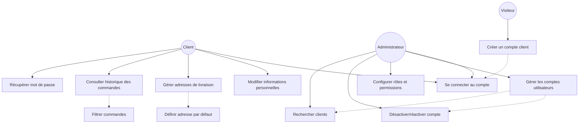
```mermaid
flowchart TD
    %% Acteurs
    Visiteur((Visiteur))
    Client((Client))
    Admin((Administrateur))
    
    %% Cas d'utilisation
    UC1[Créer un compte client]
    UC2[Se connecter au compte]
    UC3[Modifier informations personnelles]
    UC4[Gérer adresses de livraison]
    UC5[Consulter historique des commandes]
    UC6[Gérer les comptes utilisateurs]
    UC7[Configurer rôles et permissions]
    UC8[Récupérer mot de passe]
    UC9[Définir adresse par défaut]
    UC10[Filtrer commandes]
    UC11[Désactiver/réactiver compte]
    UC12[Rechercher clients]
    
    %% Relations
    Visiteur --> UC1
    Client --> UC2
    Client --> UC3
    Client --> UC4
    Client --> UC5
    Client --> UC8
    Admin --> UC2
    Admin --> UC6
    Admin --> UC7
    Admin --> UC11
    Admin --> UC12
    
    %% Extensions et inclusions
    UC1 -.-> UC2
    UC4 -.-> UC9
    UC5 -.-> UC10
    UC6 -.-> UC11
    UC6 -.-> UC12
```

### **Diagramme de Séquence pour la Création de Compte**

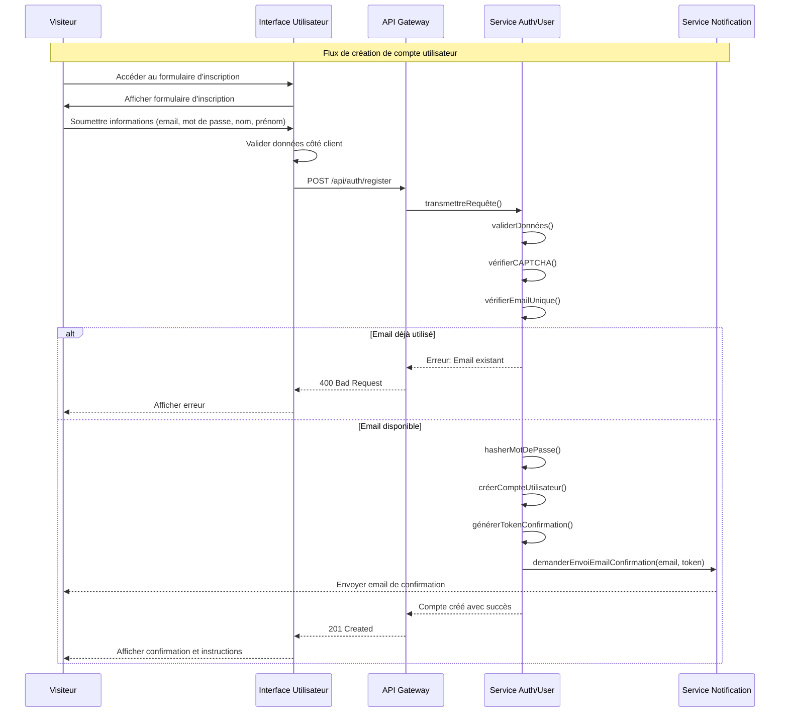
```mermaid
sequenceDiagram
    participant V as Visiteur
    participant UI as Interface Utilisateur
    participant G as API Gateway
    participant AU as Service Auth/User
    participant N as Service Notification
    
    Note over V,N: Flux de création de compte utilisateur
    
    V->>UI: Accéder au formulaire d'inscription
    UI->>V: Afficher formulaire d'inscription
    
    V->>UI: Soumettre informations (email, mot de passe, nom, prénom)
    UI->>UI: Valider données côté client
    UI->>G: POST /api/auth/register
    
    G->>AU: transmettreRequête()
    
    AU->>AU: validerDonnées()
    AU->>AU: vérifierCAPTCHA()
    AU->>AU: vérifierEmailUnique()
    
    alt Email déjà utilisé
        AU-->>G: Erreur: Email existant
        G-->>UI: 400 Bad Request
        UI-->>V: Afficher erreur
    else Email disponible
        AU->>AU: hasherMotDePasse()
        AU->>AU: créerCompteUtilisateur()
        AU->>AU: générerTokenConfirmation()
        
        AU->>N: demanderEnvoiEmailConfirmation(email, token)
        N-->>V: Envoyer email de confirmation
        
        AU-->>G: Compte créé avec succès
        G-->>UI: 201 Created
        UI-->>V: Afficher confirmation et instructions
    end
```

### **Diagramme de Séquence pour la Connexion au Compte**

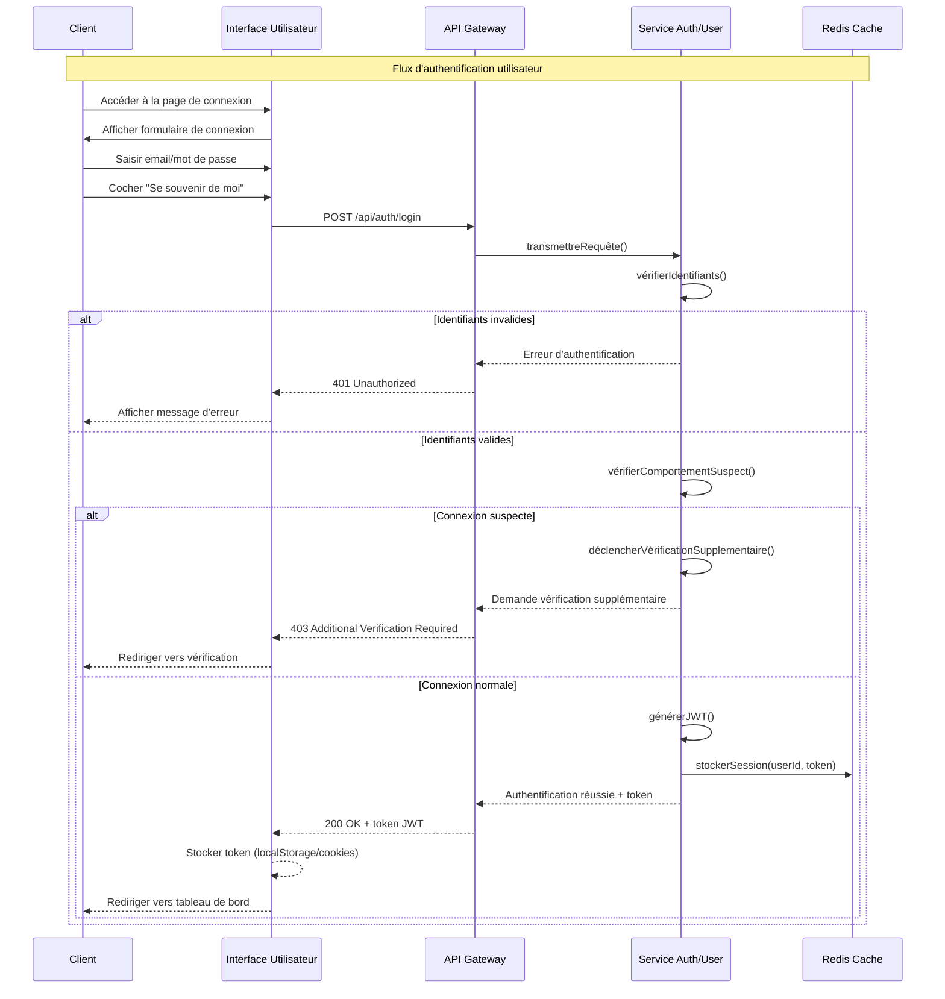
```mermaid
sequenceDiagram
    participant C as Client
    participant UI as Interface Utilisateur
    participant G as API Gateway
    participant AU as Service Auth/User
    participant R as Redis Cache
    
    Note over C,R: Flux d'authentification utilisateur
    
    C->>UI: Accéder à la page de connexion
    UI->>C: Afficher formulaire de connexion
    
    C->>UI: Saisir email/mot de passe
    C->>UI: Cocher "Se souvenir de moi"
    UI->>G: POST /api/auth/login
    
    G->>AU: transmettreRequête()
    
    AU->>AU: vérifierIdentifiants()
    
    alt Identifiants invalides
        AU-->>G: Erreur d'authentification
        G-->>UI: 401 Unauthorized
        UI-->>C: Afficher message d'erreur
    else Identifiants valides
        AU->>AU: vérifierComportementSuspect()
        
        alt Connexion suspecte
            AU->>AU: déclencherVérificationSupplementaire()
            AU-->>G: Demande vérification supplémentaire
            G-->>UI: 403 Additional Verification Required
            UI-->>C: Rediriger vers vérification
        else Connexion normale
            AU->>AU: générerJWT()
            AU->>R: stockerSession(userId, token)
            
            AU-->>G: Authentification réussie + token
            G-->>UI: 200 OK + token JWT
            UI-->>UI: Stocker token (localStorage/cookies)
            UI-->>C: Rediriger vers tableau de bord
        end
    end
```

### **Diagramme de Séquence pour la Gestion des Adresses de Livraison**

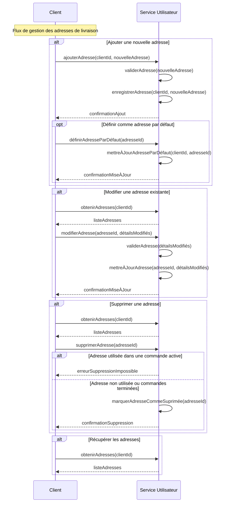
```mermaid
sequenceDiagram
    participant C as Client
    participant SU as Service Utilisateur
    
    Note over C: Flux de gestion des adresses de livraison
    
    alt Ajouter une nouvelle adresse
        C->>SU: ajouterAdresse(clientId, nouvelleAdresse)
        SU->>SU: validerAdresse(nouvelleAdresse)
        SU->>SU: enregistrerAdresse(clientId, nouvelleAdresse)
        SU-->>C: confirmationAjout
        
        opt Définir comme adresse par défaut
            C->>SU: définirAdresseParDéfaut(adresseId)
            SU->>SU: mettreÀJourAdresseParDéfaut(clientId, adresseId)
            SU-->>C: confirmationMiseÀJour
        end
    end
    
    alt Modifier une adresse existante
        C->>SU: obtenirAdresses(clientId)
        SU-->>C: listeAdresses
        
        C->>SU: modifierAdresse(adresseId, détailsModifiés)
        SU->>SU: validerAdresse(détailsModifiés)
        SU->>SU: mettreÀJourAdresse(adresseId, détailsModifiés)
        SU-->>C: confirmationMiseÀJour
    end
    
    alt Supprimer une adresse
        C->>SU: obtenirAdresses(clientId)
        SU-->>C: listeAdresses
        
        C->>SU: supprimerAdresse(adresseId)
        
        alt Adresse utilisée dans une commande active
            SU-->>C: erreurSuppressionImpossible
        else Adresse non utilisée ou commandes terminées
            SU->>SU: marquerAdresseCommeSuprimée(adresseId)
            SU-->>C: confirmationSuppression
        end
    end
    
    alt Récupérer les adresses
        C->>SU: obtenirAdresses(clientId)
        SU-->>C: listeAdresses
    end
```

### **Diagramme de Séquence pour l'Historique des Commandes**

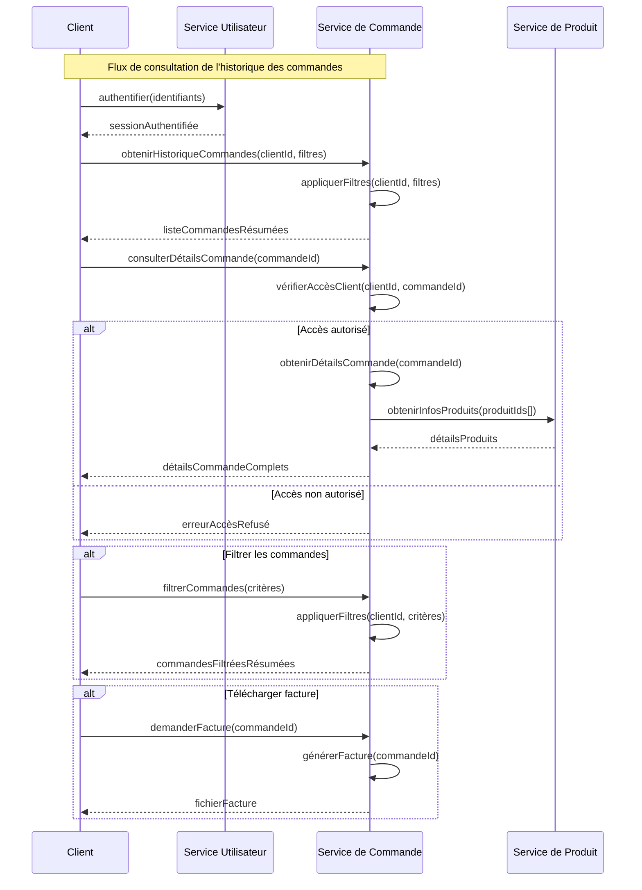
```mermaid
sequenceDiagram
    participant C as Client
    participant SU as Service Utilisateur
    participant SC as Service de Commande
    participant SP as Service de Produit
    
    Note over C,SC: Flux de consultation de l'historique des commandes
    
    C->>SU: authentifier(identifiants)
    SU-->>C: sessionAuthentifiée
    
    C->>SC: obtenirHistoriqueCommandes(clientId, filtres)
    SC->>SC: appliquerFiltres(clientId, filtres)
    SC-->>C: listeCommandesRésumées
    
    C->>SC: consulterDétailsCommande(commandeId)
    SC->>SC: vérifierAccèsClient(clientId, commandeId)
    
    alt Accès autorisé
        SC->>SC: obtenirDétailsCommande(commandeId)
        SC->>SP: obtenirInfosProduits(produitIds[])
        SP-->>SC: détailsProduits
        SC-->>C: détailsCommandeComplets
    else Accès non autorisé
        SC-->>C: erreurAccèsRefusé
    end
    
    alt Filtrer les commandes
        C->>SC: filtrerCommandes(critères)
        SC->>SC: appliquerFiltres(clientId, critères)
        SC-->>C: commandesFiltréesRésumées
    end
    
    alt Télécharger facture
        C->>SC: demanderFacture(commandeId)
        SC->>SC: générerFacture(commandeId)
        SC-->>C: fichierFacture
    end

```

### Epic 2: Gestion du Catalogue et des Produits

1. **En tant qu**'administrateur, **je veux** créer et gérer des catégories de produits afin d'organiser mon catalogue.
    - Critères d'acceptance:
        - Création de catégories
        - Réorganisation de la hiérarchie
        - Attribution d'images et descriptions
2. **En tant qu'**administrateur, **je veux** ajouter de nouveaux produits afin d'enrichir mon catalogue.
    - Critères d'acceptance:
        - Formulaire complet (nom, description, prix, caractéristiques)
        - Gestion des images (multiples vues, zoom)
        - SEO (méta-descriptions, mots-clés)
        - Gestion des variantes (tailles, couleurs)
3. **En tant qu'**administrateur, **je veux** modifier les informations produits **afin de** les maintenir à jour.
    - Critères d'acceptance:
        - Édition de tous les champs
        - Historique des modifications
        - Version préliminaire avant publication
4. **En tant qu'**administrateur, **je veux** gérer les prix et promotions afin d'optimiser mes ventes.
    - Critères d'acceptance:
        - Définition de prix normaux et promotionnels
        - Planification de promotions temporaires
        - Règles de prix par quantité
        - Gestion des codes promo
5. **En tant que** client, **je veux** parcourir le catalogue par catégories **afin de** trouver facilement des produits.
    - Critères d'acceptance:
        - Navigation intuitive par catégories/sous-catégories
        - Affichage des produits par grille/liste
        - Tri par pertinence/prix/nouveauté
        - Pagination optimisée
6. **En tant que** client, **je veux** rechercher des produits spécifiques **afin de** trouver rapidement ce que je cherche.
    - Critères d'acceptance:
        - Recherche textuelle avec auto-suggestion
        - Filtres avancés (prix, caractéristiques, disponibilité)
        - Recherche par mots-clés/références
        - Performance optimale (résultats < 500ms)
7. **En tant que** client, **je veux** consulter les détails d'un produit **afin de** prendre une décision d'achat éclairée.
    - Critères d'acceptance:
        - Description complète et caractéristiques techniques
        - Galerie d'images avec zoom
        - Affichage des variantes disponibles
        - Indication de disponibilité en temps réel
        - Prix incluant les promotions actives
        - Avis clients

### **Diagramme de Cas d'Utilisation pour la Gestion du Catalogue et Produits**

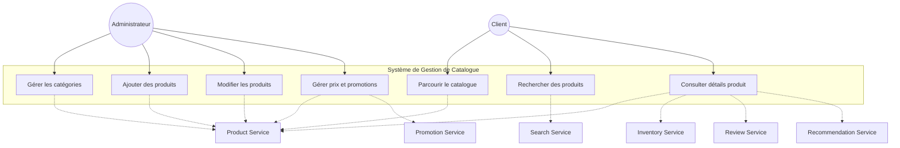
```mermaid
flowchart TD
    subgraph Système de Gestion de Catalogue
        A1[Gérer les catégories]
        A2[Ajouter des produits]
        A3[Modifier les produits]
        A4[Gérer prix et promotions]
        C1[Parcourir le catalogue]
        C2[Rechercher des produits]
        C3[Consulter détails produit]
    end
    
    Ad((Administrateur)) --> A1
    Ad --> A2
    Ad --> A3
    Ad --> A4
    C((Client)) --> C1
    C --> C2
    C --> C3
    
    A2 -.-> PS[Product Service]
    A3 -.-> PS
    A1 -.-> PS
    A4 -.-> PS
    A4 -.-> PrS[Promotion Service]
    C1 -.-> PS
    C2 -.-> SS[Search Service]
    C3 -.-> PS
    C3 -.-> IS[Inventory Service]
    C3 -.-> RS[Review Service]
    C3 -.-> RecS[Recommendation Service]
```

### **Diagramme de Séquence pour la Création de Produit**

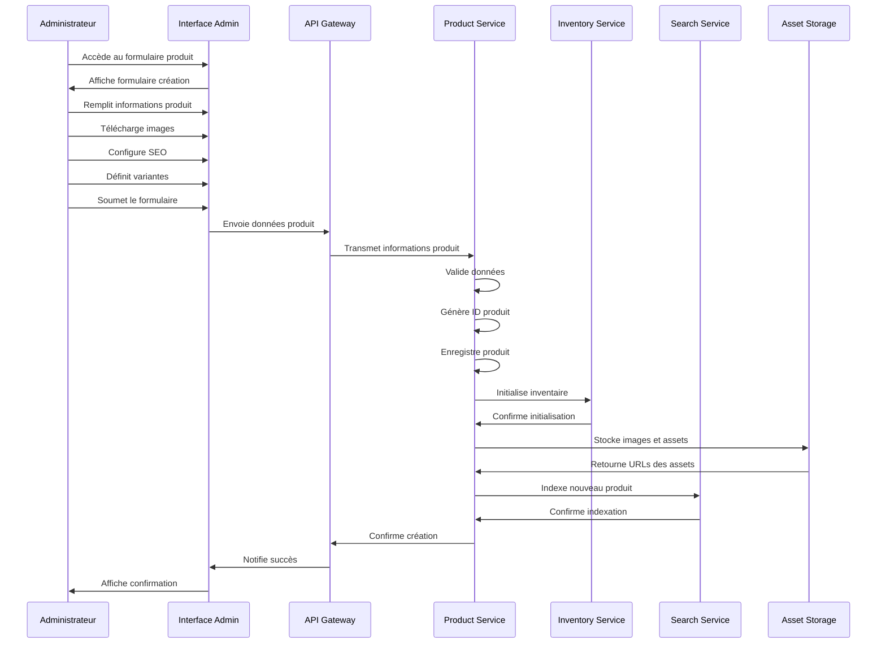
```mermaid
sequenceDiagram
    participant A as Administrateur
    participant UI as Interface Admin
    participant API as API Gateway
    participant PS as Product Service
    participant IS as Inventory Service
    participant SS as Search Service
    participant AS as Asset Storage

    A->>UI: Accède au formulaire produit
    UI->>A: Affiche formulaire création
    A->>UI: Remplit informations produit
    A->>UI: Télécharge images
    A->>UI: Configure SEO
    A->>UI: Définit variantes
    A->>UI: Soumet le formulaire
    UI->>API: Envoie données produit
    API->>PS: Transmet informations produit
    PS->>PS: Valide données
    PS->>PS: Génère ID produit
    PS->>PS: Enregistre produit
    PS->>IS: Initialise inventaire
    IS->>PS: Confirme initialisation
    PS->>AS: Stocke images et assets
    AS->>PS: Retourne URLs des assets
    PS->>SS: Indexe nouveau produit
    SS->>PS: Confirme indexation
    PS->>API: Confirme création
    API->>UI: Notifie succès
    UI->>A: Affiche confirmation

```

### **Diagramme de Séquence pour la Recherche de Produits**

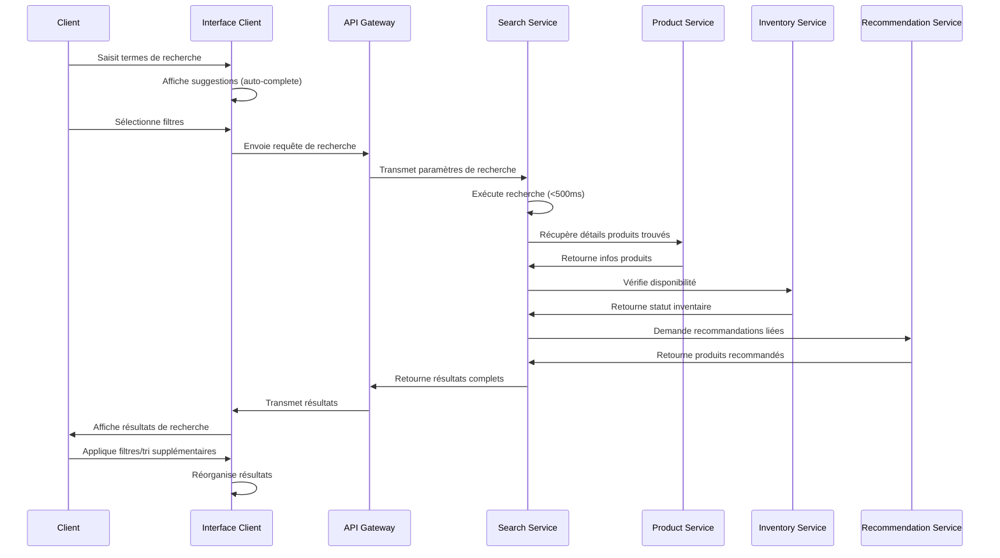
```mermaid
sequenceDiagram
    participant C as Client
    participant UI as Interface Client
    participant API as API Gateway
    participant SS as Search Service
    participant PS as Product Service
    participant IS as Inventory Service
    participant RS as Recommendation Service
    
    C->>UI: Saisit termes de recherche
    UI->>UI: Affiche suggestions (auto-complete)
    C->>UI: Sélectionne filtres
    UI->>API: Envoie requête de recherche
    API->>SS: Transmet paramètres de recherche
    SS->>SS: Exécute recherche (<500ms)
    SS->>PS: Récupère détails produits trouvés
    PS->>SS: Retourne infos produits
    SS->>IS: Vérifie disponibilité
    IS->>SS: Retourne statut inventaire
    SS->>RS: Demande recommandations liées
    RS->>SS: Retourne produits recommandés
    SS->>API: Retourne résultats complets
    API->>UI: Transmet résultats
    UI->>C: Affiche résultats de recherche
    C->>UI: Applique filtres/tri supplémentaires
    UI->>UI: Réorganise résultats
```

### **Diagramme de Séquence pour Consultation Détails Produit**

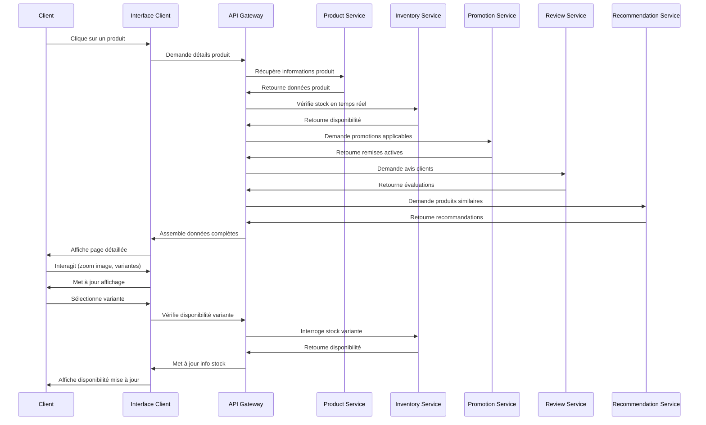
```mermaid
sequenceDiagram
    participant C as Client
    participant UI as Interface Client
    participant API as API Gateway
    participant PS as Product Service
    participant IS as Inventory Service
    participant PrS as Promotion Service
    participant RS as Review Service
    participant RecS as Recommendation Service
    
    C->>UI: Clique sur un produit
    UI->>API: Demande détails produit
    API->>PS: Récupère informations produit
    PS->>API: Retourne données produit
    API->>IS: Vérifie stock en temps réel
    IS->>API: Retourne disponibilité
    API->>PrS: Demande promotions applicables
    PrS->>API: Retourne remises actives
    API->>RS: Demande avis clients
    RS->>API: Retourne évaluations
    API->>RecS: Demande produits similaires
    RecS->>API: Retourne recommandations
    API->>UI: Assemble données complètes
    UI->>C: Affiche page détaillée
    C->>UI: Interagit (zoom image, variantes)
    UI->>C: Met à jour affichage
    C->>UI: Sélectionne variante
    UI->>API: Vérifie disponibilité variante
    API->>IS: Interroge stock variante
    IS->>API: Retourne disponibilité
    API->>UI: Met à jour info stock
    UI->>C: Affiche disponibilité mise à jour
```

### **Diagramme de Séquence pour Gestion des Prix et Promotions**

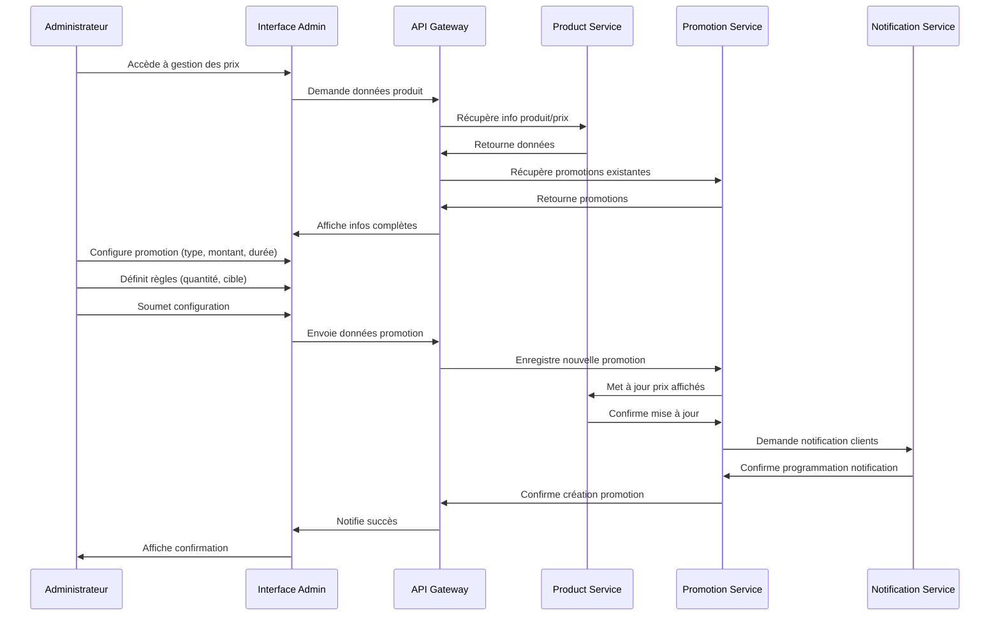
```mermaid
sequenceDiagram
    participant A as Administrateur
    participant UI as Interface Admin
    participant API as API Gateway
    participant PS as Product Service
    participant PrS as Promotion Service
    participant NS as Notification Service
    
    A->>UI: Accède à gestion des prix
    UI->>API: Demande données produit
    API->>PS: Récupère info produit/prix
    PS->>API: Retourne données
    API->>PrS: Récupère promotions existantes
    PrS->>API: Retourne promotions
    API->>UI: Affiche infos complètes
    A->>UI: Configure promotion (type, montant, durée)
    A->>UI: Définit règles (quantité, cible)
    A->>UI: Soumet configuration
    UI->>API: Envoie données promotion
    API->>PrS: Enregistre nouvelle promotion
    PrS->>PS: Met à jour prix affichés
    PS->>PrS: Confirme mise à jour
    PrS->>NS: Demande notification clients
    NS->>PrS: Confirme programmation notification
    PrS->>API: Confirme création promotion
    API->>UI: Notifie succès
    UI->>A: Affiche confirmation

```

### Epic 3: Gestion du Panier et Processus d'Achat

1. **En tant que** client, **je veux** ajouter des produits à mon panier **afin de** préparer mon achat.
    - Critères d'acceptance:
        - Ajout simple avec quantité
        - Confirmation visuelle d'ajout
        - Gestion des variantes
        - Panier persistant (connexion/déconnexion)
2. **En tant que** client, **je veux** modifier mon panier afin d'ajuster ma commande avant validation.
    - Critères d'acceptance:
        - Modification des quantités
        - Suppression d'articles
        - Recalcul automatique du montant
        - Sauvegarde automatique des modifications
3. **En tant que** client, **je veux** voir un récapitulatif de mon panier **afin de** vérifier ma commande.
    - Critères d'acceptance:
        - Liste détaillée des produits
        - Sous-total par article et total
        - Indication des promotions appliquées
        - Estimation des frais de livraison
4. **En tant que** client, **je veux** valider ma commande **afin de** finaliser mon achat.
    - Critères d'acceptance:
        - Processus en étapes claires
        - Choix de l'adresse de livraison
        - Sélection du mode de livraison
        - Récapitulatif final avant paiement
5. **En tant que** client, **je veux** payer ma commande en ligne **afin de** compléter mon achat.
    - Critères d'acceptance:
        - Multiples options de paiement (CB, PayPal, etc.)
        - Sécurisation des transactions (3D Secure)
        - Page de confirmation après paiement
        - Email de confirmation

### **Diagramme de Cas d'Utilisation pour la Gestion du Panier et Processus d'Achat**

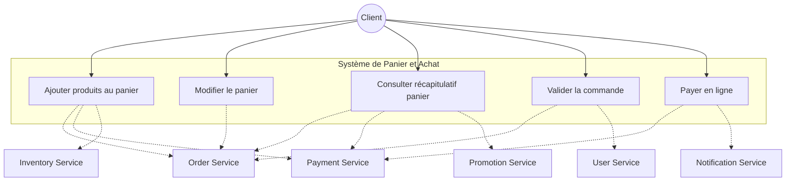
```mermaid
flowchart TD
    subgraph Système de Panier et Achat
        C1[Ajouter produits au panier]
        C2[Modifier le panier]
        C3[Consulter récapitulatif panier]
        C4[Valider la commande]
        C5[Payer en ligne]
    end
    
    C((Client)) --> C1
    C --> C2
    C --> C3
    C --> C4
    C --> C5
    
    C1 -.-> OS[Order Service]
    C1 -.-> PS[Product Service]
    C1 -.-> IS[Inventory Service]
    C2 -.-> OS
    C3 -.-> OS
    C3 -.-> PS
    C3 -.-> PrS[Promotion Service]
    C4 -.-> OS
    C4 -.-> US[User Service]
    C5 -.-> PS[Payment Service]
    C5 -.-> NS[Notification Service]
```

### **Diagramme de Séquence pour Ajouter au Panier**

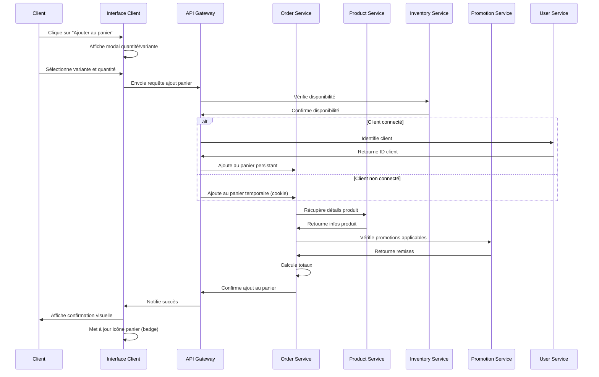
```mermaid
sequenceDiagram
    participant C as Client
    participant UI as Interface Client
    participant API as API Gateway
    participant OS as Order Service
    participant PS as Product Service
    participant IS as Inventory Service
    participant PrS as Promotion Service
    participant US as User Service
    
    C->>UI: Clique sur "Ajouter au panier"
    UI->>UI: Affiche modal quantité/variante
    C->>UI: Sélectionne variante et quantité
    UI->>API: Envoie requête ajout panier
    API->>IS: Vérifie disponibilité
    IS->>API: Confirme disponibilité
    
    alt Client connecté
        API->>US: Identifie client
        US->>API: Retourne ID client
        API->>OS: Ajoute au panier persistant
    else Client non connecté
        API->>OS: Ajoute au panier temporaire (cookie)
    end
    
    OS->>PS: Récupère détails produit
    PS->>OS: Retourne infos produit
    OS->>PrS: Vérifie promotions applicables
    PrS->>OS: Retourne remises
    OS->>OS: Calcule totaux
    OS->>API: Confirme ajout au panier
    API->>UI: Notifie succès
    UI->>C: Affiche confirmation visuelle
    UI->>UI: Met à jour icône panier (badge)
```

### **Diagramme de Séquence pour Modifier le Panier**

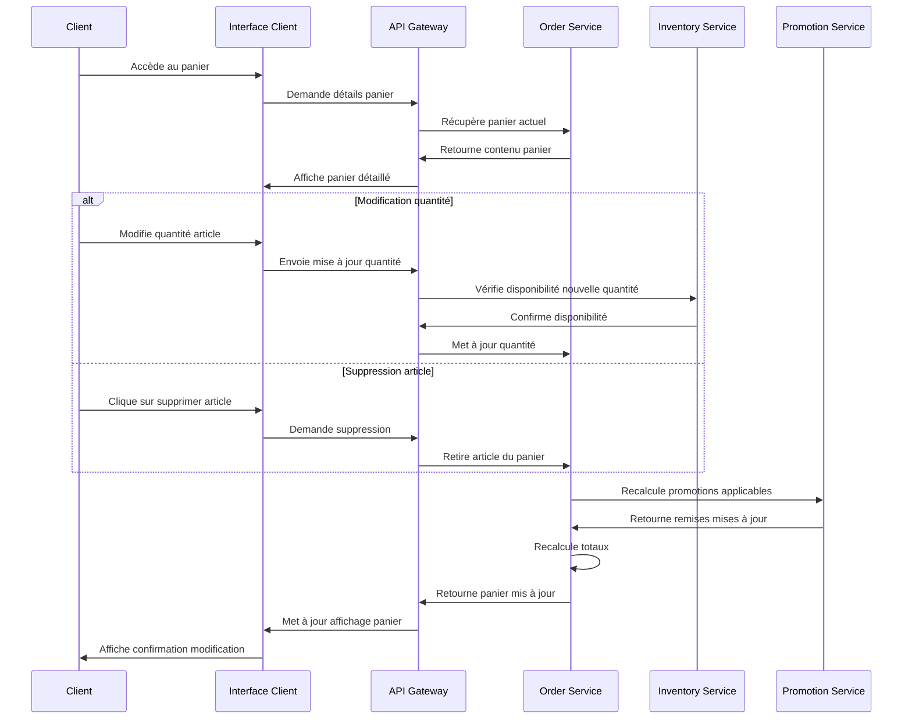
```mermaid
sequenceDiagram
    participant C as Client
    participant UI as Interface Client
    participant API as API Gateway
    participant OS as Order Service
    participant IS as Inventory Service
    participant PrS as Promotion Service
    
    C->>UI: Accède au panier
    UI->>API: Demande détails panier
    API->>OS: Récupère panier actuel
    OS->>API: Retourne contenu panier
    API->>UI: Affiche panier détaillé
    
    alt Modification quantité
        C->>UI: Modifie quantité article
        UI->>API: Envoie mise à jour quantité
        API->>IS: Vérifie disponibilité nouvelle quantité
        IS->>API: Confirme disponibilité
        API->>OS: Met à jour quantité
    else Suppression article
        C->>UI: Clique sur supprimer article
        UI->>API: Demande suppression
        API->>OS: Retire article du panier
    end
    
    OS->>PrS: Recalcule promotions applicables
    PrS->>OS: Retourne remises mises à jour
    OS->>OS: Recalcule totaux
    OS->>API: Retourne panier mis à jour
    API->>UI: Met à jour affichage panier
    UI->>C: Affiche confirmation modification
```

### **Diagramme de Séquence pour Processus d'Achat**

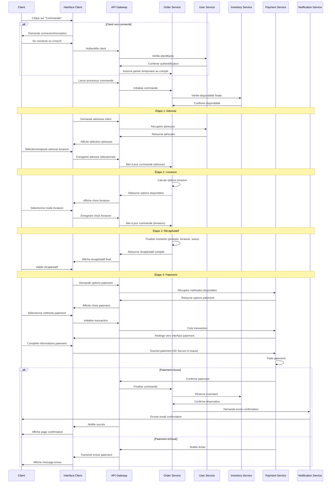
```mermaid
sequenceDiagram
    participant C as Client
    participant UI as Interface Client
    participant API as API Gateway
    participant OS as Order Service
    participant US as User Service
    participant IS as Inventory Service
    participant PS as Payment Service
    participant NS as Notification Service
    
    C->>UI: Clique sur "Commander"
    
    alt Client non connecté
        UI->>C: Demande connexion/inscription
        C->>UI: Se connecte ou s'inscrit
        UI->>API: Authentifie client
        API->>US: Vérifie identifiants
        US->>API: Confirme authentification
        API->>OS: Associe panier temporaire au compte
    end
    
    UI->>API: Lance processus commande
    API->>OS: Initialise commande
    OS->>IS: Vérifie disponibilité finale
    IS->>OS: Confirme disponibilité

    Note over C,NS: Étape 1: Adresse
    UI->>API: Demande adresses client
    API->>US: Récupère adresses
    US->>API: Retourne adresses
    API->>UI: Affiche sélection adresses
    C->>UI: Sélectionne/ajoute adresse livraison
    UI->>API: Enregistre adresse sélectionnée
    API->>OS: Met à jour commande (adresse)
    
    Note over C,NS: Étape 2: Livraison
    OS->>OS: Calcule options livraison
    OS->>API: Retourne options disponibles
    API->>UI: Affiche choix livraison
    C->>UI: Sélectionne mode livraison
    UI->>API: Enregistre choix livraison
    API->>OS: Met à jour commande (livraison)
    
    Note over C,NS: Étape 3: Récapitulatif
    OS->>OS: Finalise montants (produits, livraison, taxes)
    OS->>API: Retourne récapitulatif complet
    API->>UI: Affiche récapitulatif final
    C->>UI: Valide récapitulatif
    
    Note over C,NS: Étape 4: Paiement
    UI->>API: Demande options paiement
    API->>PS: Récupère méthodes disponibles
    PS->>API: Retourne options paiement
    API->>UI: Affiche choix paiement
    C->>UI: Sélectionne méthode paiement
    UI->>API: Initialise transaction
    API->>PS: Crée transaction
    PS->>UI: Redirige vers interface paiement
    C->>UI: Complète informations paiement
    UI->>PS: Soumet paiement (3D Secure si requis)
    PS->>PS: Traite paiement
    
    alt Paiement réussi
        PS->>API: Confirme paiement
        API->>OS: Finalise commande
        OS->>IS: Réserve inventaire
        IS->>OS: Confirme réservation
        OS->>NS: Demande envoi confirmation
        NS->>C: Envoie email confirmation
        API->>UI: Notifie succès
        UI->>C: Affiche page confirmation
    else Paiement échoué
        PS->>API: Notifie échec
        API->>UI: Transmet erreur paiement
        UI->>C: Affiche message erreur
    end
```

### **Diagramme de Séquence pour Consultation du Panier**

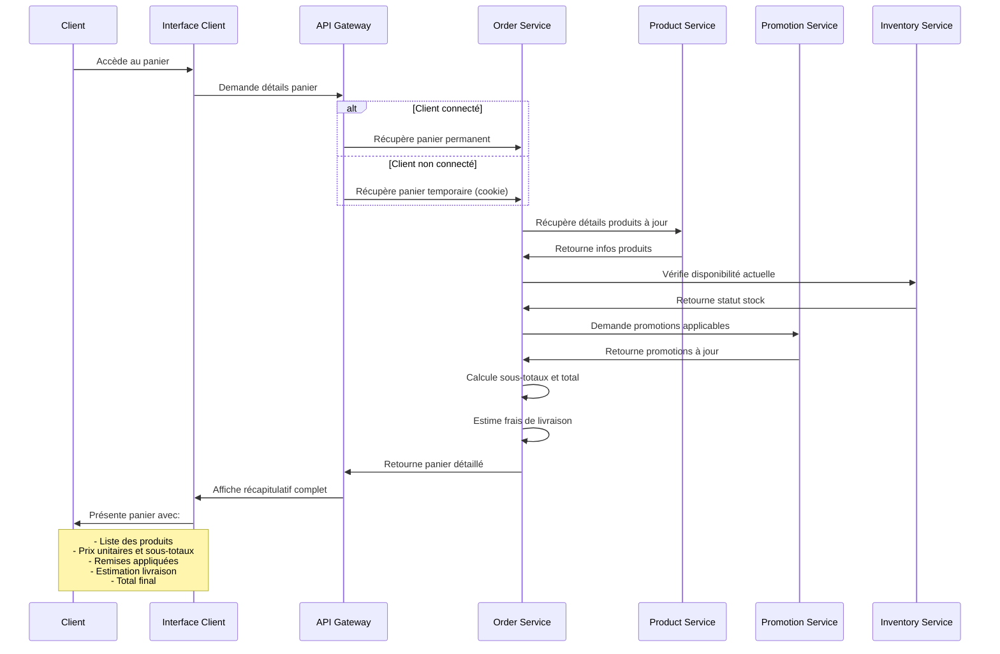
```mermaid
sequenceDiagram
    participant C as Client
    participant UI as Interface Client
    participant API as API Gateway
    participant OS as Order Service
    participant PS as Product Service
    participant PrS as Promotion Service
    participant IS as Inventory Service
    
    C->>UI: Accède au panier
    UI->>API: Demande détails panier
    
    alt Client connecté
        API->>OS: Récupère panier permanent
    else Client non connecté
        API->>OS: Récupère panier temporaire (cookie)
    end
    
    OS->>PS: Récupère détails produits à jour
    PS->>OS: Retourne infos produits
    OS->>IS: Vérifie disponibilité actuelle
    IS->>OS: Retourne statut stock
    OS->>PrS: Demande promotions applicables
    PrS->>OS: Retourne promotions à jour
    OS->>OS: Calcule sous-totaux et total
    OS->>OS: Estime frais de livraison
    OS->>API: Retourne panier détaillé
    API->>UI: Affiche récapitulatif complet
    UI->>C: Présente panier avec:
    Note over UI,C: - Liste des produits<br>- Prix unitaires et sous-totaux<br>- Remises appliquées<br>- Estimation livraison<br>- Total final
```

### Epic 4: Gestion des Commandes et Livraisons

1. **En tant que** client, **je veux** suivre l'état de ma commande **afin de** connaître son avancement.
    - Critères d'acceptance:
        - Visualisation de l'état actuel
        - Historique des étapes
        - Numéro de suivi de livraison
        - Notifications à chaque changement d'état
2. **En tant qu'**administrateur, **je veux** gérer les commandes **afin de** traiter les ventes.
    - Critères d'acceptance:
        - Liste des commandes avec filtres
        - Détails complets de chaque commande
        - Modification du statut
        - Génération de factures

### **Diagramme de Cas d'Utilisation pour la Gestion des Commandes et Livraisons**

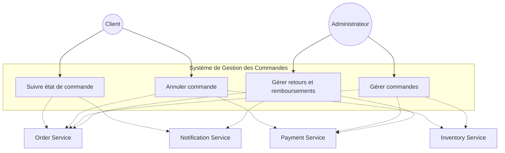
```mermaid
flowchart TD
    subgraph Système de Gestion des Commandes
        C1[Suivre état de commande]
        C2[Annuler commande]
        A1[Gérer commandes]
        A2[Gérer retours et remboursements]
    end
    
    C((Client)) --> C1
    C --> C2
    Ad((Administrateur)) --> A1
    Ad --> A2
    
    C1 -.-> OS[Order Service]
    C1 -.-> NS[Notification Service]
    C2 -.-> OS
    C2 -.-> PS[Payment Service]
    C2 -.-> IS[Inventory Service]
    A1 -.-> OS
    A1 -.-> IS
    A1 -.-> PS
    A2 -.-> OS
    A2 -.-> PS
    A2 -.-> NS
```

### **Diagramme de Séquence pour le Suivi de Commande**

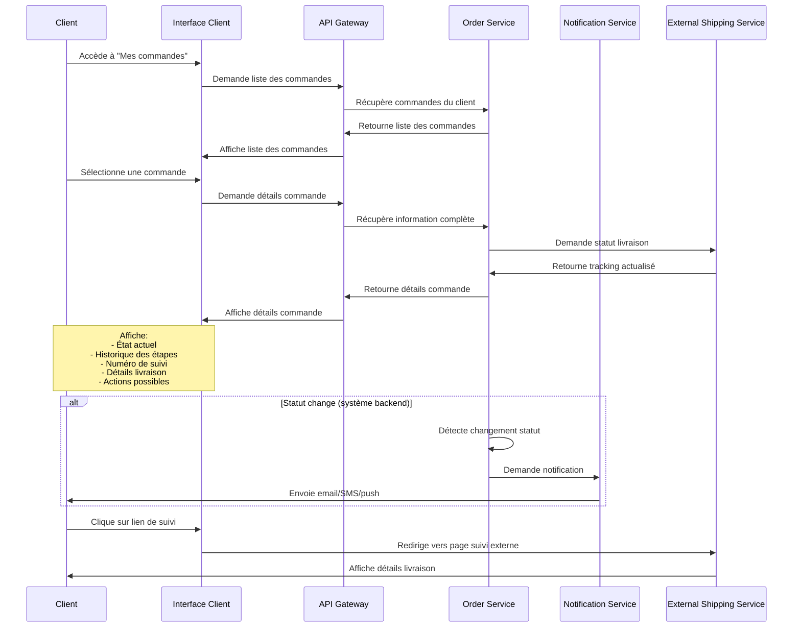
```mermaid
sequenceDiagram
    participant C as Client
    participant UI as Interface Client
    participant API as API Gateway
    participant OS as Order Service
    participant NS as Notification Service
    participant ES as External Shipping Service
    
    C->>UI: Accède à "Mes commandes"
    UI->>API: Demande liste des commandes
    API->>OS: Récupère commandes du client
    OS->>API: Retourne liste des commandes
    API->>UI: Affiche liste des commandes
    C->>UI: Sélectionne une commande
    UI->>API: Demande détails commande
    API->>OS: Récupère information complète
    OS->>ES: Demande statut livraison
    ES->>OS: Retourne tracking actualisé
    OS->>API: Retourne détails commande
    API->>UI: Affiche détails commande
    
    Note over UI,C: Affiche:<br>- État actuel<br>- Historique des étapes<br>- Numéro de suivi<br>- Détails livraison<br>- Actions possibles
    
    alt Statut change (système backend)
        OS->>OS: Détecte changement statut
        OS->>NS: Demande notification
        NS->>C: Envoie email/SMS/push
    end
    
    C->>UI: Clique sur lien de suivi
    UI->>ES: Redirige vers page suivi externe
    ES->>C: Affiche détails livraison
```

### **Diagramme de Séquence pour la Gestion des Commandes (Admin)**

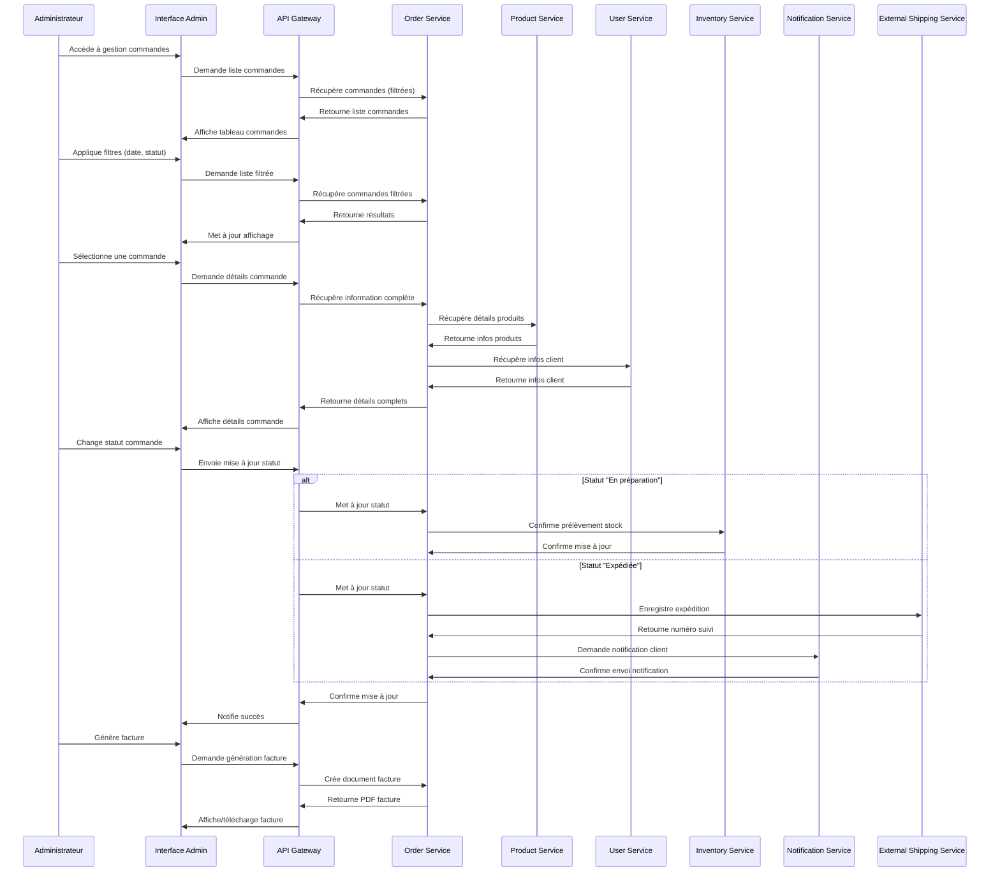
```mermaid
sequenceDiagram
    participant A as Administrateur
    participant UI as Interface Admin
    participant API as API Gateway
    participant OS as Order Service
    participant PS as Product Service
    participant US as User Service
    participant IS as Inventory Service
    participant NS as Notification Service
    participant ES as External Shipping Service
    
    A->>UI: Accède à gestion commandes
    UI->>API: Demande liste commandes
    API->>OS: Récupère commandes (filtrées)
    OS->>API: Retourne liste commandes
    API->>UI: Affiche tableau commandes
    
    A->>UI: Applique filtres (date, statut)
    UI->>API: Demande liste filtrée
    API->>OS: Récupère commandes filtrées
    OS->>API: Retourne résultats
    API->>UI: Met à jour affichage
    
    A->>UI: Sélectionne une commande
    UI->>API: Demande détails commande
    API->>OS: Récupère information complète
    OS->>PS: Récupère détails produits
    PS->>OS: Retourne infos produits
    OS->>US: Récupère infos client
    US->>OS: Retourne infos client
    OS->>API: Retourne détails complets
    API->>UI: Affiche détails commande
    
    A->>UI: Change statut commande
    UI->>API: Envoie mise à jour statut
    
    alt Statut "En préparation"
        API->>OS: Met à jour statut
        OS->>IS: Confirme prélèvement stock
        IS->>OS: Confirme mise à jour
    else Statut "Expédiée"
        API->>OS: Met à jour statut
        OS->>ES: Enregistre expédition
        ES->>OS: Retourne numéro suivi
        OS->>NS: Demande notification client
        NS->>OS: Confirme envoi notification
    end
    
    OS->>API: Confirme mise à jour
    API->>UI: Notifie succès
    
    A->>UI: Génère facture
    UI->>API: Demande génération facture
    API->>OS: Crée document facture
    OS->>API: Retourne PDF facture
    API->>UI: Affiche/télécharge facture
```

### Epic 5: Inventaire et Stock

1. **En tant qu**'administrateur, **je veux** gérer le stock des produits afin d'éviter les ruptures.
    - Critères d'acceptance:
        - Mise à jour manuelle/automatique des quantités
        - Alertes de stock bas
        - Réservation temporaire lors d'ajout au panier
        - Gestion des précommandes
2. **En tant qu'**administrateur, **je veux** définir des seuils de réapprovisionnement afin d'optimiser la gestion des stocks.
    - Critères d'acceptance:
        - Configuration par produit/catégorie
        - Alertes automatiques
        - Suggestions de quantités
3. **En tant que** client, **je veux** être informé de la disponibilité des produits **afin de** savoir si je peux commander.
    - Critères d'acceptance:
        - Indication claire (en stock, stock faible, rupture)
        - Date estimée de réapprovisionnement
        - Notification lors du retour en stock

### **Diagramme de Cas d'Utilisation pour l'Inventaire et Stock**

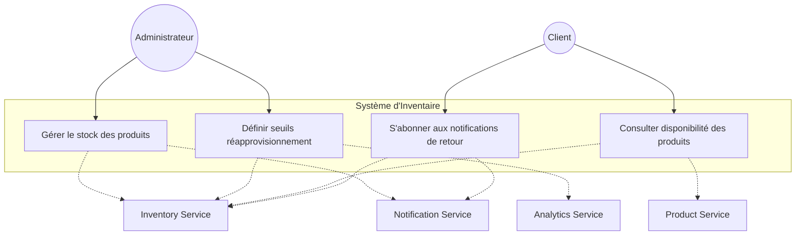
```mermaid
flowchart TD
    subgraph Système d'Inventaire
        A1[Gérer le stock des produits]
        A2[Définir seuils réapprovisionnement]
        C1[Consulter disponibilité des produits]
        C2[S'abonner aux notifications de retour]
    end
    
    Ad((Administrateur)) --> A1
    Ad --> A2
    C((Client)) --> C1
    C --> C2
    
    A1 -.-> IS[Inventory Service]
    A1 -.-> NS[Notification Service]
    A2 -.-> IS
    A2 -.-> AS[Analytics Service]
    C1 -.-> IS
    C1 -.-> PS[Product Service]
    C2 -.-> NS
    C2 -.-> IS
```

### **Diagramme de Séquence pour la Gestion des Stocks**

```mermaid
sequenceDiagram
    participant A as Administrateur
    participant UI as Interface Admin
    participant API as API Gateway
    participant IS as Inventory Service
    participant PS as Product Service
    participant NS as Notification Service
    participant AS as Analytics Service
    
    A->>UI: Accède à la gestion des stocks
    UI->>API: Demande liste des produits avec stock
    API->>PS: Récupère liste des produits
    PS->>API: Retourne liste produits
    API->>IS: Récupère niveaux de stock
    IS->>API: Retourne données inventaire
    API->>AS: Demande historique ventes
    AS->>API: Retourne tendances ventes
    API->>UI: Affiche tableau de bord stocks
    
    alt Mise à jour manuelle
        A->>UI: Modifie quantité en stock
        UI->>API: Envoie mise à jour stock
        API->>IS: Met à jour inventaire
        IS->>IS: Vérifie si seuil atteint
        
        alt Stock < seuil critique
            IS->>NS: Déclenche alerte stock bas
            NS->>A: Envoie notification
        end
        
        alt Stock revient après rupture
            IS->>NS: Notifie retour en stock
            NS->>NS: Identifie clients intéressés
            NS->>C: Envoie notifications clients
        end
        
        IS->>API: Confirme mise à jour
        API->>UI: Notifie succès
    else Import de masse
        A->>UI: Importe fichier CSV stocks
        UI->>API: Transmet données CSV
        API->>IS: Traite mise à jour en masse
        IS->>IS: Vérifie chaque produit
        IS->>API: Confirme import
        API->>UI: Affiche résumé des mises à jour
    end
```

### **Diagramme de Séquence pour Configuration des Seuils de Réapprovisionnement**

```mermaid
sequenceDiagram
    participant A as Administrateur
    participant UI as Interface Admin
    participant API as API Gateway
    participant IS as Inventory Service
    participant AS as Analytics Service
    participant PS as Product Service
    
    A->>UI: Accède aux seuils de réapprovisionnement
    UI->>API: Demande configurations actuelles
    API->>IS: Récupère seuils définis
    IS->>API: Retourne seuils actuels
    API->>AS: Demande données ventes/rotations
    AS->>API: Retourne analyses
    API->>UI: Affiche dashboard avec suggestions
    
    alt Configuration par produit
        A->>UI: Sélectionne produit spécifique
        UI->>API: Demande détails produit
        API->>PS: Récupère infos produit
        PS->>API: Retourne détails
        API->>AS: Demande historique ventes produit
        AS->>API: Retourne données spécifiques
        API->>UI: Affiche suggestions pour ce produit
        A->>UI: Configure seuils spécifiques
        UI->>API: Enregistre configuration
        API->>IS: Met à jour seuils produit
    else Configuration par catégorie
        A->>UI: Sélectionne catégorie
        UI->>API: Demande liste produits catégorie
        API->>PS: Récupère produits par catégorie
        PS->>API: Retourne liste
        API->>AS: Demande tendances catégorie
        AS->>API: Retourne analyses
        API->>UI: Affiche tendances et suggestions
        A->>UI: Configure seuils catégorie
        UI->>API: Enregistre configuration
        API->>IS: Applique seuils à tous les produits
    end
    
    IS->>API: Confirme mise à jour
    API->>UI: Notifie succès
```

### **Diagramme de Séquence pour Affichage de la Disponibilité**

```mermaid
sequenceDiagram
    participant C as Client
    participant UI as Interface Client  
    participant API as API Gateway
    participant PS as Product Service
    participant IS as Inventory Service
    participant NS as Notification Service
    
    C->>UI: Consulte page produit
    UI->>API: Demande infos produit et stock
    API->>PS: Récupère détails produit
    PS->>API: Retourne infos produit
    API->>IS: Vérifie disponibilité
    IS->>API: Retourne statut stock
    
    alt En stock
        API->>UI: Affiche "En stock"
        UI->>C: Montre disponibilité immédiate
    else Stock faible
        API->>UI: Affiche "Stock faible - X restants"
        UI->>C: Affiche alerte stock limité
    else Rupture de stock
        API->>IS: Demande date réapprovisionnement
        IS->>API: Retourne estimation
        API->>UI: Affiche "Rupture - Retour prévu le [date]"
        UI->>C: Propose notification de retour
        C->>UI: S'inscrit aux alertes
        UI->>API: Enregistre demande notification
        API->>NS: Configure alerte pour ce client
        NS->>API: Confirme configuration
        API->>UI: Confirme inscription
        UI->>C: Affiche confirmation
    end
```

### **Diagramme de Séquence pour Gestion des Précommandes**

```mermaid
sequenceDiagram
    participant C as Client
    participant UI as Interface Client
    participant API as API Gateway
    participant PS as Product Service
    participant IS as Inventory Service
    participant NS as Notification Service

    C->>UI: Demande notification disponibilité
    UI->>API: Enregistre demande de notification
    API->>NS: Ajoute client à la liste d'attente
    NS->>API: Confirme enregistrement
    
    Note over C,NS: En attente de disponibilité
    
    PS->>API: Produit disponible en stock
    API->>NS: Déclenche notifications clients
    NS->>C: Envoie notification disponibilité

```

### **Diagramme de Séquence pour Consultation du Panier**

```mermaid
sequenceDiagram
    participant C as Client
    participant UI as Interface Client
    participant API as API Gateway
    participant OS as Order Service
    participant PS as Product Service
    participant PrS as Promotion Service
    participant IS as Inventory Service
    
    C->>UI: Accède au panier
    UI->>API: Demande détails panier
    
    alt Client connecté
        API->>OS: Récupère panier permanent
    else Client non connecté
        API->>OS: Récupère panier temporaire (cookie)
    end
    
    OS->>PS: Récupère détails produits à jour
    PS->>OS: Retourne infos produits
    OS->>IS: Vérifie disponibilité actuelle
    IS->>OS: Retourne statut stock
    OS->>PrS: Demande promotions applicables
    PrS->>OS: Retourne promotions à jour
    OS->>OS: Calcule sous-totaux et total
    OS->>OS: Estime frais de livraison
    OS->>API: Retourne panier détaillé
    API->>UI: Affiche récapitulatif complet
    UI->>C: Présente panier avec:
    Note over UI,C: - Liste des produits<br>- Prix unitaires et sous-totaux<br>- Remises appliquées<br>- Estimation livraison<br>- Total final
```

### Epic 6: Notification et Communication

1. **En tant que** client, **je veux** recevoir des notifications sur ma commande afin d'être informé de son évolution.
    - Critères d'acceptance:
        - Emails de confirmation (commande, paiement, expédition)
        - Notifications push (si application mobile)
        - SMS optionnels pour livraison

### Diagramme de cas d’utilisation pour les notifications

```mermaid
flowchart TD
    %% Acteurs
    Client((Client))
    Admin((Administrateur))
    Système((Système))
    
    %% Cas d'utilisation
    UC1[Recevoir des notifications de commande]
    UC2[S'abonner à la newsletter]
    UC3[Gérer les préférences de communication]
    UC4[Se désabonner de la newsletter]
    UC5[Créer des campagnes marketing]
    UC6[Créer des modèles de messages]
    UC7[Segmenter la base clients]
    UC8[Planifier l'envoi de campagne]
    UC9[Suivre les performances des campagnes]
    UC10[Envoyer des notifications automatisées]
    
    %% Relations
    Client --> UC1
    Client --> UC2
    Client --> UC3
    Client --> UC4
    Admin --> UC5
    Admin --> UC6
    Admin --> UC7
    Admin --> UC8
    Admin --> UC9
    Système --> UC10
    
    %% Extensions et inclusions
    UC5 -.-> UC6
    UC5 -.-> UC7
    UC5 -.-> UC8
    UC5 -.-> UC9
    UC10 -.-> UC1
```

### Diagramme de Séquence des Notifications de Commande

```mermaid
sequenceDiagram
    participant C as Client
    participant SC as Service de Commande
    participant SN as Service de Notification
    participant SA as Service d'Analytique
    
    Note over C,SA: Flux de mise à jour du statut de commande
    
    SC->>SN: changementStatutCommande(commandeId, statut)
    
    SN->>SN: préparerNotifications(clientId, modèle, détailsCommande)
    
    alt Notification par e-mail
        SN-->>C: Envoyer notification par e-mail
    end
    
    alt Notification push (si activée)
        SN-->>C: Envoyer notification push
    end
    
    alt Notification SMS (si opt-in)
        SN-->>C: Envoyer alerte SMS
    end
    
    SN->>SA: enregistrerInteraction(clientId, type, contenu)
    
    C->>SN: consulterHistoriqueNotifications()
    SN-->>C: Retourner historique des notifications
```

### Epic 7: Avis et Notation

1. **En tant que** client, **je veux** laisser un avis sur un produit acheté **afin de** partager mon expérience.
    - Critères d'acceptance:
        - Notation par étoiles
        - Commentaire textuel
        - Upload de photos
        - Modération avant publication
2. **En tant qu'**administrateur, **je veux** modérer les avis clients **afin de** garantir leur qualité.
    - Critères d'acceptance:
        - File d'attente de modération
        - Validation/rejet avec justification
        - Signalement automatique de contenus suspects
        - Statistiques de notation

### **Diagramme de Cas d'Utilisation pour les Avis et Notations**

```mermaid
flowchart TD
    %% Acteurs
    Client((Client))
    Admin((Administrateur))
    Système((Système))
    
    %% Cas d'utilisation
    UC1[Laisser un avis sur un produit]
    UC2[Noter un produit par étoiles]
    UC3[Ajouter des photos à un avis]
    UC4[Consulter les avis sur un produit]
    UC5[Modérer les avis]
    UC6[Valider/rejeter un avis]
    UC7[Consulter les statistiques de notation]
    UC8[Signaler un contenu suspect]
    UC9[Vérifier l'achat du produit]
    
    %% Relations
    Client --> UC1
    Client --> UC2
    Client --> UC3
    Client --> UC4
    Admin --> UC5
    Admin --> UC6
    Admin --> UC7
    Système --> UC8
    Système --> UC9
    
    %% Extensions et inclusions
    UC1 -.-> UC2
    UC1 -.-> UC3
    UC1 -.-> UC9
    UC5 -.-> UC6
    UC5 -.-> UC8
```

### **Diagramme de Séquence pour la Soumission d'un Avis**

```mermaid
sequenceDiagram
    participant C as Client
    participant RR as Service de Revues & Notations
    participant PS as Service de Produit
    participant OS as Service de Commande
    
    Note over C,OS: Flux de soumission d'un avis client
    
    C->>RR: soumettreAvis(produitId, note, commentaire)
    
    RR->>OS: vérifierAchat(clientId, produitId)
    OS-->>RR: achatConfirmé(true/false)
    
    alt Achat non confirmé
        RR-->>C: Erreur: Achat du produit requis pour laisser un avis
    else Achat confirmé
        RR->>PS: obtenirInfoProduit(produitId)
        PS-->>RR: détailsProduit
        
        opt Ajout de photos
            C->>RR: ajouterPhotos(avisId, photos[])
            RR->>RR: stockerPhotos(photos[])
            RR-->>C: Confirmation de l'ajout des photos
        end
        
        RR->>RR: placerEnFileAttenteModeération(avisId)
        RR-->>C: Confirmation de soumission
        
        
        alt Contenu suspect détecté
            RR->>RR: marquerPourModérationPrioritaire(avisId)
        end
    end
```

### Epic 8: Recherche et Recommandations

1. **En tant que** client, **je veux** recevoir des recommandations personnalisées **afin de** découvrir des produits pertinents.
    - Critères d'acceptance:
        - Suggestions basées sur l'historique d'achat
        - Produits complémentaires
        - "Les clients ont aussi acheté..."
        - Personnalisation progressive

### Epic 9: Analytics et Reporting

1. **En tant qu'**administrateur, **je veux** exploiter les données via Power BI **afin de** créer des analyses avancées.
    - Critères d'acceptance:
        - Connecteurs configurés vers les sources de données
        - Modèles de données optimisés
        - Tableaux de bord interactifs
        - Rapports automatisés

### Epic 10: Gestion multi-appareils et Responsive

1. **En tant que** client, **je veux** utiliser la plateforme sur tous mes appareils **afin de** profiter d'une expérience cohérente.
    - Critères d'acceptance:
        - Design responsive (desktop, tablette, mobile)
        - Adaptabilité des fonctionnalités
        - Performance optimisée sur mobile
        - Synchronisation du panier entre appareils

### Epic 11: Infrastructure et Performances

1. **En tant qu'**administrateur système, **je veux** surveiller les performances de l'application afin d'assurer une expérience utilisateur optimale.
    - Critères d'acceptance:
        - Tableaux de bord Prometheus/Grafana
        - Alertes configurées
        - Suivi des temps de réponse
        - Analyse des erreurs
2. **En tant qu'**administrateur système, **je veux** déployer des mises à jour sans interruption **afin de** maintenir la continuité du service.
    - Critères d'acceptance:
        - Pipeline CI/CD automatisé
        - Rollback automatique en cas d'erreur
        - Tests automatisés

## III-Priorités et Planification

### MVP (Minimum Viable Product)

- Epic 1: Gestion des Utilisateurs et Authentification
- Epic 2: Gestion du Catalogue et des Produits
- Epic 3: Gestion du Panier et Processus d'Achat
- Epic 4: Gestion des Commandes et Livraisons
- Epic 5: Inventaire et Stock
- Epic 11: Infrastructure de base

### Phase 2

- Epic 6: Notification et Communication
- Epic 7: Avis et Notation
- Epic 9: Analytics et Reporting de base
- Epic 10: Gestion Responsive
- Améliorations des fonctionnalités MVP

### Phase 3

- Epic 8: Recherche avancée et Recommandations
- Epic 9: Analytics avancés et Power BI
- Epic : SEO et Marketing
- Epic 11: Infrastructure avancée

