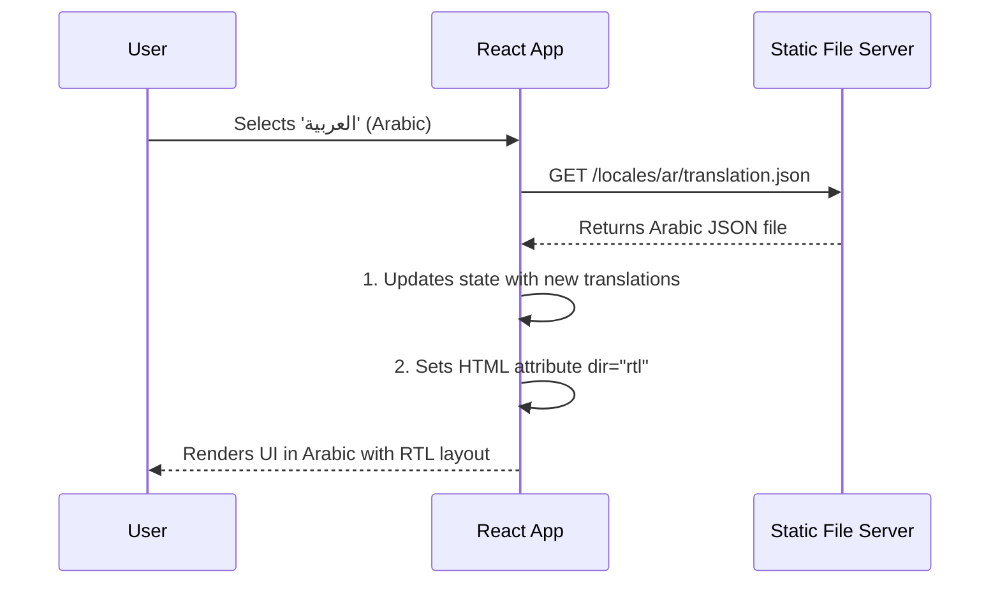
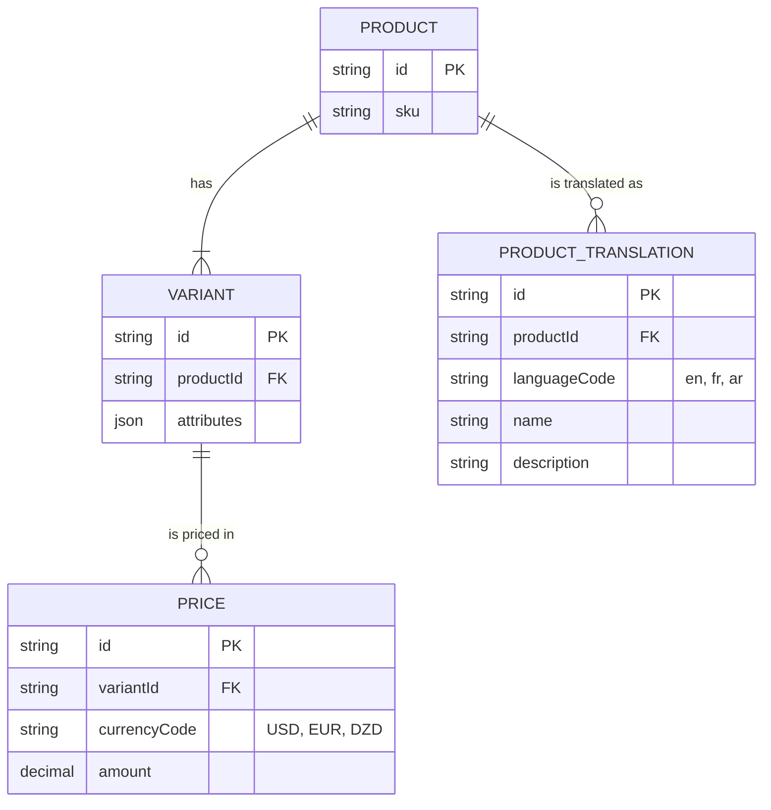
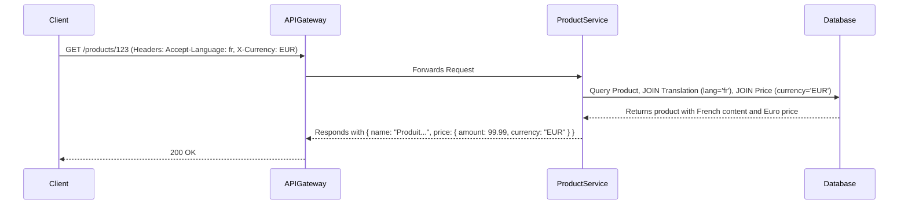
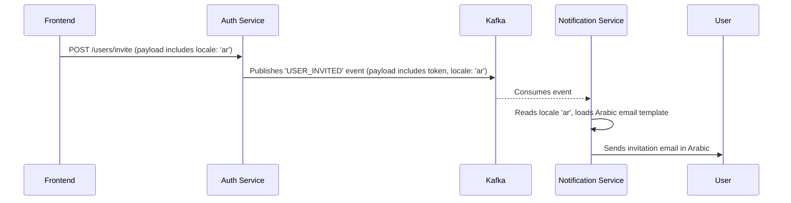

Of course. Here is the complete architectural report on implementing internationalization and localization for the e-commerce platform, covering language, currency conversion, and layout direction from start to finish.

***

### **Architectural Report: Internationalizing the E-commerce Platform**

#### **Executive Summary**

To expand the platform's reach to French, Arabic, and English-speaking markets, a comprehensive internationalization (i18n) and localization (l10n) strategy is required. This report outlines a three-pronged architectural approach designed for scalability, maintainability, and a clear separation of concerns across the frontend, backend microservices, and databases. The core principles are:

1.  **A Decoupled Presentation Layer:** The frontend is responsible for all user-facing localization, including language rendering, regional formatting (currency, dates), and layout direction.
2.  **A Centralized, Multilingual Data Model:** The backend is adapted to store and serve content and pricing in multiple languages and currencies as distinct data entities.
3.  **Language-Agnostic Service Communication:** All inter-service communication is standardized to be independent of language or locale, ensuring the microservices architecture remains decoupled and robust.

---

### **1. Principle: Decoupled Presentation Layer for Dynamic Localization**

The frontend application will manage all aspects of presenting localized content to the user. This makes the UI highly flexible and keeps the backend focused on pure data delivery.

*   **Language & Text:** All hardcoded text in the UI will be replaced with abstract keys. The frontend will dynamically fetch translation files (e.g., JSON) corresponding to the user's selected language (`en`, `fr`, `ar`) and use these keys to render the appropriate strings. This is a foundational practice for building world-ready applications. [Source: W3C Internationalization (I18n) Activity](https://www.w3.org/International/).

*   **Currency & Number Formatting:** Backend services will always provide monetary values in a culture-neutral format (e.g., `{ "amount": 13500.00, "currency": "DZD" }`). The frontend is responsible for displaying this information correctly using the browser's native **Internationalization API (`Intl`)**. This API provides locale-aware functions that handle currency symbols, decimal/thousands separators, and placement according to the user's language and regional settings. [Source: MDN Web Docs: Intl](https://developer.mozilla.org/en-US/docs/Web/JavaScript/Reference/Global_Objects/Intl).

*   **Layout Direction (RTL/LTR):** To support Right-to-Left languages like Arabic, the frontend will toggle the `dir="rtl"` attribute on the root HTML element when the user selects Arabic. By using **CSS Logical Properties** (e.g., `margin-inline-start` instead of `margin-left`), the browser's rendering engine will automatically adapt and reflow the layout correctly, eliminating the need for separate, overriding RTL stylesheets. [Source: MDN Web Docs: CSS Logical Properties](https://developer.mozilla.org/en-US/docs/Web/CSS/Logical_Properties).

**Diagram 1: Language & Layout Switching Sequence**
*This diagram shows how the frontend dynamically adapts both language and layout upon user selection.*

---

### **2. Principle: A Centralized, Multilingual Data Model**

The backend architecture and database schemas will be fundamentally redesigned to treat multilingual content and multi-currency pricing as first-class citizens.

*   **Multilingual Content:** Translatable fields like product `name` and `description` will be moved from the main `Product` table into a dedicated `ProductTranslation` table. This table will have a one-to-many relationship with `Product` and will contain a unique entry for each product-language combination. This normalized approach is a scalable and robust pattern for database internationalization. [Source: A Pragmatic Guide to Database Internationalization](https://www.launchdarkly.com/blog/a-pragmatic-guide-to-database-internationalization-i18n/).

*   **Multi-Currency Pricing:** A single `price` column is insufficient. A new `Price` table will be created with a one-to-many relationship to the `Variant` table. This allows each product variant to have multiple fixed prices, one for each supported currency (USD, EUR, DZD). This provides price stability for customers and avoids the unreliability of real-time API conversions during the purchase flow. [Source: "Multi-Currency Strategy for E-commerce," Martin Fowler's Blog (Conceptual)](https://martinfowler.com/articles/patterns-of-distributed-systems/multi-currency.html).

*   **API Data Retrieval:** The `product-service` API will use **content negotiation**. The client will send headers indicating the desired language and currency (e.g., `Accept-Language: fr`, `X-Currency: EUR`). The service will use these headers to perform database `JOIN` operations, retrieving the product's base data along with the specific French content and the fixed Euro price.

**Diagram 2: Updated Entity-Relationship Diagram for Products**
*This ERD illustrates the normalized schema for storing multilingual content and multi-currency prices.*

**Diagram 3: Language- and Currency-Aware Data Request Flow**
*This shows how the API uses client headers to return fully localized product data.*

---

### **3. Principle: Language-Agnostic Service Communication**

To maintain a decoupled microservices architecture, all inter-service communication, whether synchronous or asynchronous, must be language-agnostic.

*   **API Error Messages:** Services will not return human-readable error messages. Instead, they will return stable **error keys** (e.g., `{"messageKey": "error.sku.alreadyExists"}`). The frontend is responsible for mapping these keys to translated, user-friendly messages from its locale files. This makes the APIs reusable across different localized clients. [Source: Microsoft REST API Guidelines on Localization](https://github.com/microsoft/api-guidelines/blob/vNext/Guidelines.md#15-globalization).

*   **Event-Driven Notifications:** For asynchronous operations like sending emails, the initiating service must include the user's language preference in the event payload. The `auth-service`, for example, will publish a `USER_INVITED` Kafka event containing `{ "locale": "ar", ... }`. The `notification-service` consumes this event and uses the `locale` field to select and render the appropriate Arabic email template, ensuring users are contacted in their preferred language. [Source: W3C Personalization Semantics](https://www.w3.org/TR/personalization-semantics-1.0/).

**Diagram 4: Asynchronous Notification Flow**
*This sequence shows how user language preference is passed through an event-driven system.*

