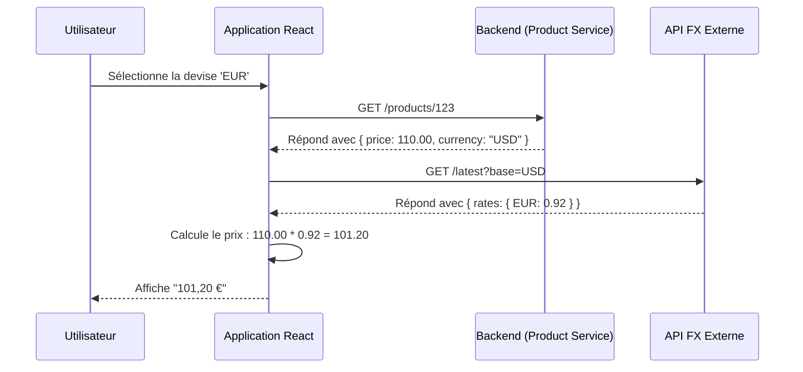
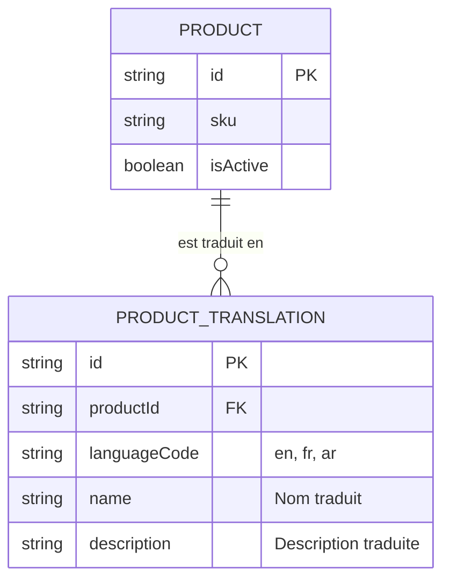
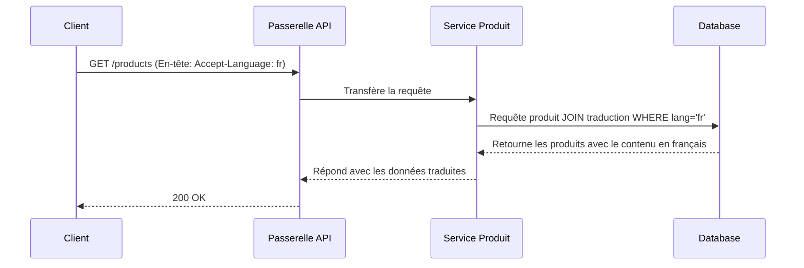

### **Rapport d'Architecture : Internationalisation de la Plateforme E-commerce**

#### **Résumé Exécutif**

Afin d'étendre la portée de la plateforme aux marchés francophone, arabophone et anglophone, une stratégie complète d'internationalisation (i18n) et de localisation (l10n) est requise. Ce rapport détaille une approche architecturale pragmatique et rapide à mettre en œuvre, axée sur trois principes fondamentaux qui assurent une séparation claire des responsabilités entre les différentes parties de l'application.

1.  **Une Couche de Présentation Découplée :** Le frontend devient l'unique responsable de la localisation, incluant la langue de l'interface, le formatage régional et la direction de l'affichage.
2.  **Un Modèle de Données Multilingue Centralisé :** Le backend adapte sa structure de données pour stocker le contenu textuel (noms, descriptions) dans plusieurs langues.
3.  **Une Communication Inter-Services Agnostique :** La communication entre les microservices est standardisée pour être indépendante de la langue, préservant ainsi la robustesse de l'architecture.

Pour la gestion des devises, ce rapport préconise la solution la plus simple : une **conversion en temps réel effectuée directement par le navigateur de l'utilisateur (côté client)**.

---

### **1. Principe : Couche de Présentation Découplée pour la Localisation Dynamique**

La responsabilité de l'adaptation de l'interface utilisateur incombe entièrement à l'application frontend. Cette approche maximise la flexibilité et permet au backend de se concentrer sur la livraison de données brutes et standardisées.

*   **Langue et Texte :** Tous les textes de l'interface utilisateur seront externalisés dans des fichiers de traduction (par exemple, JSON). L'application chargera dynamiquement le fichier correspondant à la langue sélectionnée par l'utilisateur. [Source : W3C Internationalization (I18n) Activity](https://www.w3.org/International/).

*   **Devises et Formats Numériques :** Le backend ne gère qu'une seule devise de base (par exemple, USD). Le frontend est responsable de :
    1.  Récupérer le prix de base depuis l'API du `product-service`.
    2.  Interroger une API externe de taux de change pour obtenir le taux de conversion vers la devise de l'utilisateur (EUR, DZD).
    3.  Effectuer le calcul de conversion directement dans le navigateur.
    4.  Utiliser l'**API d'Internationalisation native (`Intl`)** pour afficher le prix converti avec le bon formatage local. [Source : MDN Web Docs: Intl](https://developer.mozilla.org/fr/docs/Web/JavaScript/Reference/Global_Objects/Intl).

*   **Direction de l'Affichage (RTL/LTR) :** Pour supporter l'arabe, le frontend ajustera dynamiquement l'attribut `dir="rtl"` sur l'élément HTML racine. L'utilisation des **Propriétés Logiques CSS** permettra au navigateur de réorganiser automatiquement la mise en page. [Source : MDN Web Docs: CSS Logical Properties](https://developer.mozilla.org/fr/docs/Web/CSS/Logical_Properties).

**Diagramme 1 : Séquence de Conversion de Devise Côté Client**
*Illustre comment le frontend gère de manière autonome l'affichage des prix.*



**Diagramme 2 : Flux d'Adaptation de la Mise en Page (RTL/LTR)**
*Montre la logique de décision pour l'ajustement de la mise en page.*

```mermaid
graph TD
    A[Langue changée] --> B{La langue est-elle RTL ?};
    B -- Oui --> C[Définir l'attribut HTML dir="rtl"];
    B -- Non --> D[Définir l'attribut HTML dir="ltr"];
    C & D --> E[Le navigateur applique les Propriétés Logiques CSS];
    E --> F[La mise en page s'ajuste automatiquement];
```

---

### **2. Principe : Modèle de Données Multilingue Centralisé**

L'architecture backend est adaptée pour traiter le contenu multilingue comme un élément central du modèle de données, garantissant ainsi l'intégrité et la scalabilité du contenu textuel.

*   **Schéma de la Base de Données :** Les champs de contenu traduisibles, tels que le `name` d'un produit, sont déplacés vers une table de traduction dédiée, `ProductTranslation`. Cette table est liée par une relation un-à-plusieurs à la table `Product`. [Source : A Pragmatic Guide to Database Internationalization](https://www.launchdarkly.com/blog/a-pragmatic-guide-to-database-internationalization-i18n/).

*   **Récupération de Données via l'API :** L'API du `product-service` utilise la **négociation de contenu**. Le client envoie un en-tête `Accept-Language` (par exemple, `fr`). Le service backend utilise cet en-tête pour effectuer une `JOIN` en base de données, récupérant les informations de base du produit ainsi que sa traduction française correspondante. [Source : MDN Web Docs: Accept-Language Header](https://developer.mozilla.org/fr/docs/Web/HTTP/Headers/Accept-Language).

**Diagramme 3 : Schéma Entité-Relation pour le Contenu Multilingue**
*Illustre la structure normalisée pour le stockage des informations textuelles.*



**Diagramme 4 : Flux de Requête de Données Sensible à la Langue**
*Montre comment l'API utilise l'en-tête `Accept-Language` pour retourner le bon contenu.*



---

### **3. Principe : Communication Inter-Services Agnostique**

Pour maintenir une architecture de microservices découplée, toutes les communications doivent être indépendantes de la langue et de la région.

*   **Messages d'Erreur de l'API :** Les services backend ne retourneront plus de messages d'erreur textuels. Ils enverront à la place des **clés d'erreur** (par exemple, `{"messageKey": "error.sku.alreadyExists"}`). Le frontend se chargera de traduire cette clé. [Source : Microsoft REST API Guidelines on Localization](https://github.com/microsoft/api-guidelines/blob/vNext/Guidelines.md#15-globalization).

*   **Notifications par Événements :** Pour les opérations asynchrones, le service initiateur (`auth-service`) doit inclure la langue préférée de l'utilisateur dans le message Kafka (par exemple, `payload: { "locale": "fr", ... }`). Le `notification-service`, en consommant ce message, utilisera ce champ `locale` pour sélectionner le modèle d'email localisé approprié. [Source : W3C Personalization Semantics](https://www.w3.org/TR/personalization-semantics-1.0/).
