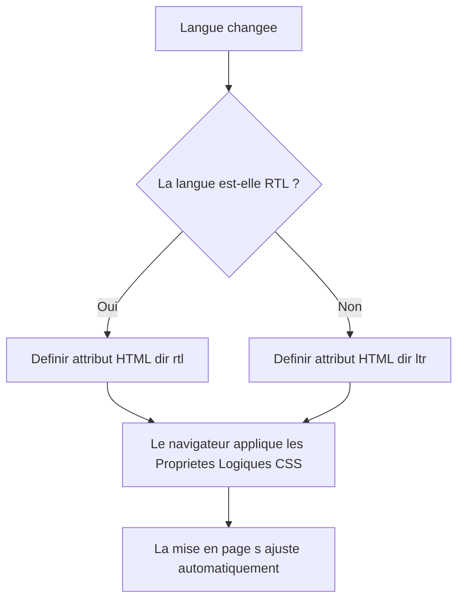
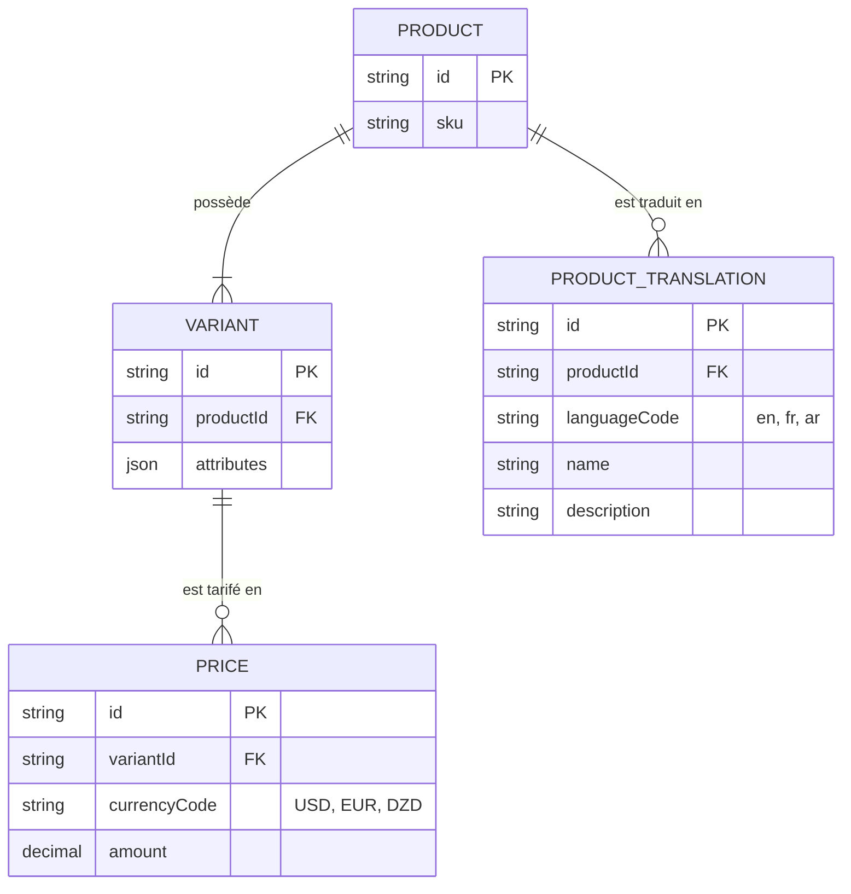
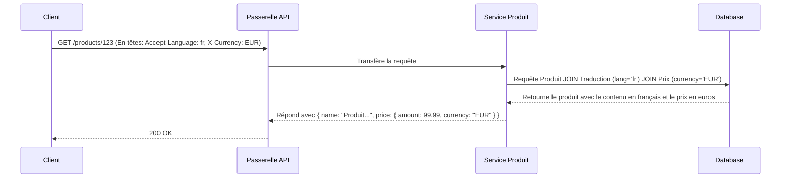
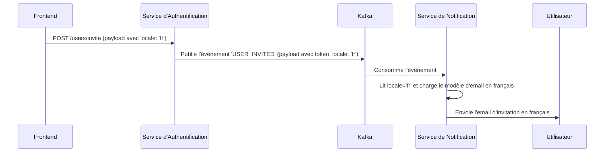

### **Rapport d'Architecture Final : Internationalisation de la Plateforme E-commerce**

#### **Résumé Exécutif**

Ce rapport détaille la stratégie architecturale recommandée pour l'internationalisation (i18n) et la localisation (l10n) de la plateforme. L'objectif est de permettre un support natif pour le français, l'arabe et l'anglais, tout en garantissant la scalabilité et la maintenabilité du système. L'architecture repose sur trois principes fondamentaux qui établissent une séparation stricte des responsabilités entre les différentes couches de l'application.

1.  **Une Couche de Présentation Découplée :** Le frontend est l'unique responsable de toute la logique de localisation, incluant la langue de l'interface, le formatage des devises et la direction de l'affichage (LTR/RTL).
2.  **Un Modèle de Données Centralisé, Multilingue et Multi-Devises :** Le backend et sa base de données sont structurés pour stocker et servir le contenu et les prix dans plusieurs langues et devises en tant qu'entités de données distinctes.
3.  **Une Communication Inter-Services Agnostique :** La communication entre les microservices est standardisée pour être indépendante de la langue, préservant la robustesse de l'architecture découplée.

---

### **1. Principe : Couche de Présentation Découplée pour la Localisation Dynamique**

La responsabilité de l'adaptation de l'interface utilisateur incombe entièrement à l'application frontend. Cette approche maximise la flexibilité et permet au backend de se concentrer sur la livraison de données brutes.

*   **Texte de l'Interface (UI Strings) vs. Données de Contenu :** Une distinction fondamentale est faite. Le **texte de l'interface** ("Ajouter au panier", "Se connecter") réside exclusivement dans des fichiers de traduction au sein du projet frontend. Les **données de contenu** (nom du produit, description) sont fournies par le backend.

*   **Formatage des Devises et Nombres :** Le backend transmet les valeurs monétaires dans un format neutre (ex: `{ "amount": 99.99, "currency": "EUR" }`). Le frontend utilise l'**API d'Internationalisation native du navigateur (`Intl`)** pour afficher cette information selon les conventions locales de l'utilisateur.

*   **Direction de l'Affichage (LTR/RTL) :** Pour supporter les langues s'écrivant de droite à gauche comme l'arabe, le frontend basculera dynamiquement l'attribut `dir="rtl"` sur l'élément HTML racine. En s'appuyant sur les **Propriétés Logiques CSS**, le navigateur réorganisera automatiquement la mise en page.

**Diagramme 1 : Flux d'Adaptation de la Mise en Page (RTL/LTR)**

---

### **2. Principe : Modèle de Données Centralisé, Multilingue et Multi-Devises**

L'architecture des données est modifiée pour traiter nativement le contenu multilingue et les prix multi-devises, garantissant stabilité et contrôle métier.

*   **Contenu Multilingue :** Les champs de contenu traduisibles (nom, description) sont externalisés dans une table `ProductTranslation` dédiée. Cette approche de "table de traduction" est une solution de normalisation robuste.

*   **Prix Multi-Devises :** Pour assurer une stabilité des prix, une table `Price` est créée, liée à chaque `Variant` de produit. Cette table permet de définir des prix fixes et distincts pour chaque devise supportée (USD, EUR, DZD).

*   **API Contextuelle :** L'API du `product-service` interprète les en-têtes HTTP `Accept-Language` et `X-Currency` pour effectuer les jointures (`JOIN`) appropriées en base de données et retourner la représentation complète et localisée de la ressource.

**Diagramme 2 : Schéma Entité-Relation Final pour les Produits**

**Diagramme 3 : Flux de Requête de Données Localisées (Langue et Devise)**

---

### **3. Principe : Communication Inter-Services Agnostique**

Toutes les communications entre microservices doivent être indépendantes de la langue pour préserver le découplage et la maintenabilité de l'architecture.

*   **Messages d'Erreur de l'API :** Les services retournent des **clés d'erreur** standardisées (ex: `{"messageKey": "error.sku.alreadyExists"}`). La responsabilité de la traduction de ces clés incombe au client.

*   **Notifications par Événements :** Pour les processus asynchrones, la préférence linguistique de l'utilisateur doit être propagée dans le message de l'événement. L'événement Kafka `USER_INVITED` contiendra un champ `locale: "fr"`. Le `notification-service` utilisera ce champ pour sélectionner le modèle d'email approprié.

**Diagramme 4 : Flux de Notification Asynchrone et Multilingue**

