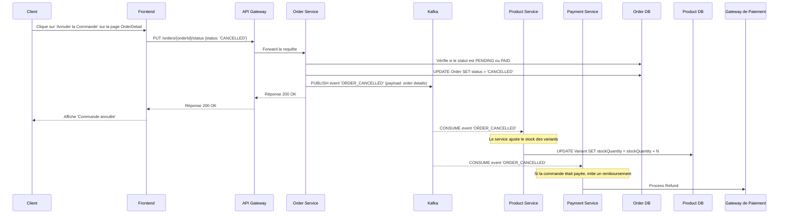
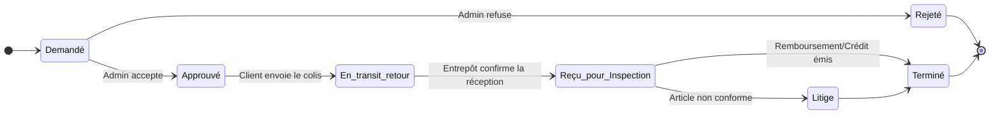
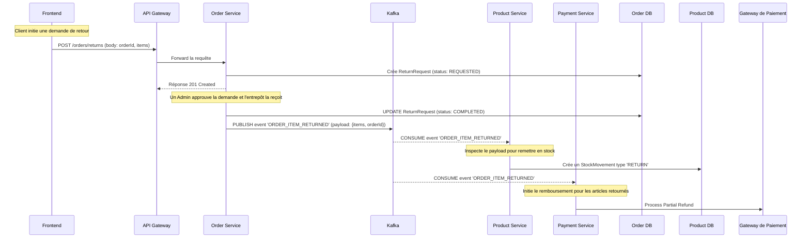

### **Rapport sur les Fonctionnalités Post-Achat : Annulation, Modification et Retours**

Ce document décrit la logique métier, les cas d'usage, les cas limites et les impacts techniques pour l'introduction de fonctionnalités de gestion des commandes après leur création.

---

### 1. Annulation de Commande

La fonctionnalité d'annulation est la plus simple à mettre en œuvre, mais elle nécessite des règles strictes pour éviter des problèmes de stock et de paiement.

#### **Logique Métier**

*   **Fenêtre d'Annulation (Client)** : Un client ne peut annuler sa commande que si son statut n'a pas encore atteint `SHIPPED`. Dans votre `order-service`, cela correspond aux statuts `PENDING` ou `PAID`. Le bouton d'annulation sur le composant `OrderDetail.jsx` du frontend doit être conditionnellement affiché.
*   **Annulation (Admin)** : Un administrateur (ou un rôle avec la permission `update:order`) peut annuler une commande à presque n'importe quelle étape, pour des raisons telles que la détection de fraude, une rupture de stock imprévue ou à la demande directe du client.
*   **Impact sur le Stock** : Une annulation doit **impérativement** remettre les articles en stock.
*   **Impact sur le Paiement** : Si la commande a été payée (`PAID`), une annulation doit déclencher un remboursement complet.

#### **Flux de Processus (Diagramme de Séquence)**

Voici comment le processus d'annulation par un client fonctionnerait à travers vos microservices :



#### **Cas Limites (Edge Cases)**

*   **Condition de Course (Race Condition)** : Si un administrateur marque la commande comme `SHIPPED` au même moment où le client l'annule, la transaction dans la base de données de `Order Service` doit garantir que seul le premier état est accepté.
*   **Échec du Remboursement** : Si le remboursement échoue, la commande doit potentiellement être placée dans un statut spécial comme `CANCELLATION_FAILED` pour une intervention manuelle.

---

### 2. Modification de Commande

La modification d'une commande existante est d'une complexité considérable. **La recommandation métier est de ne pas l'implémenter dans un premier temps** et de privilégier une politique "Annuler et repasser la commande".

#### **Logique Métier et Complexités**

*   **Paiement** :
    *   **Ajout d'article** : Nécessite une nouvelle autorisation de paiement pour la différence de prix, ce qui est complexe et risqué en termes de sécurité.
    *   **Suppression d'article** : Nécessite un remboursement partiel, que votre `Payment Service` doit pouvoir gérer.
*   **Stock** : L'ajout d'un article nécessite une vérification de stock en temps réel.
*   **Promotions** : Les promotions appliquées à la commande initiale peuvent devenir invalides, nécessitant un recalcul complet du panier.

#### **Flux Recommandé (Diagramme de Flux)**

La politique "Annuler et Recommander" est plus simple et plus sûre à mettre en œuvre.

```mermaid
graph TD
    A[Client veut modifier la commande] --> B{Commande déjà expédiée?}
    B -- Oui --> C[Modification impossible. Procéder à un retour.]
    B -- Non --> D[Le client est invité à annuler sa commande]
    D --> E[Processus d'Annulation (voir section 1)]
    E --> F[Remboursement complet est initié]
    E --> G[Les articles sont remis en stock]
    E --> H[Client est invité à passer une nouvelle commande corrigée]
```

---

### 3. Retours et Remboursements

Ce processus est crucial pour la confiance client et nécessite une modélisation claire. Il est initié *après* que la commande ait été `DELIVERED`.

#### **Logique Métier et Règles**

1.  **Éligibilité au Retour** :
    *   Certains produits ne sont pas retournables (ex: produits personnalisés, sous-vêtements).
    *   Il y a une période de retour (ex: 14 ou 30 jours après la livraison).
    *   **Impact** : Le modèle `Product` dans `product-service` doit être enrichi.

2.  **Processus RMA (Return Merchandise Authorization)** :
    *   **Demande** : Le client fait une demande de retour depuis son historique de commandes.
    *   **Approbation** : Un admin approuve ou rejette la demande.
    *   **Expédition** : Le client retourne le produit.
    *   **Inspection** : L'entrepôt reçoit et inspecte l'article.
    *   **Résolution** : Un remboursement (total, partiel) ou un crédit en magasin est émis.

#### **Cycle de Vie d'une Demande de Retour (Diagramme d'État)**



#### **Impact sur le Stock**

*   **Remise en Stock** : Si l'article est en parfait état, le stock est incrémenté.
*   **Stock Défectueux** : Si l'article est endommagé, il est mis de côté et non remis en stock vendable.
*   **Impact** : L'enum `StockMovementType` dans `product-service` doit inclure une nouvelle valeur comme `RETURN`.

---

### 4. Modifications Suggérées du Schéma de Base de Données

Pour supporter ces logiques, des modifications sont nécessaires.

#### **Dans `product-service/prisma/schema.prisma`**

Ajoutez ces champs au modèle `Product` :

```prisma
model Product {
  // ... champs existants
  isReturnable  Boolean @default(true)
  returnPeriodDays Int  @default(14)
}

// Ajouter un type de mouvement pour les retours
enum StockMovementType {
  INITIAL_STOCK
  ADMIN_UPDATE
  ORDER
  ADJUSTMENT
  ORDER_CANCELLED
  RETURN // <-- AJOUTER
}
```

#### **Dans `order-service/prisma/schema.prisma`**

Il faut ajouter de nouveaux modèles pour gérer les demandes de retour.

```prisma
enum ReturnStatus {
  REQUESTED
  APPROVED
  REJECTED
  SHIPPED_BY_CUSTOMER
  RECEIVED_FOR_INSPECTION
  COMPLETED
  DISPUTED
}

model ReturnRequest {
  id          String   @id @default(uuid())
  orderId     String
  order       Order    @relation(fields: [orderId], references: [id])
  status      ReturnStatus @default(REQUESTED)
  reason      String?
  adminNotes  String?
  createdAt   DateTime @default(now())
  updatedAt   DateTime @updatedAt

  items ReturnRequestItem[]

  @@index([orderId])
}

model ReturnRequestItem {
  id              String   @id @default(uuid())
  returnRequestId String
  returnRequest   ReturnRequest @relation(fields: [returnRequestId], references: [id], onDelete: Cascade)
  orderItemId     String
  orderItem       OrderItem @relation(fields: [orderItemId], references: [id])
  quantity        Int

  @@index([returnRequestId])
  @@unique([returnRequestId, orderItemId]) // Un article ne peut être retourné qu'une fois par demande
}
```

---

### 5. Flux de Communication Inter-Services pour un Retour

Le processus de retour illustre parfaitement la collaboration entre vos services via Kafka.



### Conclusion

1.  **Annulation** : Peut être implémentée avec une logique claire. L'enjeu principal est la synchronisation atomique du stock et des remboursements.
2.  **Modification** : Il est fortement recommandé d'adopter une politique **"Annuler et Recommander"** pour éviter la complexité de la gestion des paiements.
3.  **Retours** : C'est une fonctionnalité essentielle qui nécessite une modélisation soignée (nouveaux modèles de BDD), une logique métier claire (politique de retour) et une communication robuste entre les services.

L'approche décrite ci-dessus s'intègre naturellement dans votre architecture microservices existante, en utilisant Kafka comme bus d'événements pour maintenir la cohérence des données entre les domaines de `Order`, `Product` et `Payment`.
