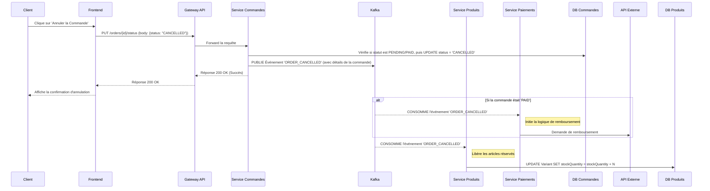
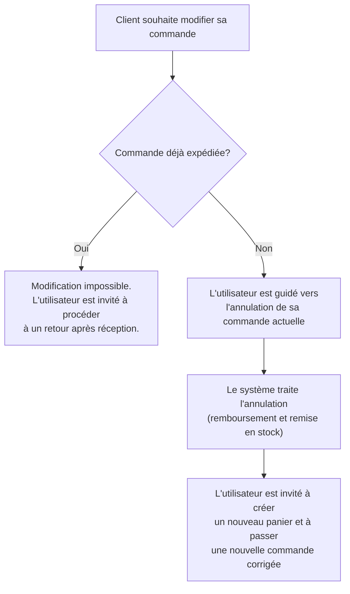
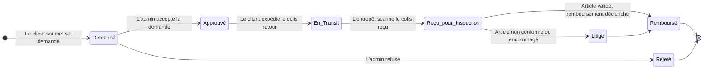
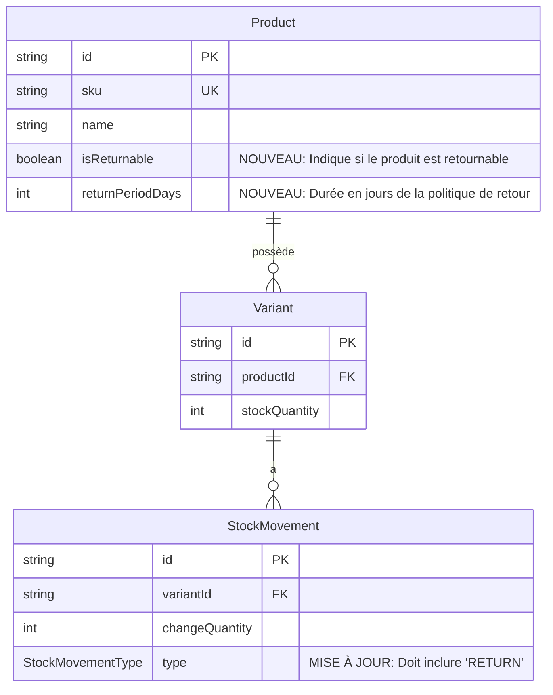
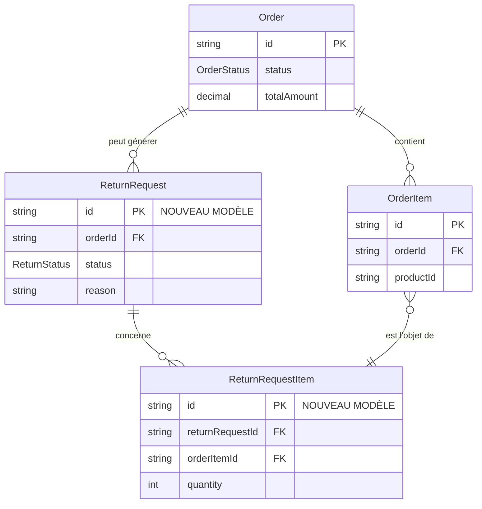
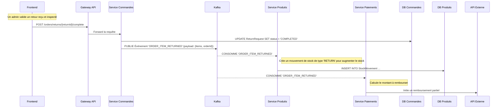

### **Rapport Complet sur l'Implémentation des Fonctionnalités Post-Achat**

**Objet :** Définition de la logique métier, des flux de processus et des impacts architecturaux pour l'intégration des fonctionnalités d'annulation, de modification et de retour de commandes au sein de la plateforme e-commerce.

**Date :** 15 août 2025

**Auteur :** Gemini AI

---

#### **Introduction**

L'objectif de ce document est de fournir un cadre stratégique et technique pour le développement des fonctionnalités post-achat. Ces fonctionnalités sont critiques pour l'expérience client et l'efficacité opérationnelle. Nous analyserons chaque fonctionnalité en la liant directement à l'architecture microservices existante, aux schémas de base de données et aux flux de communication via Kafka.

---

### **1. Annulation de Commande**

L'annulation est la première fonctionnalité post-achat essentielle. Sa mise en œuvre doit être rigoureusement contrôlée pour garantir la cohérence des données de stock et de paiement.

#### **1.1 Logique Métier**

*   **Règles d'Annulation :**
    *   **Par le Client :** Un client peut annuler sa propre commande de manière autonome tant que celle-ci n'a pas atteint le statut `SHIPPED`. Les statuts éligibles sont donc `PENDING` et `PAID`. L'interface utilisateur, notamment le composant `OrderDetail.jsx`, devra masquer l'option d'annulation une fois ce seuil dépassé.
    *   **Par un Administrateur :** Un utilisateur disposant de la permission `update:order` peut annuler une commande à presque n'importe quelle étape avant la livraison effective. Les motifs incluent la suspicion de fraude, une rupture de stock imprévue, ou une demande client hors délai.
*   **Conséquences Systémiques :**
    *   **Gestion des Stocks :** L'annulation d'une commande doit déclencher la **restitution immédiate** des quantités réservées au stock vendable. C'est une opération critique.
    *   **Gestion des Paiements :** Si la commande avait le statut `PAID`, l'annulation doit **automatiquement initier un remboursement intégral** via le `Payment Service`.

#### **1.2 Flux de Processus (Diagramme de Séquence)**

Ce diagramme illustre le flux complet d'une annulation initiée par le client.

#### **1.3 Cas Limites à Considérer**

*   **Condition de Course (Race Condition) :** Un client annule en même temps qu'un employé scanne le colis pour l'expédition. La transaction dans la base de données du `Order Service` doit être atomique pour garantir que seule la première opération réussit. L'autre doit recevoir une erreur claire (ex: "Impossible d'annuler, la commande vient d'être expédiée").
*   **Échec du Remboursement :** Si l'API de paiement retourne une erreur lors du remboursement, la commande doit être marquée avec un statut spécifique (ex: `CANCELLATION_ERROR`) pour alerter une équipe de support.

---

### **2. Modification de Commande**

La modification d'une commande en cours est une fonctionnalité d'une grande complexité.

**Recommandation Stratégique :** Ne pas implémenter la modification directe dans la version initiale. Adopter une politique claire et simple : **"Annuler la commande et en passer une nouvelle."**

#### **2.1 Justification de la Recommandation**

*   **Complexité des Paiements :**
    *   **Ajout d'article :** Nécessiterait une nouvelle autorisation de paiement du client pour le montant additionnel, ce qui est un défi technique et sécuritaire majeur.
    *   **Retrait d'article :** Nécessiterait un remboursement partiel, qui doit être supporté par le `Payment Service` et la passerelle de paiement.
*   **Complexité des Promotions :** Un changement dans le panier peut invalider des promotions appliquées, obligeant un recalcul complet et potentiellement confus pour le client.
*   **Alternative Simple :** Le flux "Annuler et Recommander" est universellement compris, ne présente pas de risques de paiement et s'appuie sur des fonctionnalités déjà existantes (annulation, création de commande).

#### **2.2 Flux de Processus Utilisateur Recommandé (Corrigé)**

Ce diagramme illustre l'approche recommandée, qui guide l'utilisateur vers une solution simple.

---

### **3. Retours de Commande (Processus RMA)**

Ce processus est fondamental pour la confiance client et gère le cycle de vie d'un produit après sa livraison.

#### **3.1 Logique Métier**

1.  **Éligibilité au Retour :** Chaque produit doit avoir des règles de retour claires.
    *   **Attribut `isReturnable` (booléen) :** Définit si un article peut être retourné.
    *   **Attribut `returnPeriodDays` (entier) :** Définit la fenêtre de retour (ex: 30 jours après la date de livraison).
2.  **Processus RMA (Return Merchandise Authorization) :**
    *   **Étape 1 - Demande :** Le client initie une demande depuis son historique de commandes (`OrderDetail.jsx`).
    *   **Étape 2 - Approbation :** Un admin examine la demande et peut l'approuver ou la rejeter.
    *   **Étape 3 - Réception & Inspection :** L'entrepôt reçoit l'article retourné et vérifie son état.
    *   **Étape 4 - Résolution :** Un remboursement (total/partiel), un crédit en magasin ou un échange est effectué.

#### **3.2 Diagramme d'État d'une Demande de Retour**

Ce diagramme montre les transitions possibles pour une demande de retour.

---

### **4. Modifications Proposées du Modèle de Données (ERD)**

Pour supporter ces nouvelles logiques, les schémas de vos bases de données doivent être étendus.

#### **4.1 Diagramme Entité-Relation - Modifications pour `product-service`**

#### **4.2 Diagramme Entité-Relation - Nouveaux Modèles pour `order-service`**

---

### **5. Flux de Communication Inter-Services pour un Retour**

Le processus de retour est un excellent exemple de la collaboration asynchrone entre vos services.

---

### **Conclusion et Recommandations**

1.  **Annulation :** **À implémenter.** C'est une fonctionnalité attendue et gérable. La priorité est de garantir l'atomicité des opérations de stock et de remboursement via des transactions et des événements fiables.

2.  **Modification :** **À reporter.** Adopter la politique **"Annuler et Recommander"** pour réduire drastiquement la complexité et les risques, tout en offrant une solution fonctionnelle aux utilisateurs.

3.  **Retours :** **À implémenter.** C'est un processus complexe mais non négociable pour un e-commerce moderne. Il nécessite les évolutions de schéma proposées et une orchestration événementielle rigoureuse pour maintenir la cohérence des données à travers les services.

L'adoption de ces stratégies permettra d'enrichir la plateforme de manière robuste et maîtrisée, en capitalisant sur les forces de votre architecture microservices.
