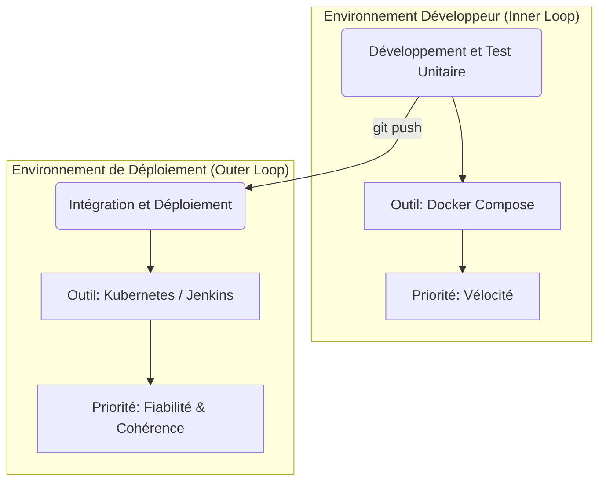
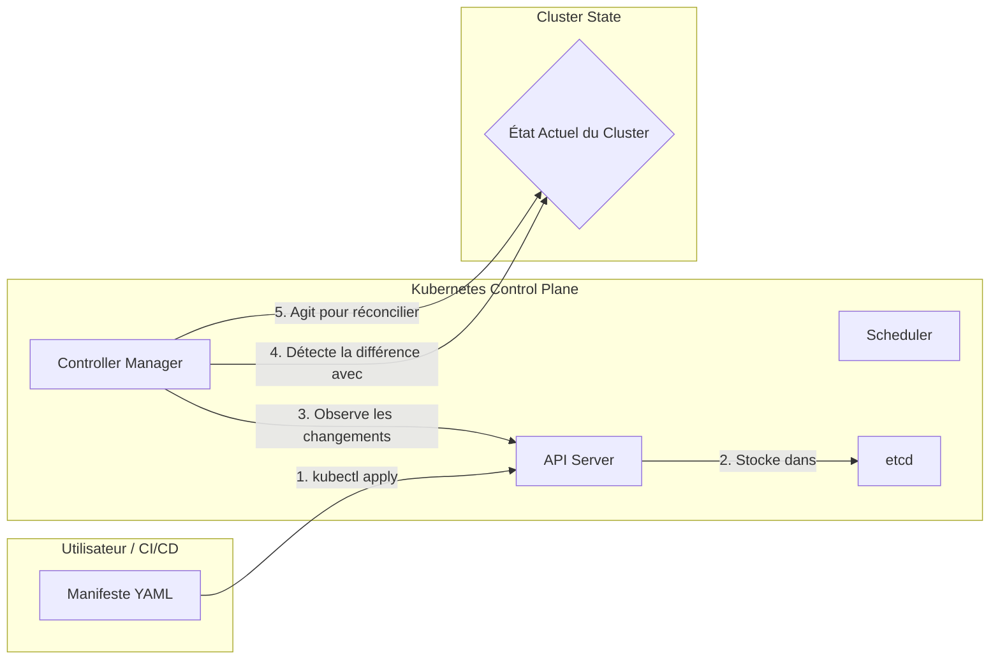
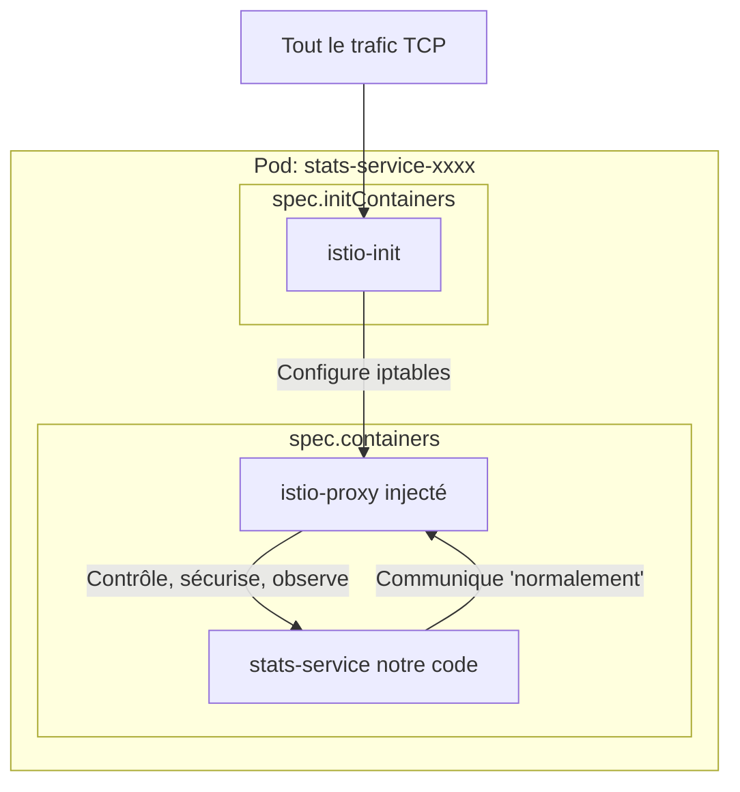
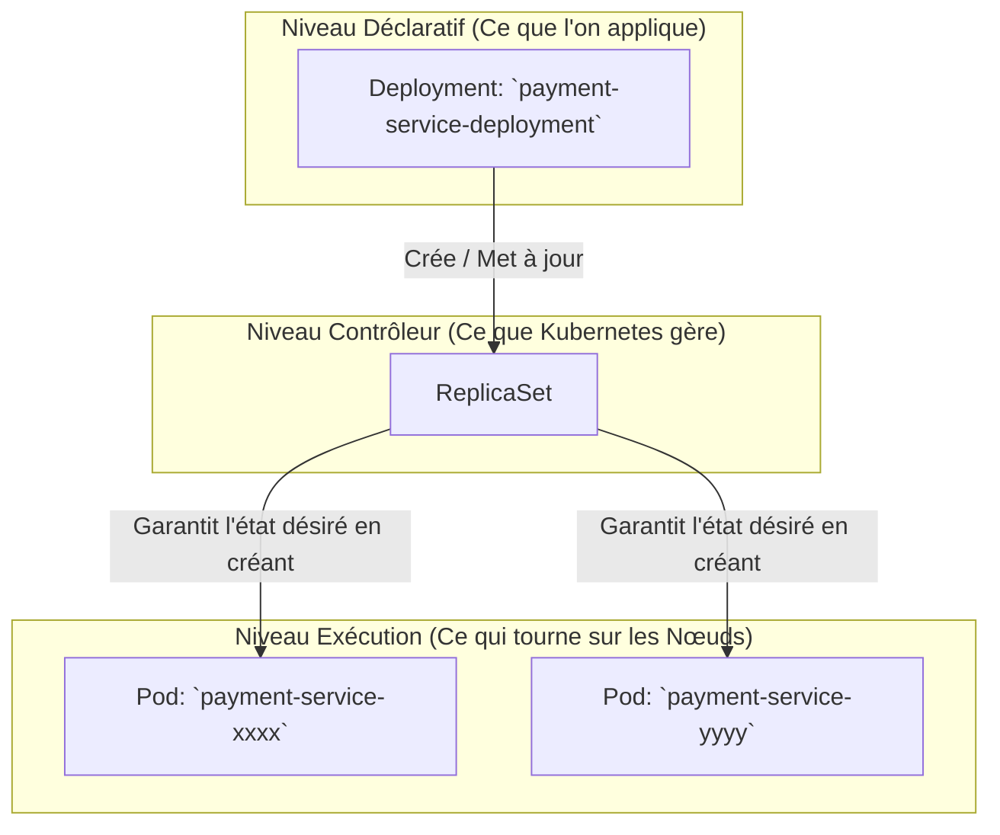
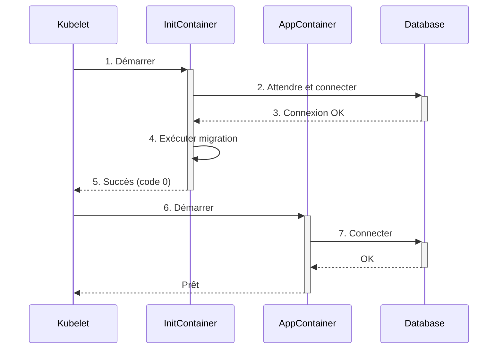
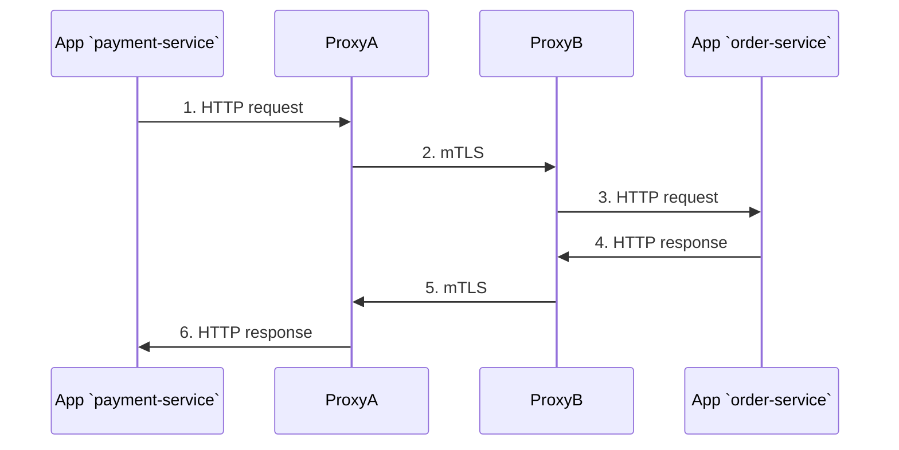
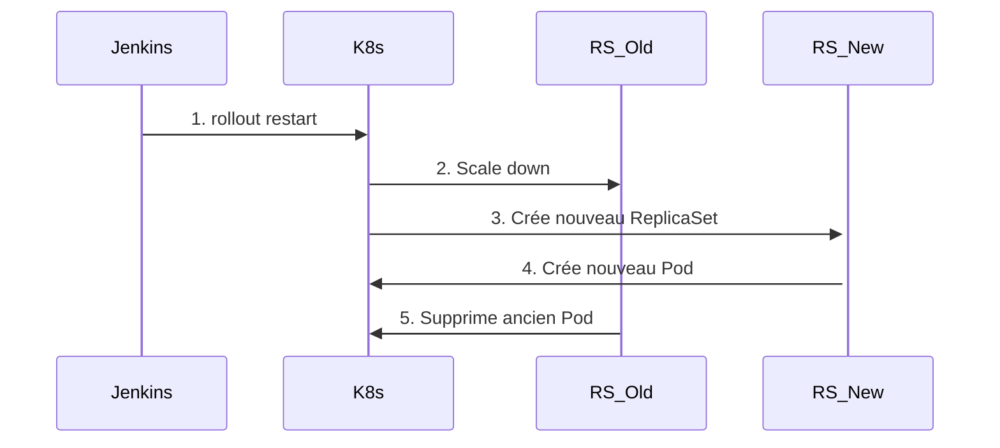
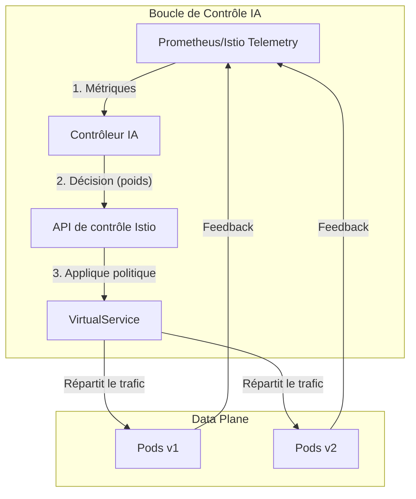

# **Rapport Technique Exhaustif : Conception et Implémentation d'une Infrastructure de Déploiement Industrialisée pour une Plateforme Microservices sur Kubernetes**

**Sous-titre :** Une Fondation pour le Déploiement Continu et une Plateforme pour la Recherche en IA sur le `Service Mesh`

**Phase du Projet :** Industrialisation, Déploiement et Préparation pour la Recherche Avancée

**Présenté par :**
HARCHE Samir

**Sous la direction de :**
Dr. Abdelhak Djamel Seriai

---

## **Abstract**

Ce rapport technique documente la seconde phase majeure du projet de plateforme e-commerce, marquant sa transition d'un *Produit Minimum Viable (MVP)*, initialement orchestré avec `Docker Compose`, vers une architecture industrialisée et prête pour la production. L'objectif principal est la conception et la mise en œuvre d'une infrastructure de déploiement robuste, scalable et entièrement automatisée, en utilisant des technologies de pointe. Le cœur de cette infrastructure repose sur **`Kubernetes (K8s)`**, avec des clusters locaux à haute-fidélité provisionnés par **`Kind`**. Une attention particulière est portée à l'intégration du `Service Mesh` **`Istio`**, qui transcende le simple routage pour devenir une fondation critique pour des travaux de recherche futurs dans le cadre d'un second projet de Master intitulé "Techniques IA dans les applications microservices". Ce rapport dissèque en profondeur les manifestes `YAML` de `Kubernetes`, en détaillant des `patterns` essentiels tels que les **`Init Containers`** pour la fiabilisation des dépendances et la séparation stratégique des ressources. Il analyse également le pipeline **`CI/CD`** orchestré par **`Jenkins`**, qui automatise l'ensemble du cycle de vie du déploiement. Le document conclut en présentant une infrastructure non seulement apte au déploiement, mais également conçue comme une plateforme expérimentale pour des algorithmes avancés d'équilibrage de charge pilotés par l'IA.

---

## **Table des Matières**

**1. Introduction et Contexte Stratégique**
    1.1. Évolution depuis le Produit Minimum Viable (MVP)
    1.2. La Stratégie d'Infrastructure à Double Volet
        1.2.1. Le "Inner Loop" : Optimisation de la Vélocité avec Docker Compose
        1.2.2. Le "Outer Loop" : Fiabilité et Cohérence avec Kubernetes
    1.3. Objectif Stratégique du `Service Mesh` : Plateforme pour la Recherche en IA
    1.4. Structure du Rapport

**2. Fondations de l'Infrastructure : Principes et Choix Technologiques**
    2.1. `Kubernetes` : L'Orchestrateur Déclaratif
        2.1.1. Le Modèle Déclaratif : État Désiré vs État Actuel
        2.1.2. Architecture de `Kubernetes` : `Control Plane` et `Worker Nodes`
    2.2. `Kind (Kubernetes in Docker)` : Le Développement à Haute-Fidélité
        2.2.1. Principe et Justification
        2.2.2. Analyse de la Configuration (`kind-cluster-config.yaml`)
    2.3. `Istio` : Le `Service Mesh` pour le Contrôle et l'Observabilité
        2.3.1. Justification du Choix d'un `Service Mesh`
        2.3.2. Architecture d'Istio : `Data Plane` vs `Control Plane`
        2.3.3. Anatomie Détaillée d'un `Pod` dans le Maillage

**3. Analyse Structurelle du Déploiement : Les Manifestes Kubernetes**
    3.1. Stratégie de Décomposition : `infra-manifests.yaml` vs `app-manifests.yaml`
    3.2. Analyse des Manifestes d'Infrastructure (`infra-manifests.yaml`)
        3.2.1. Déploiement de `Kafka` et `Zookeeper`
        3.2.2. Déploiement d'`Elasticsearch`
        3.2.3. Déploiement de `Redis`
        3.2.4. Déploiement des Bases de Données `PostgreSQL`
        3.2.5. Justification de l'Annotation `sidecar.istio.io/inject: "false"`
    3.3. Analyse des Manifestes Applicatifs (`app-manifests.yaml`)
        3.3.1. Les Objets Fondamentaux : `Deployment`, `Service`, `ReplicaSet` et `Pod`
        3.3.2. Configuration des Services : Variables d'Environnement et DNS Interne
        3.3.3. Le `Pattern Init Container` : Gestion des Dépendances au Démarrage

**4. Gestion Avancée du Trafic avec Istio**
    4.1. Le Point d'Entrée du Maillage : La Ressource `Gateway`
    4.2. Routage Programmable : La Ressource `VirtualService`
        4.2.1. Le Mécanisme de `Match` sur l'URI
        4.2.2. Découplage des APIs avec la Directive `rewrite`
    4.3. Communication Inter-`Pod` au sein du Maillage : La Transparence du `Sidecar`

**5. Automatisation du Cycle de Vie : Le Pipeline CI/CD avec Jenkins**
    5.1. Provisioning du Cluster avec le Script `setup-kind.sh`
        5.1.1. Séquence des Opérations du Script
        5.1.2. Configuration d'Istio et du `Namespace` Applicatif
    5.2. Analyse Approfondie du `Jenkinsfile`
        5.2.1. Pipeline Déclaratif et Environnement
        5.2.2. `Stage 1`: `Build & Load Application Images` - Une Optimisation Locale
        5.2.3. `Stage 2`: `Deploy Application` - Le Cœur du Déploiement
        5.2.4. Le Défi du Tag `:latest` et la Solution `kubectl rollout restart`
        5.2.5. Le `post` Block : Garantir la Visibilité en cas d'Échec

**6. Conclusion : Une Plateforme Évolutive pour le Déploiement et la Recherche**
    6.1. Synthèse des Réalisations et de la Maturité Atteinte
    6.2. Vers un Équilibrage de Charge Intelligent : Prochaines Étapes
        6.2.1. La Boucle de Contrôle IA : Architecture Cible
        6.2.2. Exploitation de la Télémétrie d'Istio
        6.2.3. Développement du Contrôleur Externe
        6.2.4. Pilotage Dynamique du `VirtualService`

---
*(Début du contenu intégral du rapport)*
---

## **1. Introduction et Contexte Stratégique**

### **1.1. Évolution depuis le Produit Minimum Viable (MVP)**
Ce document s'inscrit dans la continuité d'une première phase de développement qui avait permis de valider la conception d'une plateforme e-commerce via un *Produit Minimum Viable (MVP)*. Cette phase initiale reposait sur une orchestration simplifiée via `Docker Compose`. Si cette approche a prouvé son efficacité pour le prototypage rapide et la validation des logiques métiers, elle ne présente pas les garanties de résilience, de scalabilité, de sécurité et d'observabilité requises par un environnement de production. Le présent travail documente le saut qualitatif vers une architecture d'entreprise, prête pour le déploiement.

### **1.2. La Stratégie d'Infrastructure à Double Volet**
Le projet adopte une philosophie pragmatique qui distingue clairement le cycle de développement du cycle de déploiement.

#### **1.2.1. Le "Inner Loop" : Optimisation de la Vélocité avec Docker Compose**
Pour le travail quotidien, l'efficacité prime. `Docker Compose`, piloté par des scripts shell (`dev.sh`), permet au développeur de lancer l'intégralité de la pile de services en une commande et de bénéficier du *hot-reloading* pour un retour d'information immédiat. C'est l'environnement optimisé pour la vitesse de codage.

#### **1.2.2. Le "Outer Loop" : Fiabilité et Cohérence avec Kubernetes**
Dès qu'une fonctionnalité est prête à être intégrée, elle entre dans le "Outer Loop". Cet environnement, basé sur `Kubernetes`, est conçu pour être une réplique fidèle de la production. C'est ici que sont menés les tests d'intégration, les tests de performance et les déploiements finaux. La cohérence et la fiabilité sont ici non-négociables.


***Figure 1.1 : La dichotomie stratégique entre l'environnement de développement et de déploiement.***

### **1.3. Objectif Stratégique du `Service Mesh` : Plateforme pour la Recherche en IA**
L'intégration du `Service Mesh` `Istio` est la décision la plus stratégique de cette architecture. Si elle apporte des bénéfices immédiats (sécurité, observabilité), sa justification principale réside dans son rôle de catalyseur pour une thèse de Master parallèle : **"Techniques IA dans les applications microservices"**. L'objectif de cette recherche est de concevoir des algorithmes d'équilibrage de charge intelligents, qui surpassent les méthodes traditionnelles (`Round Robin`, `Least Connections`). `Istio` expose via son `Control Plane` et ses `proxies` les APIs de télémétrie et de contrôle du trafic indispensables pour :
1.  **Observer** le comportement du système en temps réel (latence, débit, taux d'erreurs).
2.  **Agir** sur le système en modifiant dynamiquement les règles de routage.

L'infrastructure décrite ici est donc, par conception, un **laboratoire expérimental** sophistiqué.

### **1.4. Structure du Rapport**
Ce document est structuré pour une lecture progressive. Il commence par les fondations technologiques, plonge ensuite dans l'analyse détaillée des manifestes de déploiement, explore le contrôle du trafic par `Istio`, détaille le pipeline d'automatisation `CI/CD`, et conclut en synthétisant les acquis et en traçant la feuille de route pour la recherche en IA.

## **2. Fondations de l'Infrastructure : Principes et Choix Technologiques**

### **2.1. `Kubernetes` : L'Orchestrateur Déclaratif**

#### **2.1.1. Le Modèle Déclaratif : État Désiré vs État Actuel**
`Kubernetes` fonctionne sur un principe déclaratif. Le développeur ne donne pas une suite d'ordres impératifs ("démarre ce conteneur, puis connecte-le à celui-ci..."). Il décrit l'**état final désiré** de l'application dans des fichiers `YAML`. Le `Control Plane` de `Kubernetes` travaille ensuite en permanence pour faire converger l'état actuel du cluster vers cet état désiré. C'est la boucle de réconciliation.


***Figure 2.1 : La boucle de réconciliation de `Kubernetes`, cœur du modèle déclaratif.***

#### **2.1.2. Architecture de `Kubernetes` : `Control Plane` et `Worker Nodes`**
Un cluster `Kubernetes` est composé de :
*   **`Control Plane`**: Le cerveau. Il prend les décisions globales sur le cluster (ex: `scheduling` des `Pods`), détecte et répond aux événements. Il est constitué de `kube-apiserver`, `etcd`, `kube-scheduler`, et `kube-controller-manager`.
*   **`Worker Nodes`**: Les machines (virtuelles ou physiques) qui exécutent les charges de travail. Chaque `Node` exécute un `kubelet` (l'agent qui communique avec le `Control Plane`) et un `container runtime` (comme `containerd`). C'est sur ces `Nodes` que nos `Pods` sont lancés.

### **2.2. `Kind (Kubernetes in Docker)` : Le Développement à Haute-Fidélité**

#### **2.2.1. Principe et Justification**
`Kind` lance chaque `Worker Node` et `Control Plane Node` de `Kubernetes` comme un conteneur `Docker`. Cette approche est légère et permet de simuler un cluster multi-nœuds réaliste sur une seule machine de développement. L'avantage est immense : les manifestes `YAML` et les scripts `CI/CD` testés sur `Kind` ont une très haute probabilité de fonctionner à l'identique sur un cluster de production.

#### **2.2.2. Analyse de la Configuration (`kind-cluster-config.yaml`)**
Le fichier `kind-cluster-config.yaml` permet de personnaliser le cluster. La section la plus importante pour nous est `extraPortMappings`. Elle perce des "trous" entre la machine hôte et le conteneur `Docker` qui exécute le `Node` `Kubernetes`.

```yaml
# Extrait de kind-cluster-config.yaml
extraPortMappings:
  # Istio Ingress Gateway
  - containerPort: 30000
    hostPort: 13000
```
Cette configuration est essentielle car elle rend le `NodePort` du `Service` `istio-ingressgateway` accessible depuis l'extérieur du cluster, sur `http://localhost:13000`.


***Figure 2.2 : Visualisation du `Port Mapping` de `Kind` pour exposer le `Service Mesh`.***

### **2.3. `Istio` : Le `Service Mesh` pour le Contrôle et l'Observabilité**

#### **2.3.1. Justification du Choix d'un `Service Mesh`**
Dans une architecture microservices, le réseau devient complexe. Un `Service Mesh` comme `Istio` déplace la logique de communication réseau (résilience, sécurité, routage) des services applicatifs vers une couche d'infrastructure dédiée. Cela permet aux développeurs de se concentrer sur la logique métier.

#### **2.3.2. Architecture d'Istio : `Data Plane` vs `Control Plane`**
`Istio` est aussi architecturalement séparé :
*   **`Data Plane`**: Composé de tous les `proxies` `Envoy` qui sont déployés en `sidecar` de nos applications. Ce sont eux qui manipulent les paquets, appliquent les règles et collectent la télémétrie.
*   **`Control Plane` (`istiod`)**: Un composant central qui configure tous les `proxies` du `Data Plane`. C'est lui qui lit nos ressources `YAML` (`VirtualService`, `Gateway`) et les traduit en configuration `Envoy`.

#### **2.3.3. Anatomie Détaillée d'un `Pod` dans le Maillage**
Lorsque `istio-injection=enabled` est actif sur un `namespace`, le `Control Plane` utilise un `Mutating Admission Webhook` pour intercepter la création de chaque `Pod` et y injecter automatiquement le conteneur `istio-proxy` ainsi que des `initContainers` pour configurer le `firewalling` du `Pod`.


***Figure 2.3 : Le `Pod` après mutation par `Istio`, montrant le rôle du `initContainer` et du `sidecar`.***

## **3. Analyse Structurelle du Déploiement : Les Manifestes Kubernetes**

### **3.1. Stratégie de Décomposition : `infra-manifests.yaml` vs `app-manifests.yaml`**
La séparation des manifestes est une pratique essentielle pour la gestion de la configuration :
*   `infra-manifests.yaml`: Définit les composants tiers `Stateful` (bases de données PostgreSQL, Kafka, Redis, Elasticsearch). Leur cycle de vie est long.
*   `app-manifests.yaml`: Définit nos microservices `Stateless`. Leur cycle de vie est court, lié aux itérations de développement. C'est ce fichier qui est manipulé par le pipeline `CI/CD`.

### **3.2. Analyse des Manifestes d'Infrastructure (`infra-manifests.yaml`)**

#### **3.2.1. Déploiement de `Kafka` et `Zookeeper`**
`Kafka` nécessite `Zookeeper` pour la gestion de sa configuration et la coordination des `brokers`. Les deux sont déployés comme des `Deployments` simples avec un `Service` `ClusterIP` pour la communication interne. Un `Service` `NodePort` est ajouté pour `Kafka` afin de permettre une éventuelle inspection externe depuis la machine hôte.

#### **3.2.2. Déploiement d'`Elasticsearch`**
`Elasticsearch` est déployé comme un `Deployment` à un seul nœud (`discovery.type: single-node`). Un `readinessProbe` est configuré pour s'assurer que le `Pod` n'est déclaré prêt que lorsque le cluster `Elasticsearch` est sain. Le stockage des données est géré par un volume `emptyDir`, suffisant pour un environnement de développement éphémère.

#### **3.2.3. Déploiement de `Redis`**
`Redis` est déployé de manière simple, avec un `Deployment` et un `Service`. Le stockage est également un `emptyDir`.

#### **3.2.4. Déploiement des Bases de Données `PostgreSQL`**
Chaque service `stateful` (`auth`, `product`, `order`, `review`, `stats`) possède sa propre instance `PostgreSQL`, déployée via un `Deployment` et un `Service` dédiés. Cette isolation garantit qu'une défaillance ou une corruption de données dans une base de données n'affecte pas les autres.

#### **3.2.5. Justification de l'Annotation `sidecar.istio.io/inject: "false"`**
Cette annotation est appliquée à tous les `Deployments` d'infrastructure. La raison est double :
1.  **Compatibilité des protocoles**: Certains de ces services utilisent des protocoles TCP non-HTTP. Bien qu'`Istio` puisse les gérer, l'injection d'un `proxy` peut parfois causer des problèmes et ajoute une complexité inutile.
2.  **Performance**: Pour les services de base de données où la latence est critique, contourner le `proxy sidecar` élimine une surcharge réseau minime.

### **3.3. Analyse des Manifestes Applicatifs (`app-manifests.yaml`)**

#### **3.3.1. Les Objets Fondamentaux : `Deployment`, `Service`, `ReplicaSet` et `Pod`**
Pour chaque microservice, nous utilisons une ressource `Deployment`. C'est une abstraction de haut niveau qui gère le cycle de vie des `Pods`.


***Figure 3.1 : Relation entre les objets `Deployment`, `ReplicaSet` et `Pod`.***

#### **3.3.2. Configuration des Services : Variables d'Environnement et DNS Interne**
La communication entre services est gérée par le DNS interne de `Kubernetes`. Par exemple, le `order-service` peut atteindre le `payment-service` via l'adresse `http://payment-service-svc:3009`. Le nom `payment-service-svc` est résolu par `kube-dns` en l'adresse IP interne du `Service`, qui équilibre ensuite la charge vers les `Pods` correspondants. Ces URLs sont injectées dans les conteneurs via des variables d'environnement.

#### **3.3.3. Le `Pattern Init Container` : Gestion des Dépendances au Démarrage**
Un `Pod` ne doit pas être considéré comme "prêt" (`Ready`) si ses dépendances ne le sont pas. Le `pattern Init Container` est la solution native de `Kubernetes` à ce problème. Pour chaque service nécessitant une migration de base de données, nous définissons un `initContainer` qui exécute la commande `npx prisma db push`. Le conteneur principal ne démarrera **que si et seulement si** cet `initContainer` se termine avec un code de sortie `0`.


***Figure 3.2 : Flux de démarrage fiabilisé par un `Init Container`.***

## **4. Gestion Avancée du Trafic avec Istio**

### **4.1. Le Point d'Entrée du Maillage : La Ressource `Gateway`**
Le `Gateway` (`lirmm-gateway`) est une ressource `Istio` qui définit un point d'entrée. Il écoute sur un port du `pod istio-ingressgateway` et spécifie les domaines pour lesquels il accepte du trafic. C'est la porte d'entrée du maillage.

### **4.2. Routage Programmable : La Ressource `VirtualService`**
Le `VirtualService` (`main-routing-vs`) s'attache au `Gateway` et contient la logique de routage.

#### **4.2.1. Le Mécanisme de `Match` sur l'URI**
Le `VirtualService` examine les requêtes entrantes et les dirige en fonction de règles de `match`. Dans notre cas, nous utilisons principalement `uri.prefix` pour router le trafic vers le bon microservice.

#### **4.2.2. Découplage des APIs avec la Directive `rewrite`**
`Istio` permet de découpler l'URL publique de l'API interne du microservice. Par exemple, une requête publique sur `/products/` peut être réécrite en `/` avant d'être envoyée au `product-service`.

### **4.3. Communication Inter-`Pod` au sein du Maillage : La Transparence du `Sidecar`**
Quand le `payment-service` appelle le `order-service`, le processus est transparent pour le code applicatif mais entièrement contrôlé par `Istio`.


***Figure 4.1 : Communication mTLS transparente entre deux `Pods` du maillage.***

## **5. Automatisation du Cycle de Vie : Le Pipeline CI/CD avec Jenkins**

### **5.1. Provisioning du Cluster avec le Script `setup-kind.sh`**
Ce script automatise entièrement la création d'un environnement de test vierge.

#### **5.1.1. Séquence des Opérations du Script**
1.  `kind delete cluster` / `kind create cluster`: Assure un cluster propre.
2.  `istioctl install`: Installe `Istio`.
3.  `kubectl patch svc`: Configure le `Service` de la `Gateway` en `NodePort`.
4.  `kubectl create/label namespace`: Prépare le `namespace` pour l'injection.

#### **5.1.2. Configuration d'Istio et du `Namespace` Applicatif**
Le script installe `Istio` avec le profil `demo`, qui inclut des outils d'observabilité comme `Kiali`, `Prometheus`, et `Grafana`. L'activation de l'injection sur le `namespace` est l'étape qui permet à `Istio` de modifier les `Pods` à la volée.

### **5.2. Analyse Approfondie du `Jenkinsfile`**

#### **5.2.1. Pipeline Déclaratif et Environnement**
Le `Jenkinsfile` utilise la syntaxe déclarative, plus moderne et structurée. Un bloc `environment` définit des variables globales utilisées dans tout le pipeline, comme le nom du cluster et les noms d'images.

#### **5.2.2. `Stage 1`: `Build & Load Application Images` - Une Optimisation Locale**
Cette étape itère sur une liste de microservices. Pour chacun, elle exécute `docker build` puis `kind load docker-image`. Cette dernière commande est une optimisation cruciale pour le CI local, car elle évite un cycle `push/pull` vers une `registry` externe.

#### **5.2.3. `Stage 2`: `Deploy Application` - Le Cœur du Déploiement**
Cette étape orchestre le déploiement.
*   `kubectl apply`: Applique l'état désiré.
*   `kubectl rollout restart deployment`: Force le redémarrage.
*   `kubectl wait`: Attend que le déploiement soit terminé et sain.

#### **5.2.4. Le Défi du Tag `:latest` et la Solution `kubectl rollout restart`**
`Kubernetes` ne redémarre pas les `Pods` si le `tag` de l'image ne change pas dans le manifeste. La commande `rollout restart` force un redémarrage progressif, assurant que les nouvelles images sont utilisées.


***Figure 5.1 : Séquence d'un `rolling update` initié par `rollout restart`.***

#### **5.2.5. Le `post` Block : Garantir la Visibilité en cas d'Échec**
Le bloc `post` s'exécute après toutes les étapes. La section `failure` est essentielle : en cas d'échec du pipeline, elle exécute `kubectl get pods -n lirmm-services -o wide` pour fournir un diagnostic immédiat sur l'état des `Pods`, facilitant grandement le débogage.

## **6. Conclusion : Une Plateforme Évolutive pour le Déploiement et la Recherche**

### **6.1. Synthèse des Réalisations et de la Maturité Atteinte**
Cette phase d'industrialisation a permis de construire une infrastructure de déploiement `CI/CD` complète, robuste et alignée sur les standards de l'industrie. La stratégie à deux volets (`Docker Compose` / `Kubernetes`) maximise la productivité tout en garantissant la fiabilité des déploiements.

### **6.2. Vers un Équilibrage de Charge Intelligent : Prochaines Étapes**
L'infrastructure actuelle est la fondation indispensable pour la thèse sur les techniques d'IA.

#### **6.2.1. La Boucle de Contrôle IA : Architecture Cible**
L'objectif est de créer un système où l'IA observe et agit sur le réseau.

#### **6.2.2. Exploitation de la Télémétrie d'Istio**
Collecter les métriques (latence, taux d'erreur) via `Prometheus`, qui est déjà installé.

#### **6.2.3. Développement du Contrôleur Externe**
Créer un service qui héberge les algorithmes d'IA.

#### **6.2.4. Pilotage Dynamique du `VirtualService`**
Ce contrôleur modifiera dynamiquement les poids dans le `VirtualService` pour ajuster la répartition de charge.


***Figure 6.1 : Architecture cible pour l'équilibrage de charge piloté par l'IA.***
