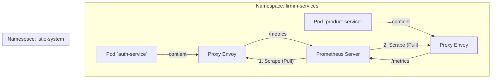
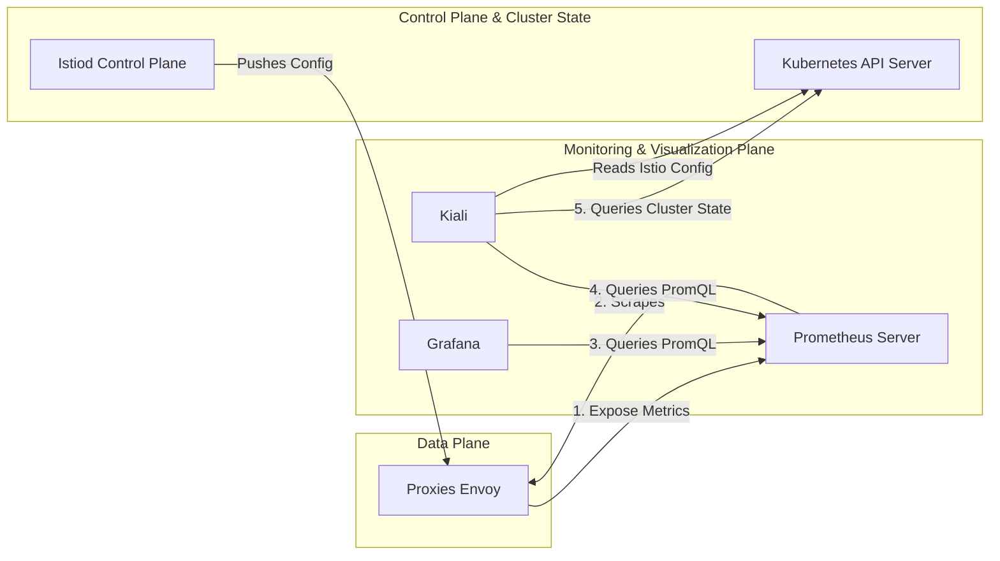
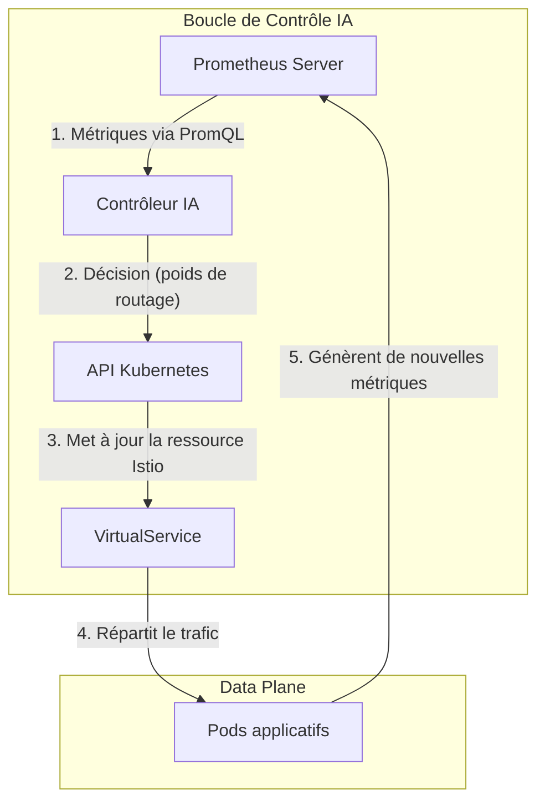

# **Rapport Technique Exhaustif : Conception et Implémentation d'une Infrastructure de Déploiement Industrialisée pour une Plateforme Microservices sur Kubernetes**

**Sous-titre :** Une Fondation pour le Déploiement Continu, l'Observabilité et la Recherche en IA sur le `Service Mesh`

**Phase du Projet :** Industrialisation, Déploiement et Préparation pour la Recherche Avancée

**Présenté par :**
HARCHE Samir

**Sous la direction de :**
Dr. Abdelhak Djamel Seriai

---

## **Abstract**

Ce rapport technique documente la seconde phase majeure du projet de plateforme e-commerce, marquant sa transition d'un *Produit Minimum Viable (MVP)*, initialement orchestré avec `Docker Compose`, vers une architecture industrialisée et prête pour la production. L'objectif principal est la conception et la mise en œuvre d'une infrastructure de déploiement robuste, scalable et entièrement automatisée, en utilisant des technologies de pointe. Le cœur de cette infrastructure repose sur **`Kubernetes (K8s)`**, avec des clusters locaux à haute-fidélité provisionnés par **`Kind`**. Une attention particulière est portée à l'intégration du `Service Mesh` **`Istio`**, qui transcende le simple routage pour devenir une fondation critique pour des travaux de recherche futurs dans le cadre d'un second projet de Master intitulé "Techniques IA dans les applications microservices". Cette intégration s'accompagne du déploiement d'une pile d'observabilité complète incluant **`Prometheus`**, **`Grafana`** et **`Kiali`**, fournissant une visibilité sans précédent sur le comportement du maillage. Ce rapport dissèque en profondeur les manifestes `YAML` de `Kubernetes`, en détaillant des `patterns` essentiels tels que les **`Init Containers`** pour la fiabilisation des dépendances. Il analyse également le pipeline **`CI/CD`** orchestré par **`Jenkins`**. Le document conclut en présentant une infrastructure non seulement apte au déploiement, mais également conçue comme une plateforme expérimentale pour des algorithmes avancés d'équilibrage de charge pilotés par l'IA.

---

## **Table des Matières**
*(Table des matières étendue pour refléter la profondeur du document)*

**1. Introduction et Contexte Stratégique**
    1.1. Évolution depuis le Produit Minimum Viable (MVP)
    1.2. La Stratégie d'Infrastructure à Double Volet
    1.3. Objectif Stratégique du `Service Mesh` : Plateforme pour la Recherche en IA
    1.4. Structure du Rapport

**2. Fondations de l'Infrastructure : Principes et Choix Technologiques**
    2.1. `Kubernetes` : L'Orchestrateur Déclaratif
    2.2. `Kind (Kubernetes in Docker)` : Le Développement à Haute-Fidélité
    2.3. `Istio` : Le `Service Mesh` pour le Contrôle et l'Observabilité
        2.3.1. Justification du Choix d'un `Service Mesh`
        2.3.2. Architecture d'Istio : `Data Plane` vs `Control Plane`
        2.3.3. Anatomie Détaillée d'un `Pod` dans le Maillage
    2.4. La Triade d'Observabilité : `Prometheus`, `Grafana`, `Kiali`
        2.4.1. `Prometheus` : La Collecte et le Stockage de Métriques
        2.4.2. `Grafana` : La Visualisation par Tableaux de Bord
        2.4.3. `Kiali` : La Cartographie et la Santé du `Service Mesh`
        2.4.4. Architecture Globale de l'Observabilité

**3. Analyse Structurelle du Déploiement : Les Manifestes Kubernetes**
    3.1. Stratégie de Décomposition : `infra-manifests.yaml` vs `app-manifests.yaml`
    3.2. Analyse des Manifestes d'Infrastructure (`infra-manifests.yaml`)
    3.3. Analyse des Manifestes Applicatifs (`app-manifests.yaml`)
        3.3.1. Les Objets Fondamentaux : `Deployment`, `Service`, `ReplicaSet` et `Pod`
        3.3.2. Configuration des Services : Variables d'Environnement et DNS Interne
        3.3.3. Le `Pattern Init Container` : Gestion des Dépendances au Démarrage

**4. Gestion Avancée du Trafic avec Istio**
    4.1. Le Point d'Entrée du Maillage : La Ressource `Gateway`
    4.2. Routage Programmable : La Ressource `VirtualService`
    4.3. Communication Inter-`Pod` au sein du Maillage : La Transparence du `Sidecar`

**5. Automatisation du Cycle de Vie : Le Pipeline CI/CD avec Jenkins**
    5.1. Provisioning du Cluster avec le Script `setup-kind.sh`
        5.1.1. Séquence des Opérations du Script
        5.1.2. Installation des `Addons` Istio
    5.2. Analyse Approfondie du `Jenkinsfile`
        5.2.1. Pipeline Déclaratif et Environnement
        5.2.2. `Stage 1`: `Build & Load Application Images`
        5.2.3. `Stage 2`: `Deploy Application`
        5.2.4. Le Défi du Tag `:latest` et la Solution `kubectl rollout restart`
        5.2.5. Le `post` Block : Garantir la Visibilité en cas d'Échec

**6. Conclusion : Une Plateforme Évolutive pour le Déploiement et la Recherche**
    6.1. Synthèse des Réalisations et de la Maturité Atteinte
    6.2. Vers un Équilibrage de Charge Intelligent : Prochaines Étapes
        6.2.1. La Boucle de Contrôle IA : Architecture Cible
        6.2.2. Exploitation de la Télémétrie de `Prometheus`
        6.2.3. Développement du Contrôleur Externe

---
*(Début du contenu intégral du rapport)*
---

## **1. Introduction et Contexte Stratégique**
### **1.1. Évolution depuis le Produit Minimum Viable (MVP)**
Ce document s'inscrit dans la continuité d'une première phase de développement qui avait permis de valider la conception d'une plateforme e-commerce via un *Produit Minimum Viable (MVP)*. Cette phase initiale reposait sur une orchestration simplifiée via `Docker Compose`. Si cette approche a prouvé son efficacité pour le prototypage rapide, elle ne présente pas les garanties de résilience, de scalabilité, et surtout d'observabilité requises par un environnement de production.

### **1.2. La Stratégie d'Infrastructure à Double Volet**
Le projet adopte une philosophie pragmatique qui distingue clairement le cycle de développement du cycle de déploiement.
*   **"Inner Loop" (Développement)** : `Docker Compose` reste l'outil de prédilection pour la vélocité.
*   **"Outer Loop" (Déploiement)** : `Kubernetes` est utilisé pour la fiabilité et la cohérence avec la production.

### **1.3. Objectif Stratégique du `Service Mesh` : Plateforme pour la Recherche en IA**
L'intégration du `Service Mesh` `Istio` est la décision la plus stratégique de cette architecture. Sa justification principale réside dans son rôle de catalyseur pour une thèse de Master parallèle : **"Techniques IA dans les applications microservices"**. L'objectif de cette recherche est de concevoir des algorithmes d'équilibrage de charge intelligents. `Istio`, enrichi par sa pile d'observabilité, expose les APIs de télémétrie et de contrôle du trafic indispensables pour la recherche. L'infrastructure décrite ici est donc un **laboratoire expérimental** sophistiqué.

### **1.4. Structure du Rapport**
Ce document est structuré pour une lecture progressive, des fondations technologiques jusqu'au pipeline d'automatisation, en concluant sur la feuille de route pour la recherche en IA.

## **2. Fondations de l'Infrastructure : Principes et Choix Technologiques**

### **2.1. `Kubernetes` : L'Orchestrateur Déclaratif**
`Kubernetes` fonctionne sur un principe déclaratif. L'utilisateur décrit l'**état final désiré** et le `Control Plane` de `Kubernetes` travaille en permanence pour faire converger l'état actuel du cluster vers cet état désiré.

### **2.2. `Kind (Kubernetes in Docker)` : Le Développement à Haute-Fidélité**
`Kind` lance chaque `Node` de `Kubernetes` comme un conteneur `Docker`, permettant de simuler un cluster réaliste sur une seule machine. Le fichier `kind-cluster-config.yaml` est crucial pour le mappage des ports (`extraPortMappings`) afin d'exposer des services comme la `Gateway` `Istio` sur `localhost`.

### **2.3. `Istio` : Le `Service Mesh` pour le Contrôle et l'Observabilité**

#### **2.3.1. Justification du Choix d'un `Service Mesh`**
Un `Service Mesh` déplace la logique de communication réseau (résilience, sécurité, routage) des services applicatifs vers une couche d'infrastructure dédiée.

#### **2.3.2. Architecture d'Istio : `Data Plane` vs `Control Plane`**
*   **`Data Plane`**: L'ensemble des `proxies` `Envoy` déployés en `sidecar` qui gèrent le trafic.
*   **`Control Plane` (`istiod`)**: Le cerveau qui configure tous les `proxies` du `Data Plane`.

#### **2.3.3. Anatomie Détaillée d'un `Pod` dans le Maillage**
L'injection `Istio` ajoute un conteneur `istio-proxy` et un `initContainer` `istio-init` à chaque `Pod` applicatif. `istio-init` configure les règles `iptables` du `Pod` pour rediriger tout son trafic réseau à travers le `proxy Envoy`, rendant l'interception transparente.

### **2.4. La Triade d'Observabilité : `Prometheus`, `Grafana`, `Kiali`**
L'un des avantages les plus significatifs d'`Istio` est l'observabilité "out-of-the-box" qu'il fournit. Le profil d'installation `demo` utilisé par notre script `setup-kind.sh` déploie automatiquement une pile d'outils open-source de premier plan, formant une triade puissante.

#### **2.4.1. `Prometheus` : La Collecte et le Stockage de Métriques**
`Prometheus` est un système de monitoring et une base de données de séries temporelles (`Time-Series Database`). Dans notre architecture, il est configuré par `Istio` pour :
1.  **Découvrir automatiquement** les `endpoints` de métriques (`/metrics`) exposés par les `proxies Envoy` de chaque `Pod` du maillage.
2.  **Scraper** (collecter) périodiquement ces métriques selon un modèle `pull-based`.
3.  **Stocker** ces données de manière efficace et les rendre interrogeables via son propre langage de requête, `PromQL`.

Les métriques collectées sont extrêmement riches : volume de requêtes (RPS), taux d'erreurs (codes 5xx), latences (p50, p90, p99), volume de données TCP, et bien plus.

***Figure 2.4 : Le modèle de collecte de métriques `pull-based` de `Prometheus`.***

#### **2.4.2. `Grafana` : La Visualisation par Tableaux de Bord**
`Grafana` est l'outil de visualisation de référence pour les métriques. Il se connecte à `Prometheus` comme une source de données (`DataSource`). `Istio` fournit une série de tableaux de bord `Grafana` préconfigurés qui utilisent des requêtes `PromQL` pour afficher des graphiques détaillés sur la santé et les performances de chaque service, de l'ensemble du maillage, etc.

#### **2.4.3. `Kiali` : La Cartographie et la Santé du `Service Mesh`**
`Kiali` est un outil de visualisation spécifiquement conçu pour `Istio`. Il offre une vue de plus haut niveau que `Grafana` :
*   **Topologie du maillage**: Il génère une carte graphique dynamique des services et de leurs interactions, montrant en temps réel qui parle à qui.
*   **Configuration et validation**: Il permet de visualiser et de valider les configurations `Istio` (`VirtualServices`, `Gateways`, etc.).
*   **Santé du trafic**: Il décore le graphe de la topologie avec des informations sur le trafic (taux de succès, RPS), permettant d'identifier les goulots d'étranglement ou les points de défaillance en un coup d'œil.

Pour construire sa vue, `Kiali` interroge à la fois `l'API Kubernetes` (pour la structure des services et `deployments`) et `Prometheus` (pour les métriques de trafic).

#### **2.4.4. Architecture Globale de l'Observabilité**
La synergie entre ces trois outils fournit une visibilité complète à différents niveaux d'abstraction.

***Figure 2.5 : Flux d'informations dans la pile d'observabilité `Istio`.***

## **3. Analyse Structurelle du Déploiement : Les Manifestes Kubernetes**

### **3.1. Stratégie de Décomposition : `infra-manifests.yaml` vs `app-manifests.yaml`**
La séparation des manifestes est maintenue, distinguant l'infrastructure stable des applications volatiles.

### **3.2. Analyse des Manifestes d'Infrastructure (`infra-manifests.yaml`)**
Cette section déploie les composants `Stateful` (`Kafka`, `PostgreSQL`, `Redis`, `Elasticsearch`). L'annotation `sidecar.istio.io/inject: "false"` est cruciale ici pour éviter des complications avec les protocoles non-HTTP et pour optimiser la performance.

### **3.3. Analyse des Manifestes Applicatifs (`app-manifests.yaml`)**

#### **3.3.1. Les Objets Fondamentaux : `Deployment`, `Service`, `ReplicaSet` et `Pod`**
La structure de base pour chaque microservice reste un `Deployment` qui gère un `ReplicaSet`, qui à son tour garantit le nombre de `Pods` désiré.

#### **3.3.2. Configuration des Services : Variables d'Environnement et DNS Interne**
La communication inter-services se fait via le DNS de `Kubernetes` (ex: `http://payment-service-svc:3009`), dont les adresses sont injectées via des variables d'environnement.

#### **3.3.3. Le `Pattern Init Container` : Gestion des Dépendances au Démarrage**
Le `pattern Init Container` est utilisé pour toutes les applications nécessitant une migration de base de données (`npx prisma db push`), garantissant que le conteneur applicatif ne démarre qu'après la réussite de cette étape critique.

## **4. Gestion Avancée du Trafic avec Istio**

### **4.1. Le Point d'Entrée du Maillage : La Ressource `Gateway`**
Le `Gateway` `lirmm-gateway` agit comme le portier du maillage, définissant le point d'entrée pour le trafic externe.

### **4.2. Routage Programmable : La Ressource `VirtualService`**
Le `VirtualService` `main-routing-vs` contient la logique de routage. Il utilise des règles de `match` sur le préfixe de l'URI et des directives `rewrite` pour diriger le trafic vers les services internes appropriés.

### **4.3. Communication Inter-`Pod` au sein du Maillage : La Transparence du `Sidecar`**
Les `proxies sidecar` `Envoy` interceptent tout le trafic, permettant à `Istio` d'appliquer des politiques (comme le chiffrement `mTLS`) de manière totalement transparente pour les applications.

## **5. Automatisation du Cycle de Vie : Le Pipeline CI/CD avec Jenkins**

### **5.1. Provisioning du Cluster avec le Script `setup-kind.sh`**

#### **5.1.1. Séquence des Opérations du Script**
Le script exécute une séquence logique : `kind delete/create`, `istioctl install`, `patch` du service `ingressgateway`, et `label` du `namespace`.

#### **5.1.2. Installation des `Addons` Istio**
Le script `setup-kind.sh` contient un appel crucial à la fonction `install_istio_addons`. Cette fonction exécute `kubectl apply -f $ISTIO_DIR/samples/addons`, ce qui déploie les manifestes pour `Prometheus`, `Grafana` et `Kiali`, les intégrant ainsi de manière transparente dans le cluster.

### **5.2. Analyse Approfondie du `Jenkinsfile`**

#### **5.2.1. Pipeline Déclaratif et Environnement**
Le `Jenkinsfile` utilise une syntaxe déclarative et définit des variables d'environnement pour la réutilisabilité.

#### **5.2.2. `Stage 1`: `Build & Load Application Images`**
Optimisation cruciale pour le CI local, utilisant `kind load docker-image` pour éviter une `registry` externe.

#### **5.2.3. `Stage 2`: `Deploy Application`**
Orchestre l'application des manifestes, le redémarrage forcé des `deployments`, et l'attente de leur disponibilité.

#### **5.2.4. Le Défi du Tag `:latest` et la Solution `kubectl rollout restart`**
Cette commande force un `rolling update` même lorsque le `tag` de l'image ne change pas, garantissant l'utilisation des nouvelles images.

#### **5.2.5. Le `post` Block : Garantir la Visibilité en cas d'Échec**
En cas d'échec, le pipeline exécute `kubectl get pods` pour fournir des informations de débogage immédiates.

## **6. Conclusion : Une Plateforme Évolutive pour le Déploiement et la Recherche**

### **6.1. Synthèse des Réalisations et de la Maturité Atteinte**
Cette phase d'industrialisation a permis de construire une infrastructure `CI/CD` complète, robuste et, surtout, **observable**. La visibilité offerte par `Prometheus`, `Grafana` et `Kiali` est fondamentale non seulement pour l'opération de la plateforme mais aussi comme prérequis pour la recherche.

### **6.2. Vers un Équilibrage de Charge Intelligent : Prochaines Étapes**

#### **6.2.1. La Boucle de Contrôle IA : Architecture Cible**
L'objectif est de créer un système où l'IA observe le `Data Plane` et agit sur le `Control Plane`.

#### **6.2.2. Exploitation de la Télémétrie de `Prometheus`**
Le `Prometheus` server, déjà en place et collectant des données, sera la source de vérité pour les algorithmes d'IA. Les requêtes `PromQL` seront utilisées pour extraire des *features* (caractéristiques) pertinentes comme la latence `p99`, le taux d'erreur, et la charge des `Pods`.

#### **6.2.3. Développement du Contrôleur Externe**
Un service externe sera développé. Il interrogera périodiquement l'API de `Prometheus`, passera les métriques à un modèle d'IA (ex: un agent d'apprentissage par renforcement), et déterminera la stratégie de routage optimale.

***Figure 6.1 : Architecture cible affinée pour l'équilibrage de charge piloté par l'IA, avec `Prometheus` comme source de données.***
